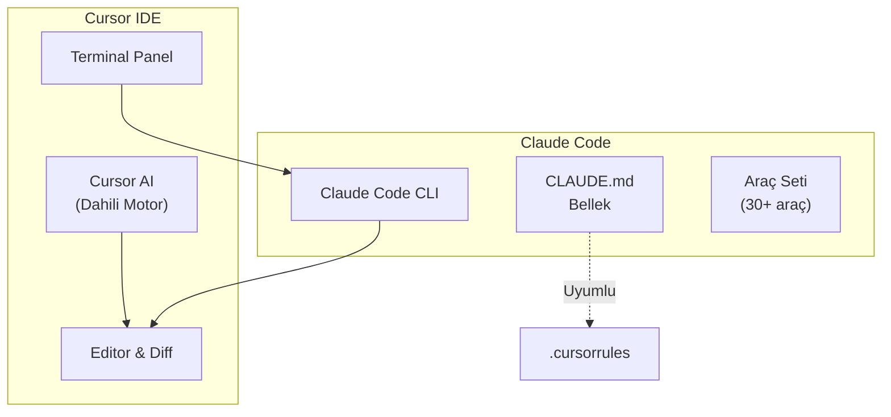
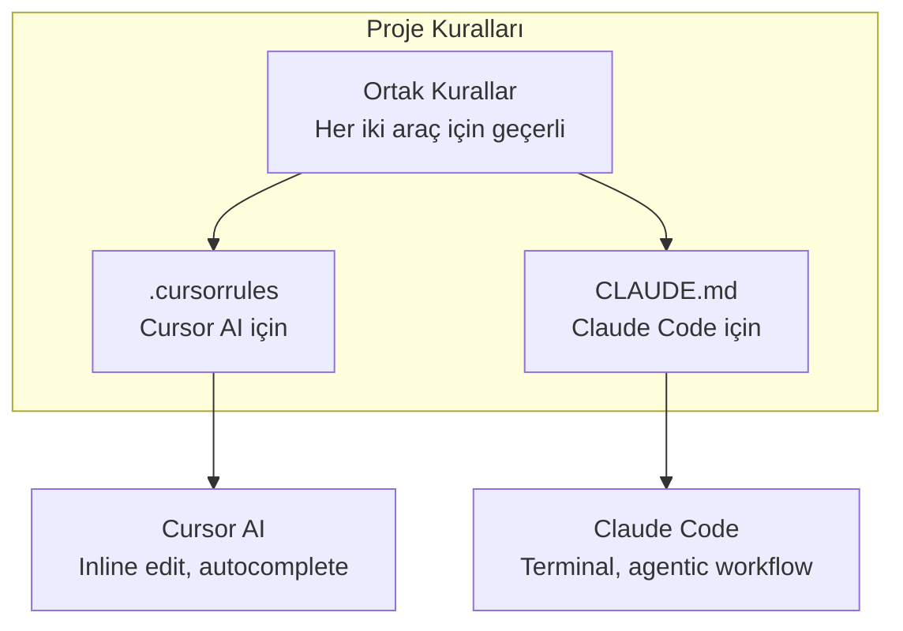
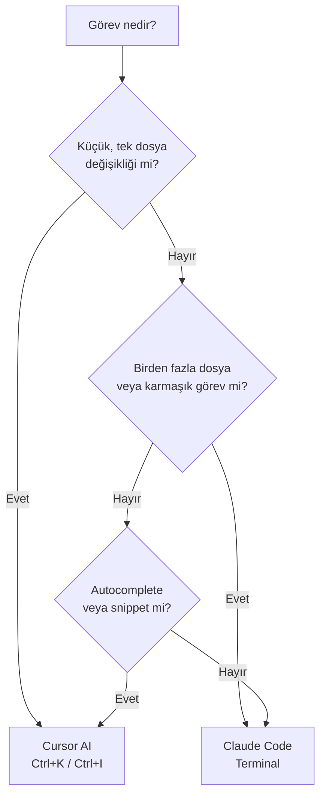
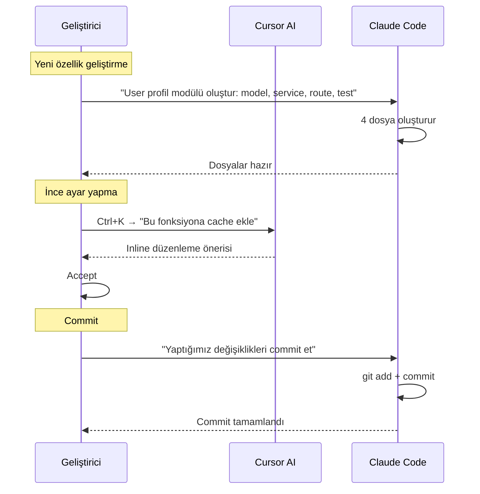

# Cursor IDE Kullanımı

Cursor IDE, yapay zeka destekli bir kod editörüdür ve kendi dahili AI motoruna sahiptir. Claude Code, Cursor'ın terminal panelinde çalışarak her iki aracın güçlü yönlerinden yararlanmanızı sağlar. Bu bölümde `.cursorrules` ve `CLAUDE.md` uyumunu, ne zaman Cursor'ın dahili AI'ını ne zaman Claude Code'u kullanacağınızı ele alıyoruz.

## Ön Koşullar

| Konu | Bölüm |
|------|-------|
| Claude Code kurulumu | [Kurulum ve Gereksinimler](../06-claude-code-tanitim/03-kurulum-ve-gereksinimler.md) |
| CLAUDE.md dosyası | [CLAUDE.md Dosyası](../09-bellek-ve-baglam/01-claude-md-dosyasi.md) |
| Cursor IDE temel bilgisi | Harici kaynak |

---

## Cursor + Claude Code Mimarisi

Cursor IDE ve Claude Code birbirini tamamlayan iki farklı yaklaşım sunar:



---

## Kurulum

### Adım 1: Cursor'da Terminal Açma

```
Terminal → New Terminal (Ctrl+`)
```

### Adım 2: Claude Code Başlatma

```bash
# Cursor'ın dahili terminalinde
claude
```

### Adım 3: Proje Bağlamı

Claude Code otomatik olarak çalışma dizinini algılar ve projeyi keşfeder. Cursor'ın açık dosya bilgisi terminal aracılığıyla Claude Code'a aktarılmaz — bunun yerine Claude Code kendi araçlarıyla projeyi tarar.

---

## .cursorrules ve CLAUDE.md Uyumu

Her iki dosya da AI asistanına proje kuralları ve bağlam sağlar. Önemli olan hangisini ne zaman kullanacağınızı bilmektir:

### Karşılaştırma

| Özellik | `.cursorrules` | `CLAUDE.md` |
|---------|---------------|-------------|
| **Hedef AI** | Cursor AI | Claude Code |
| **Konum** | Proje kökünde | Proje kökünde (veya `~/.claude/`) |
| **Format** | Serbest metin | Markdown |
| **Kapsam** | Cursor oturumu | Claude Code oturumu |
| **Hiyerarşi** | Tek dosya | Global → proje → klasör hiyerarşisi |
| **Otomatik oluşturma** | Manuel | `/init` komutuyla otomatik |

### Birlikte Kullanım Stratejisi



### Senkronizasyon Stratejileri

**Strateji 1: Ortak kuralları paylaşma**

`.cursorrules` ve `CLAUDE.md` dosyalarında ortak kuralları tutun:

```markdown
<!-- CLAUDE.md -->
# Proje Kuralları

## Kod Standartları
- TypeScript strict mode kullan
- Fonksiyon isimleri camelCase, sınıflar PascalCase
- Her dosyada en fazla 200 satır
- Tüm public API'ler JSDoc ile belgelenecek

## Test Kuralları
- Her yeni fonksiyon için unit test zorunlu
- Test dosyaları __tests__ klasöründe
- Minimum %80 code coverage
```

```markdown
<!-- .cursorrules -->
# Proje Kuralları

## Kod Standartları
- TypeScript strict mode kullan
- Fonksiyon isimleri camelCase, sınıflar PascalCase
- Her dosyada en fazla 200 satır
- Tüm public API'ler JSDoc ile belgelenecek

## Test Kuralları
- Her yeni fonksiyon için unit test zorunlu
- Test dosyaları __tests__ klasöründe
- Minimum %80 code coverage
```

**Strateji 2: Claude Code ile .cursorrules oluşturma**

```bash
# Claude Code oturumunda
> CLAUDE.md içeriğini temel alarak .cursorrules dosyası oluştur.
  Cursor AI'a özgü talimatlar ekle (autocomplete odaklı).
```

---

## Ne Zaman Hangi Aracı Kullanmalı?



### Cursor AI Tercih Edin

| Senaryo | Neden |
|---------|-------|
| Tek satır/blok düzenleme | Cursor'ın inline edit'i daha hızlı |
| Kod tamamlama (autocomplete) | Cursor Tab natif desteği |
| Küçük refactoring | `Ctrl+K` ile anında düzenleme |
| Hızlı soru sorma | `Ctrl+L` ile hızlı cevap |
| Snippet oluşturma | Cursor daha hızlı yanıt verir |

### Claude Code Tercih Edin

| Senaryo | Neden |
|---------|-------|
| Çok dosyalı değişiklik | Claude Code dosya sistemi araçlarıyla çalışır |
| Proje genelinde refactoring | Agentic workflow ile otomatik |
| Git işlemleri (commit, PR) | Git araçları dahili |
| Test suite oluşturma | Birden fazla dosya üretir |
| CI/CD yapılandırma | Karmaşık dosya düzenlemeleri |
| Codebase analizi | Tüm projeyi tarayabilir |
| MCP ve dış servis entegrasyonu | MCP araçları kullanılabilir |

---

## Pratik Örnekler

### Örnek 1: Hibrit İş Akışı



### Örnek 2: Cursor Rules ile Claude Code Sinerji

Cursor'da `.cursor/rules/` dizini Claude Code'un `.claude/rules/` dizinine benzer şekilde çalışır:

```
project-root/
├── .cursor/
│   └── rules/
│       ├── typescript.mdc     # Cursor AI kuralları
│       └── testing.mdc        # Cursor AI test kuralları
├── .claude/
│   └── rules/
│       ├── typescript.md      # Claude Code kuralları
│       └── testing.md         # Claude Code test kuralları
├── .cursorrules               # Cursor AI genel kurallar
└── CLAUDE.md                  # Claude Code genel kurallar
```

### Örnek 3: Claude Code ile Cursor Ayar Dosyası Oluşturma

```bash
# Claude Code oturumunda
> Bu projenin yapısını analiz et ve uygun .cursorrules dosyası oluştur.
  Proje teknoloji stack'ini, kod stilini ve test yaklaşımını yansıtsın.
```

---

## Performans İpuçları

| İpucu | Açıklama |
|-------|----------|
| Terminal sekmelerini ayırın | Cursor AI chat'i ve Claude Code farklı sekmelerde |
| Bağlamı daraltın | Her iki araç için de gereksiz dosyaları exclude edin |
| Doğru aracı seçin | Küçük işler → Cursor AI, büyük işler → Claude Code |
| CLAUDE.md'yi güncel tutun | `/init` ile periyodik güncelleme |
| .cursorrules senkronize tutun | Ortak kuralları her iki dosyada da tutun |

---

## Sorun Giderme

| Sorun | Çözüm |
|-------|-------|
| Terminal'de `claude` bulunamıyor | Cursor'ın PATH ayarını kontrol edin, terminal'i yeniden açın |
| İki AI çakışıyor | Cursor AI autocomplete'i belirli dosyalarda kapatın |
| CLAUDE.md Cursor tarafından okunmuyor | Normal — `.cursorrules` Cursor AI için, `CLAUDE.md` Claude Code için |
| Diff görünümü karışık | Cursor'ın diff'i ile Claude Code diff'ini karıştırmayın |

---

## Özet

| Kavram | Açıklama |
|--------|----------|
| **Cursor AI** | Inline edit, autocomplete, küçük değişiklikler için ideal |
| **Claude Code** | Çok dosyalı, karmaşık görevler ve agentic workflow için ideal |
| **.cursorrules** | Cursor AI'a yönelik proje kuralları |
| **CLAUDE.md** | Claude Code'a yönelik proje kuralları ve bellek |
| **Hibrit Kullanım** | Her iki aracın güçlü yönlerinden yararlanma stratejisi |

---

## Sonraki Adım

Claude Code Desktop uygulamasını — paralel oturumlar, Git izolasyonu ve görsel diff inceleme özelliklerini — inceleyelim:

→ [Masaüstü Uygulaması](./04-masaustu-uygulamasi.md)
