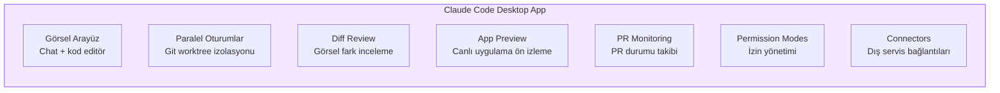
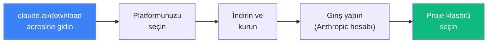
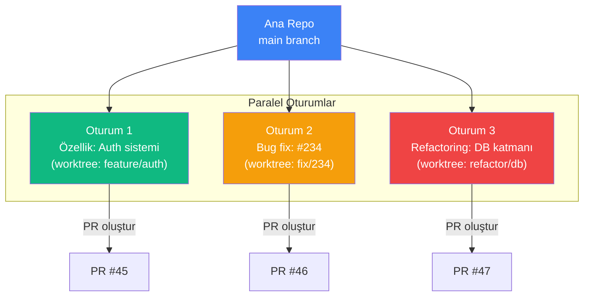
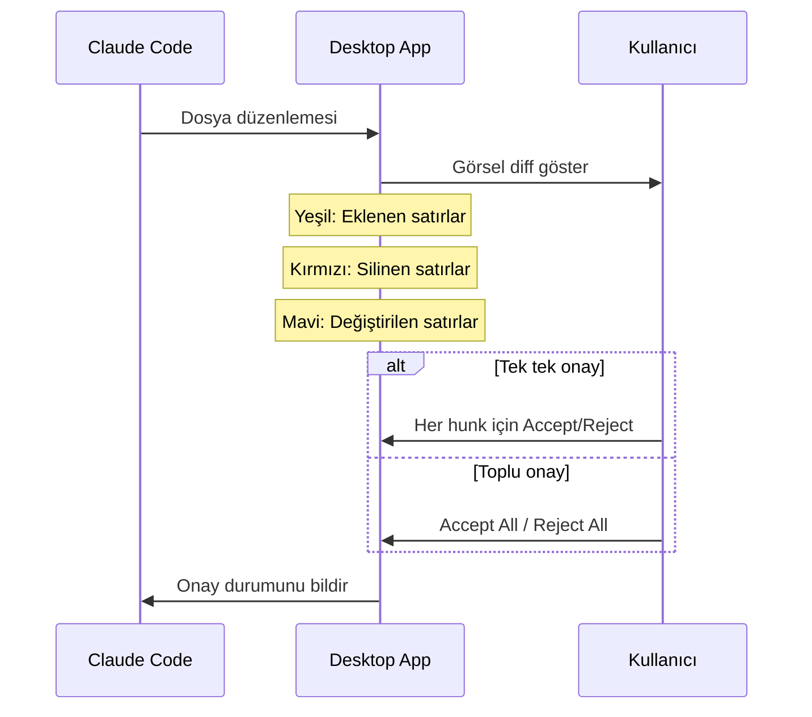
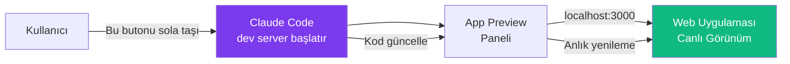
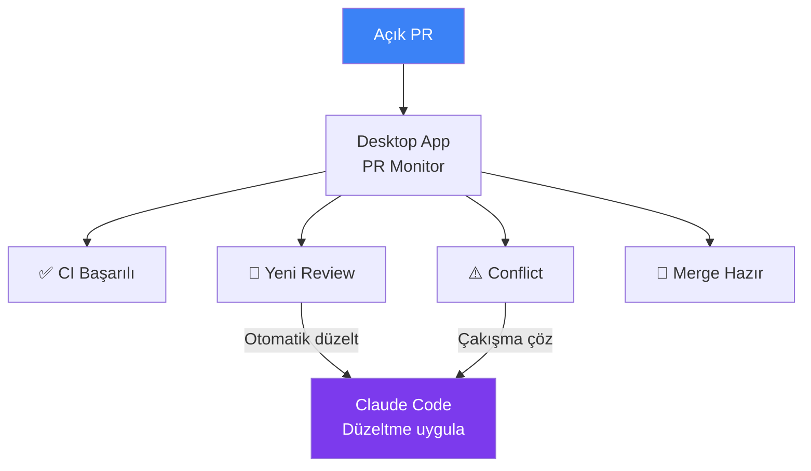
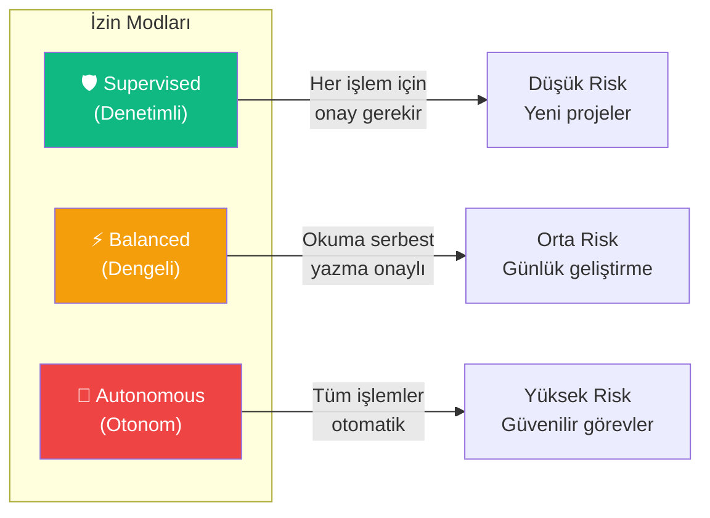
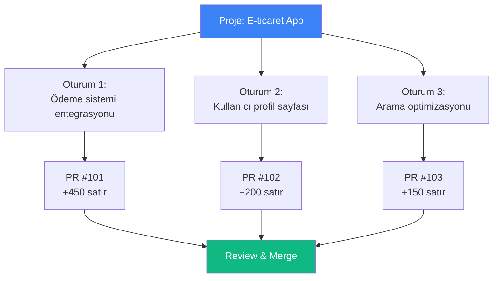

# Claude Code Masaüstü Uygulaması

Claude Code Desktop App (masaüstü uygulaması), Claude Code deneyimini terminal dışına taşıyarak görsel bir arayüz sunar. Parallel sessions (paralel oturumlar) ile Git izolasyonu, visual diff review (görsel fark inceleme), app previews (uygulama ön izleme), PR monitoring (PR izleme) ve gelişmiş permission modes (izin modları) gibi güçlü özellikler içerir.

## Ön Koşullar

| Konu | Bölüm |
|------|-------|
| Claude Code temelleri | [Claude Code Nedir](../06-claude-code-tanitim/01-claude-code-nedir.md) |
| Git temel bilgisi | Harici kaynak |
| İzin sistemi | [İzin Sistemi](../10-izinler-ve-guvenlik/01-izin-sistemi.md) |

---

## Genel Bakış



---

## Kurulum

### Platform Desteği

| Platform | Durum | İndirme |
|----------|-------|---------|
| macOS (Apple Silicon) | ✅ GA | claude.ai/download |
| macOS (Intel) | ✅ GA | claude.ai/download |
| Windows | ✅ GA | claude.ai/download |
| Linux (.deb) | ✅ GA | claude.ai/download |

### Kurulum Adımları



---

## Paralel Oturumlar ve Git İzolasyonu

Desktop app'in en güçlü özelliklerinden biri, birden fazla oturumun aynı anda ve birbirinden bağımsız çalışabilmesidir:

### Nasıl Çalışır?



Her oturum için:
- **Ayrı Git worktree** oluşturulur — dosya değişiklikleri birbirini etkilemez
- **Bağımsız branch** — her oturum kendi branch'inde çalışır
- **İzole ortam** — bir oturumdaki hata diğerlerini etkilemez
- **Paralel çalışma** — birden fazla görev eş zamanlı ilerler

### Paralel Oturum Başlatma

1. Desktop app'te `+ New Session` butonuna tıklayın
2. Proje klasörünü seçin (veya mevcut projeyi kullanın)
3. Görev tanımını yazın
4. Claude Code otomatik olarak yeni bir worktree ve branch oluşturur

---

## Visual Diff Review

Dosya değişikliklerini görsel olarak inceleme ve onaylama:



### Diff Görünüm Modları

| Mod | Açıklama | Kullanım |
|-----|----------|----------|
| **Side-by-side** | Eski ve yeni kod yan yana | Büyük değişikliklerde |
| **Inline** | Değişiklikler tek sütunda | Küçük değişikliklerde |
| **Summary** | Sadece dosya listesi ve istatistik | Genel bakış için |

---

## App Preview (Uygulama Ön İzleme)

Claude Code web uygulamaları üzerinde çalışırken, Desktop app canlı ön izleme sunar:



Desteklenen framework'ler:
- React (Next.js, Vite, CRA)
- Vue.js (Nuxt, Vite)
- Angular
- Svelte/SvelteKit
- Statik HTML/CSS/JS

---

## PR Monitoring (PR İzleme)

Desktop app açık PR'ların durumunu izler ve güncellemeleri gösterir:

| Özellik | Açıklama |
|---------|----------|
| PR Durumu | Açık, inceleniyor, onaylandı, birleştirildi |
| CI/CD Sonuçları | GitHub Actions / GitLab CI sonuçları |
| Review Yorumları | Kod inceleme yorumları bildirim olarak |
| Çakışma Uyarısı | Merge conflict tespit edildiğinde uyarı |
| Otomatik Düzeltme | Review yorumlarına göre otomatik düzeltme önerisi |



---

## Permission Modes (İzin Modları)

Desktop app'te üç izin modu bulunur:



| Mod | Okuma | Yazma | Terminal | Git |
|-----|-------|-------|----------|-----|
| **Supervised** | Onay gerekir | Onay gerekir | Onay gerekir | Onay gerekir |
| **Balanced** | Otomatik | Onay gerekir | Onay gerekir | Onay gerekir |
| **Autonomous** | Otomatik | Otomatik | Otomatik | Otomatik |

---

## Connectors (Bağlayıcılar)

Desktop app, dış servislerle entegrasyon için connector'lar sunar:

| Connector | İşlev | Kullanım |
|-----------|-------|----------|
| GitHub | Repo, PR, Issue erişimi | PR oluşturma, issue yönetimi |
| GitLab | Repo, MR erişimi | Merge request otomasyonu |
| Jira | Issue takibi | Görev durumu güncelleme |
| Linear | Issue takibi | Görev yönetimi |
| Slack | Mesajlaşma | Bildirim ve durum paylaşımı |
| Sentry | Hata izleme | Bug raporlarını analiz etme |

---

## Enterprise Konfigürasyonu

Kurumsal ortamlar için özel yapılandırma seçenekleri:

```json
{
  "enterprise": {
    "allowedModels": ["claude-sonnet-4-20250514"],
    "maxParallelSessions": 5,
    "defaultPermissionMode": "balanced",
    "proxy": {
      "host": "proxy.company.com",
      "port": 8080
    },
    "sso": {
      "provider": "okta",
      "domain": "company.okta.com"
    },
    "audit": {
      "enabled": true,
      "destination": "s3://audit-logs/"
    }
  }
}
```

---

## Pratik Örnekler

### Örnek 1: Paralel Özellik Geliştirme



1. Desktop app'te 3 yeni oturum açın
2. Her birine farklı bir görev atayın
3. Claude Code her oturum için ayrı branch oluşturur
4. Oturumlar paralel çalışır
5. Her biri tamamlandığında PR oluşturulur

### Örnek 2: PR Review Yorumlarını İşleme

1. Desktop app PR monitor'da yeni review yorumu bildirimi gelir
2. Yoruma tıklayın — ilgili oturum açılır
3. Claude Code yorumu okur ve düzeltme önerir
4. Diff review ile düzeltmeyi onaylayın
5. Claude Code commit eder ve PR'ı günceller

---

## Özet

| Özellik | Açıklama |
|---------|----------|
| **Paralel Oturumlar** | Git worktree ile izole, eş zamanlı çalışma |
| **Visual Diff** | Görsel fark inceleme ve onaylama |
| **App Preview** | Web uygulaması canlı ön izleme |
| **PR Monitoring** | PR durumu, CI sonuçları, review takibi |
| **Permission Modes** | Supervised, Balanced, Autonomous |
| **Connectors** | GitHub, GitLab, Jira, Slack vb. entegrasyonlar |
| **Enterprise** | SSO, proxy, audit log, model kısıtlamaları |

---

## Sonraki Adım

Chrome tarayıcı bağlantısı ile web uygulaması testi ve debug işlemlerini inceleyelim:

→ [Chrome Entegrasyonu](./05-chrome-entegrasyonu.md)
