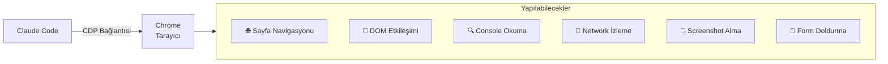
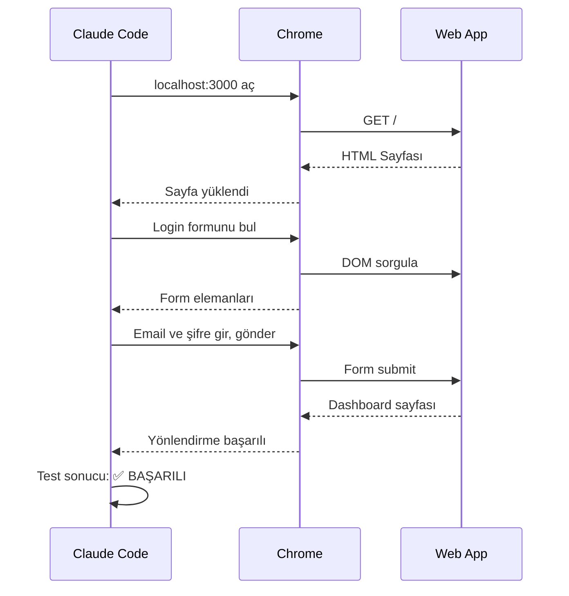
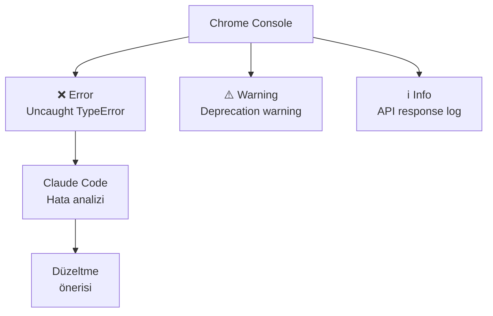
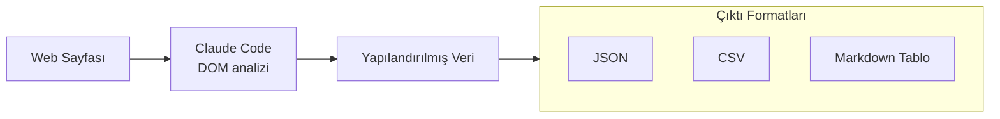

# Chrome Entegrasyonu

Claude Code, Chrome tarayıcı bağlantısı (beta) sayesinde web uygulamalarını test edebilir, console log (konsol günlüğü) hatalarını debug edebilir, form filling (form doldurma) otomasyonu yapabilir ve web sayfalarından data extraction (veri çıkarma) gerçekleştirebilir. Bu özellik, Claude Code'u tam bir full-stack geliştirme asistanına dönüştürür.

## Ön Koşullar

| Konu | Bölüm |
|------|-------|
| Claude Code araçları | [Araçlara Genel Bakış](../08-araclar/01-araclara-genel-bakis.md) |
| Web erişimi | [Web Erişimi](../08-araclar/04-web-erisimi.md) |
| Google Chrome tarayıcısı | Harici kaynak |

---

## Beta Durumu

> ⚠️ Chrome entegrasyonu şu anda **beta** aşamasındadır. Özellikler değişebilir ve bazı senaryolarda beklenmedik davranışlar görülebilir.

---

## Nasıl Çalışır?

Chrome entegrasyonu, Chrome DevTools Protocol (CDP) üzerinden tarayıcıyla iletişim kurar:



### Bağlantı Kurma

```bash
# Chrome'u debug modunda başlatma
# macOS
/Applications/Google\ Chrome.app/Contents/MacOS/Google\ Chrome --remote-debugging-port=9222

# Windows
"C:\Program Files\Google\Chrome\Application\chrome.exe" --remote-debugging-port=9222

# Linux
google-chrome --remote-debugging-port=9222
```

Claude Code otomatik olarak debug modundaki Chrome'u algılar:

```bash
# Claude Code oturumunda
> Chrome'a bağlan ve localhost:3000 sayfasını aç
```

---

## Temel Özellikler

### 1. Web App Testing (Web Uygulama Testi)

Claude Code, web uygulamanızı tarayıcı üzerinden otomatik olarak test edebilir:



Kullanım örneği:

```
> Chrome'a bağlan ve localhost:3000 üzerinde şu test senaryosunu çalıştır:
  1. Ana sayfayı aç
  2. "Giriş Yap" butonuna tıkla
  3. Email: test@example.com, Şifre: Test123! ile giriş yap
  4. Dashboard sayfasının yüklendiğini doğrula
  5. Profil menüsünden "Çıkış Yap" yap
```

### 2. Console Log Debugging (Konsol Hata Ayıklama)

Chrome console çıktılarını okuyarak hataları tespit etme:



```
> Chrome console'daki hataları oku ve düzelt:
  - JavaScript hatalarını analiz et
  - Network hatalarını (4xx, 5xx) kontrol et
  - Kaynak kodu güncelle
```

### 3. Form Filling Automation (Form Doldurma Otomasyonu)

Claude Code, formları otomatik doldurarak test senaryolarını hızlandırır:

```
> Chrome'da açık olan kayıt formunu şu verilerle doldur:
  - Ad: Test Kullanıcı
  - Email: test@example.com
  - Telefon: +905551234567
  - Adres: İstanbul, Türkiye
  - Formu gönder ve sonucu kontrol et
```

### 4. Data Extraction (Veri Çıkarma)

Web sayfalarından yapılandırılmış veri çıkarma:



```
> Chrome'da açık olan ürün listesi sayfasından 
  tüm ürünlerin adını, fiyatını ve stok durumunu 
  JSON formatında çıkar
```

Örnek çıktı:

```json
[
  {
    "name": "Wireless Kulaklık",
    "price": "₺1.299",
    "inStock": true
  },
  {
    "name": "Bluetooth Hoparlör",
    "price": "₺899",
    "inStock": false
  }
]
```

---

## Pratik Örnekler

### Örnek 1: E2E Test Senaryosu

```
> Aşağıdaki E2E test senaryosunu Chrome üzerinden çalıştır:

1. localhost:3000 aç
2. Kayıt sayfasına git (/register)
3. Test kullanıcısı oluştur
4. Email doğrulama sayfasının göründüğünü kontrol et
5. Login sayfasına git (/login)
6. Oluşturulan kullanıcıyla giriş yap
7. Dashboard'da kullanıcı adının göründüğünü doğrula
8. Sonuçları raporla
```

### Örnek 2: Responsive Design Testi

```
> Chrome'da localhost:3000 sayfasını aç ve 
  şu viewport boyutlarında screenshot al:
  - Mobile: 375x667
  - Tablet: 768x1024
  - Desktop: 1920x1080
  Her boyutta layout bozulması var mı kontrol et
```

### Örnek 3: API Response Debugging

```
> Chrome'da localhost:3000/dashboard sayfasını aç,
  Network sekmesindeki API çağrılarını izle:
  - /api/users endpoint'inin response süresini ölç
  - /api/products 404 dönen endpoint'i bul
  - CORS hatası veren istekleri listele
```

---

## Konfigürasyon

Chrome bağlantısı için Claude Code ayarları:

```json
{
  "chrome": {
    "debugPort": 9222,
    "autoConnect": true,
    "screenshotDir": "./screenshots",
    "timeout": 30000,
    "headless": false
  }
}
```

| Ayar | Varsayılan | Açıklama |
|------|-----------|----------|
| `debugPort` | `9222` | Chrome debug port numarası |
| `autoConnect` | `false` | Otomatik bağlantı |
| `screenshotDir` | `./` | Screenshot kayıt dizini |
| `timeout` | `30000` | Sayfa yükleme zaman aşımı (ms) |
| `headless` | `false` | Başsız mod (görüntüsüz) |

---

## Sınırlamalar (Beta)

| Sınırlama | Açıklama |
|-----------|----------|
| Tek sekme | Aynı anda yalnızca bir sekme kontrol edilebilir |
| Yetkilendirme | OAuth popup'ları desteklenmeyebilir |
| Dosya indirme | Dosya indirme tetiklenemez |
| iframe | Cross-origin iframe'lere erişim kısıtlı |
| WebSocket | WebSocket mesajlarını izleme sınırlı |

---

## Sorun Giderme

| Sorun | Çözüm |
|-------|-------|
| Chrome bağlanmıyor | `--remote-debugging-port=9222` ile başlatıldığından emin olun |
| Sayfa yüklenmiyor | Timeout süresini artırın, URL'yi kontrol edin |
| Console logları görünmüyor | Chrome Developer Tools'un açık olduğundan emin olun |
| Screenshot boş | Sayfa tam yüklendikten sonra bekleyin |
| Form elemanları bulunamıyor | Selector'ların doğruluğunu kontrol edin |

---

## Özet

| Özellik | Açıklama |
|---------|----------|
| **Web App Test** | Otomatik navigasyon, tıklama, form doldurma |
| **Console Debug** | JavaScript hatalarını okuma ve analiz |
| **Form Automation** | Test verileriyle otomatik form doldurma |
| **Data Extraction** | Web sayfalarından yapılandırılmış veri çıkarma |
| **Screenshot** | Farklı viewport boyutlarında ekran görüntüsü |
| **Network** | API çağrılarını ve yanıtları izleme |

---

## Sonraki Adım

Slack entegrasyonu ile kodlama görevlerini Slack workspace'inizden delegasyon yöntemlerini inceleyelim:

→ [Slack Entegrasyonu](./06-slack-entegrasyonu.md)
