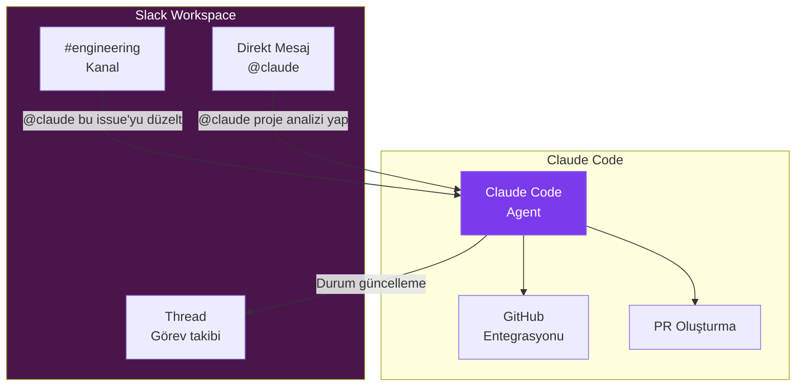
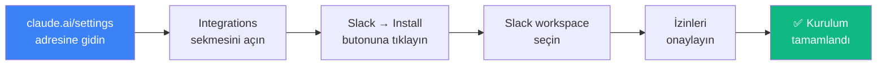
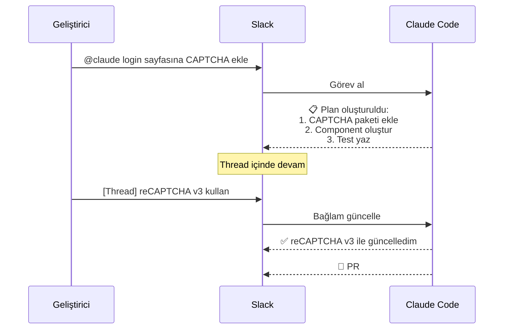
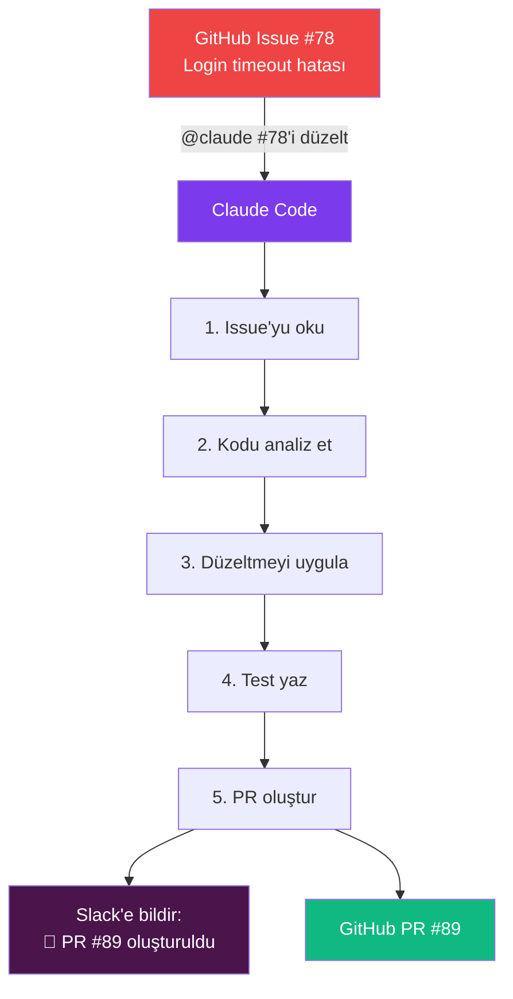
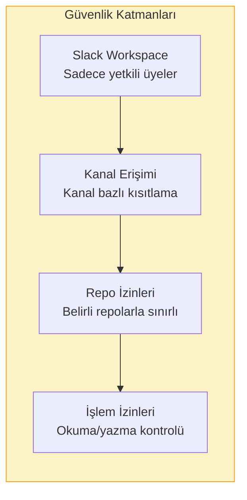

# Slack Entegrasyonu

Claude Code, Slack workspace'inize (çalışma alanı) entegre edilerek kodlama görevlerini doğrudan Slack üzerinden delege etmenizi sağlar. `@claude` ile bahsederek görev atayabilir, ilerleme güncellemeleri alabilir ve sonuçları ekip arkadaşlarınızla paylaşabilirsiniz.

## Ön Koşullar

| Konu | Bölüm |
|------|-------|
| Claude Code temelleri | [Claude Code Nedir](../06-claude-code-tanitim/01-claude-code-nedir.md) |
| GitHub/GitLab entegrasyonu | [GitHub Actions](../16-cicd-ve-devops/01-github-actions.md) |
| Slack yönetici erişimi | Harici kaynak |

---

## Genel Bakış



---

## Kurulum

### Adım 1: Slack App Yükleme



### Adım 2: Kanal Yapılandırması

Claude'u kullanmak istediğiniz kanallara ekleyin:

```
/invite @claude
```

### Adım 3: Repo Bağlantısı

Claude Code'un hangi repository'lerle çalışacağını yapılandırın:

```
@claude connect repo:organization/my-repo
```

---

## Kullanım Yöntemleri

### 1. @claude Mention (Bahsetme)

Herhangi bir kanalda `@claude` ile görev atayabilirsiniz:

```
@claude #123 numaralı issue'yu düzelt ve PR oluştur
```

```
@claude src/utils/date.ts dosyasına timezone desteği ekle
```

```
@claude Bu hata logunu analiz et ve kök nedeni bul:
[hata logu yapıştır]
```

### 2. Thread (İleti Dizisi) ile Bağlam

Bir konu hakkında devam eden sohbette thread kullanarak bağlam koruyabilirsiniz:



### 3. Status Updates (Durum Güncellemeleri)

Claude Code uzun süren görevlerde ilerleme durumunu otomatik paylaşır:

| Emoji | Durum | Açıklama |
|-------|-------|----------|
| 📋 | Plan oluşturuldu | Görev planı hazır |
| 🔍 | Analiz ediliyor | Kod tabanı inceleniyor |
| 🛠️ | Geliştiriliyor | Kod yazılıyor |
| 🧪 | Test ediliyor | Testler çalıştırılıyor |
| ✅ | Tamamlandı | Görev başarıyla bitti |
| ❌ | Hata | Bir sorun oluştu |
| 🔗 | PR hazır | Pull request oluşturuldu |

---

## Görev Türleri

### Bug Fix (Hata Düzeltme)

```
@claude Bu hatayı düzelt:
Issue: Kullanıcı profil fotoğrafı yüklenemiyor
Hata mesajı: "413 Payload Too Large"
Repo: organization/frontend-app
```

### Feature Request (Özellik İsteği)

```
@claude Kullanıcı ayarları sayfasına karanlık mod toggle ekle.
- Tercih localStorage'da saklanacak
- Tüm sayfalarda geçerli olacak
- Animasyonlu geçiş efekti olacak
```

### Code Review (Kod İnceleme)

```
@claude PR #42'yi incele:
- Güvenlik açıkları var mı?
- Performance sorunları var mı?
- Test coverage yeterli mi?
```

### Soru Sorma

```
@claude Bu projede authentication nasıl çalışıyor?
Hangi middleware'ler kullanılıyor?
Token yenileme mekanizması ne?
```

---

## Pratik Örnekler

### Örnek 1: Issue'dan PR'a Tam Akış



Slack'te yazmanız gereken tek mesaj:

```
@claude GitHub issue #78'i düzelt ve PR oluştur
```

### Örnek 2: Ekip Koordinasyonu

```
#engineering kanalında:

@developer1: Şu API'de 500 hatası alıyorum: /api/orders
@claude Bu endpoint'i analiz et ve sorunu düzelt. 
  Repo: company/backend-api
  Branch: main

Claude Code:
📋 Plan:
1. /api/orders endpoint'ini incele
2. Error handling eksikliği tespit edildi
3. Null check ekle ve hata mesajlarını iyileştir
4. Test ekle

🛠️ Düzeltme uygulanıyor...

✅ Tamamlandı!
🔗 PR #67: "Fix null pointer exception in orders endpoint"
   - 3 dosya değişti
   - 2 test eklendi
```

### Örnek 3: Günlük Standup Raporu

```
@claude Dünden bugüne yapılan değişikliklerin özetini çıkar:
  Repo: company/main-app
  Branch: develop
  Tarih: son 24 saat
```

---

## Kanal Yapılandırması

Farklı kanallar için farklı davranışlar yapılandırabilirsiniz:

| Kanal | Repo | İzin Modu | Otomatik PR |
|-------|------|-----------|-------------|
| `#engineering` | `org/main-app` | Balanced | Evet |
| `#frontend` | `org/frontend` | Supervised | Evet |
| `#devops` | `org/infra` | Supervised | Hayır |
| `#experiments` | `org/sandbox` | Autonomous | Evet |

---

## Güvenlik ve İzinler



| Güvenlik Ayarı | Açıklama |
|----------------|----------|
| Kanal kısıtlama | Claude yalnızca davet edildiği kanallarda çalışır |
| Repo beyaz liste | Yalnızca izin verilen repo'larla etkileşim |
| Branch koruma | `main`/`master` branch'ine doğrudan push engeli |
| Onay gerekliliği | Belirli işlemler için insan onayı zorunlu |
| Audit log | Tüm işlemler kaydedilir |

---

## Sorun Giderme

| Sorun | Çözüm |
|-------|-------|
| `@claude` yanıt vermiyor | Bot'un kanala eklendiğinden emin olun (`/invite @claude`) |
| Repo bağlantısı başarısız | GitHub/GitLab tokenını kontrol edin |
| PR oluşturulamıyor | Repo izinlerini kontrol edin |
| Yavaş yanıt | Büyük görevlerde beklenen — thread'den takip edin |
| Yanlış repo | `@claude connect repo:org/correct-repo` ile bağlantıyı düzeltin |

---

## Özet

| Özellik | Açıklama |
|---------|----------|
| **@claude Mention** | Herhangi bir kanaldan görev delegasyonu |
| **Thread Bağlam** | İleti dizisinde sürekli bağlam |
| **Durum Güncellemesi** | Otomatik ilerleme bildirimleri |
| **PR Oluşturma** | Issue'dan PR'a otomatik akış |
| **Kanal Yapılandırma** | Kanal bazlı repo ve izin ayarları |
| **Güvenlik** | Çok katmanlı erişim kontrolü |

---

## Sonraki Adım

Yerel oturumlarınızı telefon, tablet veya tarayıcı üzerinden uzaktan kontrol etmeyi inceleyelim:

→ [Uzaktan Kontrol](./07-uzaktan-kontrol.md)
