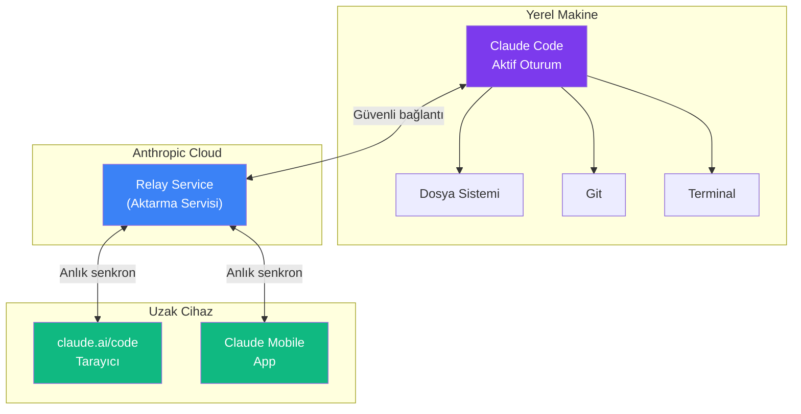
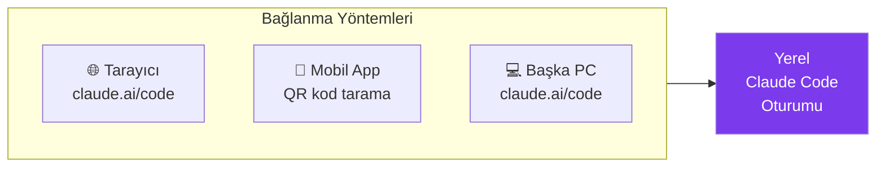
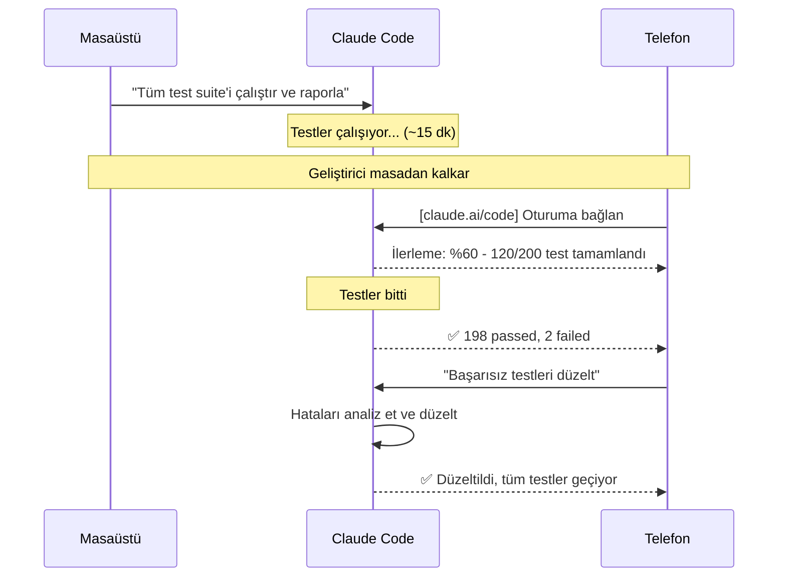
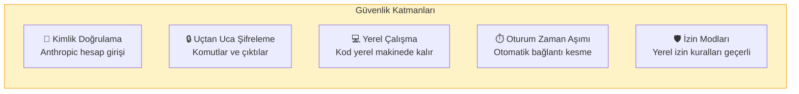
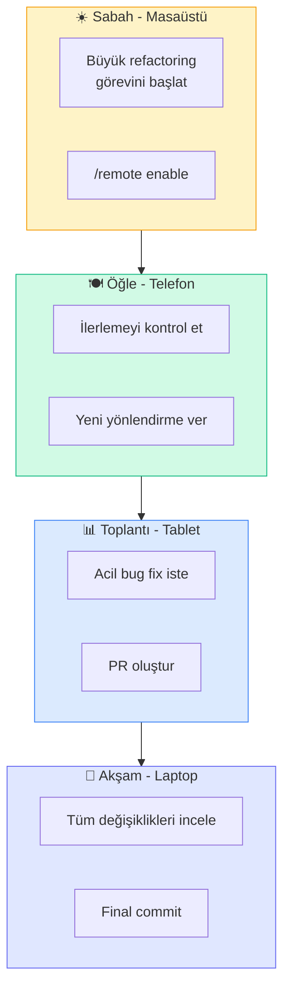

# Uzaktan Kontrol (Remote Control)

Remote Control (uzaktan kontrol), yerel makinenizde çalışan Claude Code oturumlarını telefon, tablet veya başka bir cihazın tarayıcısından devam ettirmenizi sağlar. `claude.ai/code` adresi veya Claude mobil uygulaması üzerinden oturumlarınıza erişebilir, yeni komutlar verebilir ve ilerlemeyi takip edebilirsiniz.

## Ön Koşullar

| Konu | Bölüm |
|------|-------|
| Claude Code oturum yönetimi | [Oturum Yönetimi](../09-bellek-ve-baglam/06-oturum-yonetimi.md) |
| Kimlik doğrulama | [Kimlik Doğrulama](../06-claude-code-tanitim/04-kimlik-dogrulama.md) |
| İnternet bağlantısı | Harici kaynak |

---

## Nasıl Çalışır?



Önemli noktalar:
- Kodunuz **yerel makinenizde** çalışır, buluta gönderilmez
- Yalnızca komutlar ve çıktılar relay servisi üzerinden aktarılır
- Uçtan uca şifreleme (end-to-end encryption) ile güvenli iletişim
- Yerel makine kapalıysa oturum erişilemez

---

## Kurulum

### Adım 1: Yerel Oturumda Uzaktan Kontrolü Etkinleştirme

```bash
# Claude Code oturumunda
/remote enable

# Veya başlatırken
claude --remote
```

### Adım 2: Bağlantı Bilgisi

Uzaktan kontrol etkinleştirildiğinde bir bağlantı kodu oluşturulur:

```
Remote control enabled!
Session ID: abc-def-ghi
Connect at: https://claude.ai/code/abc-def-ghi

Or scan QR code with Claude mobile app.
```

### Adım 3: Uzak Cihazdan Bağlanma



**Tarayıcıdan:**
1. `claude.ai/code` adresine gidin
2. Anthropic hesabınızla giriş yapın
3. Aktif oturumlar listesinden seçin veya Session ID girin

**Mobil uygulamadan:**
1. Claude mobil uygulamasını açın
2. "Code" sekmesine geçin
3. QR kodu tarayın veya Session ID girin

---

## Kullanım Senaryoları

### 1. Uzun Süren Görev Takibi

Masanızdan ayrıldığınızda devam eden görevleri telefondan takip edin:



### 2. Toplantıdan Görev Verme

Toplantıdayken telefondan hızlıca görev başlatın:

```
[Telefon → claude.ai/code]

> Yeni oturum başlat: ~/projects/api
> README.md dosyasını güncelle:
  - API endpoint listesini tamamla
  - Yeni authentication bölümü ekle
  - Örnek curl komutları ekle
```

### 3. Acil Düzeltme

Production'da hata olduğunda herhangi bir cihazdan müdahale:

```
[Tablet → claude.ai/code]

> ~/projects/production-api dizininde oturum başlat
> Bu hatayı acil düzelt:
  Error: ConnectionPool exhausted in UserService
> Hotfix branch'inde commit et ve PR oluştur
```

---

## Arayüz Özellikleri

### Web Arayüzü (claude.ai/code)

| Özellik | Açıklama |
|---------|----------|
| Oturum Listesi | Tüm aktif oturumları görüntüleme |
| Chat Arayüzü | Komut girme ve yanıt alma |
| Dosya Değişiklikleri | Yapılan değişikliklerin diff görünümü |
| Terminal Çıktısı | Çalıştırılan komutların çıktısı |
| Oturum Geçmişi | Önceki komutlar ve yanıtlar |

### Mobil App Özellikleri

| Özellik | Açıklama |
|---------|----------|
| Push Bildirimleri | Görev tamamlanma bildirimi |
| QR Bağlantı | Hızlı oturum bağlantısı |
| Sesli Giriş | Ses ile komut verme |
| Swipe Onay | Diff'leri kaydırarak onaylama |

---

## Güvenlik



| Güvenlik Özelliği | Açıklama |
|-------------------|----------|
| Kimlik doğrulama | Aynı Anthropic hesabıyla giriş zorunlu |
| Uçtan uca şifreleme | Veriler aktarımda şifrelenir |
| Yerel çalıştırma | Kod hiçbir zaman buluta yüklenmez |
| Oturum zaman aşımı | Bağlantısız kalan oturum otomatik kapanır |
| İzin mirası | Yerel izin kuralları uzaktan erişimde de geçerli |
| IP kısıtlama | İsteğe bağlı IP beyaz listesi |

---

## Pratik Örnek: Günlük İş Akışı



---

## Konfigürasyon

```json
{
  "remote": {
    "enabled": true,
    "autoEnable": false,
    "sessionTimeout": 3600,
    "allowedIPs": ["*"],
    "notifications": {
      "pushEnabled": true,
      "emailEnabled": false,
      "events": ["taskComplete", "error", "prCreated"]
    }
  }
}
```

---

## Sorun Giderme

| Sorun | Çözüm |
|-------|-------|
| Oturum listesi boş | Yerel makinede Claude Code çalıştığından emin olun |
| Bağlantı kopuyor | İnternet bağlantısını kontrol edin, her iki cihazda da |
| Komut gecikme | Relay servisi gecikmeli olabilir — yeniden bağlanın |
| Yerel makine yanıt vermiyor | Makinenin uyku moduna girmediğinden emin olun |
| İzin hatası | Yerel izin ayarlarını kontrol edin |

---

## Özet

| Kavram | Açıklama |
|--------|----------|
| **Remote Control** | Yerel oturumu uzak cihazdan kontrol etme |
| **claude.ai/code** | Web tabanlı uzaktan erişim arayüzü |
| **Claude Mobile** | Mobil uygulama ile bağlantı |
| **Relay Service** | Güvenli komut aktarım servisi |
| **Yerel Çalıştırma** | Kod her zaman yerel makinede çalışır |
| **E2E Şifreleme** | Tüm iletişim şifreli |

---

## Sonraki Adım

Claude Code'u tamamen web üzerinde — yerel kurulum gerektirmeden — kullanmayı inceleyelim:

→ [Web Üzerinde Claude Code](./08-web-uzerinde-claude-code.md)
