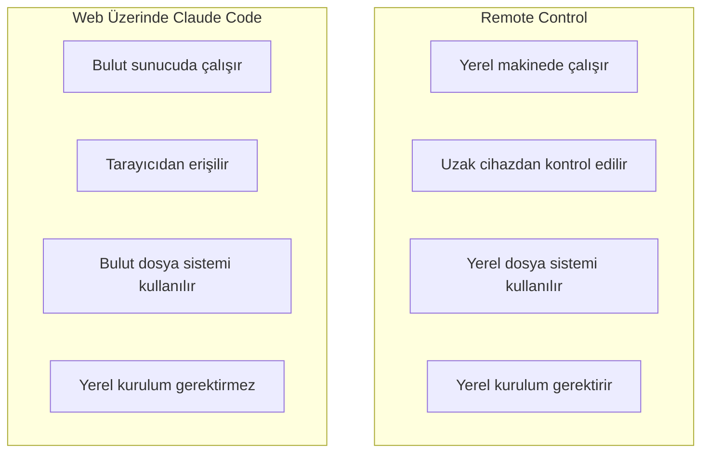
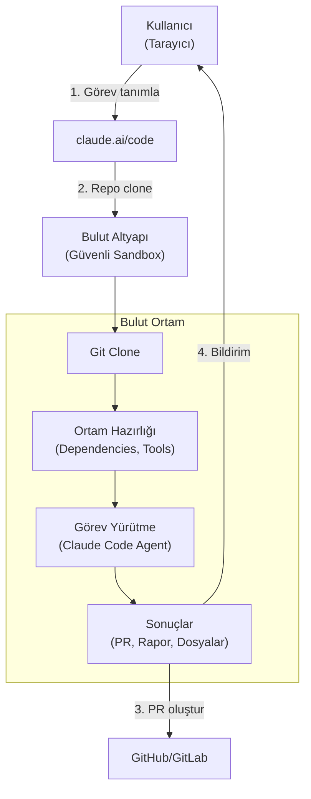
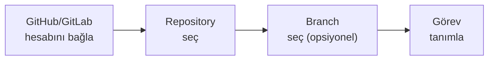
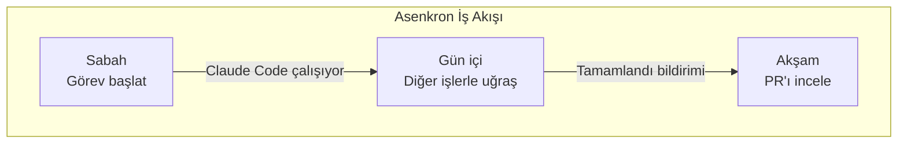
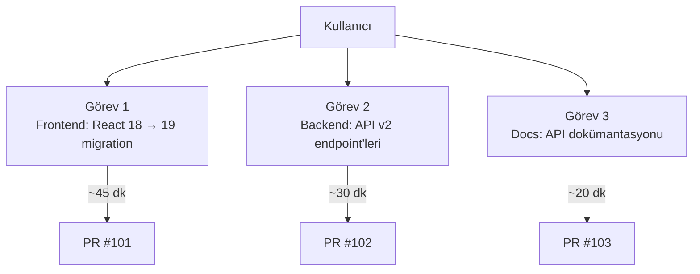
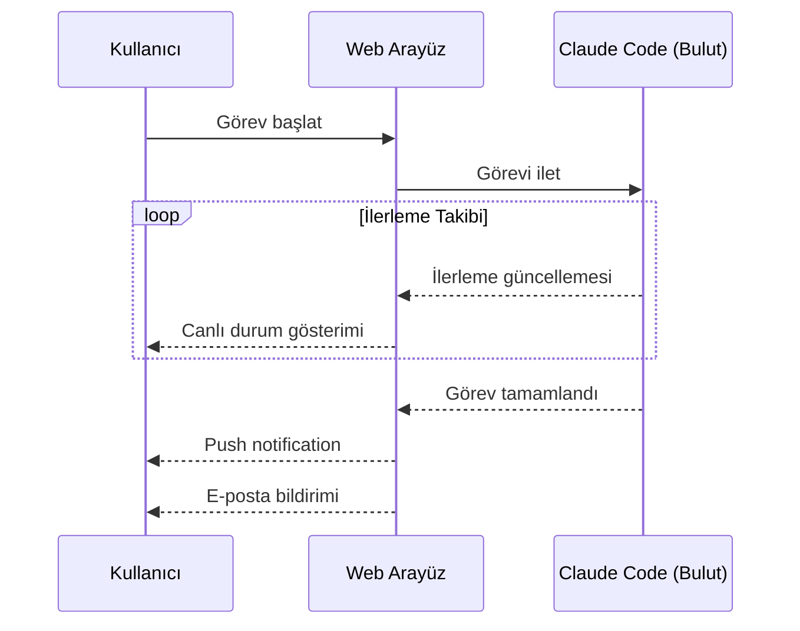
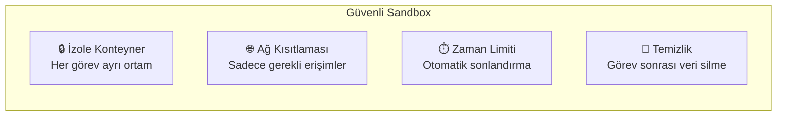

# Web Üzerinde Claude Code

Claude Code on the Web (web üzerinde Claude Code), yerel kurulum gerektirmeden güvenli bulut altyapısında (secure cloud infrastructure) asenkron kodlama görevleri çalıştırmanızı sağlar. Tarayıcınızdan erişim sağlar, görev başlatır ve sonuçları takip edersiniz — tüm hesaplama ve dosya işlemleri bulut ortamında gerçekleşir.

## Ön Koşullar

| Konu | Bölüm |
|------|-------|
| Claude Code temelleri | [Claude Code Nedir](../06-claude-code-tanitim/01-claude-code-nedir.md) |
| Git temel bilgisi | Harici kaynak |
| Anthropic hesabı | claude.ai |

---

## Remote Control vs Web Claude Code

Bu iki özellik sıklıkla karıştırılır, aralarındaki farkı netleştirelim:



| Özellik | Remote Control | Web Claude Code |
|---------|---------------|-----------------|
| Çalıştırma ortamı | Yerel makine | Bulut sunucu |
| Yerel kurulum | Gerekli | Gereksiz |
| İnternet gereksinimi | Her iki cihazda | Sadece tarayıcı |
| Dosya sistemi | Yerel | Bulut (repo clone) |
| Performans | Yerel makine gücüne bağlı | Bulut kaynakları |
| Asenkron çalışma | Sınırlı | Tam destek |

---

## Nasıl Çalışır?



### İşleyiş Adımları

1. **Görev Tanımlama** — Tarayıcıdan claude.ai/code'a giriş yapıp görev açıklarsınız
2. **Ortam Hazırlığı** — Bulut sandbox'ta repo clone edilir, bağımlılıklar kurulur
3. **Asenkron Yürütme** — Claude Code görevi bağımsız olarak çalıştırır
4. **Sonuç Teslimi** — PR oluşturulur veya sonuçlar raporlanır
5. **Bildirim** — E-posta veya push notification ile bilgilendirilirsiniz

---

## Başlarken

### Adım 1: claude.ai/code Erişimi

1. `claude.ai/code` adresine gidin
2. Anthropic hesabınızla giriş yapın
3. "New Task" butonuna tıklayın

### Adım 2: Repository Bağlama



### Adım 3: Görev Başlatma

Görev açıklamasını yazın:

```
Bu projede şunları yap:
1. TypeScript strict mode'u etkinleştir
2. Tüm "any" tiplerini uygun tipler ile değiştir
3. Yeni tip hatalarını düzelt
4. CI'da tüm testlerin geçtiğinden emin ol
5. PR oluştur
```

---

## Kullanım Senaryoları

### 1. Asenkron Görev Çalıştırma

Büyük görevleri başlatıp, tamamlanmasını beklemeden diğer işlerinize devam edin:



Örnek görevler:
- Büyük refactoring (tüm codebase'de)
- Test suite oluşturma
- Dokümantasyon güncelleme
- Dependency güncelleme ve uyumluluk düzeltme

### 2. Yerel Ortam Gerektirmeyen İşler

Bilgisayarınızda proje kurulu olmadan çalışma:

```
> Repository: github.com/company/legacy-api
> Görev: Tüm Express.js route'larını Fastify'a migrate et.
  Test'leri güncelle ve migration rehberi oluştur.
```

### 3. Paralel Görevler

Birden fazla görevi eş zamanlı çalıştırma:



---

## Görev Yönetimi

### Görev Durumları

| Durum | Simge | Açıklama |
|-------|-------|----------|
| Queued | ⏳ | Sıraya alındı |
| Setting up | ⚙️ | Ortam hazırlanıyor |
| Running | 🔄 | Görev çalışıyor |
| Awaiting input | 💬 | Kullanıcı girdisi bekleniyor |
| Completed | ✅ | Başarıyla tamamlandı |
| Failed | ❌ | Hata ile sonuçlandı |

### Görev İzleme



### Görev Geçmişi

Tüm görevleriniz claude.ai/code dashboard'unda listelenir:

| Bilgi | Açıklama |
|-------|----------|
| Görev açıklaması | Ne yapıldığı |
| Repository | Hangi repo üzerinde çalışıldığı |
| Süre | Görev süresi |
| Sonuç | PR linki veya hata raporu |
| Log | Detaylı çalışma günlüğü |
| Maliyet | Token kullanımı ve maliyet |

---

## Pratik Örnekler

### Örnek 1: Legacy Kod Modernizasyonu

```
Görev: JavaScript → TypeScript Migration

Repository: github.com/company/frontend
Branch: main

Açıklama:
1. src/ altındaki tüm .js dosyalarını .ts/.tsx'e dönüştür
2. Tip tanımları ekle (any kullanma)
3. tsconfig.json oluştur (strict mode)
4. Tüm import/export'ları güncelle
5. Build hatalarını düzelt
6. Mevcut testlerin geçtiğinden emin ol
7. PR oluştur, değişiklik özeti ekle
```

### Örnek 2: Otomatik Test Oluşturma

```
Görev: Test Coverage İyileştirme

Repository: github.com/company/api-server
Branch: develop

Açıklama:
1. Mevcut test coverage raporunu çıkar
2. Coverage'ı %50'den %80'e çıkar
3. Kritik business logic fonksiyonları öncelikli
4. Edge case'leri kapsayan testler yaz
5. CI pipeline'ın geçtiğinden emin ol
```

### Örnek 3: Dokümantasyon Güncelleme

```
Görev: API Dokümantasyonu

Repository: github.com/company/backend
Branch: main

Açıklama:
1. Tüm API endpoint'lerini tara
2. OpenAPI 3.0 spesifikasyonu oluştur
3. Her endpoint için request/response örnekleri ekle
4. README.md'ye API kullanım rehberi ekle
5. CHANGELOG.md güncelle
```

---

## Güvenlik ve İzolasyon



| Güvenlik | Açıklama |
|----------|----------|
| İzole ortam | Her görev ayrı konteyner'da çalışır |
| Veri izolasyonu | Görevler arası veri paylaşımı yok |
| Otomatik temizlik | Görev tamamlandıktan sonra ortam silinir |
| Ağ kısıtlaması | Sadece repo ve paket yöneticileri erişimi |
| Zaman limiti | Maksimum çalışma süresi |
| Denetim günlüğü | Tüm işlemler kaydedilir |

---

## Sınırlamalar

| Sınırlama | Açıklama |
|-----------|----------|
| Yerel dosya erişimi | Yerel dosya sistemine erişim yok (repo clone edilir) |
| Özel ağ | VPN/intranet erişimi yok |
| Hardware | GPU veya özel donanım erişimi yok |
| Süre limiti | Görev başına maksimum çalışma süresi var |
| Repo boyutu | Çok büyük monorepo'larda performans düşebilir |

---

## Özet

| Kavram | Açıklama |
|--------|----------|
| **Web Claude Code** | Bulut altyapıda yerel kurulum gerektirmeden çalışma |
| **Asenkron Görev** | Başlat ve tamamlanmasını bekle |
| **Bulut Sandbox** | Güvenli, izole çalışma ortamı |
| **Paralel Görev** | Birden fazla görevi eş zamanlı çalıştırma |
| **Otomatik PR** | Görev tamamlandığında PR oluşturma |
| **Görev Geçmişi** | Tüm görevlerin takibi ve logları |

---

## Sonraki Adım

Bu bölümü tamamladınız! CI/CD pipeline'larında Claude Code kullanımına geçelim:

→ [CI/CD ve DevOps](../16-cicd-ve-devops/README.md)
