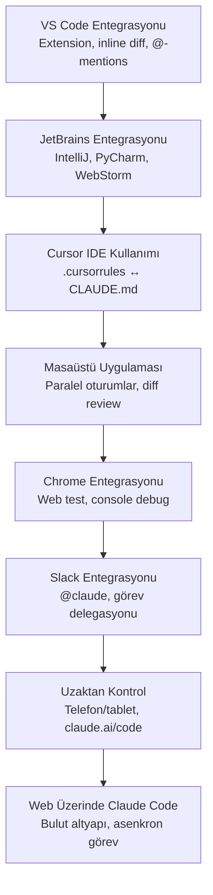
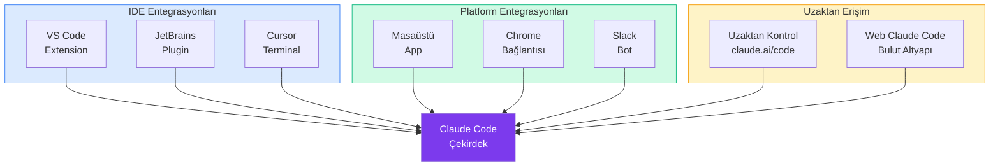

# Bölüm 15: IDE ve Platform Entegrasyonları

Claude Code, terminal tabanlı bir arayüzün ötesinde birçok IDE, platform ve hizmetle entegre çalışır. Bu bölüm, VS Code'dan JetBrains'e, Cursor'dan masaüstü uygulamasına, Chrome'dan Slack'e kadar tüm entegrasyon noktalarını kapsamlı şekilde ele alır.

## Bu Bölümde Neler Öğreneceksiniz?

## İçerik

| # | Dosya | Konu | Süre |
|---|-------|------|------|
| 01 | [VS Code Entegrasyonu](./01-vs-code-entegrasyonu.md) | Extension kurulumu, inline diff, @-mentions, kısayollar | ~15 dk |
| 02 | [JetBrains Entegrasyonu](./02-jetbrains-entegrasyonu.md) | IntelliJ, PyCharm, WebStorm plugin kurulumu ve kullanımı | ~12 dk |
| 03 | [Cursor IDE Kullanımı](./03-cursor-ide-kullanimi.md) | Cursor ile Claude Code, .cursorrules ↔ CLAUDE.md uyumu | ~12 dk |
| 04 | [Masaüstü Uygulaması](./04-masaustu-uygulamasi.md) | Desktop app, paralel oturumlar, Git izolasyonu, PR izleme | ~15 dk |
| 05 | [Chrome Entegrasyonu](./05-chrome-entegrasyonu.md) | Tarayıcı bağlantısı, web test, console debug, form otomasyon | ~10 dk |
| 06 | [Slack Entegrasyonu](./06-slack-entegrasyonu.md) | Slack workspace'ten görev delegasyonu, @claude | ~10 dk |
| 07 | [Uzaktan Kontrol](./07-uzaktan-kontrol.md) | Telefon/tablet ile oturum devam ettirme, claude.ai/code | ~8 dk |
| 08 | [Web Üzerinde Claude Code](./08-web-uzerinde-claude-code.md) | Bulut altyapıda asenkron görev çalıştırma | ~10 dk |

## Entegrasyon Haritası

## Ön Koşullar

Bu bölümü okumadan önce aşağıdaki konulara aşina olmanız önerilir:

| Konu | Bölüm |
|------|-------|
| Claude Code nasıl çalışır | [Bölüm 06](../06-claude-code-tanitim/README.md) |
| Arayüz ve komutlar | [Bölüm 07](../07-arayuz-ve-komutlar/README.md) |
| Bellek ve bağlam yönetimi | [Bölüm 09](../09-bellek-ve-baglam/README.md) |
| İzinler ve güvenlik | [Bölüm 10](../10-izinler-ve-guvenlik/README.md) |

## Önceki Bölüm

← [14 - Hooks ve Otomasyon](../14-hooks-ve-otomasyon/README.md)

## Sonraki Adım

Bu bölümü tamamladıktan sonra → [16 - CI/CD ve DevOps](../16-cicd-ve-devops/README.md)
