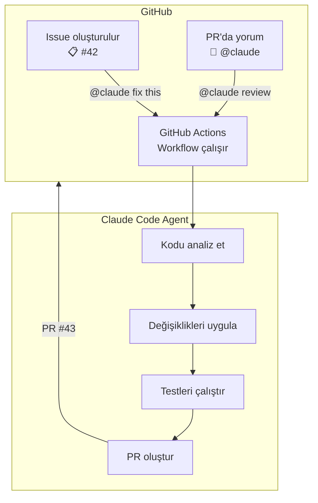
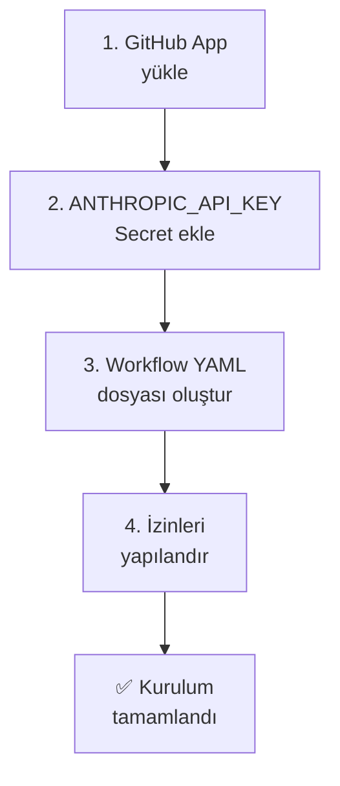
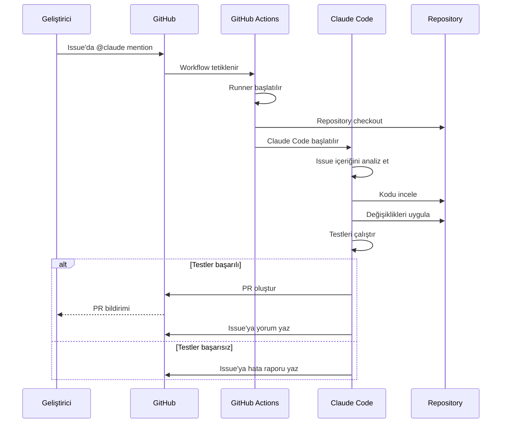
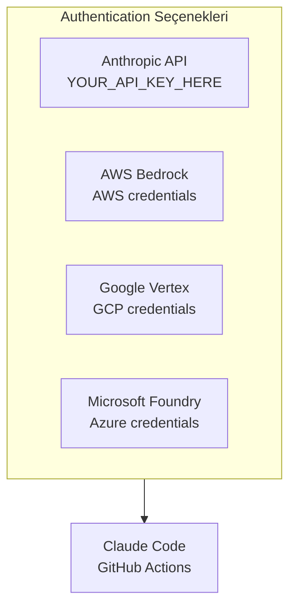
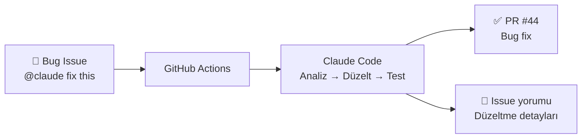

# GitHub Actions Entegrasyonu

Claude Code GitHub Actions, GitHub issue'larında ve PR'larda `@claude` mention (bahsetme) ile otomatik PR oluşturma, bug fix (hata düzeltme) ve kod inceleme işlemlerini gerçekleştirir. Bu bölümde kurulum yöntemlerini, workflow (iş akışı) yapılandırmasını, authentication (kimlik doğrulama) seçeneklerini ve pratik kullanım senaryolarını ele alıyoruz.

## Ön Koşullar

| Konu | Bölüm |
|------|-------|
| Claude Code temelleri | [Claude Code Nedir](../06-claude-code-tanitim/01-claude-code-nedir.md) |
| GitHub Actions temel bilgisi | Harici kaynak |
| GitHub repository yönetimi | Harici kaynak |

---

## Genel Bakış



---

## Kurulum Yöntemleri

### Yöntem 1: Otomatik Kurulum (Önerilen)

Claude Code CLI kullanarak hızlı kurulum:

```bash
claude /install-github-app
```

Bu komut otomatik olarak:
1. GitHub App'i repository'ye yükler
2. Gerekli izinleri yapılandırır
3. Workflow dosyasını oluşturur
4. Secret'ları ayarlar

### Yöntem 2: Manuel Kurulum

Adım adım manuel kurulum:



#### Adım 1: GitHub App Yükleme

1. GitHub Marketplace'ten "Claude Code" uygulamasını yükleyin
2. Repository erişimi verin (tüm repo'lar veya seçili repo'lar)

#### Adım 2: API Key Secret Ekleme

```
Repository → Settings → Secrets and variables → Actions → New repository secret

Name: ANTHROPIC_API_KEY
Value: YOUR_API_KEY_HERE...
```

#### Adım 3: Workflow Dosyası Oluşturma

`.github/workflows/claude-code.yml` dosyasını oluşturun:

```yaml
name: Claude Code

on:
  issue_comment:
    types: [created]
  issues:
    types: [opened, labeled]
  pull_request_review_comment:
    types: [created]

jobs:
  claude:
    if: |
      (github.event_name == 'issue_comment' && contains(github.event.comment.body, '@claude')) ||
      (github.event_name == 'issues' && contains(github.event.issue.body, '@claude')) ||
      (github.event_name == 'pull_request_review_comment' && contains(github.event.comment.body, '@claude'))
    runs-on: ubuntu-latest
    permissions:
      contents: write
      issues: write
      pull-requests: write
    steps:
      - name: Checkout
        uses: actions/checkout@v4
        with:
          fetch-depth: 0

      - name: Setup Node.js
        uses: actions/setup-node@v4
        with:
          node-version: '20'

      - name: Install Claude Code
        run: npm install -g @anthropic-ai/claude-code

      - name: Run Claude Code
        env:
          ANTHROPIC_API_KEY: ${{ secrets.ANTHROPIC_API_KEY }}
          GITHUB_TOKEN: ${{ secrets.GITHUB_TOKEN }}
        run: |
          claude -p "$(cat <<'EOF'
          GitHub event: ${{ github.event_name }}
          Issue/Comment body: ${{ github.event.comment.body || github.event.issue.body }}
          
          Analyze the request and implement the necessary changes.
          Create a pull request with the changes.
          EOF
          )"
```

#### Adım 4: İzinleri Yapılandırma

Gerekli GitHub permissions (izinler):

| İzin | Seviye | Açıklama |
|------|--------|----------|
| **Contents** | Write | Dosya okuma/yazma, branch oluşturma |
| **Issues** | Write | Issue okuma, yorum yazma |
| **Pull Requests** | Write | PR oluşturma, güncelleme |
| **Actions** | Read | Workflow durumu okuma |

---

## Workflow Diyagramı



---

## Authentication Seçenekleri

Claude Code GitHub Actions dört farklı authentication (kimlik doğrulama) yöntemi destekler:



### Anthropic API (Doğrudan)

```yaml
env:
  ANTHROPIC_API_KEY: ${{ secrets.ANTHROPIC_API_KEY }}
```

### AWS Bedrock

```yaml
env:
  CLAUDE_CODE_USE_BEDROCK: "1"
  AWS_ACCESS_KEY_ID: ${{ secrets.AWS_ACCESS_KEY_ID }}
  AWS_SECRET_ACCESS_KEY: ${{ secrets.AWS_SECRET_ACCESS_KEY }}
  AWS_REGION: us-east-1
```

### Google Vertex AI

```yaml
env:
  CLAUDE_CODE_USE_VERTEX: "1"
  GOOGLE_APPLICATION_CREDENTIALS: ${{ secrets.GCP_CREDENTIALS_PATH }}
  CLOUD_ML_REGION: us-central1
  ANTHROPIC_VERTEX_PROJECT_ID: my-project-id
```

### Microsoft Azure AI Foundry

```yaml
env:
  CLAUDE_CODE_USE_FOUNDRY: "1"
  AZURE_CLIENT_ID: ${{ secrets.AZURE_CLIENT_ID }}
  AZURE_CLIENT_SECRET: ${{ secrets.AZURE_CLIENT_SECRET }}
  AZURE_TENANT_ID: ${{ secrets.AZURE_TENANT_ID }}
```

---

## Kullanım Senaryoları

### 1. Issue'dan PR Oluşturma

Issue'da `@claude` mention yaparak otomatik PR oluşturma:

```markdown
<!-- GitHub Issue #42 -->
## Bug: Login sayfasında şifre doğrulama çalışmıyor

@claude Bu hatayı düzelt:
- Şifre 8 karakterden kısa olduğunda hata mesajı gösterilmiyor
- Özel karakter kontrolü eksik
- Test ekle
```

Claude Code bu issue'yu alır, kodu analiz eder, düzeltmeyi uygular ve PR oluşturur.

### 2. PR'da Kod İnceleme

PR'a yorum olarak `@claude` ile inceleme isteği:

```markdown
<!-- PR #43 Comment -->
@claude Bu PR'ı incele:
- Güvenlik açıkları var mı?
- Performance etkisi ne?
- Edge case'ler kapsanmış mı?
```

### 3. PR'da Değişiklik İsteği

```markdown
<!-- PR #43 Review Comment -->
@claude Bu fonksiyona input validation ekle ve error handling'i iyileştir
```

### 4. Label ile Otomatik Tetikleme

Issue'ya belirli bir label eklendiğinde otomatik tetikleme:

```yaml
on:
  issues:
    types: [labeled]

jobs:
  claude:
    if: github.event.label.name == 'claude-fix'
    # ...
```

---

## Gelişmiş Workflow Yapılandırması

### Çoklu Adım Workflow

```yaml
name: Claude Code Advanced

on:
  issue_comment:
    types: [created]

jobs:
  analyze:
    if: contains(github.event.comment.body, '@claude')
    runs-on: ubuntu-latest
    permissions:
      contents: write
      issues: write
      pull-requests: write
    steps:
      - uses: actions/checkout@v4
        with:
          fetch-depth: 0

      - uses: actions/setup-node@v4
        with:
          node-version: '20'

      - name: Install dependencies
        run: |
          npm install -g @anthropic-ai/claude-code
          npm ci

      - name: Run Claude Code
        env:
          ANTHROPIC_API_KEY: ${{ secrets.ANTHROPIC_API_KEY }}
          GITHUB_TOKEN: ${{ secrets.GITHUB_TOKEN }}
        run: |
          claude -p "$(cat <<'EOF'
          Context: GitHub issue comment
          Repository: ${{ github.repository }}
          Issue Number: ${{ github.event.issue.number }}
          Comment: ${{ github.event.comment.body }}
          
          Instructions:
          1. Read the issue and understand the request
          2. Analyze the codebase
          3. Implement the changes
          4. Run tests: npm test
          5. If tests pass, create a PR
          6. Comment on the issue with the result
          EOF
          )"

      - name: Post result
        if: always()
        uses: actions/github-script@v7
        with:
          script: |
            await github.rest.issues.createComment({
              owner: context.repo.owner,
              repo: context.repo.repo,
              issue_number: context.issue.number,
              body: `Claude Code workflow completed. Check the [Actions run](${context.serverUrl}/${context.repo.owner}/${context.repo.repo}/actions/runs/${context.runId}) for details.`
            });
```

---

## Pratik Örnekler

### Örnek 1: Bug Fix Otomasyonu



### Örnek 2: Feature İmplementasyonu

```markdown
<!-- Issue #50 -->
## Feature: Kullanıcı profil API'si

@claude Şu endpoint'leri oluştur:
- GET /api/users/:id/profile
- PUT /api/users/:id/profile
- DELETE /api/users/:id/profile

Gereksinimler:
- JWT authentication zorunlu
- Input validation (Joi/Zod)
- Rate limiting
- Unit test (%80+ coverage)
```

### Örnek 3: Scheduled Maintenance

```yaml
name: Weekly Code Quality

on:
  schedule:
    - cron: '0 9 * * 1'  # Her Pazartesi 09:00 UTC

jobs:
  quality-check:
    runs-on: ubuntu-latest
    steps:
      - uses: actions/checkout@v4

      - name: Code Quality Analysis
        env:
          ANTHROPIC_API_KEY: ${{ secrets.ANTHROPIC_API_KEY }}
        run: |
          npx @anthropic-ai/claude-code -p "$(cat <<'EOF'
          Analyze the codebase for:
          1. Security vulnerabilities
          2. Performance bottlenecks
          3. Code duplication
          4. Outdated dependencies
          Create an issue with the findings.
          EOF
          )"
```

---

## Sorun Giderme

| Sorun | Çözüm |
|-------|-------|
| Workflow tetiklenmiyor | `if` koşulunu ve event türünü kontrol edin |
| Permission hatası | Workflow `permissions` bloğunu kontrol edin |
| API key hatası | Secret'ın doğru adla eklendiğinden emin olun |
| Timeout | Büyük görevlerde `timeout-minutes` artırın |
| PR oluşturulamıyor | `contents: write` ve `pull-requests: write` izinleri gerekli |

---

## Özet

| Kavram | Açıklama |
|--------|----------|
| **@claude Mention** | Issue/PR'da Claude Code'u tetikleme |
| **GitHub App** | Otomatik veya manuel kurulum |
| **Workflow YAML** | GitHub Actions yapılandırma dosyası |
| **Permissions** | Contents, Issues, Pull Requests yazma izni |
| **Auth Seçenekleri** | Anthropic API, AWS Bedrock, Google Vertex, Azure Foundry |
| **Otomatik PR** | Issue'dan PR'a tam otomatik akış |

---

## Sonraki Adım

GitLab CI/CD pipeline'larında Claude Code entegrasyonunu inceleyelim:

→ [GitLab CI/CD](./02-gitlab-cicd.md)
