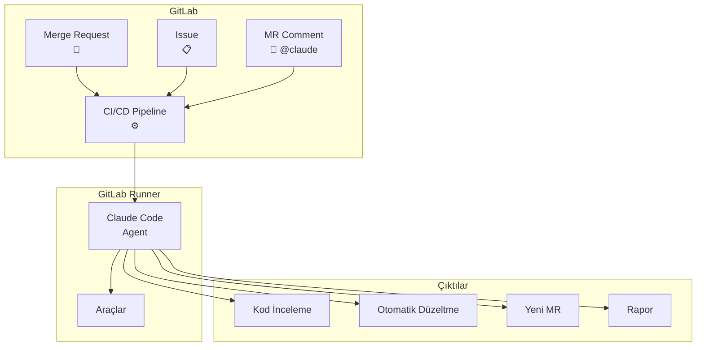
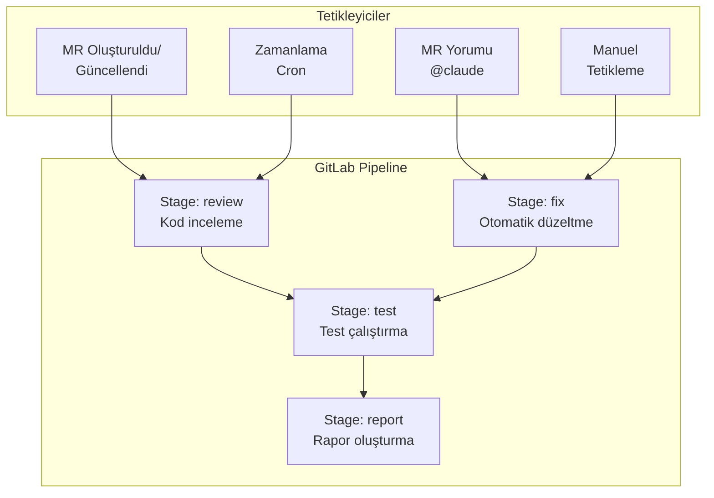
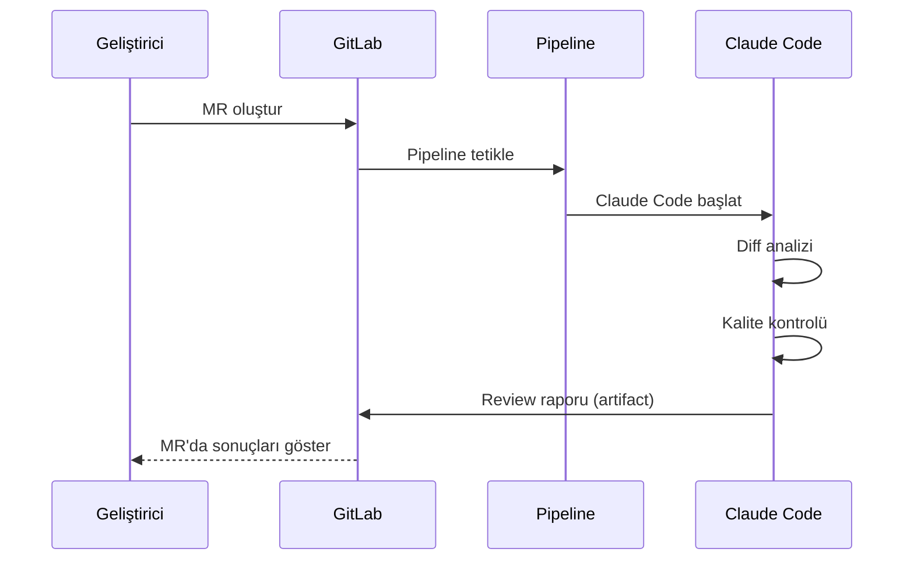

# GitLab CI/CD Entegrasyonu

Claude Code, GitLab CI/CD pipeline'larına (sürekli entegrasyon/dağıtım hatları) entegre edilerek merge request (birleştirme isteği) otomasyonu, kod inceleme ve otomatik düzeltme işlemleri gerçekleştirebilir. Bu bölümde `.gitlab-ci.yml` yapılandırmasını, merge request tetikleyicilerini ve pratik kullanım senaryolarını ele alıyoruz.

## Ön Koşullar

| Konu | Bölüm |
|------|-------|
| Claude Code temelleri | [Claude Code Nedir](../06-claude-code-tanitim/01-claude-code-nedir.md) |
| GitLab CI/CD temel bilgisi | Harici kaynak |
| GitLab repository yönetimi | Harici kaynak |

---

## Genel Bakış



---

## Kurulum

### Adım 1: CI/CD Variables Ekleme

GitLab'da CI/CD değişkenlerini ekleyin:

```
Settings → CI/CD → Variables → Add variable

ANTHROPIC_API_KEY = YOUR_API_KEY_HERE (Masked, Protected)
```

### Adım 2: .gitlab-ci.yml Oluşturma

Proje kök dizininde `.gitlab-ci.yml` dosyası oluşturun:

```yaml
stages:
  - claude-review
  - claude-fix

variables:
  NODE_VERSION: "20"

.claude-base:
  image: node:${NODE_VERSION}
  before_script:
    - npm install -g @anthropic-ai/claude-code
    - git config --global user.email "claude@example.com"
    - git config --global user.name "Claude Code"

claude-mr-review:
  extends: .claude-base
  stage: claude-review
  rules:
    - if: '$CI_PIPELINE_SOURCE == "merge_request_event"'
  script:
    - |
      claude -p "$(cat <<'EOF'
      Review the merge request changes in this repository.
      
      Source branch: ${CI_MERGE_REQUEST_SOURCE_BRANCH_NAME}
      Target branch: ${CI_MERGE_REQUEST_TARGET_BRANCH_NAME}
      MR Title: ${CI_MERGE_REQUEST_TITLE}
      
      Analyze:
      1. Code quality and best practices
      2. Potential bugs and edge cases
      3. Security vulnerabilities
      4. Performance implications
      5. Test coverage
      
      Output a structured review report.
      EOF
      )"

claude-issue-fix:
  extends: .claude-base
  stage: claude-fix
  rules:
    - if: '$CI_PIPELINE_SOURCE == "trigger"'
      when: manual
  script:
    - |
      claude -p "$(cat <<'EOF'
      Fix the issue described below and create a merge request.
      
      Issue: ${ISSUE_DESCRIPTION}
      
      Steps:
      1. Analyze the codebase
      2. Implement the fix
      3. Write tests
      4. Create a merge request
      EOF
      )"
```

### Adım 3: Runner Yapılandırması

GitLab Runner'ın Claude Code çalıştırabilmesi için yeterli kaynaklara sahip olması gerekir:

```toml
# /etc/gitlab-runner/config.toml
[[runners]]
  name = "claude-code-runner"
  executor = "docker"
  [runners.docker]
    image = "node:20"
    memory = "4g"
    cpus = "2"
    allowed_images = ["node:*"]
```

---

## Pipeline Mimarisi



---

## Merge Request Otomasyonu

### Otomatik MR İnceleme

Her merge request oluşturulduğunda otomatik inceleme:

```yaml
claude-auto-review:
  extends: .claude-base
  stage: claude-review
  rules:
    - if: '$CI_PIPELINE_SOURCE == "merge_request_event"'
  script:
    - |
      DIFF=$(git diff ${CI_MERGE_REQUEST_DIFF_BASE_SHA}...HEAD)
      claude -p "$(cat <<EOF
      Review the following code changes:
      
      ${DIFF}
      
      Provide:
      1. Summary of changes
      2. Potential issues
      3. Improvement suggestions
      4. Security concerns
      EOF
      )" > review_report.md
  artifacts:
    paths:
      - review_report.md
    expire_in: 1 week
```

### MR Yorumundan Tetikleme

```yaml
claude-on-comment:
  extends: .claude-base
  stage: claude-fix
  rules:
    - if: '$CI_PIPELINE_SOURCE == "trigger" && $CLAUDE_COMMAND'
  script:
    - |
      claude -p "$(cat <<EOF
      Command: ${CLAUDE_COMMAND}
      Repository: ${CI_PROJECT_PATH}
      Branch: ${CI_COMMIT_BRANCH}
      
      Execute the command and push changes.
      EOF
      )"
    - git push origin HEAD:${CI_COMMIT_BRANCH}
```

---

## Pratik Örnekler

### Örnek 1: MR Kalite Kontrolü



```yaml
claude-quality-gate:
  extends: .claude-base
  stage: claude-review
  rules:
    - if: '$CI_PIPELINE_SOURCE == "merge_request_event"'
  script:
    - |
      claude -p "$(cat <<'EOF'
      Analyze the code changes for quality gates:
      
      1. No console.log statements in production code
      2. All functions have TypeScript types
      3. No hardcoded secrets or API keys
      4. Error handling is present
      5. New code has corresponding tests
      
      Exit with code 1 if any gate fails.
      EOF
      )" || exit 1
  allow_failure: false
```

### Örnek 2: Otomatik Issue Çözme

```yaml
claude-fix-issue:
  extends: .claude-base
  stage: claude-fix
  rules:
    - if: '$ISSUE_ID && $CI_PIPELINE_SOURCE == "trigger"'
  script:
    - |
      BRANCH_NAME="claude/fix-issue-${ISSUE_ID}"
      git checkout -b ${BRANCH_NAME}
      
      claude -p "$(cat <<EOF
      Fix GitLab issue #${ISSUE_ID}
      Issue description: ${ISSUE_DESCRIPTION}
      
      Steps:
      1. Analyze the issue
      2. Find related code
      3. Implement the fix
      4. Write tests
      5. Commit changes
      EOF
      )"
      
      git push -u origin ${BRANCH_NAME}
      
      # MR oluştur
      curl --request POST \
        --header "PRIVATE-TOKEN: ${GITLAB_TOKEN}" \
        --header "Content-Type: application/json" \
        --data "{
          \"source_branch\": \"${BRANCH_NAME}\",
          \"target_branch\": \"main\",
          \"title\": \"Fix: Issue #${ISSUE_ID}\",
          \"description\": \"Automated fix by Claude Code\"
        }" \
        "${CI_API_V4_URL}/projects/${CI_PROJECT_ID}/merge_requests"
```

### Örnek 3: Scheduled Kod Analizi

```yaml
claude-weekly-analysis:
  extends: .claude-base
  stage: claude-review
  rules:
    - if: '$CI_PIPELINE_SOURCE == "schedule"'
  script:
    - |
      claude -p "$(cat <<'EOF'
      Perform weekly code analysis:
      
      1. Find dead code and unused imports
      2. Identify code duplication
      3. Check dependency freshness
      4. Review security advisories
      5. Generate improvement suggestions
      
      Create a report in markdown format.
      EOF
      )" > weekly_report.md
  artifacts:
    paths:
      - weekly_report.md
    expire_in: 30 days
```

---

## Konfigürasyon Seçenekleri

### Ortam Değişkenleri

| Değişken | Gerekli | Açıklama |
|----------|---------|----------|
| `ANTHROPIC_API_KEY` | ✅ | Anthropic API anahtarı |
| `GITLAB_TOKEN` | MR için | GitLab API erişim tokeni |
| `CI_MERGE_REQUEST_*` | Otomatik | GitLab MR değişkenleri |
| `CLAUDE_MODEL` | ❌ | Kullanılacak model (varsayılan: sonnet) |
| `CLAUDE_MAX_TOKENS` | ❌ | Maksimum token limiti |

### İleri Düzey Yapılandırma

```yaml
variables:
  CLAUDE_MODEL: "claude-sonnet-4-20250514"
  CLAUDE_MAX_TURNS: "50"
  CLAUDE_OUTPUT_FORMAT: "json"

claude-advanced:
  extends: .claude-base
  variables:
    CLAUDE_CODE_USE_BEDROCK: "1"
    AWS_DEFAULT_REGION: "eu-west-1"
  script:
    - claude -p "${TASK}" --model ${CLAUDE_MODEL} --output-format json
```

---

## Sorun Giderme

| Sorun | Çözüm |
|-------|-------|
| Pipeline tetiklenmiyor | `rules` ve `if` koşullarını kontrol edin |
| API key hatası | CI/CD variables'da `ANTHROPIC_API_KEY` masked olarak ekleyin |
| Runner timeout | Runner `timeout` değerini artırın (ör: 1h) |
| Git push başarısız | Runner'ın push izni olduğundan emin olun |
| MR oluşturulamıyor | `GITLAB_TOKEN` değişkenini kontrol edin |

---

## Özet

| Kavram | Açıklama |
|--------|----------|
| **.gitlab-ci.yml** | Pipeline yapılandırma dosyası |
| **MR Tetikleyici** | Merge request olaylarında otomatik çalışma |
| **Otomatik İnceleme** | Kod kalite kontrolü ve güvenlik analizi |
| **Issue Çözme** | Issue'dan MR'a otomatik akış |
| **Scheduled Analysis** | Zamanlı kod kalite raporları |
| **Auth Seçenekleri** | Anthropic API, AWS Bedrock, Google Vertex |

---

## Sonraki Adım

Otomatik kod inceleme sürecinin detaylarını — güvenlik, logic hatası ve regression analizi — inceleyelim:

→ [Kod İnceleme Otomasyonu](./03-kod-inceleme-otomasyonu.md)
