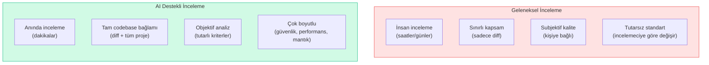
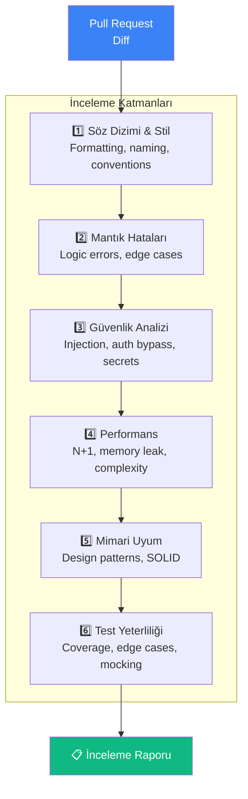
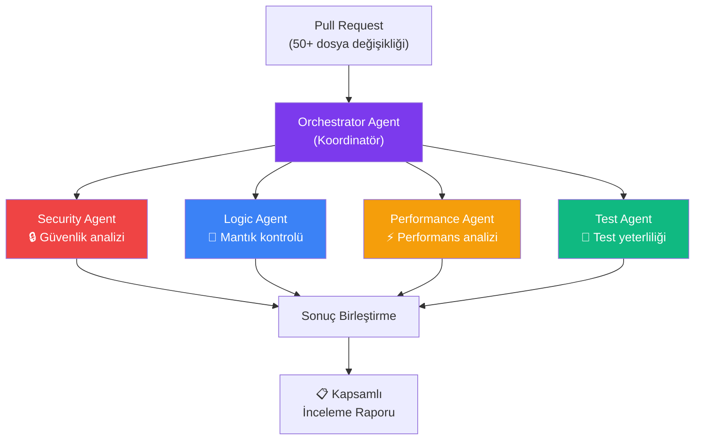
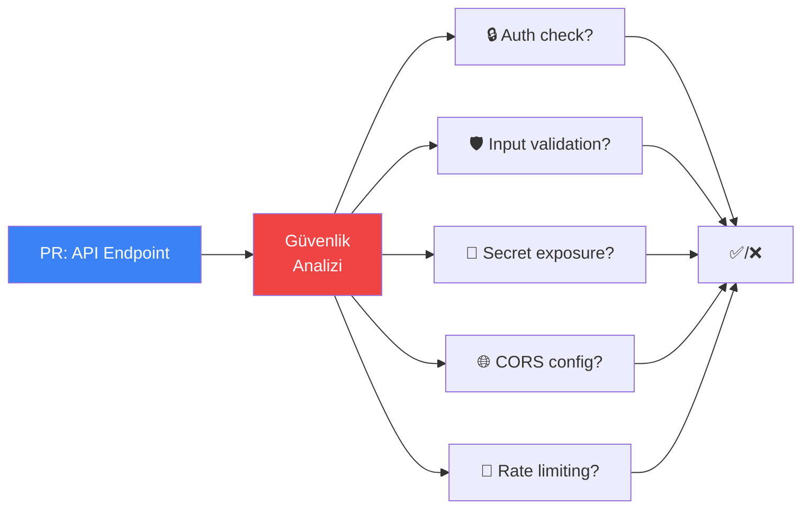

# Kod İnceleme Otomasyonu

Claude Code, PR (Pull Request) ve MR (Merge Request) incelemelerini otomatikleştirerek logic errors (mantık hataları), security vulnerabilities (güvenlik açıkları) ve regressions (gerilemeleri) tespit eder. Multi-agent analysis (çok ajanlı analiz) ile tam codebase bağlamında derinlemesine inceleme yaparak, geleneksel linter'ların ötesine geçen kapsamlı kod incelemeleri sunar.

## Ön Koşullar

| Konu | Bölüm |
|------|-------|
| GitHub Actions | [GitHub Actions](./01-github-actions.md) |
| GitLab CI/CD | [GitLab CI/CD](./02-gitlab-cicd.md) |
| Subagent'lar | [Subagent Nedir](../13-subagentlar-ve-agent-takimlari/01-subagent-nedir.md) |

---

## Otomatik Kod İnceleme Nedir?

Geleneksel code review (kod inceleme) ve AI destekli code review arasındaki fark:



---

## İnceleme Katmanları

Claude Code kod incelemesini birden fazla katmanda gerçekleştirir:



### Her Katmanın Detayı

| Katman | Kontrol Edilen | Araçlar |
|--------|---------------|---------|
| **Söz Dizimi & Stil** | Formatting, naming convention, code style | ESLint, Prettier kuralları |
| **Mantık Hataları** | Null reference, off-by-one, race condition | Statik analiz + AI |
| **Güvenlik** | SQL injection, XSS, CSRF, hardcoded secrets | OWASP kontrol listesi |
| **Performans** | N+1 query, memory leak, O(n²) algoritma | Complexity analizi |
| **Mimari** | SOLID ihlali, circular dependency, coupling | Design pattern analizi |
| **Test** | Coverage gap, edge case eksikliği, mock kalitesi | Test framework analizi |

---

## Multi-Agent Analiz

Büyük PR'lar için Claude Code multi-agent (çok ajanlı) yaklaşım kullanır:



### Multi-Agent Avantajları

| Tek Agent | Multi-Agent |
|-----------|-------------|
| Sıralı analiz | Paralel analiz |
| Sınırlı context | Her agent kendi alanına odaklanır |
| Tek bakış açısı | Çok boyutlu değerlendirme |
| Büyük PR'larda yavaş | Ölçeklenebilir |

---

## Kurulum ve Yapılandırma

### GitHub Actions ile Otomatik İnceleme

```yaml
name: Claude Code Review

on:
  pull_request:
    types: [opened, synchronize, reopened]

jobs:
  review:
    runs-on: ubuntu-latest
    permissions:
      contents: read
      pull-requests: write
    steps:
      - uses: actions/checkout@v4
        with:
          fetch-depth: 0

      - uses: actions/setup-node@v4
        with:
          node-version: '20'

      - name: Install Claude Code
        run: npm install -g @anthropic-ai/claude-code

      - name: Get PR diff
        id: diff
        run: |
          git diff origin/${{ github.base_ref }}...HEAD > pr_diff.txt
          echo "files_changed=$(git diff --name-only origin/${{ github.base_ref }}...HEAD | wc -l)" >> $GITHUB_OUTPUT

      - name: Run Code Review
        env:
          ANTHROPIC_API_KEY: ${{ secrets.ANTHROPIC_API_KEY }}
        run: |
          claude -p "$(cat <<'EOF'
          You are a senior code reviewer. Review the PR changes thoroughly.
          
          PR Title: ${{ github.event.pull_request.title }}
          PR Description: ${{ github.event.pull_request.body }}
          Files changed: ${{ steps.diff.outputs.files_changed }}
          
          Review criteria:
          1. Logic errors and bugs
          2. Security vulnerabilities (OWASP Top 10)
          3. Performance issues
          4. Code quality and maintainability
          5. Test coverage adequacy
          
          Format your review as:
          ## Summary
          ## Critical Issues (must fix)
          ## Warnings (should fix)
          ## Suggestions (nice to have)
          ## Positive Observations
          EOF
          )" > review.md

      - name: Post Review Comment
        uses: actions/github-script@v7
        with:
          script: |
            const fs = require('fs');
            const review = fs.readFileSync('review.md', 'utf8');
            await github.rest.pulls.createReview({
              owner: context.repo.owner,
              repo: context.repo.repo,
              pull_number: context.issue.number,
              body: review,
              event: 'COMMENT'
            });
```

### İnceleme Kuralları Yapılandırması

Projenize özel inceleme kuralları tanımlayın:

```json
{
  "codeReview": {
    "severity": {
      "security": "critical",
      "logic": "high",
      "performance": "medium",
      "style": "low"
    },
    "rules": {
      "noConsoleLog": true,
      "noHardcodedSecrets": true,
      "requireErrorHandling": true,
      "maxFunctionLength": 50,
      "maxFileLength": 300,
      "requireTests": true,
      "minTestCoverage": 80
    },
    "ignore": [
      "*.test.ts",
      "*.spec.ts",
      "migrations/**",
      "generated/**"
    ]
  }
}
```

---

## İnceleme Raporu Formatı

Claude Code'un ürettiği tipik bir inceleme raporu:

```markdown
## 📋 Kod İnceleme Raporu

### Özet
- **Değişen dosya sayısı:** 12
- **Eklenen satır:** +345
- **Silinen satır:** -120
- **Risk seviyesi:** 🟡 Orta

### 🔴 Kritik Sorunlar (Düzeltilmeli)

#### 1. SQL Injection Açığı
**Dosya:** `src/services/user.ts:45`
```typescript
// ❌ Tehlikeli
const query = `SELECT * FROM users WHERE id = ${userId}`;

// ✅ Güvenli
const query = `SELECT * FROM users WHERE id = $1`;
```
**Risk:** Kullanıcı girdisi doğrudan SQL sorgusuna ekleniyor.

#### 2. Eksik Authentication Kontrolü
**Dosya:** `src/routes/admin.ts:23`
Yeni eklenen `/admin/users` endpoint'inde auth middleware eksik.

### 🟡 Uyarılar (Düzeltilmeli)

#### 1. N+1 Query Sorunu
**Dosya:** `src/services/order.ts:67`
Döngü içinde veritabanı sorgusu yapılıyor. `JOIN` veya batch sorgu kullanılmalı.

### 🟢 Öneriler (İsteğe Bağlı)

#### 1. Fonksiyon Bölünmesi
`processOrder()` fonksiyonu 120 satır. Daha küçük fonksiyonlara bölünebilir.

### ✨ Olumlu Gözlemler
- Error handling tutarlı ve kapsamlı
- TypeScript tipleri doğru kullanılmış
- Yeni fonksiyonlar için test yazılmış
```

---

## Pratik Örnekler

### Örnek 1: Güvenlik Odaklı İnceleme



### Örnek 2: Otomatik Düzeltme ile İnceleme

```yaml
claude-review-and-fix:
  stage: review
  script:
    - |
      claude -p "$(cat <<'EOF'
      Review and automatically fix issues in the PR:
      
      1. Review all changes
      2. For style issues: auto-fix
      3. For logic issues: fix if confident, otherwise comment
      4. For security issues: always fix
      5. Commit fixes with descriptive messages
      6. Add review comments for manual review items
      EOF
      )"
```

### Örnek 3: Regression Tespiti

```
> Bu PR'daki değişikliklerin mevcut testleri bozup bozmadığını kontrol et.
  Özellikle:
  - Public API imzaları değişmiş mi?
  - Database schema uyumlu mu?
  - Breaking change var mı?
  - Backward compatibility korunmuş mu?
```

---

## Sorun Giderme

| Sorun | Çözüm |
|-------|-------|
| İnceleme çok yüzeysel | Prompt'a spesifik kontrol kriterleri ekleyin |
| False positive çok fazla | İnceleme kurallarını özelleştirin, `ignore` listesini güncelleyin |
| Büyük PR'da timeout | Multi-agent yaklaşımı kullanın, `timeout-minutes` artırın |
| Review yorum formatı bozuk | Markdown formatını prompt'ta belirtin |
| Güvenlik taraması eksik | OWASP kontrol listesini prompt'a dahil edin |

---

## Özet

| Kavram | Açıklama |
|--------|----------|
| **Otomatik İnceleme** | PR/MR açıldığında otomatik kod inceleme |
| **Çok Katmanlı** | Güvenlik, mantık, performans, stil, test analizi |
| **Multi-Agent** | Büyük PR'lar için paralel çok ajanlı analiz |
| **Otomatik Düzeltme** | Tespit edilen sorunları otomatik düzeltme |
| **Regression Tespiti** | Mevcut işlevselliği bozan değişiklikleri bulma |
| **Yapılandırılabilir** | Projeye özel inceleme kuralları tanımlama |

---

## Sonraki Adım

Claude Code'u programmatik olarak kullanma — CLI, Python SDK ve TypeScript SDK ile headless çalıştırma:

→ [Headless Mode ve SDK](./04-headless-mod-ve-sdk.md)
