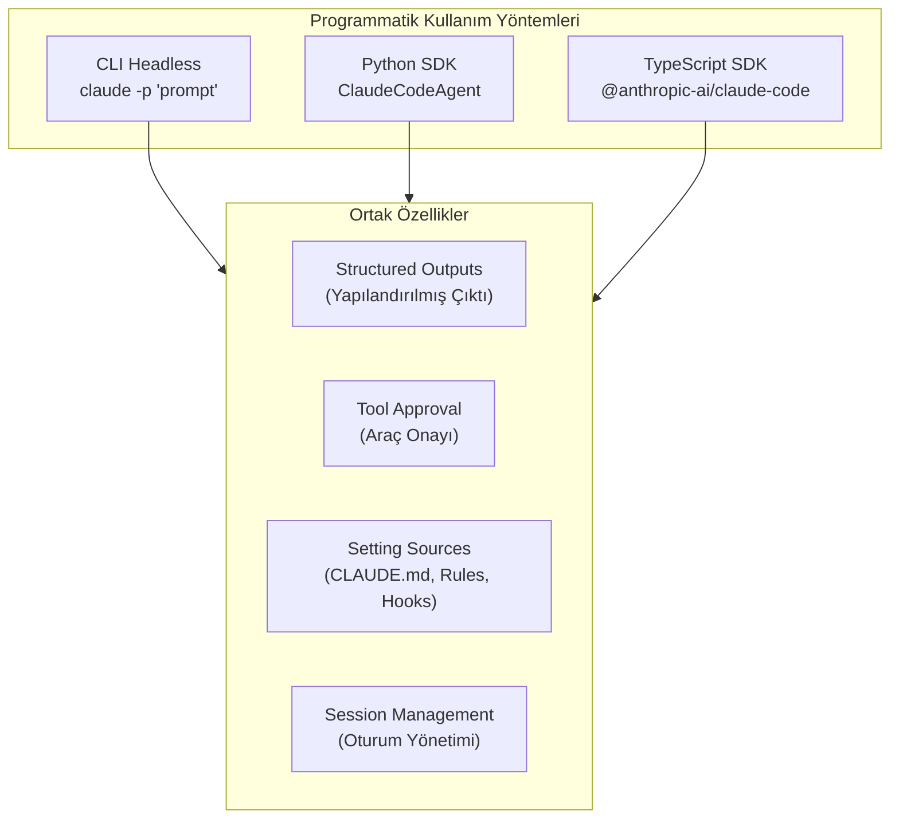
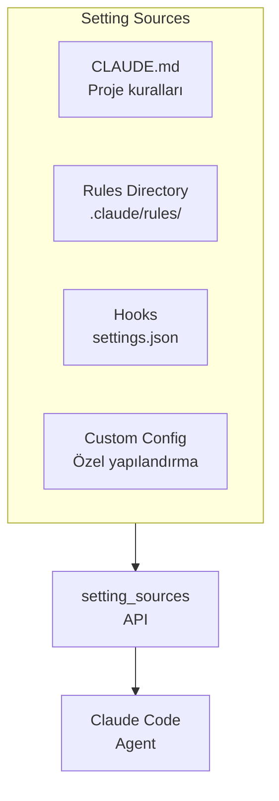
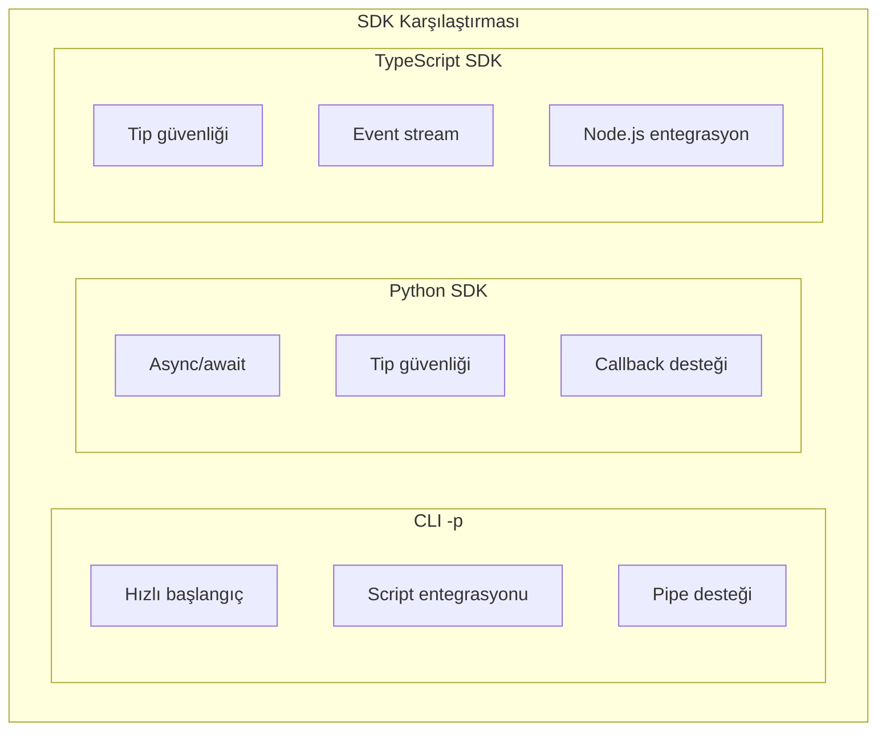

# Headless Mode ve SDK

Claude Code'u programmatik olarak çalıştırmanın üç ana yolu vardır: CLI'da `-p` flag (bayrak) ile headless mode (başsız mod), Python SDK ve TypeScript SDK. Bu bölümde her yöntemi, Agent SDK'nın `setting_sources` gibi ileri düzey özelliklerini, structured outputs (yapılandırılmış çıktılar) ve tool approval callbacks (araç onay geri çağrıları) konularını ele alıyoruz.

## Ön Koşullar

| Konu | Bölüm |
|------|-------|
| Claude Code temelleri | [Claude Code Nasıl Çalışır](../06-claude-code-tanitim/02-claude-code-nasil-calisir.md) |
| Araçlar | [Araçlara Genel Bakış](../08-araclar/01-araclara-genel-bakis.md) |
| Python veya TypeScript bilgisi | Harici kaynak |

---

## Genel Bakış



---

## 1. CLI Headless Mode

`-p` flag ile Claude Code'u non-interactive (etkileşimsiz) modda çalıştırabilirsiniz:

### Temel Kullanım

```bash
# Basit komut
claude -p "src/utils.ts dosyasındaki tüm fonksiyonları listele"

# Çıktı formatı belirleme
claude -p "Proje yapısını analiz et" --output-format json

# Stdin'den girdi
echo "Bu kodu incele" | claude -p -

# Maksimum tur sayısı
claude -p "Testleri düzelt" --max-turns 20

# Model seçimi
claude -p "Kodu optimize et" --model claude-sonnet-4-20250514
```

### Çıktı Formatları

| Format | Flag | Açıklama |
|--------|------|----------|
| Text | `--output-format text` | Düz metin (varsayılan) |
| JSON | `--output-format json` | Yapılandırılmış JSON |
| Stream JSON | `--output-format stream-json` | Satır satır JSON stream |

### JSON Çıktı Örneği

```bash
claude -p "src/ altındaki dosyaları say ve raporla" --output-format json
```

```json
{
  "result": "Rapor oluşturuldu",
  "cost": {
    "input_tokens": 12500,
    "output_tokens": 850,
    "total_usd": 0.042
  },
  "duration_ms": 15230,
  "turns": 3,
  "session_id": "sess_abc123"
}
```

### Pipe ve Zincirleme

```bash
# Pipe ile kullanım
cat error.log | claude -p "Bu hata logunu analiz et ve çözüm öner"

# Çıktıyı dosyaya kaydetme
claude -p "API dokümantasyonu oluştur" --output-format json > api-docs.json

# Zincirleme
claude -p "Lint hatalarını düzelt" && npm test && echo "Başarılı"
```

---

## 2. Python SDK

Python SDK, Claude Code'u Python uygulamalarınıza entegre etmenizi sağlar:

### Kurulum

```bash
pip install claude-code-sdk
```

### Temel Kullanım

```python
import asyncio
from claude_code_sdk import ClaudeCodeAgent, ClaudeAgentOptions

async def main():
    options = ClaudeAgentOptions(
        prompt="src/utils.ts dosyasını analiz et ve iyileştirme öner",
        working_directory="/path/to/project",
        max_turns=10,
    )
    
    agent = ClaudeCodeAgent(options)
    
    async for event in agent.run():
        if event.type == "text":
            print(event.content)
        elif event.type == "tool_use":
            print(f"Araç kullanıldı: {event.tool_name}")
        elif event.type == "result":
            print(f"Sonuç: {event.content}")
            print(f"Maliyet: ${event.cost.total_usd:.4f}")

asyncio.run(main())
```

### ClaudeAgentOptions Detaylı

```python
from claude_code_sdk import ClaudeAgentOptions

options = ClaudeAgentOptions(
    # Temel ayarlar
    prompt="Görev açıklaması",
    working_directory="/path/to/project",
    model="claude-sonnet-4-20250514",
    max_turns=20,
    
    # Çıktı ayarları
    output_format="json",
    
    # İzin ayarları
    permission_mode="auto",  # "auto", "manual", "deny"
    allowed_tools=["Read", "Edit", "Bash"],
    
    # Bağlam ayarları
    system_prompt="Sen bir kod inceleme uzmanısın.",
    context_files=["src/main.ts", "README.md"],
    
    # Performans ayarları
    timeout=300,  # saniye
)
```

### Structured Outputs (Yapılandırılmış Çıktılar)

```python
import asyncio
from claude_code_sdk import ClaudeCodeAgent, ClaudeAgentOptions

async def analyze_codebase():
    options = ClaudeAgentOptions(
        prompt="""
        Projeyi analiz et ve şu JSON formatında sonuç döndür:
        {
            "total_files": number,
            "languages": [{"name": string, "percentage": number}],
            "issues": [{"severity": "high"|"medium"|"low", "description": string, "file": string}],
            "score": number (1-10)
        }
        """,
        output_format="json",
        working_directory="/path/to/project",
    )
    
    agent = ClaudeCodeAgent(options)
    result = await agent.run_to_completion()
    
    # Yapılandırılmış sonuç
    analysis = result.parsed_json
    print(f"Toplam dosya: {analysis['total_files']}")
    print(f"Kalite skoru: {analysis['score']}/10")
    
    for issue in analysis['issues']:
        if issue['severity'] == 'high':
            print(f"⚠️ {issue['file']}: {issue['description']}")

asyncio.run(analyze_codebase())
```

### Tool Approval Callbacks (Araç Onay Geri Çağrıları)

Claude Code'un hangi araçları kullanabileceğini programmatik olarak kontrol edin:

```python
import asyncio
from claude_code_sdk import ClaudeCodeAgent, ClaudeAgentOptions, ToolApproval

async def custom_approval(tool_name: str, tool_input: dict) -> ToolApproval:
    """Her araç kullanımı öncesi çağrılır."""
    
    # Bash komutlarını filtrele
    if tool_name == "Bash":
        command = tool_input.get("command", "")
        dangerous = ["rm -rf", "drop table", "format", "mkfs"]
        
        if any(d in command.lower() for d in dangerous):
            return ToolApproval.DENY
        
        if "sudo" in command:
            return ToolApproval.ASK  # Manuel onay iste
    
    # Edit aracı sadece src/ altında izinli
    if tool_name == "Edit":
        file_path = tool_input.get("file_path", "")
        if not file_path.startswith("src/"):
            return ToolApproval.DENY
    
    return ToolApproval.ALLOW

async def main():
    options = ClaudeAgentOptions(
        prompt="Projeyi refactor et",
        working_directory="/path/to/project",
        tool_approval_callback=custom_approval,
    )
    
    agent = ClaudeCodeAgent(options)
    
    async for event in agent.run():
        if event.type == "tool_denied":
            print(f"❌ Araç engellendi: {event.tool_name}")
        elif event.type == "result":
            print(f"✅ Tamamlandı: {event.content}")

asyncio.run(main())
```

---

## 3. TypeScript SDK

TypeScript/JavaScript projelerinde Claude Code'u programmatik olarak kullanma:

### Kurulum

```bash
npm install @anthropic-ai/claude-code
```

### Temel Kullanım

```typescript
import { ClaudeCodeAgent, type ClaudeAgentOptions } from "@anthropic-ai/claude-code";

async function main() {
  const options: ClaudeAgentOptions = {
    prompt: "src/ altındaki tüm any tiplerini düzelt",
    workingDirectory: "/path/to/project",
    maxTurns: 15,
    outputFormat: "json",
  };

  const agent = new ClaudeCodeAgent(options);

  for await (const event of agent.run()) {
    switch (event.type) {
      case "text":
        console.log(event.content);
        break;
      case "tool_use":
        console.log(`Araç: ${event.toolName} → ${event.toolInput}`);
        break;
      case "result":
        console.log(`Sonuç: ${event.content}`);
        console.log(`Maliyet: $${event.cost.totalUsd.toFixed(4)}`);
        break;
    }
  }
}

main();
```

### Tool Approval (TypeScript)

```typescript
import { ClaudeCodeAgent, ToolApproval } from "@anthropic-ai/claude-code";

const agent = new ClaudeCodeAgent({
  prompt: "Testleri düzelt ve çalıştır",
  workingDirectory: "/path/to/project",
  toolApprovalCallback: async (toolName, toolInput) => {
    if (toolName === "Bash" && toolInput.command?.includes("npm publish")) {
      return ToolApproval.DENY;
    }
    return ToolApproval.ALLOW;
  },
});

for await (const event of agent.run()) {
  console.log(event);
}
```

---

## Agent SDK: setting_sources

Agent SDK, Claude Code'un `CLAUDE.md`, `rules/` ve `hooks` gibi yapılandırma kaynaklarını programmatik olarak yüklemenizi sağlar:



### Python'da setting_sources

```python
from claude_code_sdk import ClaudeCodeAgent, ClaudeAgentOptions, SettingSource

options = ClaudeAgentOptions(
    prompt="Projeyi analiz et",
    working_directory="/path/to/project",
    setting_sources=[
        # CLAUDE.md dosyasını yükle
        SettingSource.claude_md("/path/to/project/CLAUDE.md"),
        
        # Kurallar dizinini yükle
        SettingSource.rules_directory("/path/to/project/.claude/rules/"),
        
        # Hooks yapılandırmasını yükle
        SettingSource.hooks({
            "PostToolUse": [
                {
                    "matcher": "Edit",
                    "hooks": [
                        {
                            "type": "command",
                            "command": "npx prettier --write $CLAUDE_FILE_PATH"
                        }
                    ]
                }
            ]
        }),
        
        # Özel sistem prompt'u
        SettingSource.system_prompt(
            "Her zaman TypeScript strict mode kullan. "
            "Test coverage %80'in altına düşmemeli."
        ),
    ],
)
```

### TypeScript'te setting_sources

```typescript
import { ClaudeCodeAgent, SettingSource } from "@anthropic-ai/claude-code";

const agent = new ClaudeCodeAgent({
  prompt: "API endpoint'lerini güncelle",
  workingDirectory: "/path/to/project",
  settingSources: [
    SettingSource.claudeMd("/path/to/project/CLAUDE.md"),
    SettingSource.rulesDirectory("/path/to/project/.claude/rules/"),
    SettingSource.hooks({
      SessionStart: [
        {
          hooks: [
            {
              type: "command",
              command: "npm ci",
            },
          ],
        },
      ],
    }),
  ],
});
```

---

## Kullanım Senaryoları

### Senaryo 1: CI/CD Pipeline'da Programmatik Kullanım

```python
import asyncio
import sys
from claude_code_sdk import ClaudeCodeAgent, ClaudeAgentOptions

async def ci_code_review():
    """CI pipeline'da otomatik kod inceleme."""
    options = ClaudeAgentOptions(
        prompt="""
        PR'daki değişiklikleri incele:
        1. Güvenlik açıkları
        2. Performans sorunları
        3. Test yeterliliği
        
        JSON formatında sonuç döndür:
        {"pass": boolean, "issues": [...], "summary": string}
        """,
        output_format="json",
        working_directory=".",
        max_turns=10,
    )
    
    agent = ClaudeCodeAgent(options)
    result = await agent.run_to_completion()
    
    review = result.parsed_json
    if not review["pass"]:
        print("❌ Kod inceleme başarısız:")
        for issue in review["issues"]:
            print(f"  - {issue}")
        sys.exit(1)
    
    print("✅ Kod inceleme başarılı")
    print(review["summary"])

asyncio.run(ci_code_review())
```

### Senaryo 2: Batch İşleme

```python
import asyncio
from claude_code_sdk import ClaudeCodeAgent, ClaudeAgentOptions

async def batch_process(tasks: list[str]):
    """Birden fazla görevi paralel olarak çalıştır."""
    agents = []
    
    for task in tasks:
        options = ClaudeAgentOptions(
            prompt=task,
            working_directory="/path/to/project",
            max_turns=5,
        )
        agents.append(ClaudeCodeAgent(options).run_to_completion())
    
    results = await asyncio.gather(*agents, return_exceptions=True)
    
    for task, result in zip(tasks, results):
        if isinstance(result, Exception):
            print(f"❌ {task}: {result}")
        else:
            print(f"✅ {task}: Tamamlandı (${result.cost.total_usd:.4f})")

tasks = [
    "README.md'yi güncelle",
    "Kullanılmayan import'ları kaldır",
    "TypeScript hata düzeltmeleri yap",
]

asyncio.run(batch_process(tasks))
```

### Senaryo 3: Custom Agent Oluşturma

```typescript
import { ClaudeCodeAgent, SettingSource, ToolApproval } from "@anthropic-ai/claude-code";

class SecurityReviewAgent {
  private agent: ClaudeCodeAgent;

  constructor(projectPath: string) {
    this.agent = new ClaudeCodeAgent({
      prompt: `
        Perform a comprehensive security review:
        1. Check for OWASP Top 10 vulnerabilities
        2. Scan for hardcoded secrets
        3. Review authentication/authorization
        4. Check input validation
        5. Review error handling (no stack traces leaked)
      `,
      workingDirectory: projectPath,
      maxTurns: 20,
      outputFormat: "json",
      settingSources: [
        SettingSource.systemPrompt(
          "You are a security expert. Focus only on security issues. " +
          "Rate each finding as critical, high, medium, or low."
        ),
      ],
      toolApprovalCallback: async (toolName) => {
        // Sadece okuma araçlarına izin ver
        const readOnlyTools = ["Read", "Glob", "Grep", "Bash"];
        if (readOnlyTools.includes(toolName)) {
          return ToolApproval.ALLOW;
        }
        return ToolApproval.DENY;
      },
    });
  }

  async review() {
    const result = await this.agent.runToCompletion();
    return result.parsedJson;
  }
}

// Kullanım
const reviewer = new SecurityReviewAgent("/path/to/project");
const findings = await reviewer.review();
console.log(JSON.stringify(findings, null, 2));
```

---

## SDK Karşılaştırması



| Özellik | CLI `-p` | Python SDK | TypeScript SDK |
|---------|----------|------------|----------------|
| Kurulum kolaylığı | ⭐⭐⭐ | ⭐⭐ | ⭐⭐ |
| Tip güvenliği | ❌ | ✅ | ✅ |
| Async support | Sınırlı | ✅ | ✅ |
| Tool approval | ❌ | ✅ | ✅ |
| Structured output | ✅ | ✅ | ✅ |
| Setting sources | ❌ | ✅ | ✅ |
| Event streaming | Sınırlı | ✅ | ✅ |
| CI/CD uyumu | ⭐⭐⭐ | ⭐⭐ | ⭐⭐ |

---

## Sorun Giderme

| Sorun | Çözüm |
|-------|-------|
| SDK import hatası | `pip install claude-code-sdk` / `npm install @anthropic-ai/claude-code` |
| API key bulunamıyor | `ANTHROPIC_API_KEY` ortam değişkenini ayarlayın |
| Timeout hatası | `timeout` veya `max_turns` değerini artırın |
| Tool approval çağrılmıyor | `tool_approval_callback` parametresini kontrol edin |
| JSON parse hatası | `output_format="json"` ayarlandığından emin olun |

---

## Özet

| Kavram | Açıklama |
|--------|----------|
| **CLI `-p`** | Headless modda tek satırla çalıştırma |
| **Python SDK** | `ClaudeCodeAgent` ile Python entegrasyonu |
| **TypeScript SDK** | Node.js projelerinde programmatik kullanım |
| **Structured Outputs** | JSON formatında yapılandırılmış sonuçlar |
| **Tool Approval** | Araç kullanımını programmatik onaylama/engelleme |
| **Setting Sources** | CLAUDE.md, rules, hooks yapılandırmalarını yükleme |

---

## Sonraki Adım

Yaygın CI/CD otomasyon senaryoları için hazır tarifler ve yapılandırmaları inceleyelim:

→ [Otomasyon Tarifleri](./05-otomasyon-tarifleri.md)
