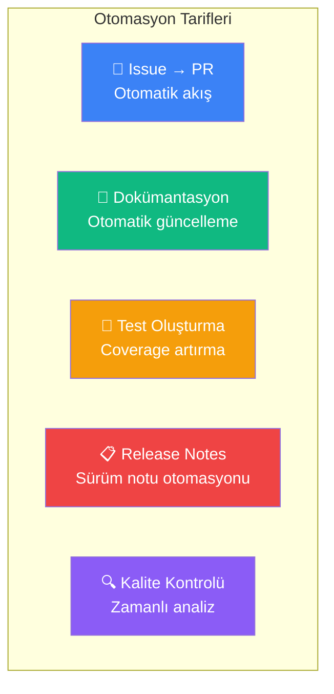
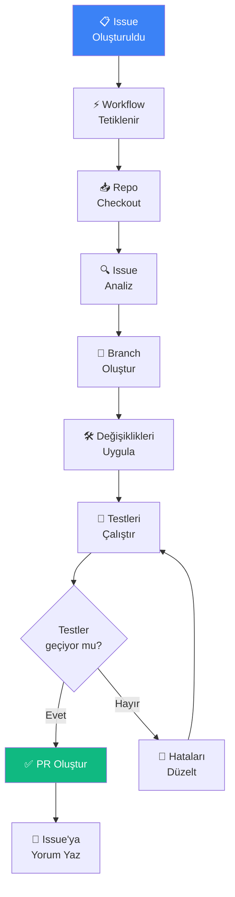
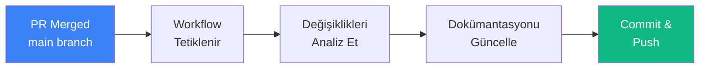
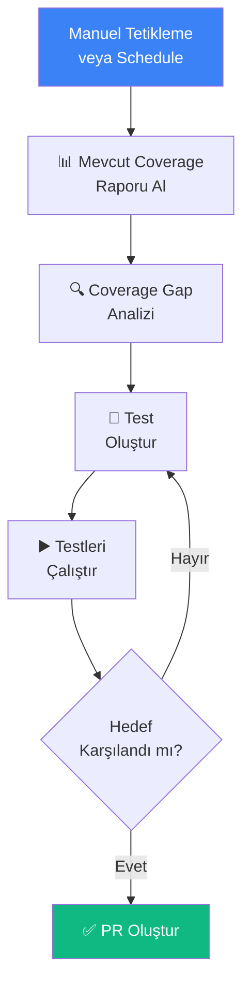
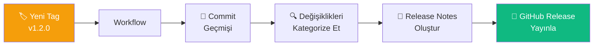
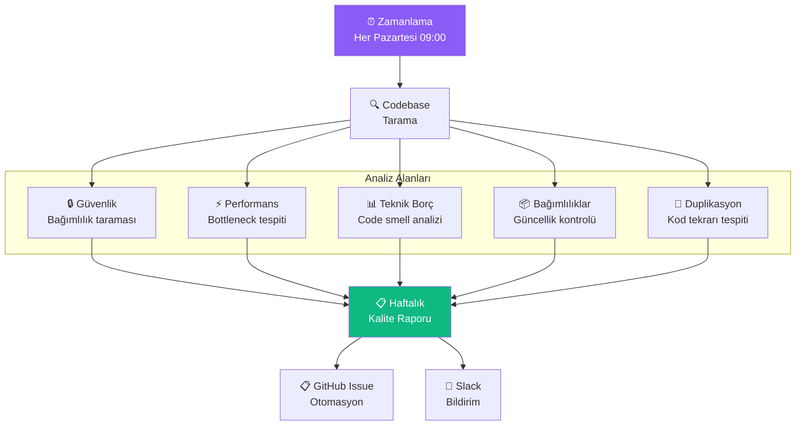
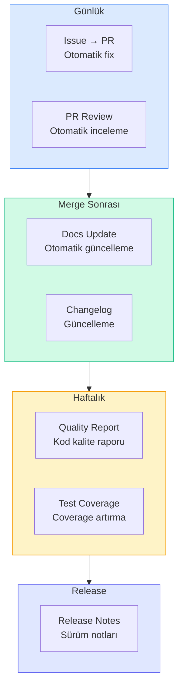

# Otomasyon Tarifleri

Bu bölümde, Claude Code ile CI/CD pipeline'larında kullanılabilecek hazır otomasyon tariflerini (automation recipes) sunuyoruz. Issue'dan PR'a tam akış, otomatik dokümantasyon güncelleme, test oluşturma, release notes (sürüm notları) otomasyonu ve zamanlı kod kalite kontrolleri gibi yaygın senaryolar için adım adım rehberler ve yapılandırma örnekleri bulacaksınız.

## Ön Koşullar

| Konu | Bölüm |
|------|-------|
| GitHub Actions | [GitHub Actions](./01-github-actions.md) |
| GitLab CI/CD | [GitLab CI/CD](./02-gitlab-cicd.md) |
| Headless Mode | [Headless Mode ve SDK](./04-headless-mod-ve-sdk.md) |
| Hooks | [Hooks Nedir](../14-hooks-ve-otomasyon/01-hooks-nedir.md) |

---

## Tarif Kataloğu



---

## Tarif 1: Issue'dan PR'a Otomatik Akış

### Amaç

GitHub/GitLab issue oluşturulduğunda veya `@claude` ile etiketlendiğinde, Claude Code otomatik olarak kodu analiz eder, düzeltmeyi uygular, test yazar ve PR/MR oluşturur.

### İş Akışı



### GitHub Actions Yapılandırması

```yaml
name: Issue to PR

on:
  issues:
    types: [opened, labeled]
  issue_comment:
    types: [created]

jobs:
  issue-to-pr:
    if: |
      (github.event_name == 'issues' && contains(github.event.issue.labels.*.name, 'claude-fix')) ||
      (github.event_name == 'issue_comment' && contains(github.event.comment.body, '@claude'))
    runs-on: ubuntu-latest
    permissions:
      contents: write
      issues: write
      pull-requests: write
    steps:
      - uses: actions/checkout@v4
        with:
          fetch-depth: 0

      - uses: actions/setup-node@v4
        with:
          node-version: '20'

      - name: Install dependencies
        run: |
          npm install -g @anthropic-ai/claude-code
          npm ci

      - name: Create fix branch
        run: |
          BRANCH="claude/fix-issue-${{ github.event.issue.number }}"
          git checkout -b $BRANCH

      - name: Run Claude Code
        env:
          ANTHROPIC_API_KEY: ${{ secrets.ANTHROPIC_API_KEY }}
          GITHUB_TOKEN: ${{ secrets.GITHUB_TOKEN }}
        run: |
          claude -p "$(cat <<'EOF'
          Fix the following GitHub issue:
          
          Issue #${{ github.event.issue.number }}
          Title: ${{ github.event.issue.title }}
          Body: ${{ github.event.issue.body }}
          
          Steps:
          1. Read and understand the issue
          2. Analyze the relevant code
          3. Implement the fix
          4. Write or update tests
          5. Run tests to verify: npm test
          6. Commit changes with a descriptive message
          EOF
          )"

      - name: Push and create PR
        env:
          GITHUB_TOKEN: ${{ secrets.GITHUB_TOKEN }}
        run: |
          BRANCH="claude/fix-issue-${{ github.event.issue.number }}"
          git push -u origin $BRANCH
          
          gh pr create \
            --title "Fix: #${{ github.event.issue.number }} - ${{ github.event.issue.title }}" \
            --body "$(cat <<'EOF'
          ## Automated Fix
          
          This PR was automatically generated by Claude Code to fix #${{ github.event.issue.number }}.
          
          ### Changes
          See commit messages for details.
          
          ### Testing
          - [ ] Automated tests pass
          - [ ] Manual verification needed
          
          Closes #${{ github.event.issue.number }}
          EOF
          )" \
            --base main \
            --head $BRANCH

      - name: Comment on issue
        env:
          GITHUB_TOKEN: ${{ secrets.GITHUB_TOKEN }}
        run: |
          gh issue comment ${{ github.event.issue.number }} \
            --body "🤖 Claude Code has created a fix for this issue. Please review the PR."
```

---

## Tarif 2: Otomatik Dokümantasyon Güncelleme

### Amaç

Kod değişiklikleri yapıldığında ilgili dokümantasyonu (README, API docs, JSDoc/TSDoc) otomatik olarak güncellemek.

### İş Akışı



### GitHub Actions Yapılandırması

```yaml
name: Auto-update Documentation

on:
  push:
    branches: [main]
    paths:
      - 'src/**'
      - 'lib/**'

jobs:
  update-docs:
    runs-on: ubuntu-latest
    permissions:
      contents: write
    steps:
      - uses: actions/checkout@v4
        with:
          fetch-depth: 2

      - uses: actions/setup-node@v4
        with:
          node-version: '20'

      - name: Install Claude Code
        run: npm install -g @anthropic-ai/claude-code

      - name: Get changed files
        id: changes
        run: |
          echo "files=$(git diff --name-only HEAD~1 HEAD -- 'src/**' 'lib/**' | tr '\n' ',')" >> $GITHUB_OUTPUT

      - name: Update documentation
        env:
          ANTHROPIC_API_KEY: ${{ secrets.ANTHROPIC_API_KEY }}
        run: |
          claude -p "$(cat <<'EOF'
          The following source files were changed: ${{ steps.changes.outputs.files }}
          
          Update the documentation accordingly:
          1. Update README.md if public API changed
          2. Update API docs in docs/ if endpoints changed
          3. Add/update JSDoc comments for changed functions
          4. Update CHANGELOG.md with a summary of changes
          
          Only update docs that are actually affected by the changes.
          Do NOT create new documentation files unless absolutely necessary.
          EOF
          )"

      - name: Commit documentation updates
        run: |
          git config user.name "Claude Code Bot"
          git config user.email "claude@bot.dev"
          git add -A
          if git diff --staged --quiet; then
            echo "No documentation changes needed"
          else
            git commit -m "docs: auto-update documentation for recent changes"
            git push
          fi
```

---

## Tarif 3: Test Oluşturma ve Coverage Artırma

### Amaç

Mevcut code coverage'ı analiz edip, eksik testleri otomatik olarak oluşturarak belirli bir coverage hedefine ulaşmak.

### İş Akışı



### GitHub Actions Yapılandırması

```yaml
name: Test Coverage Improvement

on:
  workflow_dispatch:
    inputs:
      target_coverage:
        description: 'Target coverage percentage'
        required: true
        default: '80'
  schedule:
    - cron: '0 6 * * 1'  # Her Pazartesi 06:00 UTC

jobs:
  improve-coverage:
    runs-on: ubuntu-latest
    permissions:
      contents: write
      pull-requests: write
    steps:
      - uses: actions/checkout@v4

      - uses: actions/setup-node@v4
        with:
          node-version: '20'

      - name: Install dependencies
        run: |
          npm install -g @anthropic-ai/claude-code
          npm ci

      - name: Get current coverage
        run: |
          npx jest --coverage --coverageReporters=json-summary || true
          cat coverage/coverage-summary.json || echo '{"total":{"lines":{"pct":0}}}'

      - name: Generate tests
        env:
          ANTHROPIC_API_KEY: ${{ secrets.ANTHROPIC_API_KEY }}
        run: |
          TARGET=${{ github.event.inputs.target_coverage || '80' }}
          
          claude -p "$(cat <<EOF
          Current test coverage report is in coverage/coverage-summary.json.
          Target coverage: ${TARGET}%
          
          Steps:
          1. Analyze coverage gaps (files with low coverage)
          2. Prioritize: business-critical code first
          3. Generate tests for uncovered functions
          4. Focus on edge cases and error paths
          5. Run tests after each file: npx jest
          6. Continue until target is reached or all gaps addressed
          
          Test file conventions:
          - Test files: __tests__/[filename].test.ts
          - Use Jest and @testing-library if React
          - Mock external dependencies
          - Include both happy path and error cases
          EOF
          )"

      - name: Create PR
        env:
          GITHUB_TOKEN: ${{ secrets.GITHUB_TOKEN }}
        run: |
          BRANCH="claude/improve-coverage-$(date +%Y%m%d)"
          git checkout -b $BRANCH
          git add -A
          git commit -m "test: improve test coverage to ${{ github.event.inputs.target_coverage || '80' }}%"
          git push -u origin $BRANCH
          
          gh pr create \
            --title "Test: Improve coverage to ${{ github.event.inputs.target_coverage || '80' }}%" \
            --body "Automated test generation by Claude Code to improve code coverage."
```

---

## Tarif 4: Release Notes Otomasyonu

### Amaç

Yeni bir release tag'i oluşturulduğunda, commit geçmişini analiz ederek yapılandırılmış release notes (sürüm notları) otomatik oluşturmak.

### İş Akışı



### GitHub Actions Yapılandırması

```yaml
name: Auto Release Notes

on:
  push:
    tags:
      - 'v*'

jobs:
  release-notes:
    runs-on: ubuntu-latest
    permissions:
      contents: write
    steps:
      - uses: actions/checkout@v4
        with:
          fetch-depth: 0

      - uses: actions/setup-node@v4
        with:
          node-version: '20'

      - name: Install Claude Code
        run: npm install -g @anthropic-ai/claude-code

      - name: Get previous tag
        id: prev_tag
        run: |
          PREV=$(git describe --tags --abbrev=0 HEAD~1 2>/dev/null || echo "")
          echo "tag=$PREV" >> $GITHUB_OUTPUT

      - name: Generate release notes
        env:
          ANTHROPIC_API_KEY: ${{ secrets.ANTHROPIC_API_KEY }}
        run: |
          CURRENT_TAG=${GITHUB_REF_NAME}
          PREV_TAG=${{ steps.prev_tag.outputs.tag }}
          
          if [ -n "$PREV_TAG" ]; then
            COMMIT_LOG=$(git log ${PREV_TAG}..${CURRENT_TAG} --pretty=format:"%h %s" --no-merges)
          else
            COMMIT_LOG=$(git log --pretty=format:"%h %s" --no-merges -50)
          fi
          
          claude -p "$(cat <<EOF
          Generate release notes for version ${CURRENT_TAG}.
          Previous version: ${PREV_TAG:-"initial release"}
          
          Commits:
          ${COMMIT_LOG}
          
          Format the release notes as:
          
          ## What's New
          ### Features
          - List new features
          
          ### Improvements
          - List improvements
          
          ### Bug Fixes
          - List bug fixes
          
          ### Breaking Changes
          - List any breaking changes (if none, omit this section)
          
          ### Dependencies
          - List dependency updates (if any)
          
          Keep it concise and user-focused. 
          Group related changes together.
          Use conventional commit types to categorize.
          EOF
          )" > release_notes.md

      - name: Create GitHub Release
        env:
          GITHUB_TOKEN: ${{ secrets.GITHUB_TOKEN }}
        run: |
          gh release create ${GITHUB_REF_NAME} \
            --title "Release ${GITHUB_REF_NAME}" \
            --notes-file release_notes.md
```

---

## Tarif 5: Zamanlı Kod Kalite Kontrolleri

### Amaç

Haftalık/aylık olarak kod tabanını analiz ederek kalite raporları oluşturmak, teknik borcu izlemek ve iyileştirme önerileri sunmak.

### İş Akışı



### GitHub Actions Yapılandırması

```yaml
name: Weekly Code Quality Report

on:
  schedule:
    - cron: '0 9 * * 1'  # Her Pazartesi 09:00 UTC
  workflow_dispatch:

jobs:
  quality-report:
    runs-on: ubuntu-latest
    permissions:
      contents: read
      issues: write
    steps:
      - uses: actions/checkout@v4

      - uses: actions/setup-node@v4
        with:
          node-version: '20'

      - name: Install dependencies
        run: |
          npm install -g @anthropic-ai/claude-code
          npm ci

      - name: Generate quality report
        env:
          ANTHROPIC_API_KEY: ${{ secrets.ANTHROPIC_API_KEY }}
        run: |
          claude -p "$(cat <<'EOF'
          Perform a comprehensive code quality analysis:
          
          1. SECURITY SCAN
             - Check for known vulnerabilities in dependencies (npm audit)
             - Scan for hardcoded secrets or API keys
             - Review authentication/authorization patterns
          
          2. CODE QUALITY
             - Identify code duplication (DRY violations)
             - Find dead code and unused exports
             - Check for overly complex functions (cyclomatic complexity)
             - Review error handling patterns
          
          3. DEPENDENCY HEALTH
             - List outdated dependencies
             - Identify deprecated packages
             - Check for license compliance
          
          4. PERFORMANCE
             - Identify potential N+1 queries
             - Find memory leak patterns
             - Check for unnecessary re-renders (React)
          
          5. RECOMMENDATIONS
             - Prioritized list of improvements
             - Estimated effort for each
             - Impact assessment
          
          Output as structured markdown report.
          EOF
          )" > quality_report.md

      - name: Create issue with report
        env:
          GITHUB_TOKEN: ${{ secrets.GITHUB_TOKEN }}
        run: |
          WEEK=$(date +%Y-W%V)
          gh issue create \
            --title "📊 Weekly Code Quality Report - ${WEEK}" \
            --body-file quality_report.md \
            --label "code-quality,automated"

      - name: Notify Slack (optional)
        if: env.SLACK_WEBHOOK_URL != ''
        env:
          SLACK_WEBHOOK_URL: ${{ secrets.SLACK_WEBHOOK_URL }}
        run: |
          curl -X POST $SLACK_WEBHOOK_URL \
            -H 'Content-type: application/json' \
            -d "{\"text\": \"📊 Weekly code quality report is ready. Check the latest issue in the repository.\"}"
```

---

## Tarifleri Birleştirme

Birden fazla tarifi bir arada kullanarak kapsamlı bir otomasyon sistemi oluşturabilirsiniz:



---

## En İyi Uygulamalar

| Uygulama | Açıklama |
|----------|----------|
| Küçük başlayın | Tek bir tarif ile başlayıp zamanla genişletin |
| Timeout ayarlayın | `timeout-minutes` ile uzun çalışan görevleri sınırlayın |
| Maliyet izleyin | Token kullanımını ve maliyeti düzenli takip edin |
| Sonuçları doğrulayın | Otomatik oluşturulan PR'ları mutlaka insan gözüyle inceleyin |
| Bildirimleri yapılandırın | Slack/email ile önemli olayları bildirin |
| Secret'ları koruyun | API key'leri her zaman repository secret olarak saklayın |
| Branch koruma | `main` branch'e doğrudan push'u engelleyin |
| Rollback planı | Otomatik değişiklikleri geri alabilecek süreç oluşturun |

---

## Sorun Giderme

| Sorun | Çözüm |
|-------|-------|
| Workflow tetiklenmiyor | Event türünü ve `if` koşullarını kontrol edin |
| Claude Code timeout | `timeout-minutes` artırın, `max-turns` sınırlayın |
| Yanlış dosyalar değişiyor | Prompt'ta scope'u netleştirin, path kısıtlaması ekleyin |
| Test hataları | Mevcut testleri çalıştırarak başarılı olduklarından emin olun |
| PR çakışmaları | Base branch'i güncel tutun, rebase stratejisi kullanın |
| Maliyet aşımı | Daha küçük scope tanımlayın, model seçimini optimize edin |

---

## Özet

| Tarif | Tetikleyici | Çıktı |
|-------|-------------|-------|
| **Issue → PR** | Issue oluşturma / @claude | Otomatik PR |
| **Dokümantasyon** | Push to main | Güncellenmiş docs |
| **Test Oluşturma** | Schedule / Manuel | Test dosyaları + PR |
| **Release Notes** | Tag push | GitHub Release |
| **Kalite Kontrolü** | Schedule (haftalık) | Kalite raporu issue |

---

## Sonraki Adım

Bu bölümü tamamladınız! Claude Code'un konfigürasyon ve ayarlarını detaylı inceleyelim:

→ [Konfigürasyon ve Ayarlar](../17-konfigurasyon/README.md)
