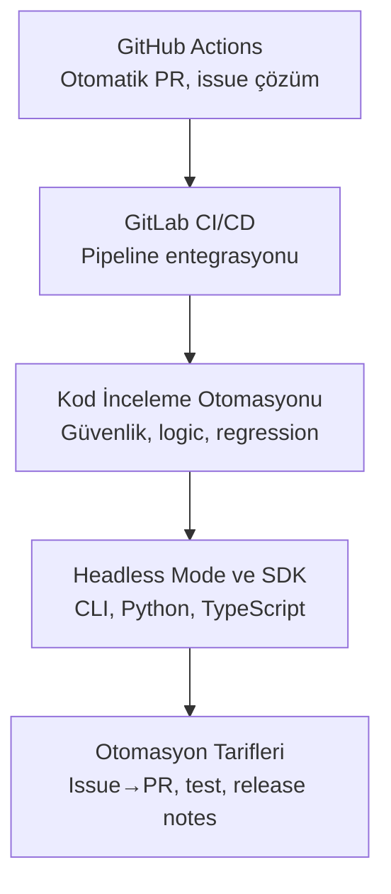
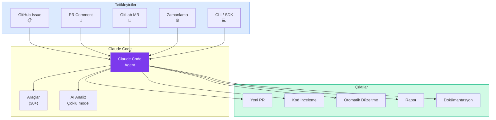

# Bölüm 16: CI/CD ve DevOps

Claude Code, geliştirme iş akışlarının ötesinde CI/CD pipeline'larına (sürekli entegrasyon/sürekli dağıtım hatları) ve DevOps süreçlerine entegre olarak yazılım teslimatını otomatikleştirir. GitHub Actions ile otomatik PR oluşturma, GitLab CI/CD pipeline entegrasyonu, kod inceleme otomasyonu, Headless Mode ile programmatik kullanım ve otomasyon tariflerini bu bölümde kapsamlı olarak ele alıyoruz.

## Bu Bölümde Neler Öğreneceksiniz?

## İçerik

| # | Dosya | Konu | Süre |
|---|-------|------|------|
| 01 | [GitHub Actions](./01-github-actions.md) | GitHub Actions entegrasyonu, @claude mention, workflow YAML | ~20 dk |
| 02 | [GitLab CI/CD](./02-gitlab-cicd.md) | GitLab pipeline entegrasyonu, .gitlab-ci.yml yapılandırması | ~15 dk |
| 03 | [Kod İnceleme Otomasyonu](./03-kod-inceleme-otomasyonu.md) | Otomatik PR review, güvenlik analizi, multi-agent | ~15 dk |
| 04 | [Headless Mode ve SDK](./04-headless-mod-ve-sdk.md) | CLI -p flag, Python SDK, TypeScript SDK, Agent SDK | ~20 dk |
| 05 | [Otomasyon Tarifleri](./05-otomasyon-tarifleri.md) | Issue→PR, dokümantasyon, test, release notes, kalite kontrol | ~18 dk |

## CI/CD Entegrasyon Haritası

## Ön Koşullar

Bu bölümü okumadan önce aşağıdaki konulara aşina olmanız önerilir:

| Konu | Bölüm |
|------|-------|
| Claude Code nasıl çalışır | [Bölüm 06](../06-claude-code-tanitim/README.md) |
| Araçlar ve izin sistemi | [Bölüm 08](../08-araclar/README.md) |
| CLAUDE.md ve bellek | [Bölüm 09](../09-bellek-ve-baglam/README.md) |
| Hooks | [Bölüm 14](../14-hooks-ve-otomasyon/README.md) |
| GitHub/GitLab temel bilgisi | Harici kaynak |

## Önceki Bölüm

← [15 - IDE ve Platform Entegrasyonları](../15-entegrasyonlar/README.md)

## Sonraki Adım

Bu bölümü tamamladıktan sonra → [17 - Konfigürasyon ve Ayarlar](../17-konfigurasyon/README.md)
