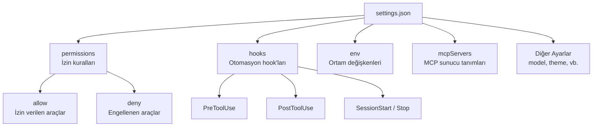
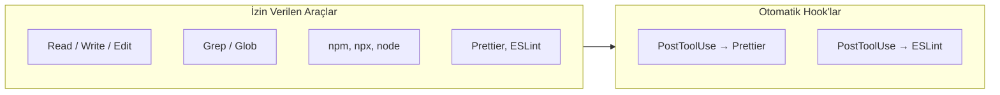
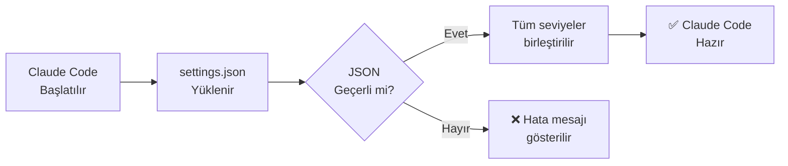

# Settings.json Referansı

`settings.json`, Claude Code'un tüm davranışlarını kontrol eden merkezi konfigürasyon dosyasıdır. Bu rehber, mevcut tüm ayar anahtarlarını, varsayılan değerlerini ve kullanım senaryolarını kapsamlı şekilde belgelemektedir.

## Ön Koşullar

| Konu | Bölüm |
|------|-------|
| Ayar dosyaları hiyerarşisi | [Ayar Dosyaları Hiyerarşisi](./01-ayar-dosyalari-hiyerarsisi.md) |
| İzin sistemi | [İzin Sistemi](../10-izinler-ve-guvenlik/01-izin-sistemi.md) |
| Hook kavramı | [Hooks Nedir?](../14-hooks-ve-otomasyon/01-hooks-nedir.md) |

---

## Genel Yapı



---

## Tüm Ayar Anahtarları Referans Tablosu

### permissions (İzin Ayarları)

İzin kuralları, Claude Code'un hangi araçları kullanıp kullanamayacağını belirler.

| Anahtar | Tip | Varsayılan | Açıklama |
|---------|-----|------------|----------|
| `permissions.allow` | `string[]` | `[]` | İzin verilen araç pattern'ları |
| `permissions.deny` | `string[]` | `[]` | Engellenen araç pattern'ları |

```json
{
  "permissions": {
    "allow": [
      "Read",
      "Write",
      "Edit",
      "Grep",
      "Glob",
      "Bash(git:*)",
      "Bash(npm run:*)",
      "Bash(npx prettier:*)",
      "mcp__github__*"
    ],
    "deny": [
      "Bash(rm -rf:*)",
      "Bash(sudo:*)",
      "Bash(curl|*)",
      "WebFetch"
    ]
  }
}
```

#### İzin Pattern Söz Dizimi

| Pattern | Açıklama | Örnek |
|---------|----------|-------|
| `ToolName` | Aracın tamamına izin/engel | `"Read"` |
| `ToolName(prefix:*)` | Belirli prefix ile başlayan komutlar | `"Bash(git:*)"` |
| `ToolName(exact)` | Tam eşleşme | `"Bash(npm test)"` |
| `mcp__server__tool` | MCP araç erişimi | `"mcp__github__create_issue"` |
| `mcp__server__*` | MCP sunucusundaki tüm araçlar | `"mcp__github__*"` |

---

### hooks (Hook Ayarları)

Yaşam döngüsü olaylarına bağlı otomasyon kurallarını tanımlar.

| Anahtar | Tip | Açıklama |
|---------|-----|----------|
| `hooks.PreToolUse` | `HookRule[]` | Araç kullanılmadan önce |
| `hooks.PostToolUse` | `HookRule[]` | Araç kullanıldıktan sonra |
| `hooks.SessionStart` | `HookRule[]` | Oturum başlangıcında |
| `hooks.SessionStop` | `HookRule[]` | Oturum sonunda |
| `hooks.Notification` | `HookRule[]` | Bildirim gönderildiğinde |
| `hooks.PreCompact` | `HookRule[]` | Compact işleminden önce |
| `hooks.PostCompact` | `HookRule[]` | Compact işleminden sonra |
| `hooks.SubagentTurnStart` | `HookRule[]` | Subagent turn başlangıcında |
| `hooks.SubagentTurnEnd` | `HookRule[]` | Subagent turn sonunda |

```json
{
  "hooks": {
    "PostToolUse": [
      {
        "matcher": "Edit",
        "hooks": [
          {
            "type": "command",
            "command": "npx prettier --write \"$CLAUDE_FILE_PATH\"",
            "timeout": 10000
          }
        ]
      },
      {
        "matcher": "Write",
        "hooks": [
          {
            "type": "command",
            "command": "npx eslint --fix \"$CLAUDE_FILE_PATH\""
          }
        ]
      }
    ],
    "SessionStart": [
      {
        "hooks": [
          {
            "type": "command",
            "command": "echo 'Claude Code oturumu başladı' >> ~/.claude/sessions.log"
          }
        ]
      }
    ]
  }
}
```

#### HookRule Yapısı

| Alan | Tip | Zorunlu | Açıklama |
|------|-----|---------|----------|
| `matcher` | `string` | Hayır | Araç adı filtresi |
| `hooks` | `HookAction[]` | Evet | Çalıştırılacak eylemler |

#### HookAction Yapısı

| Alan | Tip | Zorunlu | Açıklama |
|------|-----|---------|----------|
| `type` | `"command" \| "http"` | Evet | Hook tipi |
| `command` | `string` | Evet (command) | Çalıştırılacak shell komutu |
| `url` | `string` | Evet (http) | HTTP endpoint URL'i |
| `timeout` | `number` | Hayır | Timeout (ms), varsayılan: 60000 |

---

### env (Ortam Değişkenleri)

Claude Code oturumunda kullanılacak ortam değişkenlerini tanımlar.

```json
{
  "env": {
    "NODE_ENV": "development",
    "DATABASE_URL": "postgresql://localhost:5432/mydb",
    "CUSTOM_LINT_RULES": "/path/to/rules"
  }
}
```

---

### mcpServers (MCP Sunucu Tanımları)

Model Context Protocol (MCP) sunucu konfigürasyonlarını tanımlar.

| Anahtar | Tip | Açıklama |
|---------|-----|----------|
| `mcpServers.<name>.command` | `string` | Sunucu çalıştırma komutu |
| `mcpServers.<name>.args` | `string[]` | Komut argümanları |
| `mcpServers.<name>.env` | `object` | Sunucuya özel ortam değişkenleri |
| `mcpServers.<name>.url` | `string` | Uzak sunucu URL'i (SSE/Streamable HTTP) |

```json
{
  "mcpServers": {
    "github": {
      "command": "npx",
      "args": ["-y", "@modelcontextprotocol/server-github"],
      "env": {
        "GITHUB_PERSONAL_ACCESS_TOKEN": "ghp_..."
      }
    },
    "postgres": {
      "command": "npx",
      "args": ["-y", "@modelcontextprotocol/server-postgres"],
      "env": {
        "DATABASE_URL": "postgresql://localhost:5432/mydb"
      }
    },
    "remote-server": {
      "url": "https://mcp.example.com/sse"
    }
  }
}
```

---

### Diğer Ayarlar

| Anahtar | Tip | Varsayılan | Açıklama |
|---------|-----|------------|----------|
| `defaultMode` | `"agent" \| "plan" \| "ask"` | `"agent"` | Varsayılan çalışma modu |
| `allowedTools` | `string[]` | — | İzin verilen araçlar (eski format, `permissions.allow` tercih edilir) |

---

## Senaryo Bazlı Konfigürasyonlar

### Senaryo 1: Frontend Projesi



```json
{
  "permissions": {
    "allow": [
      "Read", "Write", "Edit", "Grep", "Glob",
      "Bash(npm:*)",
      "Bash(npx:*)",
      "Bash(node:*)",
      "Bash(git:*)"
    ],
    "deny": [
      "Bash(rm -rf:*)",
      "Bash(sudo:*)"
    ]
  },
  "hooks": {
    "PostToolUse": [
      {
        "matcher": "Edit",
        "hooks": [
          {
            "type": "command",
            "command": "npx prettier --write \"$CLAUDE_FILE_PATH\""
          }
        ]
      }
    ]
  },
  "env": {
    "NODE_ENV": "development"
  }
}
```

### Senaryo 2: Python / Data Science Projesi

```json
{
  "permissions": {
    "allow": [
      "Read", "Write", "Edit", "Grep", "Glob",
      "Bash(python:*)",
      "Bash(pip:*)",
      "Bash(pytest:*)",
      "Bash(jupyter:*)",
      "Bash(git:*)"
    ],
    "deny": [
      "Bash(rm -rf:*)",
      "Bash(pip install --user:*)"
    ]
  },
  "hooks": {
    "PostToolUse": [
      {
        "matcher": "Edit",
        "hooks": [
          {
            "type": "command",
            "command": "black \"$CLAUDE_FILE_PATH\" && isort \"$CLAUDE_FILE_PATH\""
          }
        ]
      }
    ]
  },
  "env": {
    "PYTHONPATH": "./src",
    "VIRTUAL_ENV": "./.venv"
  }
}
```

### Senaryo 3: DevOps / Infrastructure Projesi

```json
{
  "permissions": {
    "allow": [
      "Read", "Write", "Edit", "Grep", "Glob",
      "Bash(terraform:*)",
      "Bash(kubectl:*)",
      "Bash(docker:*)",
      "Bash(helm:*)",
      "Bash(git:*)"
    ],
    "deny": [
      "Bash(terraform destroy:*)",
      "Bash(kubectl delete namespace:*)",
      "Bash(rm -rf:*)"
    ]
  },
  "hooks": {
    "PreToolUse": [
      {
        "matcher": "Bash",
        "hooks": [
          {
            "type": "command",
            "command": "echo \"$CLAUDE_TOOL_INPUT\" | python3 -c \"import sys,json; cmd=json.load(sys.stdin).get('command',''); sys.exit(1 if 'prod' in cmd and 'destroy' in cmd else 0)\""
          }
        ]
      }
    ]
  },
  "env": {
    "KUBECONFIG": "~/.kube/config",
    "TF_WORKSPACE": "development"
  }
}
```

### Senaryo 4: Minimal Güvenlik Odaklı

```json
{
  "permissions": {
    "allow": [
      "Read",
      "Grep",
      "Glob"
    ],
    "deny": [
      "Bash(*)",
      "Write",
      "Edit",
      "WebFetch"
    ]
  }
}
```

---

## Ayarları Yönetme

### CLI ile Ayar Okuma/Yazma

```bash
# Tüm ayarları listele
claude config list

# Belirli bir ayarı oku
claude config get permissions

# Ayar ekle
claude config set permissions.allow '["Read", "Write"]'
```

### Doğrulama (Validation)

Claude Code başlatıldığında `settings.json` otomatik olarak doğrulanır. Geçersiz JSON veya tanınmayan anahtarlar hata mesajıyla bildirilir.



---

## Sık Yapılan Hatalar

| Hata | Çözüm |
|------|-------|
| JSON söz dizimi hatası (trailing comma vb.) | JSON validator ile kontrol edin |
| `allowedTools` ve `permissions.allow` karıştırmak | `permissions.allow` tercih edin (yeni format) |
| Hook timeout'u çok düşük ayarlamak | Ağır işlemler için timeout değerini artırın |
| MCP sunucu env değişkenlerini açık yazmak | `.claude/settings.local.json` kullanın |

---

## Özet

| Bölüm | Anahtar Ayarlar |
|-------|-----------------|
| İzinler | `permissions.allow`, `permissions.deny` |
| Hook'lar | `hooks.PreToolUse`, `hooks.PostToolUse` + 7 olay daha |
| Ortam | `env.*` |
| MCP | `mcpServers.<name>.command/args/env/url` |
| Genel | `defaultMode`, `allowedTools` |

---

## Sonraki Adım

`settings.json` dışında ortam değişkenleri aracılığıyla da Claude Code'u yapılandırabilirsiniz:

→ [Ortam Değişkenleri](./03-ortam-degiskenleri.md)
