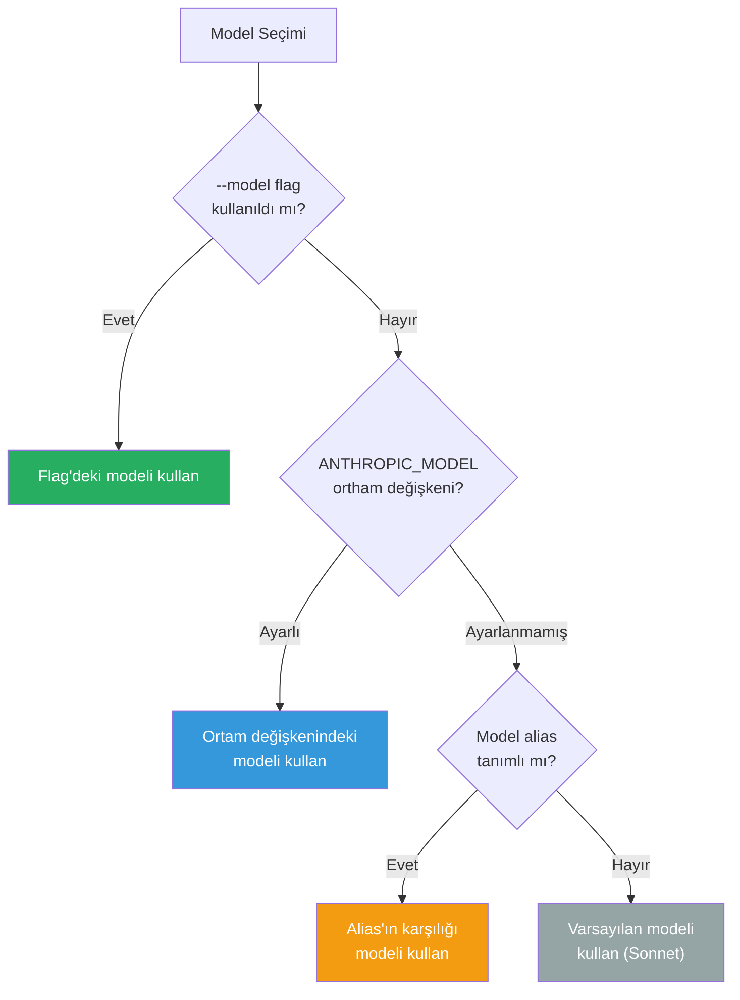
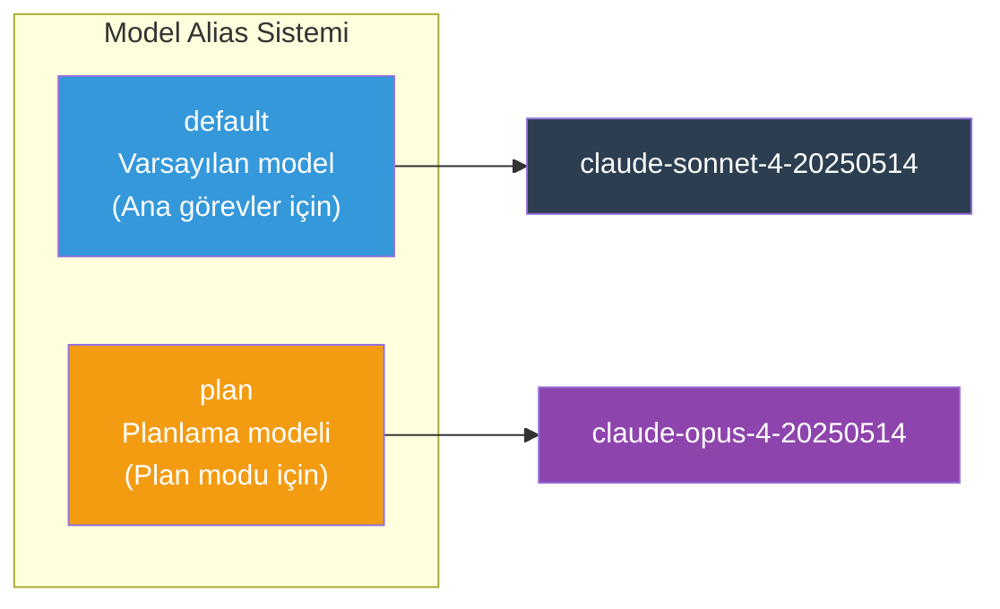
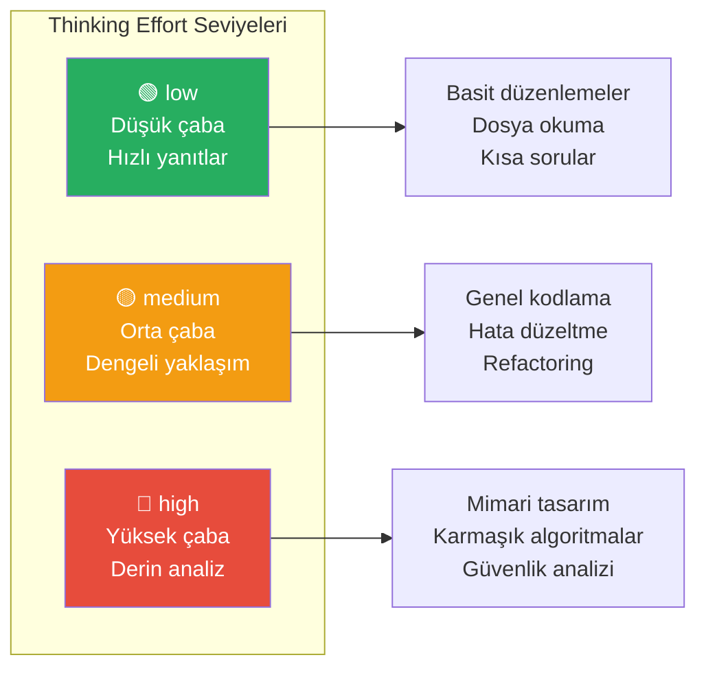
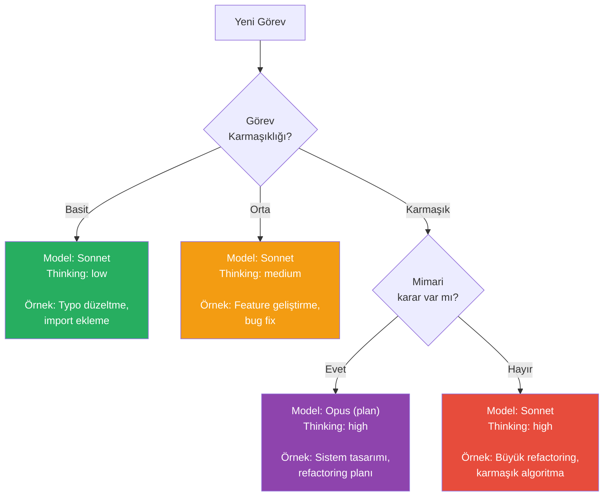
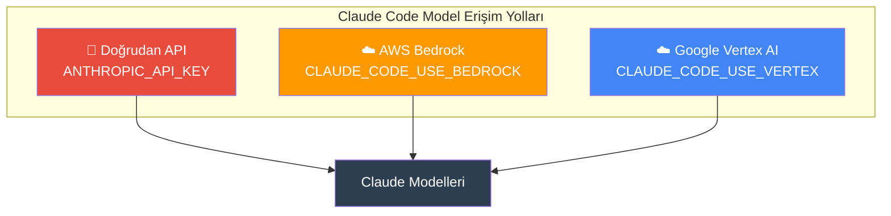

# Model Konfigürasyonu

Claude Code, farklı model alias'ları (takma adları) ve Extended Thinking (genişletilmiş düşünme) ayarları ile görev karmaşıklığına göre optimize edilebilir. Doğru model ve thinking effort (düşünme çabası) seçimi, hem performansı hem de maliyeti doğrudan etkiler.

## Ön Koşullar

| Konu | Bölüm |
|------|-------|
| Claude model ailesi | [Claude Model Ailesi](../05-claude-ekosistemi/02-claude-model-ailesi.md) |
| Ortam değişkenleri | [Ortam Değişkenleri](./03-ortam-degiskenleri.md) |
| Settings.json | [Settings.json Referansı](./02-settings-json-referansi.md) |

---

## Model Seçim Mekanizması

Claude Code, kullanılacak modeli birkaç farklı yöntemle belirlemenize olanak tanır:



### Model Belirleme Yöntemleri

| Yöntem | Öncelik | Kullanım |
|--------|---------|----------|
| `--model` CLI flag | En yüksek | `claude --model claude-sonnet-4-20250514` |
| `ANTHROPIC_MODEL` ortam değişkeni | Yüksek | `export ANTHROPIC_MODEL="claude-sonnet-4-20250514"` |
| Model alias konfigürasyonu | Orta | `settings.json` veya `claude model` komutu |
| Varsayılan | En düşük | Claude Sonnet (güncel sürüm) |

---

## Model Alias'ları

Model alias (takma ad), uzun model ID'lerini kısa ve hatırlanabilir isimlerle eşleştirmenizi sağlar. Claude Code'da iki yerleşik alias kategorisi vardır:

### Yerleşik Alias'lar



| Alias | Varsayılan Model | Kullanım Alanı |
|-------|-----------------|----------------|
| `default` | `claude-sonnet-4-20250514` | Ana etkileşim modeli, agent modu |
| `plan` | `claude-opus-4-20250514` | Plan modu, mimari kararlar |

### Alias Konfigürasyonu

```bash
# CLI ile model alias ayarlama
claude model set default claude-sonnet-4-20250514
claude model set plan claude-opus-4-20250514

# Mevcut alias'ları görüntüleme
claude model get default
claude model get plan
```

### Dahili Komut ile Geçiş

Oturum sırasında model değiştirmek için dahili komut kullanılabilir:

```
/model                          # Mevcut modeli göster
/model claude-opus-4-20250514   # Model değiştir
/model default                  # Varsayılana dön
```

---

## Mevcut Modeller

### Ana Modeller (2026)

| Model | ID | Güç | Hız | Maliyet | Önerilen Kullanım |
|-------|----|-----|-----|---------|-------------------|
| Claude Opus 4 | `claude-opus-4-20250514` | ⭐⭐⭐⭐⭐ | ⭐⭐ | $$$$$ | Karmaşık mimari, derin analiz |
| Claude Sonnet 4 | `claude-sonnet-4-20250514` | ⭐⭐⭐⭐ | ⭐⭐⭐⭐ | $$$ | Genel geliştirme, kod yazma |
| Claude Haiku 3.5 | `claude-haiku-3-5-20241022` | ⭐⭐⭐ | ⭐⭐⭐⭐⭐ | $ | Hızlı sorular, basit görevler |

### Cloud Provider Modelleri

```bash
# AWS Bedrock model ID formatı
export ANTHROPIC_MODEL="anthropic.claude-sonnet-4-20250514-v1:0"

# Google Vertex AI model ID formatı
export ANTHROPIC_MODEL="claude-sonnet-4@20250514"
```

---

## Extended Thinking (Genişletilmiş Düşünme)

Extended Thinking, Claude'un yanıt vermeden önce daha derin düşünmesini sağlayan bir özelliktir. Thinking effort (düşünme çabası) seviyeleri ile kontrolünüz altındadır.

### Thinking Effort Seviyeleri



| Seviye | Token Kullanımı | Yanıt Süresi | Ne Zaman Kullanılır |
|--------|----------------|--------------|---------------------|
| `low` | Az | Hızlı | Basit görevler, hızlı düzenlemeler |
| `medium` | Orta | Normal | Günlük kodlama, orta karmaşıklıktaki görevler |
| `high` | Çok | Yavaş | Karmaşık mimari, derin analiz gerektiren görevler |

### Thinking Effort Ayarlama

```bash
# CLI ile thinking effort ayarlama
claude --thinking-effort high

# Oturum içinde değiştirme
/thinking high
/thinking medium
/thinking low
```

### Thinking Effort ile Model Kombinasyonları

| Senaryo | Önerilen Model | Thinking Effort | Gerekçe |
|---------|----------------|----------------|---------|
| Hızlı typo düzeltme | Sonnet | `low` | Basit, düşünme gerektirmiyor |
| Yeni feature geliştirme | Sonnet | `medium` | Dengeli performans |
| Büyük refactoring | Sonnet | `high` | Kapsamlı analiz gerekli |
| Mimari tasarım | Opus | `high` | Maksimum zeka + derin düşünme |
| API tasarımı | Opus | `medium` | Yüksek zeka yeterli |
| Basit soru-cevap | Haiku | `low` | Hız ve maliyet optimize |

---

## Pratik Örnek: Model Stratejisi

### Günlük Geliştirme Akışı



### Otomatik Model Geçiş Senaryosu

```bash
# Genel geliştirme (varsayılan)
claude model set default claude-sonnet-4-20250514

# Plan modu için Opus kullan
claude model set plan claude-opus-4-20250514

# Artık:
# - Normal modda: Sonnet kullanılır
# - /plan komutu ile: Opus'a geçilir
# - Plan onaylandığında: Sonnet'e geri dönülür
```

### Proje Bazlı Model Ayarı

```bash
# .claude/settings.local.json
{
  "model": "claude-sonnet-4-20250514"
}
```

```bash
# Farklı projeler için farklı modeller
# Proje A (performans-kritik): Opus
cd ~/projects/payment-service
echo '{"model": "claude-opus-4-20250514"}' > .claude/settings.local.json

# Proje B (frontend): Sonnet
cd ~/projects/web-app
echo '{"model": "claude-sonnet-4-20250514"}' > .claude/settings.local.json
```

---

## Bedrock ve Vertex AI Model Konfigürasyonu

### AWS Bedrock

```bash
# Gerekli ortam değişkenleri
export CLAUDE_CODE_USE_BEDROCK=true
export AWS_REGION="us-east-1"

# Model seçimi
export ANTHROPIC_MODEL="anthropic.claude-sonnet-4-20250514-v1:0"

# Cross-region inference (bölgeler arası çıkarım)
export ANTHROPIC_MODEL="us.anthropic.claude-sonnet-4-20250514-v1:0"
```

### Google Vertex AI

```bash
# Gerekli ortam değişkenleri
export CLAUDE_CODE_USE_VERTEX=true
export CLOUD_ML_REGION="us-east5"
export ANTHROPIC_VERTEX_PROJECT_ID="my-project"

# Model seçimi
export ANTHROPIC_MODEL="claude-sonnet-4@20250514"
```



---

## Sık Yapılan Hatalar

| Hata | Çözüm |
|------|-------|
| Her görev için Opus kullanmak | Basit görevlerde Sonnet yeterli, maliyet ve hız kazanın |
| Thinking effort'u hiç ayarlamamak | Görev karmaşıklığına göre ayarlayın |
| Bedrock model ID'sini yanlış formatla yazmak | `anthropic.claude-sonnet-4-20250514-v1:0` formatına dikkat |
| Plan modunda Sonnet bırakmak | Plan modu için Opus, daha kaliteli mimari kararlar verir |

---

## Özet

| Konu | Anahtar Bilgi |
|------|---------------|
| Model seçimi | `--model`, `ANTHROPIC_MODEL`, model alias, varsayılan |
| Alias'lar | `default` (Sonnet), `plan` (Opus) |
| Thinking effort | `low`, `medium`, `high` |
| Strateji | Karmaşıklığa göre model + effort kombinasyonu |
| Cloud providers | Bedrock (`CLAUDE_CODE_USE_BEDROCK`), Vertex (`CLAUDE_CODE_USE_VERTEX`) |

---

## Sonraki Adım

Model seçiminin maliyet etkisini ve token kullanımını nasıl yöneteceğinizi öğrenelim:

→ [Maliyet Yönetimi](./05-maliyet-yonetimi.md)
