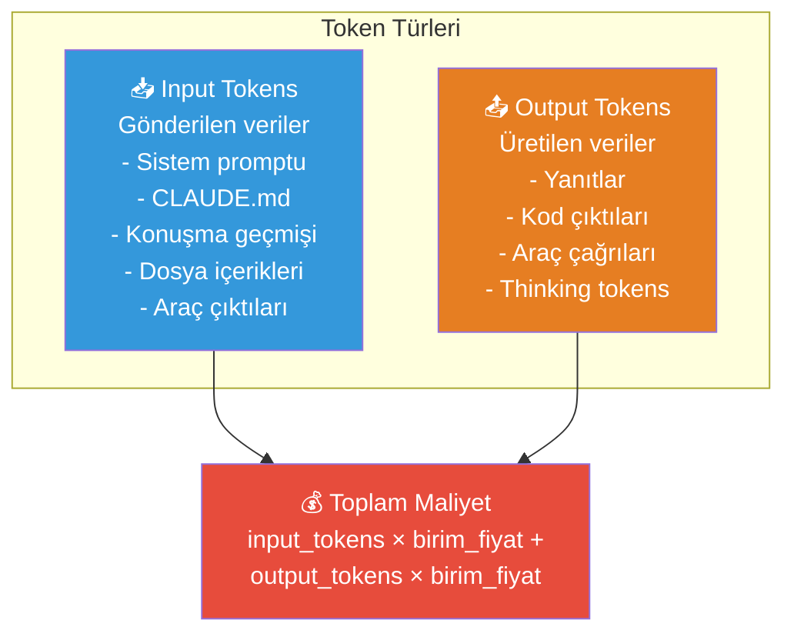
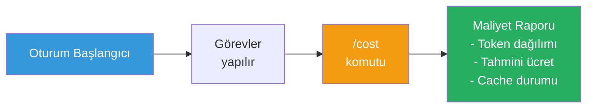
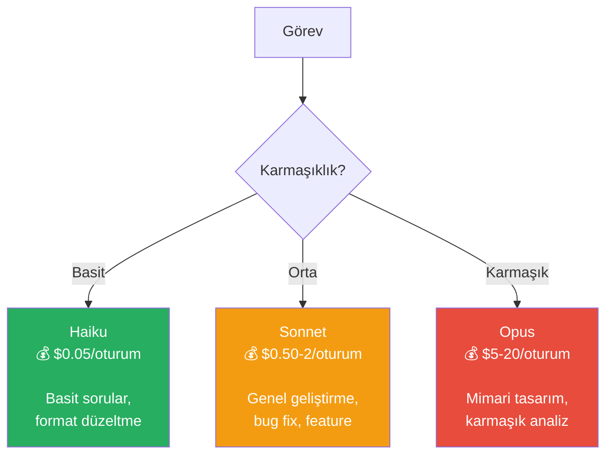
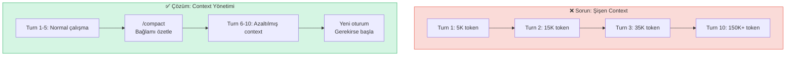
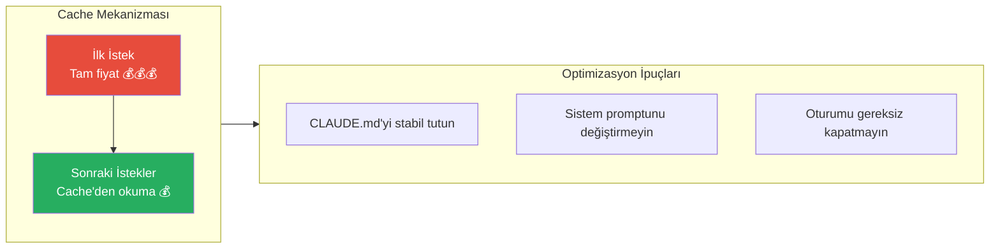
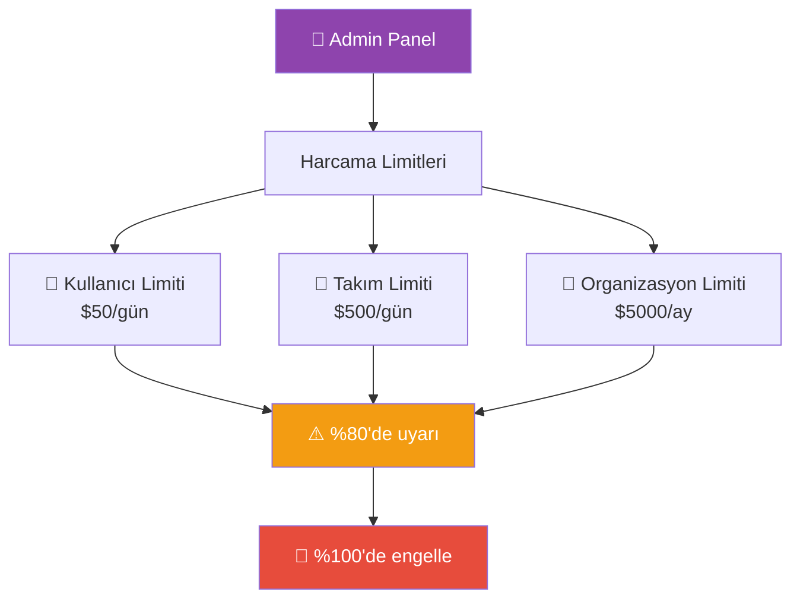
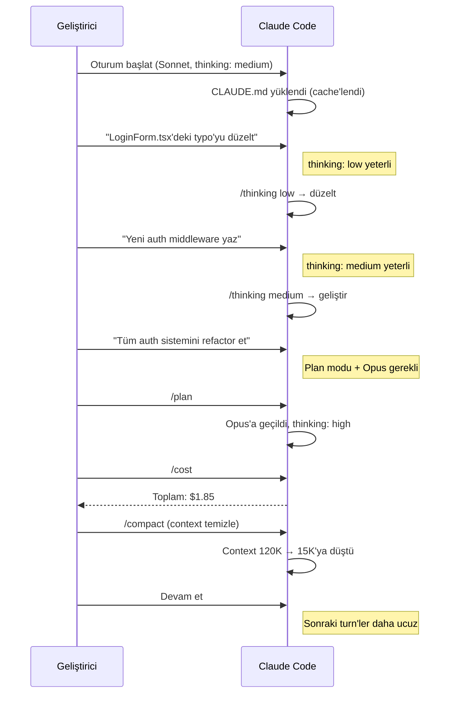

# Maliyet Yönetimi

Claude Code kullanımı token (jeton) tüketimine dayalı olarak faturalandırılır. Doğru model seçimi, bağlam yönetimi ve akıllı konfigürasyon ile maliyetleri önemli ölçüde optimize edebilirsiniz.

## Ön Koşullar

| Konu | Bölüm |
|------|-------|
| Model konfigürasyonu | [Model Konfigürasyonu](./04-model-konfigurasyonu.md) |
| Context window yönetimi | [Context Window Yönetimi](../09-bellek-ve-baglam/05-context-window-yonetimi.md) |
| Extended Thinking | [Model Konfigürasyonu](./04-model-konfigurasyonu.md) |

---

## Token Kullanım Modeli

Claude Code'da maliyet, iki temel token türüne dayanır:



### Model Bazlı Fiyatlandırma (Referans)

| Model | Input (1M token) | Output (1M token) | Tahmini Oturum Maliyeti |
|-------|------------------|--------------------|------------------------|
| Claude Opus 4 | $15.00 | $75.00 | $2 - $20+ |
| Claude Sonnet 4 | $3.00 | $15.00 | $0.50 - $5 |
| Claude Haiku 3.5 | $0.80 | $4.00 | $0.05 - $0.50 |

> **Not:** Fiyatlar değişebilir. Güncel fiyatlar için [Anthropic fiyatlandırma sayfası](https://www.anthropic.com/pricing) kontrol edilmelidir.

---

## /cost Komutu

Oturum içinde maliyet takibi yapmanın en hızlı yolu `/cost` komutudur:

```
> /cost

Session Cost Summary
─────────────────────
Input tokens:    45,230
Output tokens:   12,840
Cache read:      38,100 (cached)
Cache write:      7,130
─────────────────────
Estimated cost:  $0.47
```

### Maliyet Gösterimi



---

## Maliyet Düşürme Stratejileri

### Strateji 1: Doğru Model Seçimi

En büyük maliyet etkeni model seçimidir. Opus, Sonnet'ten ~5x daha pahalıdır.



**Tavsiye:** Günlük geliştirmenin %80'i Sonnet ile yapılabilir. Opus'u yalnızca plan modu ve mimari kararlar için kullanın.

```bash
# Varsayılan olarak Sonnet, plan için Opus
claude model set default claude-sonnet-4-20250514
claude model set plan claude-opus-4-20250514
```

### Strateji 2: Context Window Yönetimi

Context window (bağlam penceresi) büyüdükçe her turn'de gönderilen input token sayısı artar. Bu, maliyetin kümülatif olarak büyümesine neden olur.



**Pratik İpuçları:**

```bash
# Bağlam çok büyüdüğünde sıkıştır
/compact

# Kısa ve odaklı oturumlar tercih et
# Büyük projelerde konuya özel oturumlar aç

# Gereksiz dosya okumalarını engelle
# Claude'a hangi dosyaları okuması gerektiğini söyle
```

### Strateji 3: Extended Thinking Optimizasyonu

Extended Thinking (genişletilmiş düşünme) ekstra output token harcar. Düşünme çabasını görev karmaşıklığına göre ayarlayın.

| Thinking Effort | Ek Token Maliyeti | Ne Zaman |
|----------------|-------------------|----------|
| `low` | Minimal | Basit düzenlemeler, sorular |
| `medium` | Orta | Çoğu geliştirme görevi |
| `high` | Yüksek | Yalnızca karmaşık mimari/algoritma |

```bash
# Basit görevlerde düşük thinking
/thinking low

# Karmaşık görevlerde yüksek thinking
/thinking high
```

### Strateji 4: Cache Optimizasyonu

Claude Code, prompt caching (istem önbellekleme) kullanarak tekrarlayan içeriklerin maliyetini düşürür. Cache'den okunan token'lar %90'a kadar daha ucuzdur.



### Strateji 5: Preprocessing Hook'ları

Gereksiz token kullanımını önlemek için preprocessing (ön işleme) hook'ları kullanın:

```json
{
  "hooks": {
    "PreToolUse": [
      {
        "matcher": "Read",
        "hooks": [
          {
            "type": "command",
            "command": "python3 -c \"import sys,json,os; inp=json.load(sys.stdin); path=inp.get('file_path',''); size=os.path.getsize(path) if os.path.exists(path) else 0; sys.exit(1) if size > 1048576 else sys.exit(0)\"",
            "timeout": 5000
          }
        ]
      }
    ]
  }
}
```

Bu hook, 1MB'den büyük dosyaların okunmasını engeller ve gereksiz token tüketimini önler.

---

## Takım Harcama Limitleri

Enterprise (kurumsal) planlarda takım bazında harcama limitleri tanımlanabilir:



### Limit Konfigürasyonu

Kurumsal admin panelinden ayarlanır:

| Limit Türü | Açıklama | Örnek |
|------------|----------|-------|
| Kullanıcı günlük | Bir kullanıcının günlük harcama üst sınırı | $50 |
| Takım günlük | Takımın toplam günlük harcama üst sınırı | $500 |
| Organizasyon aylık | Tüm organizasyonun aylık üst sınırı | $5000 |
| Uyarı eşiği | Limitin yüzde kaçında uyarı verilir | %80 |

---

## Maliyet İzleme Kontrol Listesi

Günlük maliyet yönetimi için kontrol listesi:

| Kontrol | Nasıl | Sıklık |
|---------|-------|--------|
| Oturum maliyetini kontrol et | `/cost` komutu | Her oturum |
| Model seçimini gözden geçir | Basit görevlerde Sonnet/Haiku | Her görev |
| Context boyutunu kontrol et | Durum çubuğunda token sayısı | Sürekli |
| Gereksiz dosya okumalarını engelle | Spesifik dosya yolları ver | Her istek |
| Compact işlemi uygula | `/compact` komutu | Context büyüyünce |
| Thinking effort ayarla | `/thinking low/medium/high` | Görev başına |

---

## Pratik Örnek: Maliyet Optimize Edilmiş İş Akışı



---

## Sık Yapılan Hatalar

| Hata | Çözüm |
|------|-------|
| Her şeyde Opus kullanmak | Sonnet, görevlerin %80'i için yeterli |
| Context'i hiç temizlememek | Düzenli `/compact` kullanın |
| Büyük dosyaları toptan okutmak | Satır aralığı belirterek okutun |
| Thinking effort'u hep `high` bırakmak | Görev karmaşıklığına göre ayarlayın |
| Maliyet takibi yapmamak | Oturum sonunda `/cost` alışkanlık edinin |

---

## Özet

| Strateji | Tasarruf Potansiyeli | Zorluk |
|----------|---------------------|--------|
| Doğru model seçimi | 🟢🟢🟢🟢🟢 Çok yüksek | Kolay |
| Context yönetimi | 🟢🟢🟢🟢 Yüksek | Orta |
| Thinking effort ayarı | 🟢🟢🟢 Orta | Kolay |
| Cache optimizasyonu | 🟢🟢 Düşük-Orta | Otomatik |
| Preprocessing hook'ları | 🟢🟢 Düşük-Orta | İleri düzey |

---

## Sonraki Adım

Durum çubuğunda maliyet ve context bilgilerini nasıl izleyeceğinizi öğrenelim:

→ [Durum Çubuğu](./06-durum-satiri.md)
