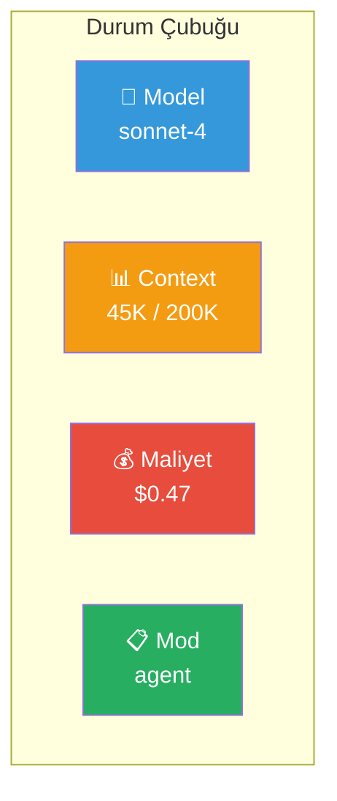
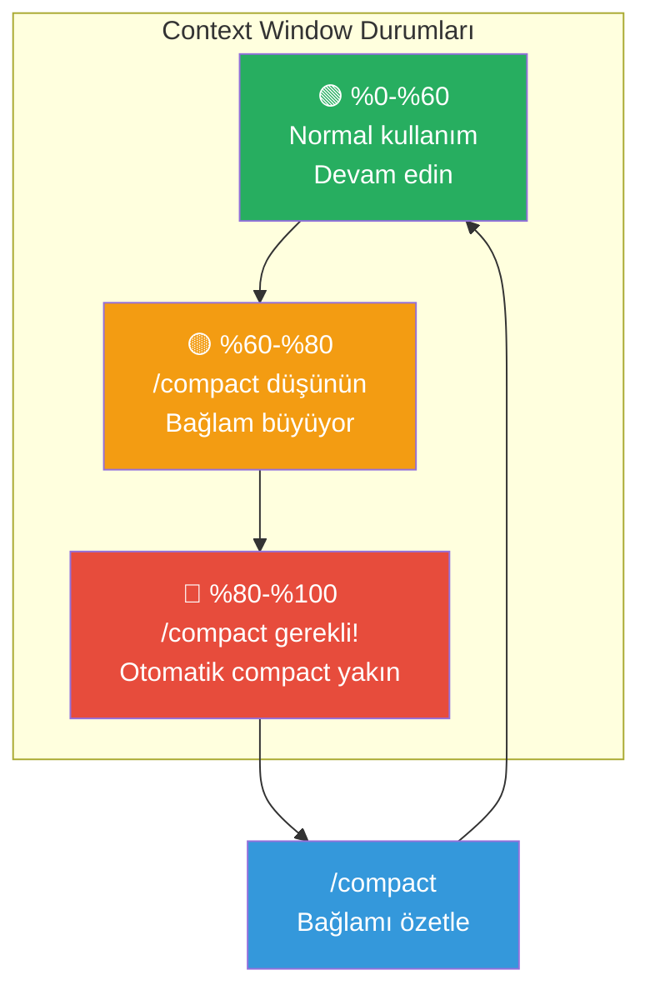
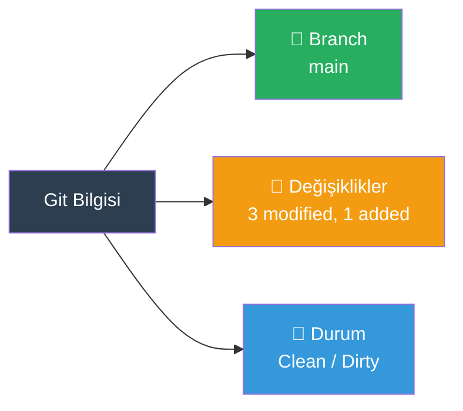
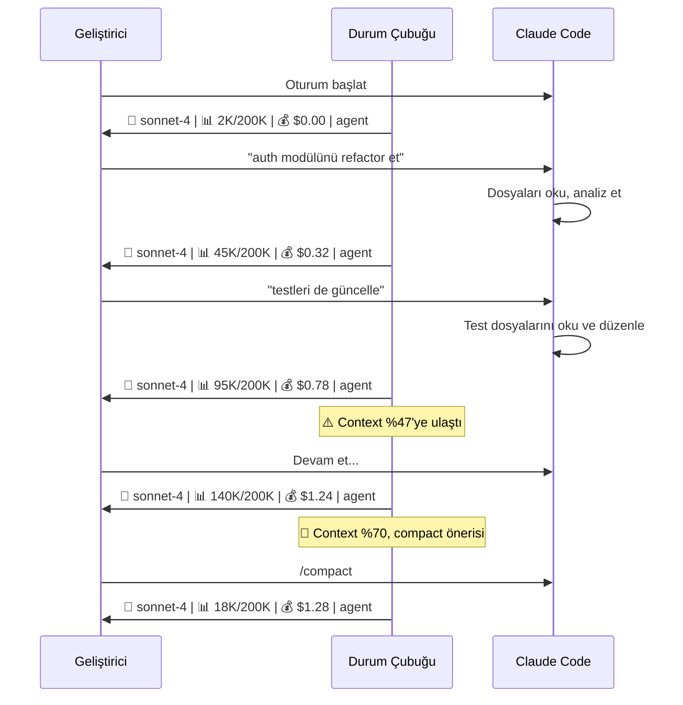

# Durum Çubuğu (Status Bar)

Claude Code, terminal penceresinin alt kısmında bir status bar (durum çubuğu) gösterir. Bu çubuk, context window (bağlam penceresi) kullanımı, tahmini maliyet ve model bilgisi gibi kritik verileri gerçek zamanlı sunar.

## Ön Koşullar

| Konu | Bölüm |
|------|-------|
| Terminal optimizasyonu | [Terminal Optimizasyonu](./08-terminal-optimizasyonu.md) |
| Context window yönetimi | [Context Window Yönetimi](../09-bellek-ve-baglam/05-context-window-yonetimi.md) |
| Maliyet yönetimi | [Maliyet Yönetimi](./05-maliyet-yonetimi.md) |

---

## Durum Çubuğu Bileşenleri

Claude Code durum çubuğu şu bilgileri gösterir:



### Bileşen Detayları

| Bileşen | Görüntülenen Bilgi | Anlamı |
|---------|-------------------|--------|
| Model | Aktif model adı | Kullanılan Claude modeli |
| Context | `kullanılan / toplam` token | Context window doluluk oranı |
| Maliyet | Tahmini oturum maliyeti ($) | Şu ana kadar harcanan tutar |
| Mod | `agent`, `plan`, `ask` | Aktif çalışma modu |

---

## Context Window İzleme

Durum çubuğundaki en kritik metrik context window kullanımıdır:



### Context Doluluk Renkleri

| Doluluk | Renk | Anlam | Aksiyon |
|---------|------|-------|---------|
| %0 - %60 | 🟢 Yeşil | Normal | Devam edin |
| %60 - %80 | 🟡 Sarı | Dikkat | `/compact` düşünün |
| %80 - %100 | 🔴 Kırmızı | Kritik | Hemen `/compact` veya yeni oturum |

---

## Maliyet İzleme

Durum çubuğundaki maliyet göstergesi, oturum boyunca kümülatif harcamayı takip eder:

```
Session: $0.47  (Input: 45K tokens, Output: 12K tokens)
```

Daha detaylı maliyet bilgisi için `/cost` komutunu kullanın:

```
> /cost

Session Cost Summary
─────────────────────
Model:           claude-sonnet-4-20250514
Input tokens:    45,230  ($0.14)
Output tokens:   12,840  ($0.19)
Cache read:      38,100  ($0.01)
Cache write:      7,130  ($0.02)
Thinking:         8,400  ($0.13)
─────────────────────
Estimated cost:  $0.49
Duration:        12m 34s
```

---

## Git Durumu İzleme

Claude Code durum çubuğu, proje Git durumunu da yansıtabilir:



---

## Durum Çubuğu Konfigürasyonu

Durum çubuğunun görünümü ve davranışı özelleştirilebilir:

### Temel Ayarlar

```json
{
  "statusBar": {
    "showCost": true,
    "showContext": true,
    "showModel": true,
    "showMode": true
  }
}
```

### Özel Durum Gösterimi

Hook'lar aracılığıyla durum çubuğuna özel bilgiler eklenebilir:

```json
{
  "hooks": {
    "SessionStart": [
      {
        "hooks": [
          {
            "type": "command",
            "command": "echo \"Git branch: $(git branch --show-current), Node: $(node --version)\""
          }
        ]
      }
    ]
  }
}
```

---

## Pratik Örnek: Durum Çubuğu Odaklı İş Akışı

### Adım Adım İzleme



---

## Sık Yapılan Hatalar

| Hata | Çözüm |
|------|-------|
| Durum çubuğunu görmezden gelmek | Context ve maliyet bilgilerine düzenli bakın |
| Context kırmızıya dönene kadar beklemek | Sarı bölgede `/compact` kullanın |
| Terminal penceresini çok dar yapmak | Tüm göstergelerin görünmesi için yeterli genişlik sağlayın |

---

## Özet

| Bileşen | Bilgi | İzleme Amacı |
|---------|-------|-------------|
| Model | Aktif model | Doğru model kullanıldığından emin olma |
| Context | Token kullanımı | Compact zamanını belirleme |
| Maliyet | Oturum harcaması | Bütçe kontrolü |
| Mod | Çalışma modu | Aktif modun farkında olma |

---

## Sonraki Adım

Claude Code'daki klavye kısayollarını ve özelleştirme seçeneklerini öğrenelim:

→ [Klavye Kısayolları](./07-klavye-kisayollari.md)
