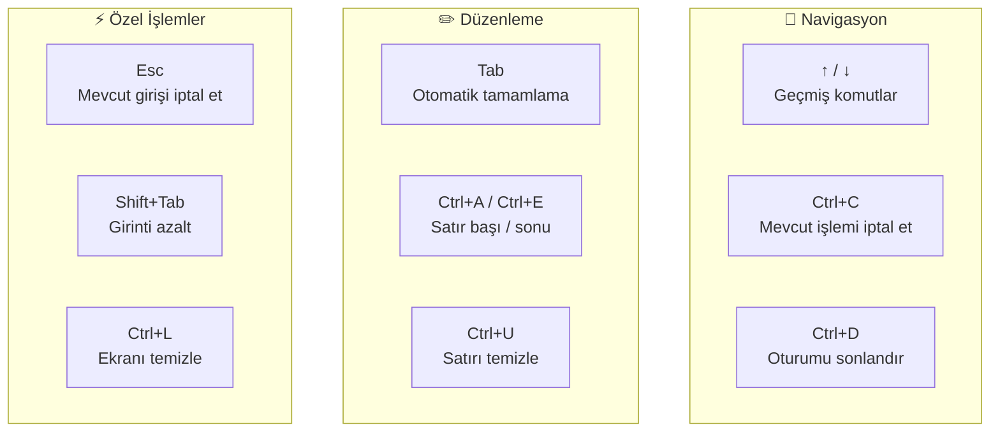
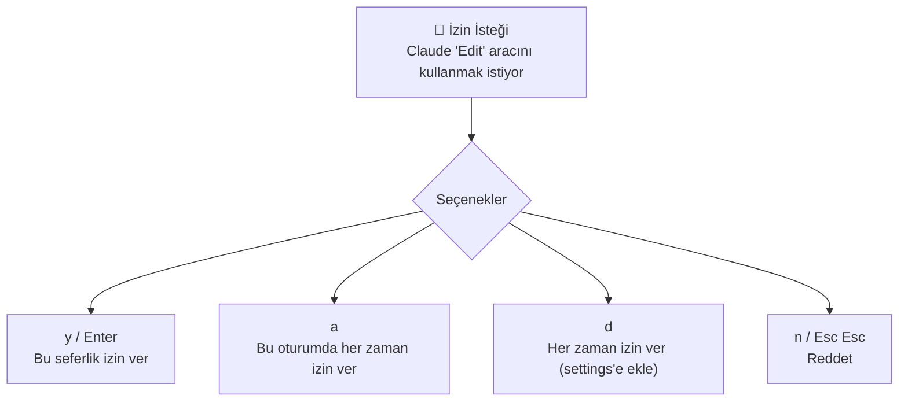
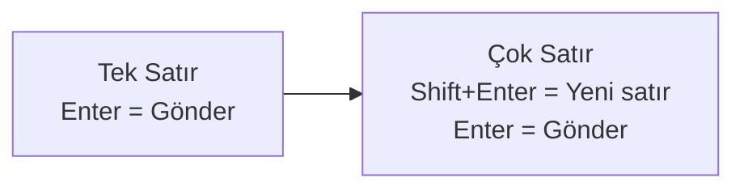
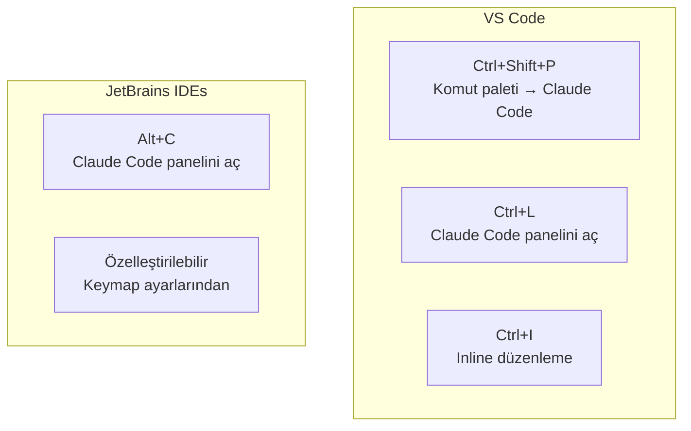

# Klavye Kısayolları

Claude Code, terminal tabanlı bir arayüze sahip olduğundan, etkili kullanım için keybindings (klavye kısayolları) kritik öneme sahiptir. Bu rehber, varsayılan kısayolları, özelleştirme seçeneklerini ve verimlilik ipuçlarını kapsar.

## Ön Koşullar

| Konu | Bölüm |
|------|-------|
| İnteraktif mod | [İnteraktif Mod](../07-arayuz-ve-komutlar/01-interaktif-mod.md) |
| CLI referansı | [CLI Referansı](../07-arayuz-ve-komutlar/04-cli-referansi.md) |
| Dahili komutlar | [Dahili Komutlar](../07-arayuz-ve-komutlar/05-dahili-komutlar.md) |

---

## Varsayılan Kısayollar

Claude Code'da kullanılabilecek temel klavye kısayolları:



### Temel Kısayol Referans Tablosu

| Kısayol | İşlev | Açıklama |
|---------|-------|----------|
| `↑` / `↓` | Geçmiş navigasyonu | Önceki/sonraki komutlar arasında gezin |
| `Tab` | Otomatik tamamlama | Dosya yolları ve komut tamamlama |
| `Enter` | Gönder | Mesajı Claude'a gönderir |
| `Shift+Enter` | Yeni satır | Çok satırlı giriş için |
| `Ctrl+C` | İptal | Mevcut işlemi iptal eder |
| `Ctrl+D` | Çıkış | Oturumu sonlandırır (EOF) |
| `Ctrl+L` | Ekran temizle | Terminal ekranını temizler |
| `Ctrl+A` | Satır başı | İmleci satır başına taşır |
| `Ctrl+E` | Satır sonu | İmleci satır sonuna taşır |
| `Ctrl+U` | Satır sil | İmleçten satır başına kadar siler |
| `Ctrl+K` | Satır kes | İmleçten satır sonuna kadar siler |
| `Ctrl+W` | Kelime sil | Önceki kelimeyi siler |
| `Esc` | İptal | Mevcut girişi temizler |
| `Esc Esc` | Çift Escape | İzin isteğini reddet |

---

## İzin Yönetimi Kısayolları

Claude Code bir araç kullanmak istediğinde izin ister. Bu izin diyaloğunda kullanılan kısayollar:



| Kısayol | İşlev | Kalıcılık |
|---------|-------|-----------|
| `y` veya `Enter` | İzin ver | Sadece bu sefer |
| `a` | Always allow (her zaman izin ver) | Bu oturum boyunca |
| `d` | Allow and remember (izin ver ve hatırla) | `settings.json`'a kaydeder |
| `n` veya `Esc Esc` | Reddet | Sadece bu sefer |

---

## Çok Satırlı Giriş

Uzun mesajlar veya kod blokları girmek için çok satırlı giriş modunu kullanın:



### Çok Satırlı Giriş Örneği

```
> Bu bir çok satırlı mesajdır.    [Shift+Enter]
  İkinci satır burada.            [Shift+Enter]
  Üçüncü satır burada.            [Enter → Gönderir]
```

---

## Dahili Komut Kısayolları

`/` ile başlayan dahili komutlar da bir tür kısayol olarak işlev görür:

| Komut | Kısayol | İşlev |
|-------|---------|-------|
| `/help` | — | Yardım menüsünü göster |
| `/compact` | — | Context'i özetle |
| `/cost` | — | Maliyet bilgisini göster |
| `/model` | — | Model bilgisini göster/değiştir |
| `/thinking` | — | Thinking effort ayarla |
| `/plan` | — | Plan moduna geç |
| `/clear` | `Ctrl+L` | Ekranı temizle |
| `/quit` | `Ctrl+D` | Oturumdan çık |
| `/bug` | — | Bug raporu gönder |

---

## Vim Tarzı Kısayollar

Readline desteği sayesinde bazı Vim/Emacs tarzı kısayollar da çalışır:

### Emacs Tarzı (Varsayılan)

| Kısayol | İşlev |
|---------|-------|
| `Ctrl+A` | Satır başı |
| `Ctrl+E` | Satır sonu |
| `Ctrl+F` | Bir karakter ileri |
| `Ctrl+B` | Bir karakter geri |
| `Alt+F` | Bir kelime ileri |
| `Alt+B` | Bir kelime geri |
| `Ctrl+D` | Karakter sil (ileri) |
| `Ctrl+H` | Karakter sil (geri) / Backspace |
| `Ctrl+T` | İki karakteri yer değiştir |

---

## IDE Entegrasyonu Kısayolları

Claude Code, IDE entegrasyonlarında (VS Code, JetBrains) ek kısayollarla kullanılabilir:



### VS Code Kısayolları

| Kısayol | İşlev |
|---------|-------|
| `Ctrl+Shift+P` → "Claude" | Claude Code komutlarını listele |
| `Ctrl+L` | Claude Code panelini aç/kapat |
| `Ctrl+I` | Seçili kod için inline düzenleme |
| `Ctrl+Enter` | Mesajı gönder (panel içinde) |

---

## Kısayol Özelleştirme

### Terminal Kısayollarını Özelleştirme

Terminal seviyesinde kısayollar, shell konfigürasyonunda (`.inputrc`) özelleştirilebilir:

```bash
# ~/.inputrc dosyası
# Ctrl+G ile git status çalıştır
"\C-g": "git status\n"

# Ctrl+T ile test komutu
"\C-t": "npm test\n"
```

### VS Code Keybindings

VS Code'da Claude Code kısayollarını özelleştirmek için `keybindings.json`:

```json
[
  {
    "key": "ctrl+shift+c",
    "command": "claude-code.openPanel",
    "when": "editorTextFocus"
  },
  {
    "key": "ctrl+shift+i",
    "command": "claude-code.inlineEdit",
    "when": "editorHasSelection"
  }
]
```

---

## Verimlilik İpuçları

| İpucu | Açıklama |
|-------|----------|
| `↑` tuşunu kullanın | Önceki komutları tekrarlamak yerine geçmişten çağırın |
| `Tab` ile tamamlayın | Dosya yollarını elle yazmayın |
| `Shift+Enter` ile gruplayın | İlişkili talimatları tek mesajda gönderin |
| `/compact` düzenli kullanın | Context büyümeden önce sıkıştırın |
| `a` ile toplu izin verin | Güvendiğiniz araçlara oturum boyunca izin verin |
| `d` ile kalıcı izin verin | Sürekli kullandığınız araçları ayarlara ekleyin |

---

## Sık Yapılan Hatalar

| Hata | Çözüm |
|------|-------|
| `Enter` ile yeni satır beklentisi | `Shift+Enter` kullanın |
| `Ctrl+C` ile oturumdan çıkma beklentisi | `Ctrl+C` işlemi iptal eder, `Ctrl+D` ile çıkın |
| IDE kısayolları çakışması | Keybindings ayarlarından çakışanları düzenleyin |
| Terminal kısayollarının çalışmaması | Terminal türünüz ve shell konfigürasyonunuzu kontrol edin |

---

## Özet

| Kategori | Anahtar Kısayollar |
|----------|-------------------|
| Navigasyon | `↑`/`↓`, `Ctrl+A`/`Ctrl+E`, `Tab` |
| İşlem | `Enter` (gönder), `Ctrl+C` (iptal), `Ctrl+D` (çık) |
| Düzenleme | `Shift+Enter` (yeni satır), `Ctrl+U` (sil), `Ctrl+W` (kelime sil) |
| İzin | `y`/`a`/`d`/`n` |
| Dahili komutlar | `/compact`, `/cost`, `/model`, `/thinking` |

---

## Sonraki Adım

Terminal ortamınızı Claude Code için en iyi performansa göre yapılandırmayı öğrenelim:

→ [Terminal Optimizasyonu](./08-terminal-optimizasyonu.md)
