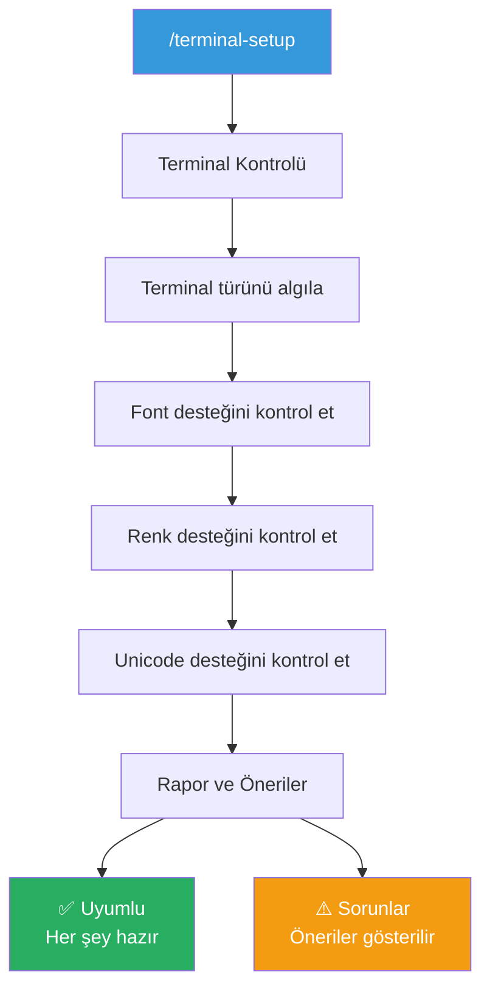
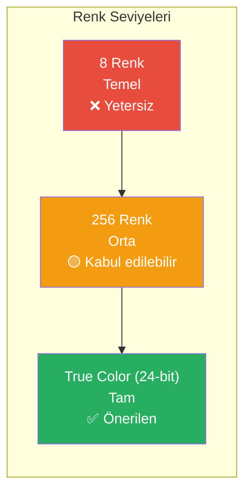
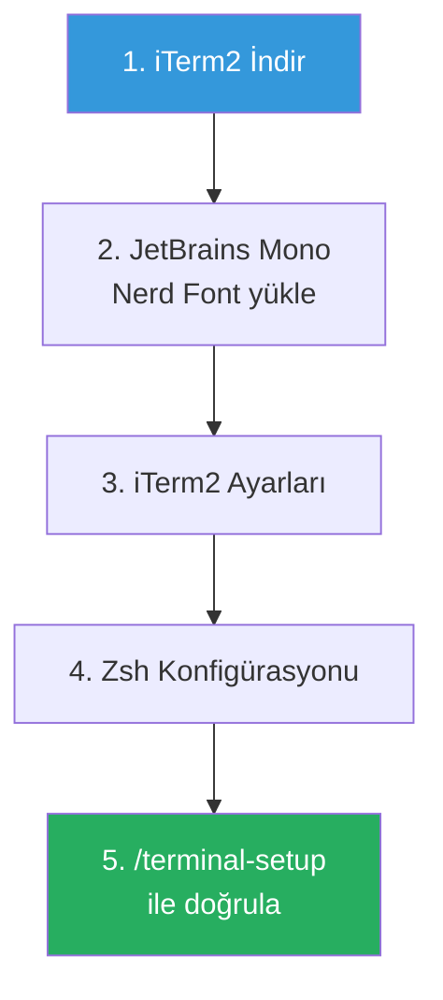
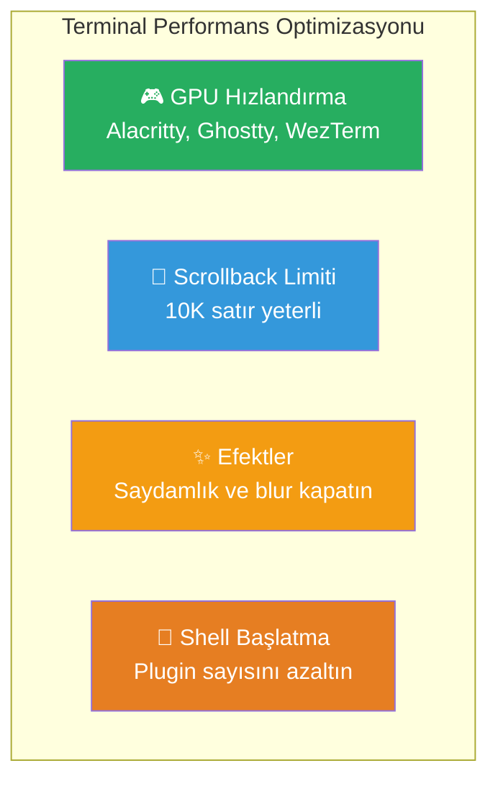

# Terminal Optimizasyonu

Claude Code bir CLI (Command Line Interface) aracı olduğundan, terminal ortamının doğru yapılandırılması hem görsel deneyimi hem de performansı doğrudan etkiler. Bu rehber, önerilen terminal uygulamalarını, font konfigürasyonunu, renk desteğini ve `/terminal-setup` komutunu kapsar.

## Ön Koşullar

| Konu | Bölüm |
|------|-------|
| Claude Code kurulumu | [Kurulum ve Gereksinimler](../06-claude-code-tanitim/03-kurulum-ve-gereksinimler.md) |
| Klavye kısayolları | [Klavye Kısayolları](./07-klavye-kisayollari.md) |

---

## Önerilen Terminal Uygulamaları

Claude Code, modern terminal özelliklerinden (Unicode, true color, ligature) yararlanan bir TUI (Terminal User Interface) sunar. En iyi deneyim için uyumlu terminal kullanılmalıdır.

```mermaid
flowchart TD
    subgraph recommended ["✅ Önerilen Terminaller"]
        direction TB
        ITERM["iTerm2\nmacOS\nTrue color, ligature, Unicode"]
        GHOSTTY["Ghostty\nmacOS / Linux\nGPU hızlandırmalı, modern"]
        WARP["Warp\nmacOS / Linux\nAI-native, hızlı"]
        WEZTERM["WezTerm\nÇapraz platform\nGPU, yapılandırılabilir"]
        WTERM["Windows Terminal\nWindows\nTrue color, Unicode"]
    end

    subgraph acceptable ["🟡 Kabul Edilebilir"]
        direction TB
        ALACRITTY["Alacritty\nÇapraz platform\nGPU, minimal"]
        KITTY["Kitty\nmacOS / Linux\nGPU, font özelleştirme"]
        HYPER["Hyper\nÇapraz platform\nElectron tabanlı"]
    end

    subgraph avoid ["❌ Sorunlu Olabilecekler"]
        direction TB
        XTERM["xterm\nEski, sınırlı Unicode"]
        CMD["cmd.exe\nSınırlı renk desteği"]
        TERM_APP["Terminal.app\nmacOS varsayılanı\nSınırlı true color"]
    end

    style recommended fill:#D5F5E3,stroke:#27AE60
    style acceptable fill:#FEF9E7,stroke:#F39C12
    style avoid fill:#FADBD8,stroke:#E74C3C
```



### Platform Bazlı Öneriler

| Platform | Birincil Öneri | Alternatif | Kaçınılması Gereken |
|----------|---------------|------------|---------------------|
| macOS | iTerm2, Ghostty | Kitty, WezTerm | Terminal.app |
| Linux | Ghostty, WezTerm | Alacritty, Kitty | xterm |
| Windows | Windows Terminal | WezTerm | cmd.exe |

---

## /terminal-setup Komutu

Claude Code, terminal ortamınızı otomatik olarak yapılandırmak için `/terminal-setup` komutunu sunar:

```
> /terminal-setup
```

Bu komut şunları yapar:



### Kontrol Edilen Öğeler

| Öğe | Kontrol | Önerilen |
|-----|---------|----------|
| Terminal türü | `$TERM` değişkeni | `xterm-256color` veya üstü |
| True color | 24-bit renk desteği | Evet |
| Unicode | Emoji ve özel karakter desteği | UTF-8 |
| Font | Nerd Font veya ligature desteği | Fira Code, JetBrains Mono |
| Boyut | Terminal pencere boyutu | En az 120x30 karakter |

---

## Font Konfigürasyonu

Claude Code'un çıktılarında emoji, kutu çizim karakterleri ve özel semboller kullanılır. Bunların doğru görüntülenmesi için uygun fontlar gereklidir.

### Önerilen Fontlar

| Font | Özellikler | Nereden İndirilir |
|------|------------|-------------------|
| **JetBrains Mono** | Ligature, geniş Unicode | [jetbrains.com/mono](https://www.jetbrains.com/mono/) |
| **Fira Code** | Ligature, programlama odaklı | [github.com/tonsky/FiraCode](https://github.com/tonsky/FiraCode) |
| **MesloLGS NF** | Nerd Font, powerline semboller | [Nerd Fonts](https://www.nerdfonts.com/) |
| **Cascadia Code** | Microsoft, ligature | [github.com/microsoft/cascadia-code](https://github.com/microsoft/cascadia-code) |
| **Hack** | Temiz, okunabilir | [sourcefoundry.org/hack](https://sourcefoundry.org/hack/) |

### Font Boyutu Önerisi

| Ortam | Önerilen Boyut | Gerekçe |
|-------|---------------|---------|
| Masaüstü (1080p) | 13-14px | Dengeli okunabilirlik |
| Masaüstü (4K) | 14-16px | Yüksek DPI kompanzasyonu |
| Laptop | 12-13px | Ekran alanı optimizasyonu |
| Sunum / eşli programlama | 16-18px | Uzaktan okunabilirlik |

### Terminal Bazlı Font Ayarları

**iTerm2:**
```
Preferences → Profiles → Text → Font → JetBrains Mono, 14pt
☑ Use ligatures
```

**Windows Terminal** (`settings.json`):
```json
{
  "profiles": {
    "defaults": {
      "font": {
        "face": "JetBrains Mono",
        "size": 13,
        "features": {
          "liga": 1
        }
      }
    }
  }
}
```

**Ghostty** (`config`):
```
font-family = "JetBrains Mono"
font-size = 14
```

**Alacritty** (`alacritty.toml`):
```toml
[font]
size = 13.0

[font.normal]
family = "JetBrains Mono"
style = "Regular"
```

---

## Renk Desteği

Claude Code, söz dizimi vurgulama, diff gösterimi ve durum göstergeleri için renk kullanır.

### True Color (24-bit) Kontrolü

```bash
# True color desteğini test et
echo -e "\033[38;2;255;0;0mKırmızı\033[38;2;0;255;0mYeşil\033[38;2;0;0;255mMavi\033[0m"

# TERM değişkenini kontrol et
echo $TERM
# Önerilen: xterm-256color veya xterm-direct
```

### Renk Desteği Seviyeleri



### TERM Değişkeni Ayarı

```bash
# ~/.bashrc veya ~/.zshrc
export TERM=xterm-256color

# True color desteği için (bazı terminallerde)
export COLORTERM=truecolor
```

---

## Terminal Boyutu ve Pencere Ayarları

Claude Code'un etkili çalışması için terminal penceresinin yeterli boyutta olması gerekir:

| Boyut | Genişlik | Yükseklik | Kullanım |
|-------|----------|-----------|----------|
| **Minimum** | 80 karakter | 24 satır | Temel kullanım |
| **Önerilen** | 120 karakter | 35 satır | Konforlu geliştirme |
| **İdeal** | 160+ karakter | 40+ satır | Geniş kod blokları |

```bash
# Terminal boyutunu kontrol et
echo "Columns: $(tput cols), Lines: $(tput lines)"
```

---

## Shell Konfigürasyonu

### Önerilen Shell Ayarları

```bash
# ~/.bashrc veya ~/.zshrc

# UTF-8 desteği
export LANG=en_US.UTF-8
export LC_ALL=en_US.UTF-8

# Renk desteği
export TERM=xterm-256color
export COLORTERM=truecolor

# Geçmiş boyutu (Claude Code komut geçmişi için faydalı)
export HISTSIZE=10000
export HISTFILESIZE=20000

# Zaman damgalı geçmiş
export HISTTIMEFORMAT="%Y-%m-%d %H:%M:%S "
```

### PowerShell (Windows)

```powershell
# $PROFILE dosyası
# Encoding ayarı
[Console]::OutputEncoding = [System.Text.Encoding]::UTF8
$OutputEncoding = [System.Text.Encoding]::UTF8

# PSReadLine ayarları (daha iyi düzenleme deneyimi)
Set-PSReadLineOption -EditMode Emacs
Set-PSReadLineOption -PredictionSource History
```

---

## Pratik Örnek: Tam Terminal Kurulumu

### macOS + iTerm2 + Zsh



**Adımlar:**

```bash
# 1. Homebrew ile iTerm2
brew install --cask iterm2

# 2. Font yükleme
brew install --cask font-jetbrains-mono-nerd-font

# 3. iTerm2 ayarları (Preferences → Profiles → Text)
#    Font: JetBrains Mono Nerd Font, 14pt
#    ☑ Use ligatures

# 4. Zsh konfigürasyonu (~/.zshrc)
export LANG=en_US.UTF-8
export TERM=xterm-256color
export COLORTERM=truecolor

# 5. Claude Code ile doğrulama
claude
> /terminal-setup
```

### Windows + Windows Terminal

```powershell
# 1. Windows Terminal (Microsoft Store'dan yüklü)

# 2. Font yükleme
# JetBrains Mono'yu indirip sistem fontlarına yükleyin

# 3. Windows Terminal settings.json
# Ctrl+, ile ayarları açın
```

```json
{
  "profiles": {
    "defaults": {
      "font": {
        "face": "JetBrains Mono",
        "size": 13
      },
      "colorScheme": "One Half Dark",
      "useAcrylic": false,
      "scrollbarState": "visible",
      "padding": "8"
    }
  },
  "schemes": []
}
```

### Linux + Ghostty

```bash
# 1. Ghostty yükleme (distro'ya göre)
# Arch: yay -S ghostty
# Ubuntu: snap install ghostty

# 2. Font yükleme
sudo apt install fonts-jetbrains-mono  # Ubuntu/Debian

# 3. Ghostty konfigürasyonu (~/.config/ghostty/config)
font-family = "JetBrains Mono"
font-size = 14
theme = "catppuccin-mocha"
window-padding-x = 8
window-padding-y = 8
```

---

## Sorun Giderme

| Sorun | Olası Neden | Çözüm |
|-------|-------------|-------|
| Emoji/semboller bozuk görünüyor | Font Unicode desteği yok | Nerd Font yükleyin |
| Renkler yanlış/yok | TERM değişkeni yanlış | `export TERM=xterm-256color` |
| Kutu çizim karakterleri kırık | Font karakter seti eksik | JetBrains Mono veya Fira Code kullanın |
| Yavaş terminal performansı | GPU hızlandırma kapalı | Alacritty, Ghostty veya WezTerm deneyin |
| Kopyala/yapıştır çalışmıyor | Terminal clipboard ayarı | Terminal ayarlarından clipboard'u etkinleştirin |
| Düzensiz satır araları | Font satır yüksekliği yanlış | Terminal line spacing ayarını yapın |
| Türkçe karakterler bozuk | Encoding ayarı yanlış | `export LANG=tr_TR.UTF-8` |

---

## Performans İpuçları



| Optimizasyon | Etki | Nasıl |
|-------------|------|-------|
| GPU hızlandırmalı terminal | Rendering hızı | Alacritty/Ghostty/WezTerm kullanın |
| Scrollback buffer limiti | Bellek kullanımı | 10,000 satır yeterli |
| Saydamlık efektini kapatma | GPU yükü | Terminal ayarlarında devre dışı bırakın |
| Shell başlatma optimizasyonu | Startup süresi | Gereksiz plugin'leri kaldırın |
| Font cache | Rendering hızı | Sistem font cache'ini etkinleştirin |

---

## Sık Yapılan Hatalar

| Hata | Çözüm |
|------|-------|
| cmd.exe kullanmak (Windows) | Windows Terminal'e geçin |
| Çok küçük terminal penceresi | En az 120x35 karakter |
| Varsayılan sistem fontunu kullanmak | Programlama fontu yükleyin |
| TERM değişkenini ayarlamamak | `export TERM=xterm-256color` |

---

## Özet

| Alan | Öneri |
|------|-------|
| Terminal | iTerm2 (mac), Windows Terminal (win), Ghostty (linux) |
| Font | JetBrains Mono veya Fira Code, 13-14px |
| Renk | True color (24-bit), `TERM=xterm-256color` |
| Boyut | En az 120 karakter genişlik |
| Doğrulama | `/terminal-setup` komutu |

---

## Sonraki Adım

Terminal ortamınız hazır! Şimdi Claude Code'u kurumsal ortamda kullanmayı öğrenelim:

→ [Bölüm 18: Kurumsal Kullanım](../18-kurumsal-kullanim/README.md)
