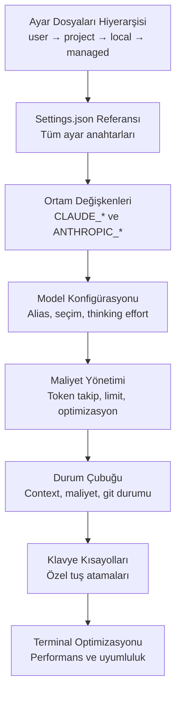

# Bölüm 17: Konfigürasyon

Claude Code'un davranışını tam olarak kontrol altına almak için kapsamlı bir konfigürasyon sistemi sunar. Ayar dosyalarından ortam değişkenlerine, model seçiminden maliyet yönetimine, durum çubuğundan terminal optimizasyonuna kadar her detayı bu bölümde öğreneceksiniz.

## Bu Bölümde Neler Öğreneceksiniz?

## İçerik

| # | Dosya | Konu | Süre |
|---|-------|------|------|
| 01 | [Ayar Dosyaları Hiyerarşisi](./01-ayar-dosyalari-hiyerarsisi.md) | Settings dosya türleri, öncelik sırası, scope kavramı | ~12 dk |
| 02 | [Settings.json Referansı](./02-settings-json-referansi.md) | Tüm ayar anahtarları, varsayılanlar, örnek konfigürasyonlar | ~18 dk |
| 03 | [Ortam Değişkenleri](./03-ortam-degiskenleri.md) | CLAUDE_*, ANTHROPIC_* ve diğer ortam değişkenleri referansı | ~12 dk |
| 04 | [Model Konfigürasyonu](./04-model-konfigurasyonu.md) | Model alias'ları, Extended Thinking ayarları, seçim stratejisi | ~15 dk |
| 05 | [Maliyet Yönetimi](./05-maliyet-yonetimi.md) | Token takip, harcama limitleri, maliyet düşürme teknikleri | ~15 dk |
| 06 | [Durum Çubuğu](./06-durum-satiri.md) | Özel durum çubuğu, context izleme, maliyet gösterimi | ~8 dk |
| 07 | [Klavye Kısayolları](./07-klavye-kisayollari.md) | Tuş atama konfigürasyonu, varsayılan kısayollar | ~8 dk |
| 08 | [Terminal Optimizasyonu](./08-terminal-optimizasyonu.md) | Terminal seçimi, font, renk desteği, /terminal-setup | ~10 dk |

## Ön Koşullar

Bu bölümü okumadan önce aşağıdaki konulara aşina olmanız önerilir:

| Konu | Bölüm |
|------|-------|
| Claude Code nasıl çalışır | [Bölüm 06](../06-claude-code-tanitim/README.md) |
| Bellek ve bağlam yönetimi | [Bölüm 09](../09-bellek-ve-baglam/README.md) |
| İzinler ve güvenlik | [Bölüm 10](../10-izinler-ve-guvenlik/README.md) |
| Hooks ve otomasyon | [Bölüm 14](../14-hooks-ve-otomasyon/README.md) |

## Önceki Bölüm

← [16 - CI/CD ve DevOps](../16-cicd-ve-devops/README.md)

## Sonraki Adım

Bu bölümü tamamladıktan sonra → [18 - Kurumsal Kullanım](../18-kurumsal-kullanim/README.md)
