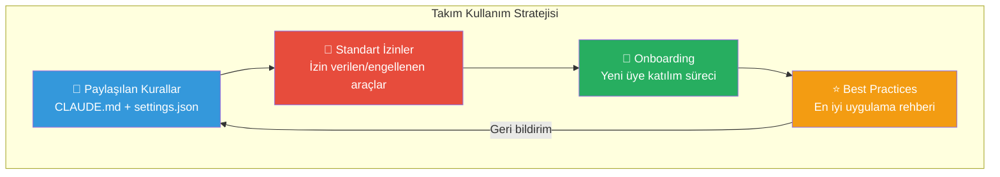
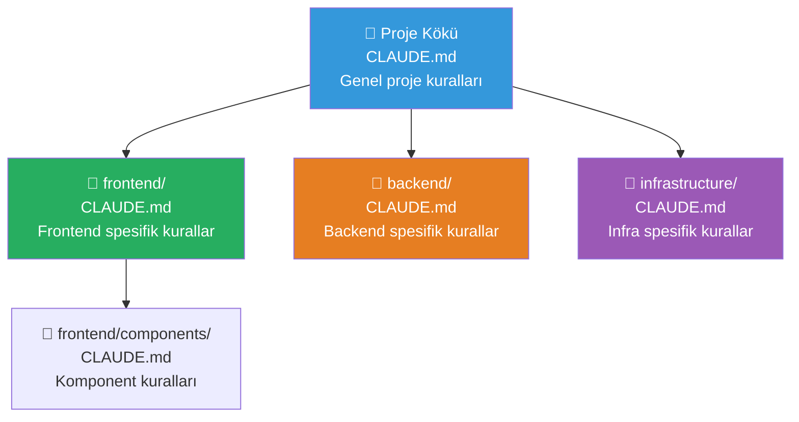
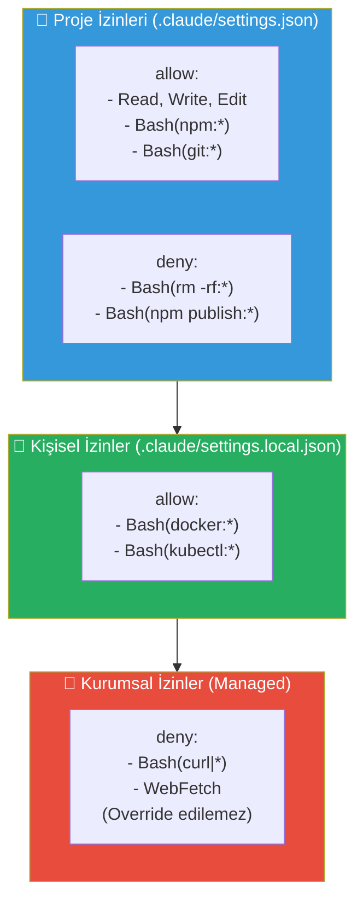
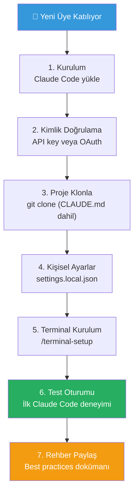
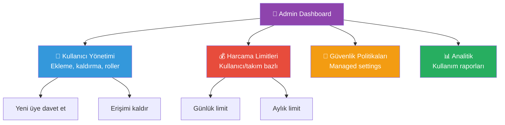

# Takım Kullanımı ve Yönetim

Claude Code'u bir ekip genelinde etkili ve tutarlı şekilde kullanmak, paylaşılan kurallar, standartlaştırılmış izinler ve yapılandırılmış bir onboarding (katılım) süreci gerektirir. Bu rehber, takım liderlerinin ve yöneticilerin Claude Code'u ekip genelinde nasıl yapılandıracağını kapsar.

## Ön Koşullar

| Konu | Bölüm |
|------|-------|
| CLAUDE.md dosyası | [CLAUDE.md Dosyası](../09-bellek-ve-baglam/01-claude-md-dosyasi.md) |
| Ayar dosyaları hiyerarşisi | [Ayar Dosyaları Hiyerarşisi](../17-konfigurasyon/01-ayar-dosyalari-hiyerarsisi.md) |
| İzin sistemi | [İzin Sistemi](../10-izinler-ve-guvenlik/01-izin-sistemi.md) |

---

## Takım Kullanım Stratejisi

Kurumsal ortamda Claude Code'u başarıyla uygulamak için katmanlı bir strateji izlenmelidir:



---

## Paylaşılan CLAUDE.md Kuralları

`CLAUDE.md` dosyası, projenin kök dizininde tutularak tüm ekip üyelerinin Claude Code oturumlarına otomatik yüklenir. Bu dosya, proje standartlarını ve kod kurallarını Claude'a öğretir.

### Ekip CLAUDE.md Şablonu

```markdown
# Proje: E-Ticaret Platformu

## Kod Standartları
- TypeScript strict mode kullanılır
- Tüm fonksiyonlar JSDoc ile belgelenir
- Değişken ve fonksiyon adları İngilizce olmalıdır
- camelCase (değişken/fonksiyon), PascalCase (sınıf/interface)

## Mimari Kurallar
- Katmanlı mimari: Controller → Service → Repository
- Her servis için interface tanımlanır
- Dependency injection kullanılır
- Circular dependency yasaktır

## Test Kuralları
- Her yeni fonksiyon için unit test yazılır
- Test dosyaları `__tests__/` dizininde tutulur
- Minimum %80 code coverage hedeflenir
- Test isimleri "should..." ile başlar

## Git Kuralları
- Conventional Commits formatı kullanılır
- Branch isimleri: feature/, bugfix/, hotfix/
- PR'lar en az 1 onay gerektirir
- main branch'e doğrudan push yapılmaz

## Yasaklar
- console.log kullanılmaz (logger servisi kullanılır)
- any tipi kullanılmaz
- eval() kullanılmaz
- Dosyalara hard-coded credential yazılmaz
```

### CLAUDE.md Hiyerarşisi



---

## Standart İzin Konfigürasyonu

Ekip genelinde tutarlı izinler için `.claude/settings.json` kullanılır ve Git'e commit edilir.

### Katmanlı İzin Stratejisi



### Önerilen Proje İzinleri

```json
{
  "permissions": {
    "allow": [
      "Read",
      "Write",
      "Edit",
      "Grep",
      "Glob",
      "Bash(git:*)",
      "Bash(npm run:*)",
      "Bash(npm test:*)",
      "Bash(npx prettier:*)",
      "Bash(npx eslint:*)",
      "Bash(npx tsc:*)"
    ],
    "deny": [
      "Bash(rm -rf:*)",
      "Bash(sudo:*)",
      "Bash(npm publish:*)",
      "Bash(git push --force:*)",
      "Bash(git push -f:*)"
    ]
  }
}
```

### Rol Bazlı İzin Önerileri

| Rol | Ek İzinler | Ek Kısıtlamalar |
|-----|-----------|-----------------|
| Junior Developer | Temel izinler | `deny: ["Bash(git push:*)"]` |
| Senior Developer | `+ Bash(docker:*)` | Minimal kısıtlama |
| DevOps Engineer | `+ Bash(terraform:*), kubectl` | `deny: ["Bash(terraform destroy:*)"]` |
| Tech Lead | Tam erişim | Sadece güvenlik kısıtlamaları |

---

## Onboarding (Yeni Üye Katılım) Süreci

### Onboarding Kontrol Listesi



### Adım Adım Onboarding

**1. Kurulum:**

```bash
# Node.js 18+ gerekli
npm install -g @anthropic-ai/claude-code
```

**2. Kimlik Doğrulama:**

```bash
# Doğrudan API key (bireysel)
claude auth login

# Kurumsal OAuth
# Admin'in sağladığı talimatları izleyin
```

**3. Proje Klonlama:**

```bash
git clone https://github.com/company/project.git
cd project
# CLAUDE.md ve .claude/settings.json otomatik yüklenir
```

**4. Kişisel Ayarlar:**

```bash
# .claude/settings.local.json oluştur
cat > .claude/settings.local.json << 'EOF'
{
  "permissions": {
    "allow": [
      "Bash(docker compose:*)"
    ]
  },
  "env": {
    "DATABASE_URL": "postgresql://localhost:5432/mydb_dev"
  }
}
EOF

# .gitignore'a ekle
echo ".claude/settings.local.json" >> .gitignore
```

**5. Terminal Kurulum:**

```bash
claude
> /terminal-setup
```

**6. Test Oturumu:**

```bash
claude
> "Projenin yapısını açıkla ve ana modülleri listele"
```

---

## Takım İçi Best Practices (En İyi Uygulamalar)

### İletişim ve Standartlar

| Uygulama | Açıklama |
|----------|----------|
| CLAUDE.md'yi güncel tutun | Yeni kuralları hemen ekleyin |
| PR'larda CLAUDE.md değişikliklerini review edin | Ekip standartlarını koruyun |
| Haftalık Claude Code ipuçları paylaşın | Bilgi paylaşımını teşvik edin |
| Ortak hook kütüphanesi oluşturun | Verimli hook'ları paylaşın |
| Maliyet raporlarını takip edin | Bütçeyi kontrol altında tutun |

### Takım Hook'ları

Ekip genelinde geçerli olan otomatik kalite kontrolleri:

```json
{
  "hooks": {
    "PostToolUse": [
      {
        "matcher": "Edit",
        "hooks": [
          {
            "type": "command",
            "command": "npx prettier --write \"$CLAUDE_FILE_PATH\" && npx eslint --fix \"$CLAUDE_FILE_PATH\""
          }
        ]
      }
    ],
    "PreToolUse": [
      {
        "matcher": "Bash",
        "hooks": [
          {
            "type": "command",
            "command": "echo \"$CLAUDE_TOOL_INPUT\" | python3 -c \"import sys,json; cmd=json.load(sys.stdin).get('command',''); sys.exit(1 if 'push --force' in cmd or 'push -f' in cmd else 0)\""
          }
        ]
      }
    ]
  }
}
```

---

## Takım Yönetim Kontrol Paneli

Kurumsal planlarda admin dashboard (yönetici paneli) üzerinden takım yönetimi yapılabilir:



---

## Sık Yapılan Hatalar

| Hata | Çözüm |
|------|-------|
| CLAUDE.md'yi Git'e eklememek | `git add CLAUDE.md` ile commit edin |
| Her geliştiriciye farklı izin vermek | Proje settings.json'da standart izinler tanımlayın |
| Onboarding sürecini belgelememek | README veya wiki'de adım adım rehber oluşturun |
| settings.local.json'ı commit etmek | `.gitignore`'a eklediğinizden emin olun |
| Maliyet takibi yapmamak | Admin dashboard'dan harcama limitlerini ayarlayın |

---

## Özet

| Konu | Anahtar Eylem |
|------|---------------|
| Paylaşılan kurallar | Proje kökünde CLAUDE.md oluşturun |
| Standart izinler | `.claude/settings.json` ile tanımlayın |
| Onboarding | 7 adımlık kontrol listesi izleyin |
| Hook'lar | Kalite kontrol hook'larını proje ayarlarına ekleyin |
| Yönetim | Admin dashboard ile takımı yönetin |

---

## Sonraki Adım

Takım kullanım verilerini analiz etmek ve verimlilik metriklerini ölçmek için:

→ [Analitik ve Metrikler](./02-analitik-ve-metrikler.md)
