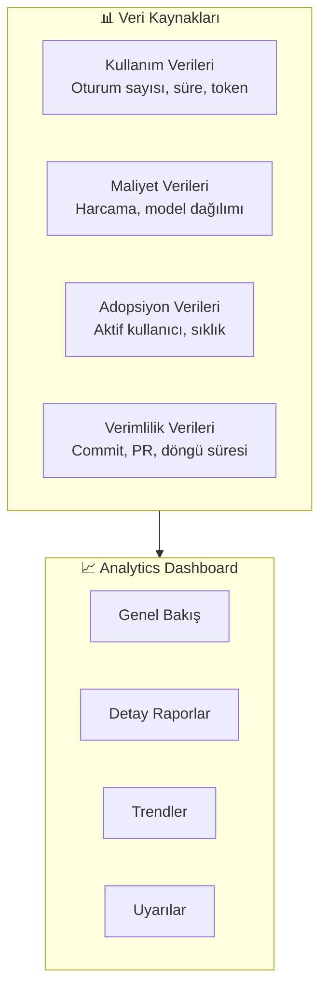
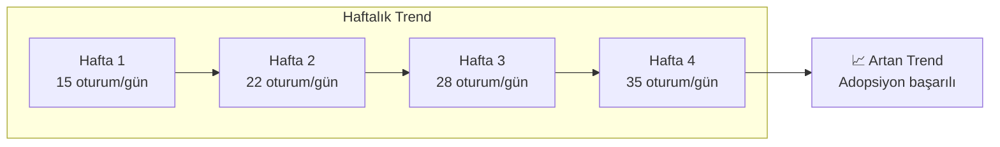
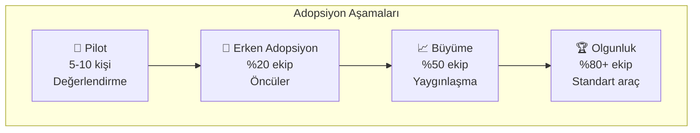
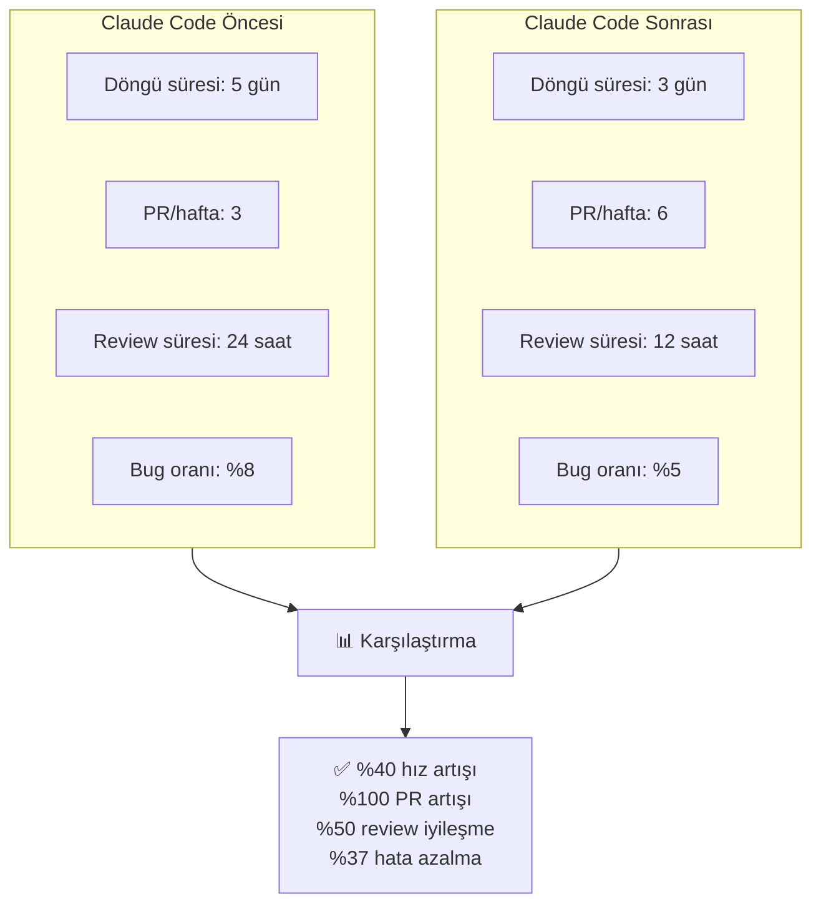
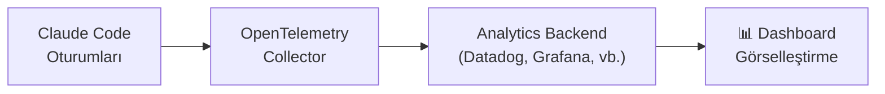
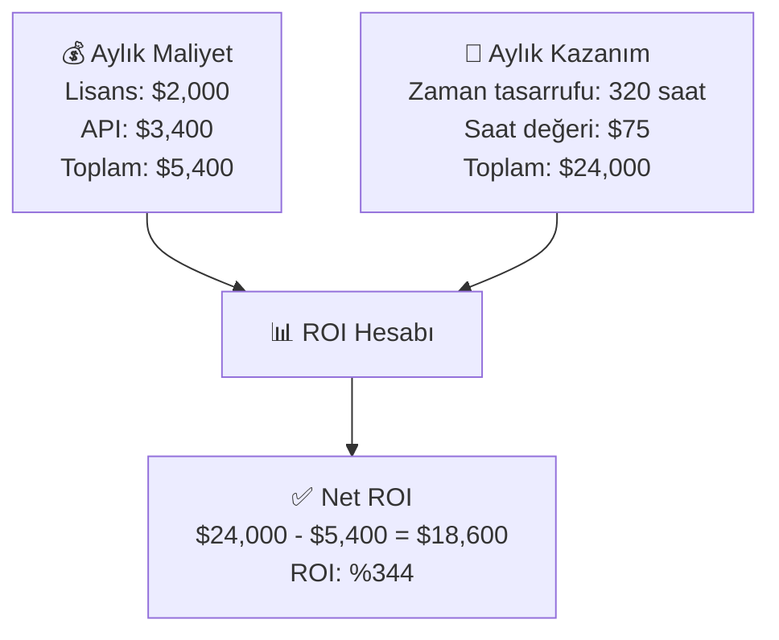
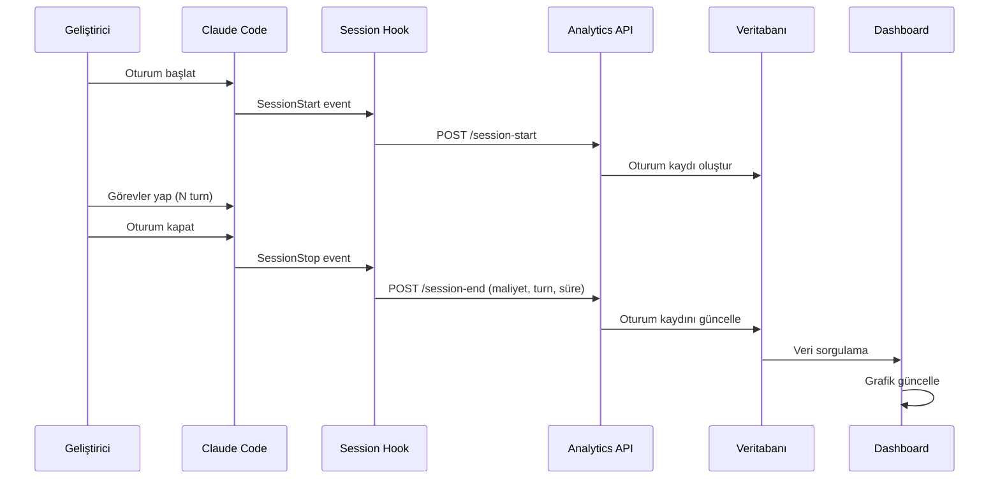

# Analitik ve Metrikler

Claude Code'un kurumsal ortamda etkin kullanılıp kullanılmadığını ölçmek için analytics (analitik) ve metrics (metrikler) takibi kritik öneme sahiptir. Bu rehber, kullanım verilerinin toplanması, adopsiyon (benimseme) takibi ve engineering velocity (mühendislik hızı) ölçümünü kapsar.

## Ön Koşullar

| Konu | Bölüm |
|------|-------|
| Takım kullanımı | [Takım Kullanımı ve Yönetim](./01-takim-kullanimi-ve-yonetim.md) |
| Maliyet yönetimi | [Maliyet Yönetimi](../17-konfigurasyon/05-maliyet-yonetimi.md) |

---

## Analitik Genel Bakış



---

## Kullanım Metrikleri

### Temel Kullanım Metrikleri

| Metrik | Açıklama | Nasıl Ölçülür |
|--------|----------|---------------|
| Aktif kullanıcı sayısı | Belirli dönemde Claude Code kullanan kişi sayısı | DAU/WAU/MAU |
| Oturum sayısı | Toplam başlatılan oturum | Günlük/haftalık/aylık |
| Ortalama oturum süresi | Bir oturumun ortalama süresi | Dakika cinsinden |
| Token tüketimi | Input + output token toplamı | Model bazlı ayrım |
| Araç kullanım dağılımı | Hangi araçlar ne sıklıkla kullanılıyor | Araç bazlı sayaç |
| Turn sayısı | Oturum başına ortalama etkileşim | Mesaj sayısı |

### Kullanım Trendi Analizi



---

## Adopsiyon Takibi

Organizasyondaki Claude Code benimseme oranını ölçmek:



### Adopsiyon Metrikleri

| Metrik | Formül | Hedef |
|--------|--------|-------|
| Adopsiyon oranı | Aktif kullanıcı / Toplam geliştirici × 100 | %80+ |
| Haftalık aktif oran | WAU / Toplam lisanslı × 100 | %60+ |
| Retention (elde tutma) | Bu hafta aktif ∩ Geçen hafta aktif / Geçen hafta aktif × 100 | %90+ |
| Derinlik | Ortalama oturum/gün/kullanıcı | 3+ |
| Genişlik | Claude Code kullanan proje sayısı / Toplam proje | %70+ |

---

## Engineering Velocity (Mühendislik Hızı) Ölçümü

Claude Code'un geliştirme verimliliğine etkisini ölçmek:



### Verimlilik Metrikleri

| Metrik | Ölçüm | Claude Code Öncesi/Sonrası Karşılaştırma |
|--------|-------|------------------------------------------|
| Cycle time (döngü süresi) | Issue'dan deploy'a kadar geçen süre | Azalma beklenir |
| PR throughput | Haftalık merge edilen PR sayısı | Artış beklenir |
| Code review süresi | PR açılmasından onaylanmasına | Azalma beklenir |
| Time to first commit | Bir göreve başlamadan ilk commit'e | Azalma beklenir |
| Bug rate | Üretimdeki hata sayısı / toplam commit | Azalma beklenir |
| Test coverage | Otomatik test kapsamı yüzdesi | Artış beklenir |

---

## Analytics Dashboard Yapılandırma

### Hook ile Metrik Toplama

```json
{
  "hooks": {
    "SessionStart": [
      {
        "hooks": [
          {
            "type": "http",
            "url": "https://analytics.company.com/api/claude-session",
            "timeout": 5000
          }
        ]
      }
    ],
    "SessionStop": [
      {
        "hooks": [
          {
            "type": "http",
            "url": "https://analytics.company.com/api/claude-session-end",
            "timeout": 5000
          }
        ]
      }
    ]
  }
}
```

### OpenTelemetry ile Metrik Gönderme

Detaylı telemetri için OpenTelemetry entegrasyonu kullanılabilir (bir sonraki bölümde detaylı anlatılacak).



---

## Raporlama Şablonları

### Haftalık Kullanım Raporu

| Metrik | Bu Hafta | Geçen Hafta | Değişim |
|--------|----------|-------------|---------|
| Aktif kullanıcı | 42 | 38 | +10.5% |
| Toplam oturum | 312 | 278 | +12.2% |
| Ort. oturum süresi | 18 dk | 15 dk | +20.0% |
| Toplam token | 4.2M | 3.8M | +10.5% |
| Toplam harcama | $847 | $723 | +17.1% |
| Oturum başı maliyet | $2.71 | $2.60 | +4.2% |

### Aylık ROI (Return on Investment) Raporu



---

## Pratik Örnek: Metrik Toplama Pipeline



---

## Sık Yapılan Hatalar

| Hata | Çözüm |
|------|-------|
| Sadece kullanım metriklerine bakmak | Verimlilik metriklerini de (PR, cycle time) takip edin |
| ROI hesaplamamak | Maliyet vs tasarruf karşılaştırması yapın |
| Bireysel performansı ölçmek | Takım metrikleri odaklanın, bireysel sıralamadan kaçının |
| Veriyi toplamama | Hook'lar ile otomatik telemetri kurun |

---

## Özet

| Alan | Anahtar Metrikler |
|------|-------------------|
| Kullanım | Aktif kullanıcı, oturum sayısı, token tüketimi |
| Adopsiyon | Adopsiyon oranı, retention, derinlik |
| Verimlilik | Cycle time, PR throughput, bug rate |
| Maliyet | Toplam harcama, oturum başı maliyet, ROI |

---

## Sonraki Adım

OpenTelemetry entegrasyonu ile detaylı izleme ve performans monitoring'i kurmak için:

→ [İzleme ve OpenTelemetry](./03-izleme-ve-opentelemetry.md)
