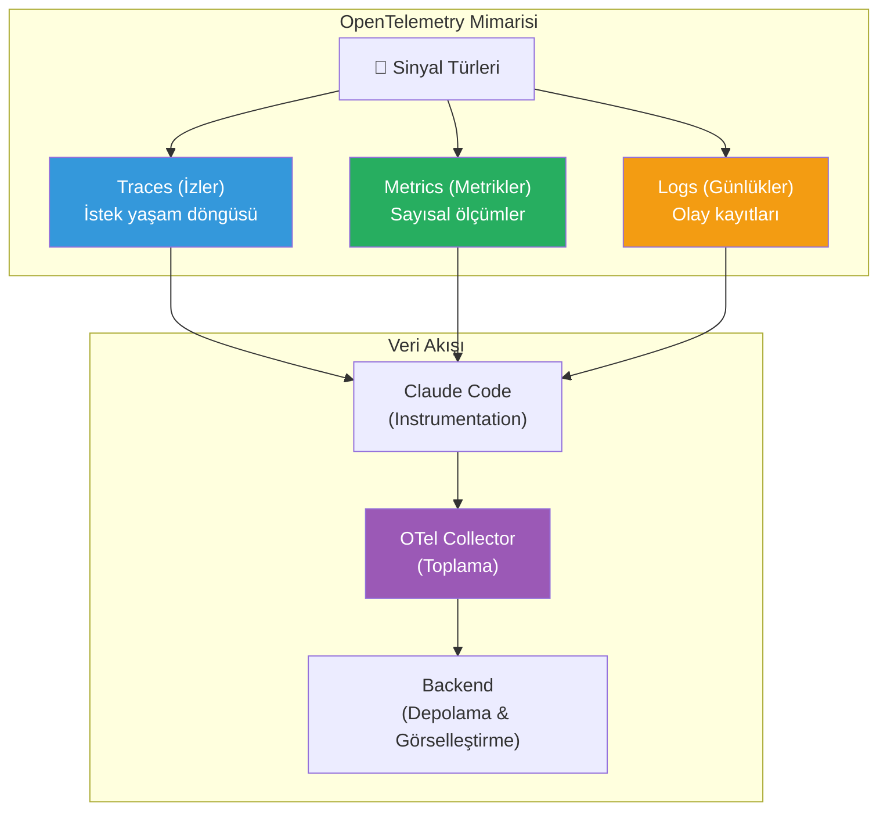
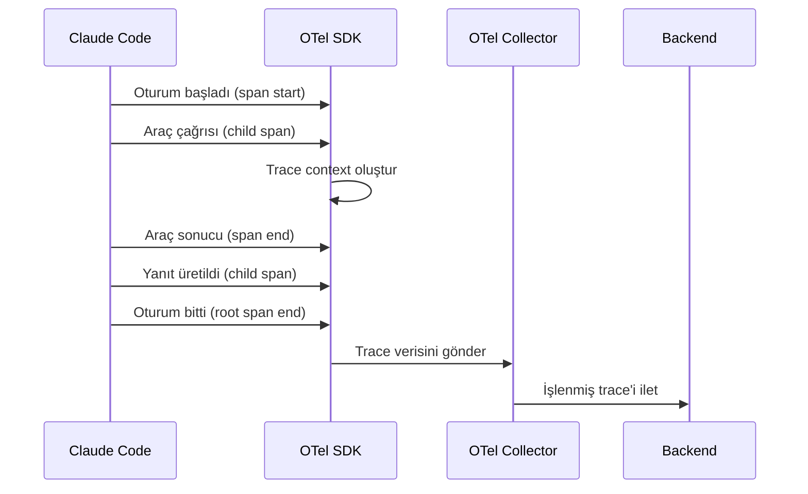
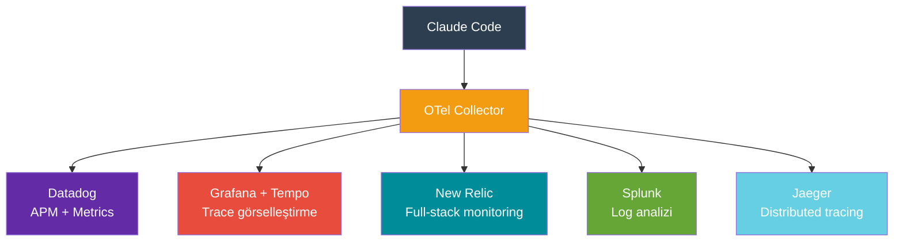

# İzleme ve OpenTelemetry

Claude Code, OpenTelemetry (OTel) standardını destekleyerek kurumsal monitoring (izleme) altyapılarına entegre edilebilir. Bu rehber, telemetri konfigürasyonu, trace (iz) toplama, loglama ve performans izleme kurulumunu kapsar.

## Ön Koşullar

| Konu | Bölüm |
|------|-------|
| Analitik ve metrikler | [Analitik ve Metrikler](./02-analitik-ve-metrikler.md) |
| Ortam değişkenleri | [Ortam Değişkenleri](../17-konfigurasyon/03-ortam-degiskenleri.md) |

---

## OpenTelemetry Nedir?

OpenTelemetry (OTel), dağıtık sistemlerden telemetri verisi (trace, metric, log) toplamak için vendor-agnostic (satıcıdan bağımsız) açık kaynak bir standarttır.



---

## OpenTelemetry Konfigürasyonu

### Temel Kurulum

Claude Code'da OpenTelemetry desteğini etkinleştirmek için ortam değişkenleri kullanılır:

```bash
# OpenTelemetry'i etkinleştir
export OTEL_EXPORTER_OTLP_ENDPOINT="http://localhost:4318"
export OTEL_EXPORTER_OTLP_PROTOCOL="http/protobuf"

# Servis adı tanımla
export OTEL_SERVICE_NAME="claude-code"

# Kaynak bilgileri
export OTEL_RESOURCE_ATTRIBUTES="team=backend,environment=production"

# Claude Code başlat
claude
```

### OTel Collector Konfigürasyonu

```yaml
# otel-collector-config.yaml
receivers:
  otlp:
    protocols:
      grpc:
        endpoint: "0.0.0.0:4317"
      http:
        endpoint: "0.0.0.0:4318"

processors:
  batch:
    timeout: 5s
    send_batch_size: 1024

  attributes:
    actions:
      - key: "team"
        action: insert
        value: "engineering"

exporters:
  otlphttp:
    endpoint: "https://otel.company.com"
    headers:
      Authorization: "Bearer ${OTEL_AUTH_TOKEN}"

  logging:
    loglevel: info

service:
  pipelines:
    traces:
      receivers: [otlp]
      processors: [batch, attributes]
      exporters: [otlphttp, logging]
    metrics:
      receivers: [otlp]
      processors: [batch]
      exporters: [otlphttp]
    logs:
      receivers: [otlp]
      processors: [batch]
      exporters: [otlphttp, logging]
```

---

## Trace (İz) Toplama

Claude Code oturumları trace'ler olarak kaydedilir. Her trace, oturumdaki etkileşimlerin ve araç kullanımlarının tam bir kaydını içerir.



### Trace Yapısı

```
claude-session (root span)
├── model-request (Sonnet API çağrısı)
│   ├── input-tokens: 12,430
│   ├── output-tokens: 3,210
│   └── duration: 4.2s
├── tool-use: Read (dosya okuma)
│   ├── file: src/auth/login.ts
│   └── duration: 0.1s
├── tool-use: Edit (dosya düzenleme)
│   ├── file: src/auth/login.ts
│   └── duration: 0.2s
├── hook: PostToolUse (prettier)
│   └── duration: 0.8s
└── model-request (ikinci API çağrısı)
    ├── input-tokens: 18,920
    ├── output-tokens: 1,540
    └── duration: 2.8s
```

---

## Metrik Türleri

### Otomatik Toplanan Metrikler

| Metrik | Tip | Açıklama |
|--------|-----|----------|
| `claude.session.duration` | Histogram | Oturum süresi (saniye) |
| `claude.session.turns` | Counter | Toplam turn sayısı |
| `claude.tokens.input` | Counter | Toplam input token |
| `claude.tokens.output` | Counter | Toplam output token |
| `claude.tokens.cache_read` | Counter | Cache'den okunan token |
| `claude.tool.invocations` | Counter | Araç çağrı sayısı |
| `claude.tool.duration` | Histogram | Araç çalışma süresi |
| `claude.cost.estimated` | Counter | Tahmini maliyet ($) |
| `claude.errors` | Counter | Hata sayısı |

### Custom Metrikler (Hook ile)

```json
{
  "hooks": {
    "PostToolUse": [
      {
        "matcher": "Bash",
        "hooks": [
          {
            "type": "command",
            "command": "curl -s -X POST http://localhost:9090/api/v1/metrics -d '{\"metric\": \"claude.bash.execution\", \"value\": 1, \"labels\": {\"tool\": \"bash\"}}'"
          }
        ]
      }
    ]
  }
}
```

---

## Backend Entegrasyonları



### Datadog Konfigürasyonu

```yaml
# otel-collector-config.yaml (Datadog exporter)
exporters:
  datadog:
    api:
      key: "${DD_API_KEY}"
      site: "datadoghq.com"
    traces:
      span_name_as_resource_name: true

service:
  pipelines:
    traces:
      exporters: [datadog]
    metrics:
      exporters: [datadog]
```

### Grafana + Tempo

```yaml
exporters:
  otlphttp:
    endpoint: "http://tempo:4318"

  prometheusremotewrite:
    endpoint: "http://prometheus:9090/api/v1/write"

service:
  pipelines:
    traces:
      exporters: [otlphttp]
    metrics:
      exporters: [prometheusremotewrite]
```

---

## Loglama Konfigürasyonu

Claude Code, yapılandırılmış loglar üretir:

```bash
# Log seviyesini ayarla
export CLAUDE_CODE_LOG_LEVEL="info"

# Log dosyası konumu
# Varsayılan: ~/.claude/logs/

# Logları inceleme
ls ~/.claude/logs/
```

### Log Seviyeleri

| Seviye | Açıklama | Kullanım |
|--------|----------|----------|
| `error` | Yalnızca hatalar | Üretim |
| `warn` | Uyarılar ve hatalar | Üretim |
| `info` | Genel bilgi | Geliştirme/üretim |
| `debug` | Detaylı debug bilgisi | Geliştirme |

---

## Pratik Örnek: Docker Compose ile Tam Monitoring Stack

```yaml
# docker-compose.monitoring.yaml
version: "3.9"

services:
  otel-collector:
    image: otel/opentelemetry-collector-contrib:latest
    ports:
      - "4317:4317"   # gRPC
      - "4318:4318"   # HTTP
    volumes:
      - ./otel-collector-config.yaml:/etc/otel/config.yaml
    command: ["--config=/etc/otel/config.yaml"]

  jaeger:
    image: jaegertracing/all-in-one:latest
    ports:
      - "16686:16686"  # Jaeger UI
      - "14268:14268"  # Trace collector

  prometheus:
    image: prom/prometheus:latest
    ports:
      - "9090:9090"
    volumes:
      - ./prometheus.yaml:/etc/prometheus/prometheus.yml

  grafana:
    image: grafana/grafana:latest
    ports:
      - "3000:3000"
    environment:
      - GF_SECURITY_ADMIN_PASSWORD=admin
```

Kullanım:

```bash
# Monitoring stack başlat
docker compose -f docker-compose.monitoring.yaml up -d

# Claude Code'u OTel ile başlat
export OTEL_EXPORTER_OTLP_ENDPOINT="http://localhost:4318"
export OTEL_SERVICE_NAME="claude-code"
claude

# Jaeger UI: http://localhost:16686
# Grafana: http://localhost:3000
```

---

## Sık Yapılan Hatalar

| Hata | Çözüm |
|------|-------|
| OTel endpoint'i ayarlamamak | `OTEL_EXPORTER_OTLP_ENDPOINT` değişkenini tanımlayın |
| Collector olmadan veri göndermek | OTel Collector'ı başlattığınızdan emin olun |
| Çok fazla trace toplamak | Sampling (örnekleme) oranını ayarlayın |
| Debug loglarını üretimde açmak | Üretimde `info` veya `warn` seviyesi yeterli |

---

## Özet

| Alan | Araç/Yöntem |
|------|------------|
| Trace toplama | OpenTelemetry SDK + Collector |
| Metrikler | OTel Metrics + Prometheus |
| Loglar | Yapılandırılmış loglar + Log backend |
| Görselleştirme | Grafana, Jaeger, Datadog |
| Konfigürasyon | Ortam değişkenleri + collector config |

---

## Sonraki Adım

Kurumsal ağ ortamında Claude Code'u proxy ve sertifika ayarlarıyla yapılandırmak için:

→ [Ağ ve Proxy Konfigürasyonu](./04-ag-ve-proxy-konfigurasyonu.md)
