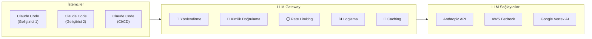
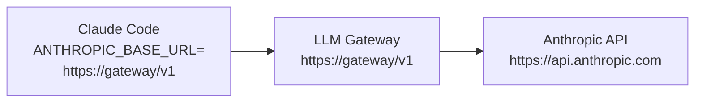
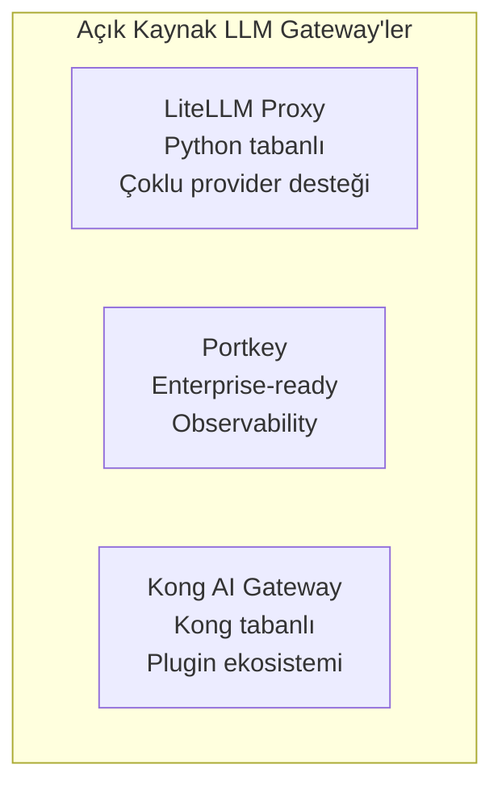
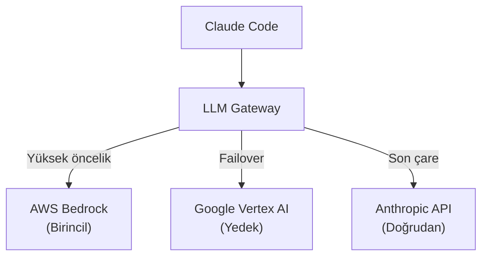
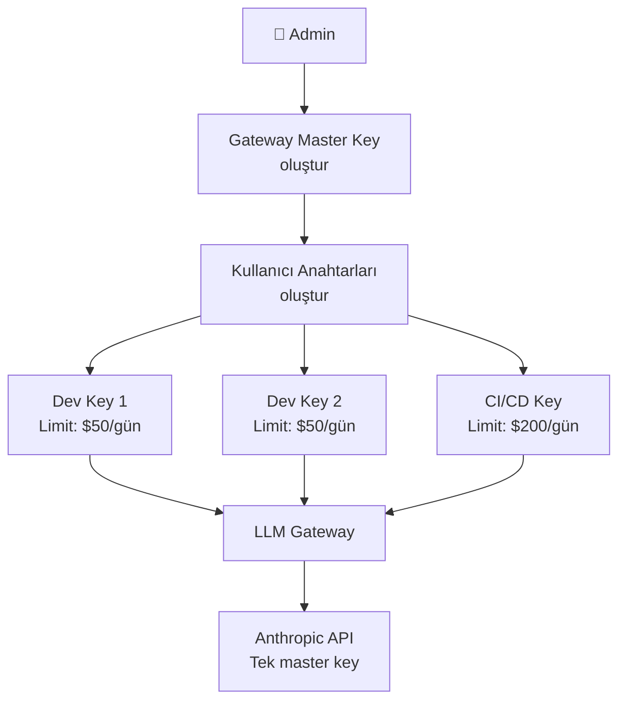
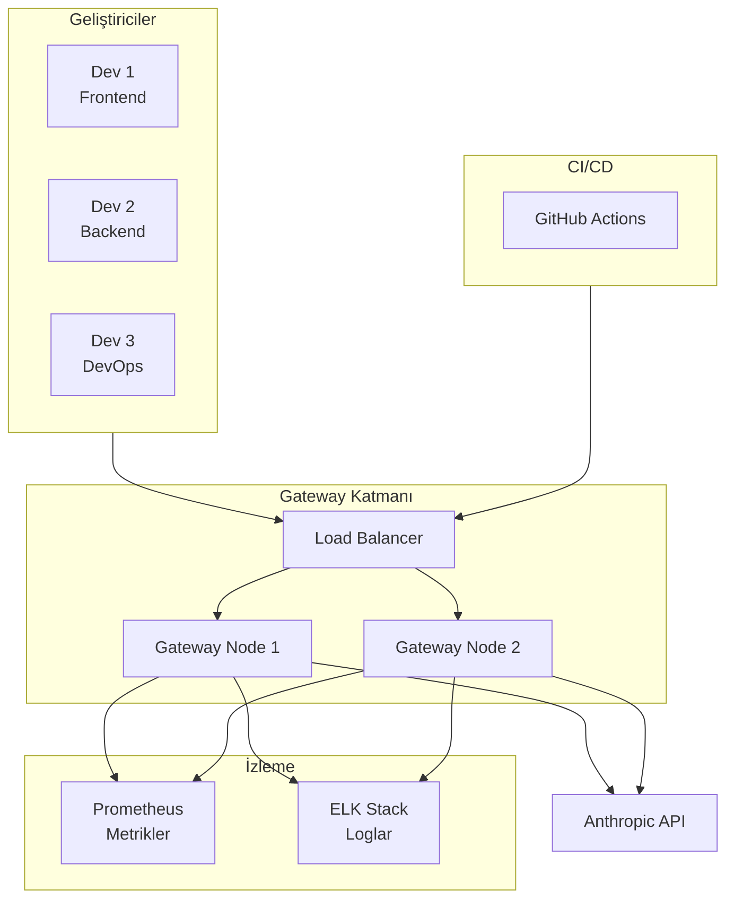

# LLM Gateway

LLM Gateway (büyük dil modeli geçidi), Claude Code ile Anthropic API arasında bir ara katman olarak çalışarak yönlendirme, güvenlik, maliyet kontrolü ve izleme gibi kurumsal ihtiyaçları karşılar. Bu rehber, gateway çözümlerini, endpoint yapılandırmasını ve provider-specific (sağlayıcıya özel) kurulumları kapsar.

## Ön Koşullar

| Konu | Bölüm |
|------|-------|
| Ağ ve proxy konfigürasyonu | [Ağ ve Proxy Konfigürasyonu](./04-ag-ve-proxy-konfigurasyonu.md) |
| Ortam değişkenleri | [Ortam Değişkenleri](../17-konfigurasyon/03-ortam-degiskenleri.md) |

---

## LLM Gateway Nedir?

LLM Gateway, tüm LLM API çağrılarını merkezi bir noktadan geçirerek kontrol, izleme ve güvenlik sağlayan bir reverse proxy'dir (ters vekil sunucu).



### Gateway Avantajları

| Avantaj | Açıklama |
|---------|----------|
| Merkezi API key yönetimi | Bireysel API key dağıtmak yerine gateway üzerinden |
| Rate limiting | Kullanıcı/takım bazlı hız sınırı |
| Maliyet kontrolü | Harcama limitleri ve raporlama |
| Güvenlik | mTLS, IP whitelist, istek filtreleme |
| İzleme | Tüm isteklerin merkezi loglanması |
| Failover | Birden fazla provider arasında otomatik geçiş |
| Caching | Tekrarlayan isteklerin önbelleklenmesi |

---

## Claude Code Gateway Konfigürasyonu

Claude Code'u bir LLM Gateway üzerinden kullanmak için `ANTHROPIC_BASE_URL` değişkeni ayarlanır:

```bash
# Gateway endpoint'ini ayarla
export ANTHROPIC_BASE_URL="https://llm-gateway.company.com/v1"

# API key (gateway'in beklediği format)
export ANTHROPIC_API_KEY="gateway-key-xxxx"

# Claude Code başlat
claude
```



---

## Popüler LLM Gateway Çözümleri

### Açık Kaynak Çözümler



### LiteLLM Proxy Kurulumu

```bash
# LiteLLM proxy kurulumu
pip install litellm[proxy]

# Konfigürasyon dosyası
cat > litellm_config.yaml << 'EOF'
model_list:
  - model_name: "claude-sonnet-4"
    litellm_params:
      model: "claude-sonnet-4-20250514"
      api_key: "YOUR_API_KEY_HERE"

  - model_name: "claude-opus-4"
    litellm_params:
      model: "claude-opus-4-20250514"
      api_key: "YOUR_API_KEY_HERE"

general_settings:
  master_key: "YOUR_GATEWAY_KEY_HERE"

litellm_settings:
  max_budget: 1000
  budget_duration: "30d"
EOF

# Proxy başlat
litellm --config litellm_config.yaml --port 4000
```

Claude Code'da kullanım:

```bash
export ANTHROPIC_BASE_URL="http://localhost:4000/v1"
export ANTHROPIC_API_KEY="YOUR_GATEWAY_KEY_HERE"
claude
```

---

## Cloud Provider Entegrasyonları

### AWS Bedrock

AWS Bedrock zaten bir tür gateway işlevi görür ve ek gateway gerekmeyebilir:

```bash
export CLAUDE_CODE_USE_BEDROCK=true
export AWS_REGION="us-east-1"
export ANTHROPIC_MODEL="anthropic.claude-sonnet-4-20250514-v1:0"
```

### Google Vertex AI

```bash
export CLAUDE_CODE_USE_VERTEX=true
export CLOUD_ML_REGION="us-east5"
export ANTHROPIC_VERTEX_PROJECT_ID="my-project"
export ANTHROPIC_MODEL="claude-sonnet-4@20250514"
```

### Cloud Provider + Gateway Kombinasyonu



---

## Gateway Güvenlik Konfigürasyonu

### API Key Yönetimi



### Rate Limiting Konfigürasyonu

```yaml
# Gateway rate limit konfigürasyonu
rate_limits:
  - key: "user"
    max_requests: 100
    time_window: "1m"

  - key: "team"
    max_requests: 500
    time_window: "1m"

  - key: "organization"
    max_requests: 2000
    time_window: "1m"
    max_tokens: 1000000
```

---

## Pratik Örnek: Kurumsal Gateway Mimarisi



---

## Sorun Giderme

| Sorun | Olası Neden | Çözüm |
|-------|-------------|-------|
| `Connection refused` | Gateway çalışmıyor | Gateway servisini başlatın |
| `401 Unauthorized` | Yanlış gateway key | API key'i kontrol edin |
| `429 Too Many Requests` | Rate limit aşıldı | Limit ayarlarını kontrol edin veya bekleyin |
| `502 Bad Gateway` | Gateway → API bağlantı sorunu | Gateway'in API'ye erişimini kontrol edin |
| Yavaş yanıtlar | Gateway overhead | Gateway performans metriklerini inceleyin |

---

## Sık Yapılan Hatalar

| Hata | Çözüm |
|------|-------|
| Gateway olmadan her geliştiriciye API key vermek | Merkezi gateway kullanın |
| Rate limit koymamak | Kullanıcı ve takım bazlı limitler tanımlayın |
| Failover yapılandırmamak | Birden fazla provider tanımlayın |
| Gateway loglarını izlememek | Monitoring sistemi kurun |

---

## Özet

| Konu | Anahtar Bilgi |
|------|---------------|
| Konfigürasyon | `ANTHROPIC_BASE_URL` ile gateway endpoint'i |
| Açık kaynak | LiteLLM, Portkey, Kong AI Gateway |
| Cloud | Bedrock, Vertex AI (yerleşik gateway) |
| Güvenlik | Merkezi key yönetimi, rate limiting |
| İzleme | Gateway logları ve metrikleri |

---

## Sonraki Adım

Cihaz yönetimi altyapısı olmadan merkezi konfigürasyon uygulamak için:

→ [Sunucu Tabanlı Ayarlar](./06-sunucu-tabanli-ayarlar.md)
