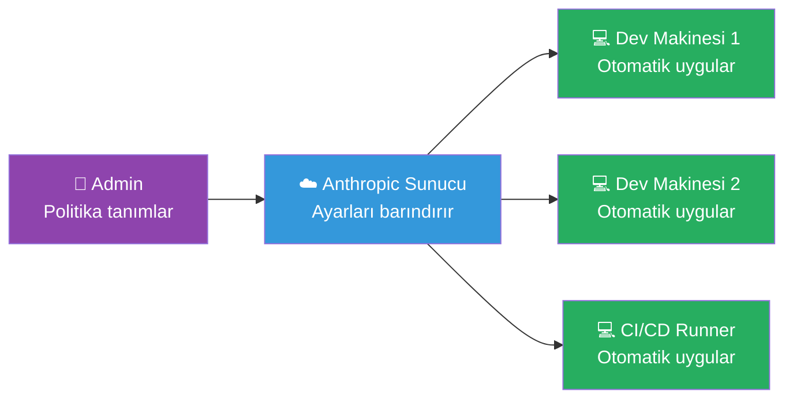
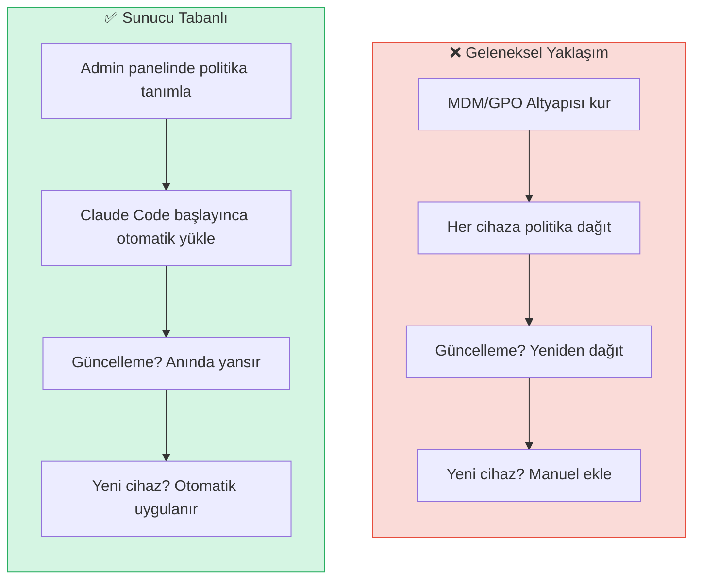
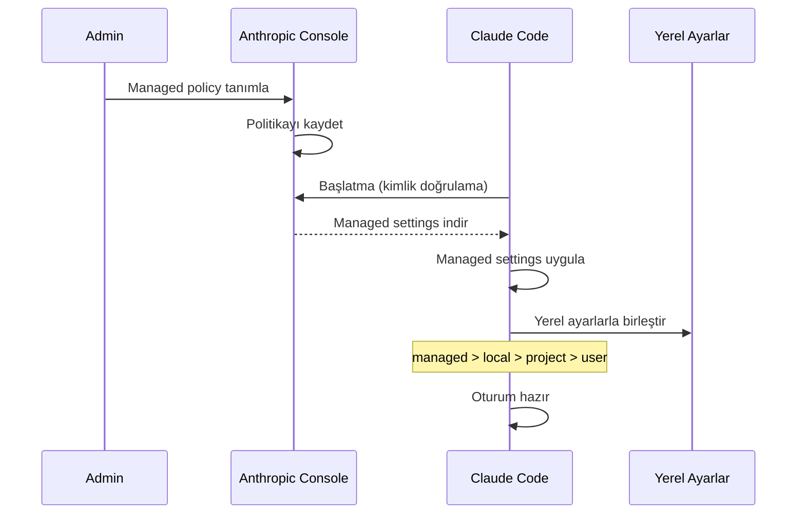
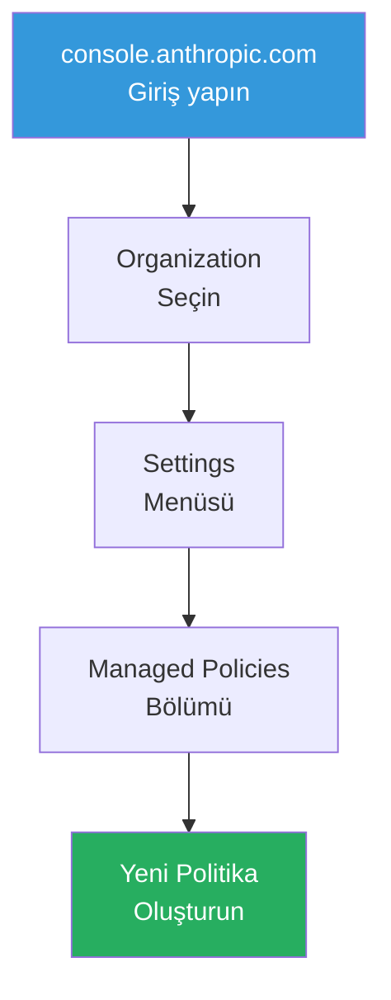

# Sunucu Tabanlı Ayarlar

Server-managed settings (sunucu tarafından yönetilen ayarlar), kurumsal yöneticilerin cihaz yönetimi altyapısı (MDM) gerekmeden Claude Code politikalarını merkezi olarak yapılandırmasını sağlayan bir özelliktir. Bu özellik şu anda public beta (genel beta) aşamasındadır.

## Ön Koşullar

| Konu | Bölüm |
|------|-------|
| Ayar dosyaları hiyerarşisi | [Ayar Dosyaları Hiyerarşisi](../17-konfigurasyon/01-ayar-dosyalari-hiyerarsisi.md) |
| Takım kullanımı | [Takım Kullanımı ve Yönetim](./01-takim-kullanimi-ve-yonetim.md) |

---

## Sunucu Tabanlı Ayarlar Nedir?

Geleneksel kurumsal yazılım yapılandırması, her cihaza ayrı ayrı politika dağıtmayı gerektirir (MDM, GPO vb.). Sunucu tabanlı ayarlar bu ihtiyacı ortadan kaldırarak politikaları sunucu tarafında tanımlar ve Claude Code başlatıldığında otomatik olarak uygular.



### Geleneksel vs Sunucu Tabanlı Yaklaşım



---

## Çalışma Prensibi



### Öncelik Hiyerarşisi

Managed settings, tüm diğer ayar seviyelerini geçersiz kılar:

```
managed (sunucu) > local > project > user
```

| Seviye | Override Edebilir mi? | Managed Tarafından Override Edilir mi? |
|--------|----------------------|----------------------------------------|
| User | Evet | ✅ Evet |
| Project | Evet | ✅ Evet |
| Local | Evet | ✅ Evet |
| Managed | ❌ Hayır | — |

---

## Yapılandırılabilir Politikalar

### İzin Politikaları

Managed settings ile zorunlu kılınabilecek izin kuralları:

```json
{
  "permissions": {
    "deny": [
      "Bash(rm -rf /)",
      "Bash(sudo *)",
      "Bash(curl | *)",
      "Bash(wget *)",
      "WebFetch"
    ]
  }
}
```

Bu `deny` kuralları kullanıcılar tarafından kaldırılamaz.

### Model Kısıtlamaları

Belirli modellerin kullanılmasını zorunlu kılma veya engelleme:

```json
{
  "model": "claude-sonnet-4-20250514",
  "allowedModels": [
    "claude-sonnet-4-20250514",
    "claude-haiku-3-5-20241022"
  ]
}
```

### Hook Zorunlulukları

Kurumsal güvenlik hook'larının her zaman çalışmasını sağlama:

```json
{
  "hooks": {
    "PreToolUse": [
      {
        "matcher": "Bash",
        "hooks": [
          {
            "type": "http",
            "url": "https://security.company.com/api/claude-command-check",
            "timeout": 5000
          }
        ]
      }
    ],
    "SessionStart": [
      {
        "hooks": [
          {
            "type": "http",
            "url": "https://audit.company.com/api/session-start",
            "timeout": 3000
          }
        ]
      }
    ]
  }
}
```

---

## Kurulum ve Yapılandırma

### Adım 1: Enterprise Plan

Sunucu tabanlı ayarlar Enterprise plan gerektirir. Anthropic sales ekibiyle iletişime geçin.

### Adım 2: Admin Console Erişimi



### Adım 3: Politika Tanımlama

Admin console üzerinden JSON formatında politika tanımlayın:

```json
{
  "name": "Engineering Team Policy",
  "description": "Tüm mühendislik ekibi için güvenlik politikası",
  "settings": {
    "permissions": {
      "deny": [
        "Bash(rm -rf:*)",
        "Bash(sudo:*)",
        "Bash(curl | sh:*)",
        "Bash(eval:*)"
      ]
    },
    "hooks": {
      "SessionStart": [
        {
          "hooks": [
            {
              "type": "http",
              "url": "https://audit.company.com/api/claude-session",
              "timeout": 3000
            }
          ]
        }
      ]
    }
  },
  "targets": {
    "teams": ["engineering", "devops"],
    "users": []
  }
}
```

### Adım 4: Doğrulama

Geliştiriciler Claude Code'u başlattığında managed settings otomatik uygulanır:

```bash
# Claude Code başlat
claude

# Managed settings uygulandığını doğrula
# Engellenen araçlar denemede bloklanır
```

---

## Kullanım Senaryoları

### Senaryo 1: Güvenlik Standartları

Tehlikeli komutların tüm ekip genelinde engellenmesi:

```json
{
  "permissions": {
    "deny": [
      "Bash(rm -rf /)",
      "Bash(sudo *)",
      "Bash(chmod 777 *)",
      "Bash(curl | sh)",
      "Bash(eval *)"
    ]
  }
}
```

### Senaryo 2: Maliyet Kontrolü

Pahalı model kullanımını kısıtlama:

```json
{
  "allowedModels": [
    "claude-sonnet-4-20250514",
    "claude-haiku-3-5-20241022"
  ]
}
```

### Senaryo 3: Denetim ve Uyumluluk

Tüm oturumların denetim sistemine bildirilmesi:

```json
{
  "hooks": {
    "SessionStart": [
      {
        "hooks": [
          {
            "type": "http",
            "url": "https://compliance.company.com/api/audit/session-start"
          }
        ]
      }
    ],
    "SessionStop": [
      {
        "hooks": [
          {
            "type": "http",
            "url": "https://compliance.company.com/api/audit/session-end"
          }
        ]
      }
    ]
  }
}
```

---

## Sık Yapılan Hatalar

| Hata | Çözüm |
|------|-------|
| Managed settings'i yerel dosya ile karıştırmak | Managed settings sunucudan gelir, dosya değildir |
| Çok kısıtlayıcı politika tanımlamak | Geliştiricilerin verimli çalışmasına izin verin |
| Hook timeout'u çok kısa ayarlamak | Ağ gecikmesini hesaba katarak timeout belirleyin |
| Politika değişikliklerini test etmemek | Küçük bir pilot grupta test edin |

---

## Özet

| Konu | Açıklama |
|------|----------|
| Ne yapar | Merkezi politika uygulama, MDM gerektirmez |
| Öncelik | En yüksek (managed > tüm diğerleri) |
| Yapılandırma | Admin console üzerinden JSON |
| Kullanım | Güvenlik kuralları, model kısıtlamaları, denetim hook'ları |
| Durum | Public beta |

---

## Sonraki Adım

Tutarlı ve güvenli geliştirme ortamları için container tabanlı çözümleri inceleyelim:

→ [DevContainer](./07-devcontainer.md)
