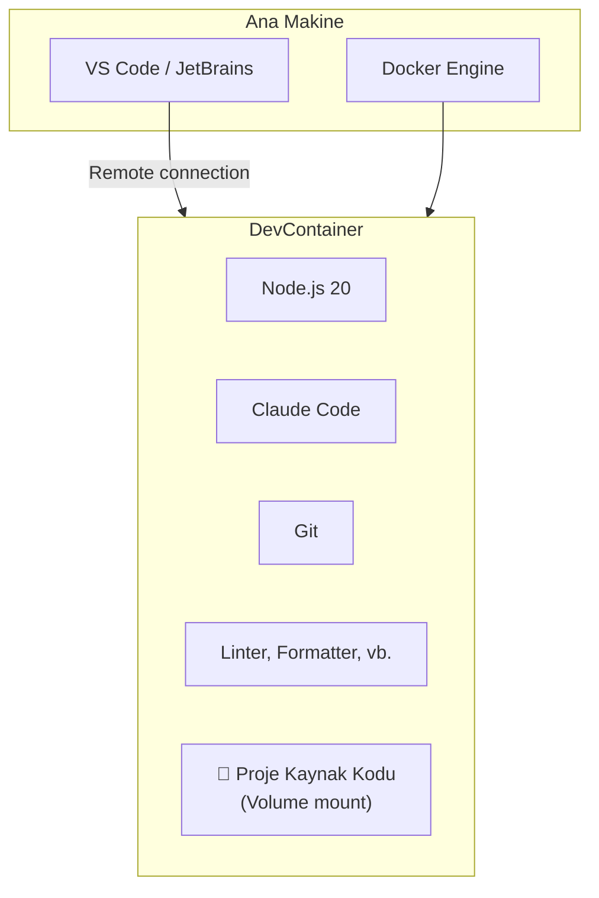
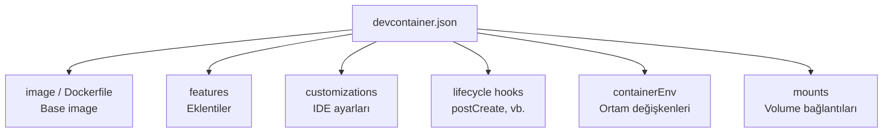
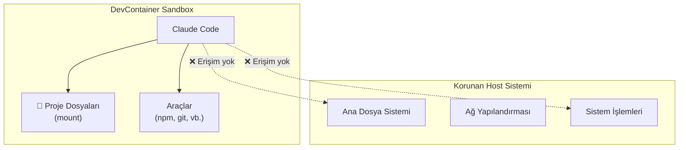
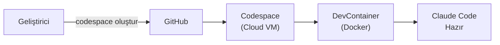
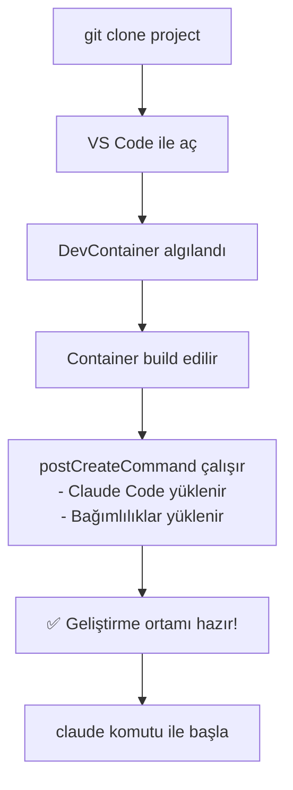

# DevContainer ile Geliştirme

Development containers (geliştirme container'ları), Claude Code için tutarlı, güvenli ve tekrarlanabilir geliştirme ortamları sağlar. `devcontainer.json` konfigürasyonu ile tüm ekip üyeleri aynı ortamda çalışır ve "benim makinemde çalışıyor" sorunu ortadan kalkar.

## Ön Koşullar

| Konu | Bölüm |
|------|-------|
| Docker temel bilgisi | Harici kaynak |
| Claude Code kurulumu | [Kurulum ve Gereksinimler](../06-claude-code-tanitim/03-kurulum-ve-gereksinimler.md) |
| Güvenlik | [Güvenlik En İyi Uygulamalar](../10-izinler-ve-guvenlik/05-guvenlik-en-iyi-uygulamalar.md) |

---

## DevContainer Nedir?

DevContainer, bir projenin geliştirme ortamını Docker container'ı olarak tanımlayan açık bir spesifikasyondur. VS Code, JetBrains ve GitHub Codespaces tarafından desteklenir.



### DevContainer Avantajları

| Avantaj | Açıklama |
|---------|----------|
| Tutarlılık | Tüm geliştiriciler aynı ortamda çalışır |
| İzolasyon | Host sistemden izole, güvenli çalışma |
| Tekrarlanabilirlik | `devcontainer.json` ile ortam her zaman yeniden oluşturulabilir |
| Hızlı onboarding | Yeni geliştirici dakikalar içinde hazır |
| Sandboxing | Claude Code'un erişimi sınırlandırılabilir |
| CI/CD uyumu | Aynı container CI/CD'de de kullanılabilir |

---

## Temel devcontainer.json Yapısı



---

## Claude Code için DevContainer Konfigürasyonu

### Minimal Kurulum

```json
{
  "name": "Claude Code Development",
  "image": "mcr.microsoft.com/devcontainers/javascript-node:20",

  "features": {
    "ghcr.io/devcontainers/features/git:1": {},
    "ghcr.io/devcontainers/features/github-cli:1": {}
  },

  "postCreateCommand": "npm install -g @anthropic-ai/claude-code && npm install",

  "containerEnv": {
    "CLAUDE_BASH_MAINTAIN_PROJECT_WORKING_DIR": "true"
  },

  "forwardPorts": [3000, 5173, 8080],

  "customizations": {
    "vscode": {
      "extensions": [
        "esbenp.prettier-vscode",
        "dbaeumer.vscode-eslint"
      ]
    }
  }
}
```

### Tam Kurumsal Kurulum

```json
{
  "name": "Enterprise Claude Code Environment",
  "build": {
    "dockerfile": "Dockerfile",
    "context": "..",
    "args": {
      "NODE_VERSION": "20",
      "CLAUDE_CODE_VERSION": "latest"
    }
  },

  "features": {
    "ghcr.io/devcontainers/features/git:1": {
      "version": "latest"
    },
    "ghcr.io/devcontainers/features/github-cli:1": {},
    "ghcr.io/devcontainers/features/docker-in-docker:2": {
      "version": "latest"
    }
  },

  "containerEnv": {
    "CLAUDE_BASH_MAINTAIN_PROJECT_WORKING_DIR": "true",
    "CLAUDE_CODE_DISABLE_NONESSENTIAL_TRAFFIC": "true",
    "NODE_EXTRA_CA_CERTS": "/usr/local/share/ca-certificates/corporate-ca.crt"
  },

  "mounts": [
    "source=${localEnv:HOME}/.claude,target=/home/node/.claude,type=bind,consistency=cached",
    "source=claude-code-cache,target=/home/node/.cache,type=volume"
  ],

  "postCreateCommand": "bash .devcontainer/setup.sh",
  "postStartCommand": "echo 'DevContainer hazır!'",

  "forwardPorts": [3000, 5173, 8080, 5432],

  "customizations": {
    "vscode": {
      "settings": {
        "terminal.integrated.defaultProfile.linux": "bash",
        "editor.formatOnSave": true
      },
      "extensions": [
        "esbenp.prettier-vscode",
        "dbaeumer.vscode-eslint",
        "ms-azuretools.vscode-docker"
      ]
    }
  },

  "remoteUser": "node"
}
```

### Dockerfile

```dockerfile
# .devcontainer/Dockerfile
ARG NODE_VERSION=20
FROM mcr.microsoft.com/devcontainers/javascript-node:${NODE_VERSION}

ARG CLAUDE_CODE_VERSION=latest

# Kurumsal CA sertifikası (opsiyonel)
COPY corporate-ca.crt /usr/local/share/ca-certificates/
RUN update-ca-certificates

# Claude Code kurulumu
RUN npm install -g @anthropic-ai/claude-code@${CLAUDE_CODE_VERSION}

# Ek araçlar
RUN apt-get update && apt-get install -y \
    python3 \
    python3-pip \
    jq \
    && rm -rf /var/lib/apt/lists/*

# Proje bağımlılıkları için çalışma dizini
WORKDIR /workspace
```

### Setup Script

```bash
#!/bin/bash
# .devcontainer/setup.sh

set -e

echo "🔧 DevContainer kurulumu başlatılıyor..."

# Proje bağımlılıklarını yükle
if [ -f "package.json" ]; then
    echo "📦 npm bağımlılıkları yükleniyor..."
    npm install
fi

# Claude Code ayarlarını doğrula
if [ -f ".claude/settings.json" ]; then
    echo "✅ Claude Code proje ayarları mevcut"
else
    echo "⚠️ .claude/settings.json bulunamadı"
fi

# Git konfigürasyonu
git config --global --add safe.directory /workspace

echo "✅ DevContainer kurulumu tamamlandı!"
```

---

## Güvenlik ve Sandboxing

DevContainer, Claude Code için doğal bir sandbox (kum havuzu) ortamı sağlar:



### Güvenlik Konfigürasyonu

```json
{
  "runArgs": [
    "--security-opt=no-new-privileges:true",
    "--cap-drop=ALL",
    "--cap-add=NET_BIND_SERVICE"
  ],
  "containerUser": "node",
  "remoteUser": "node",
  "updateRemoteUserUID": true
}
```

---

## GitHub Codespaces Entegrasyonu

GitHub Codespaces, DevContainer'ları bulutta çalıştırır:



### Codespaces Konfigürasyonu

```json
{
  "name": "Claude Code Codespace",
  "image": "mcr.microsoft.com/devcontainers/javascript-node:20",

  "postCreateCommand": "npm install -g @anthropic-ai/claude-code && npm install",

  "secrets": {
    "ANTHROPIC_API_KEY": {
      "description": "Anthropic API anahtarı"
    }
  },

  "hostRequirements": {
    "cpus": 4,
    "memory": "8gb",
    "storage": "32gb"
  }
}
```

---

## Pratik Örnek: Tam Proje Yapısı

```
my-project/
├── .devcontainer/
│   ├── devcontainer.json    # DevContainer konfigürasyonu
│   ├── Dockerfile           # Özel image (opsiyonel)
│   ├── setup.sh             # Kurulum scripti
│   └── corporate-ca.crt     # Kurumsal CA (opsiyonel)
├── .claude/
│   └── settings.json        # Claude Code proje ayarları
├── CLAUDE.md                # Claude Code kuralları
├── package.json
└── src/
    └── ...
```

### Kullanım Akışı



---

## Sık Yapılan Hatalar

| Hata | Çözüm |
|------|-------|
| API key'i devcontainer.json'a yazmak | Secret veya ortam değişkeni kullanın, koda gömmeyin |
| Volume mount'u unutmak | `~/.claude` dizinini mount edin (oturum bilgileri için) |
| Root olarak çalıştırmak | `remoteUser: "node"` kullanın |
| CA sertifikasını eklememek | Kurumsal ağda `NODE_EXTRA_CA_CERTS` ayarlayın |
| Docker-in-Docker ihtiyacını görmemek | Claude Code Docker komutları çalıştıracaksa `docker-in-docker` feature ekleyin |

---

## Özet

| Konu | Anahtar Bilgi |
|------|---------------|
| Konfigürasyon | `.devcontainer/devcontainer.json` |
| Claude Code kurulumu | `postCreateCommand` ile otomatik |
| Güvenlik | Doğal sandbox, capability kısıtlamaları |
| Codespaces | Bulut tabanlı DevContainer |
| Onboarding | "Clone → Open → Hazır" iş akışı |

---

## Sonraki Adım

Kurumsal ortamda veri güvenliği ve Zero Data Retention politikalarını öğrenelim:

→ [Veri Güvenliği ve ZDR](./08-veri-guvenligi-ve-zdr.md)
