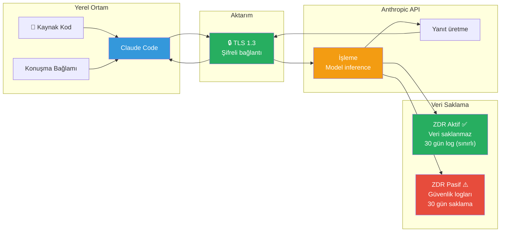
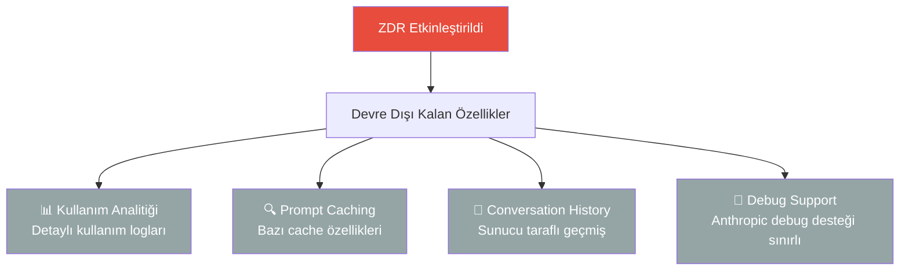
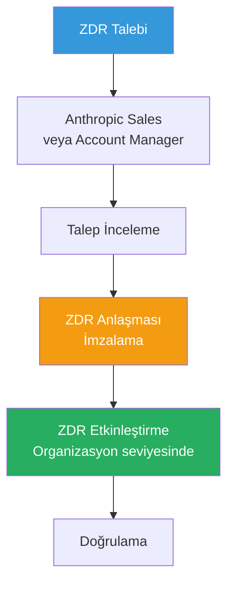
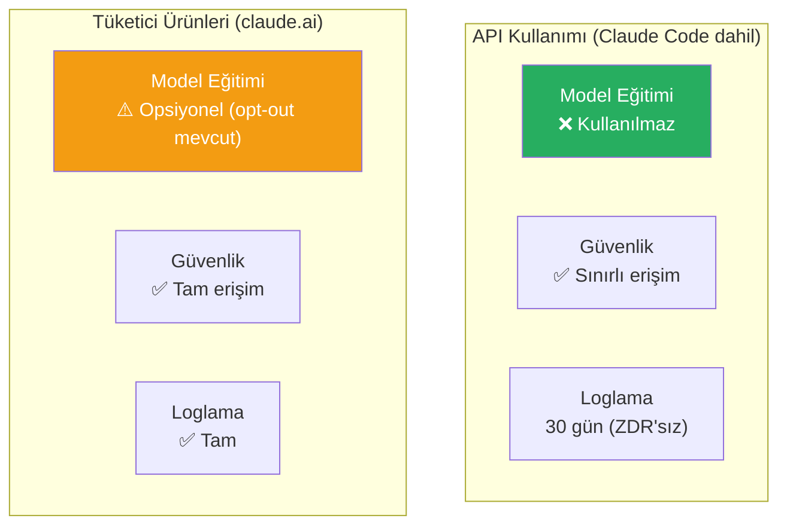
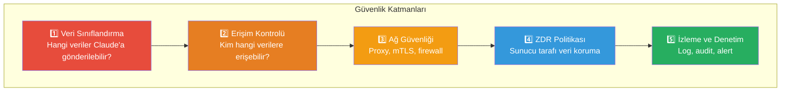
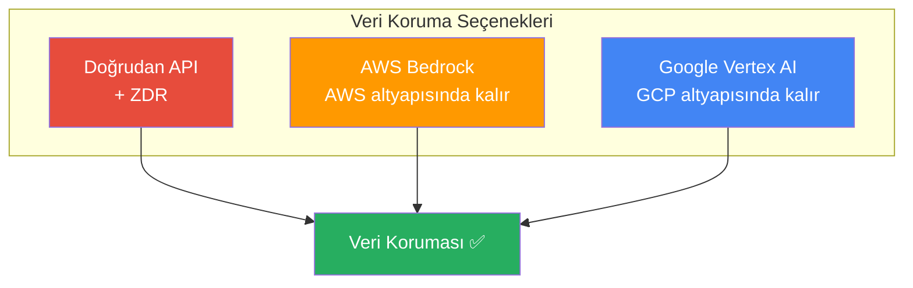

# Veri Güvenliği ve Zero Data Retention (ZDR)

Kurumsal ortamlarda Claude Code kullanırken veri güvenliği en kritik konudur. Zero Data Retention (sıfır veri saklama) politikası, gönderilen verilerin Anthropic tarafından model eğitiminde veya kalıcı depolamada kullanılmamasını garanti eder.

## Ön Koşullar

| Konu | Bölüm |
|------|-------|
| Claude Code temelleri | [Claude Code Nedir?](../06-claude-code-tanitim/01-claude-code-nedir.md) |
| Güvenlik en iyi uygulamalar | [Güvenlik En İyi Uygulamalar](../10-izinler-ve-guvenlik/05-guvenlik-en-iyi-uygulamalar.md) |
| Ağ konfigürasyonu | [Ağ ve Proxy Konfigürasyonu](./04-ag-ve-proxy-konfigurasyonu.md) |

---

## Veri Akışı Genel Bakış

Claude Code kullandığınızda aşağıdaki veri akışı gerçekleşir:



---

## Zero Data Retention (ZDR) Nedir?

ZDR, Anthropic'in veri saklama politikasının en kısıtlayıcı seviyesidir. ZDR etkinleştirildiğinde:

### ZDR Kapsamı

| Kapsam | ZDR Aktif | ZDR Pasif |
|--------|-----------|-----------|
| Prompt'lar ve yanıtlar | ❌ Saklanmaz | 30 gün (güvenlik) |
| Model eğitimi | ❌ Kullanılmaz | ❌ Kullanılmaz |
| Kötüye kullanım tespiti | Sınırlı | Tam |
| Trust & Safety değerlendirmesi | Sınırlı | Tam |
| Hata ayıklama | Sınırlı | Mümkün |

### ZDR ile Devre Dışı Kalan Özellikler



> **Not:** ZDR etkinleştirildiğinde bazı özellikler kısıtlanabilir. Güncel bilgi için Anthropic ile iletişime geçin.

---

## ZDR Etkinleştirme

### Adım 1: Uygunluk

ZDR, Enterprise plan kapsamında sunulmaktadır:



### Adım 2: Talep Süreci

1. **Anthropic sales ekibiyle iletişime geçin** — [sales@anthropic.com](mailto:sales@anthropic.com)
2. **ZDR gereksinimlerinizi belirtin** — Hangi organizasyon/takım için
3. **Anlaşma şartlarını gözden geçirin** — Devre dışı kalan özellikler dahil
4. **Anlaşmayı imzalayın** — ZDR addendum (ek sözleşme)
5. **Etkinleştirmeyi doğrulayın** — API yanıtlarında ZDR header kontrolü

### Adım 3: Doğrulama

```bash
# API yanıtında ZDR durumunu kontrol edin
# Yanıt header'larında ZDR bilgisi yer alır
curl -v https://api.anthropic.com/v1/messages \
  -H "x-api-key: $ANTHROPIC_API_KEY" \
  -H "content-type: application/json" \
  -H "anthropic-version: 2024-01-01" \
  -d '{"model": "claude-sonnet-4-20250514", "max_tokens": 10, "messages": [{"role": "user", "content": "test"}]}'
```

---

## Veri Kullanım Politikaları

### Anthropic Veri Politikası Özeti



### Claude Code Spesifik Politika

| Veri Türü | API Kullanımı | ZDR ile |
|-----------|---------------|---------|
| Kaynak kod | Eğitim için kullanılmaz | Saklanmaz |
| Prompt'lar | 30 gün güvenlik logu | Saklanmaz |
| Yanıtlar | 30 gün güvenlik logu | Saklanmaz |
| Dosya içerikleri | Eğitim için kullanılmaz | Saklanmaz |
| Metadata (token sayısı vb.) | Kullanım metrikleri | Sınırlı |

---

## Kurumsal Veri Güvenliği Stratejisi

### Katmanlı Güvenlik Yaklaşımı



### Veri Sınıflandırma Rehberi

| Sınıf | Açıklama | Claude Code ile Kullanım |
|-------|----------|--------------------------|
| 🟢 Genel | Açık kaynak kod, dökümantasyon | Serbestçe kullanılabilir |
| 🟡 İç kullanım | İç projeler, standart kod | ZDR önerilir |
| 🟠 Gizli | Müşteri verileri, iş mantığı | ZDR gerekli + ek önlemler |
| 🔴 Çok gizli | Credential'lar, PII, finansal | Claude Code ile kullanılmamalı |

### .gitignore ve Hook Korumaları

```json
{
  "hooks": {
    "PreToolUse": [
      {
        "matcher": "Read",
        "hooks": [
          {
            "type": "command",
            "command": "echo \"$CLAUDE_TOOL_INPUT\" | python3 -c \"import sys,json; path=json.load(sys.stdin).get('file_path',''); sensitive=['.env','.pem','.key','credentials','secret','password']; sys.exit(1) if any(s in path.lower() for s in sensitive) else sys.exit(0)\""
          }
        ]
      }
    ]
  }
}
```

---

## Cloud Provider ile ZDR

### AWS Bedrock

AWS Bedrock varsayılan olarak verilerinizi Anthropic ile paylaşmaz:

```bash
export CLAUDE_CODE_USE_BEDROCK=true
# Bedrock'ta verileriniz AWS altyapınızda kalır
# Anthropic model eğitimi için kullanılmaz
```

### Google Vertex AI

Vertex AI'da da benzer şekilde verileriniz Google Cloud altyapınızda kalır:

```bash
export CLAUDE_CODE_USE_VERTEX=true
# Vertex AI'da verileriniz GCP projenizde kalır
```



---

## Pratik Örnek: Güvenlik Kontrol Listesi

### Claude Code Dağıtımı Öncesi

| # | Kontrol | Durum |
|---|---------|-------|
| 1 | Veri sınıflandırma politikası tanımlandı mı? | ☐ |
| 2 | ZDR etkinleştirildi mi (gerekiyorsa)? | ☐ |
| 3 | Hassas dosya filtreleme hook'u kuruldu mu? | ☐ |
| 4 | Ağ güvenliği (proxy, TLS) yapılandırıldı mı? | ☐ |
| 5 | Managed settings ile güvenlik politikaları uygulandı mı? | ☐ |
| 6 | Denetim loglaması aktif mi? | ☐ |
| 7 | Harcama limitleri tanımlandı mı? | ☐ |
| 8 | Ekip güvenlik eğitimi verildi mi? | ☐ |

---

## Sık Yapılan Hatalar

| Hata | Çözüm |
|------|-------|
| Credential'ları Claude Code ile paylaşmak | Hassas verileri asla prompt'a eklemeyin |
| ZDR olmadan hassas kodla çalışmak | Gizli veriler için ZDR zorunlu kılın |
| Veri sınıflandırma yapmamak | Hangi verilerin AI ile kullanılabileceğini tanımlayın |
| Bedrock/Vertex'i tercih etmemek | Kurumsal ortamda cloud provider seçeneğini değerlendirin |

---

## Özet

| Konu | Anahtar Bilgi |
|------|---------------|
| ZDR | Prompt ve yanıtlar saklanmaz, model eğitiminde kullanılmaz |
| API politikası | API verileri varsayılan olarak eğitimde kullanılmaz |
| Cloud providers | Bedrock/Vertex veriler sağlayıcı altyapısında kalır |
| Veri sınıflandırma | Yeşil, sarı, turuncu, kırmızı katmanlar |
| Koruma hook'ları | Hassas dosya erişimini otomatik engelleme |

---

## Sonraki Adım

Yasal uyumluluk, GDPR/KVKK ve sertifika gereksinimlerini inceleyelim:

→ [Yasal Uyumluluk](./09-yasal-uyumluluk.md)
