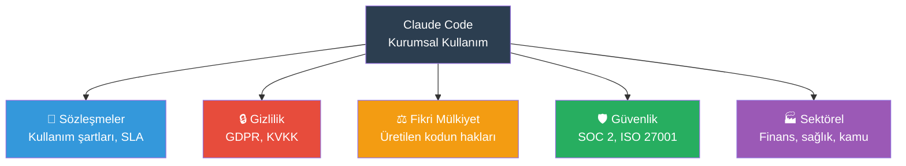
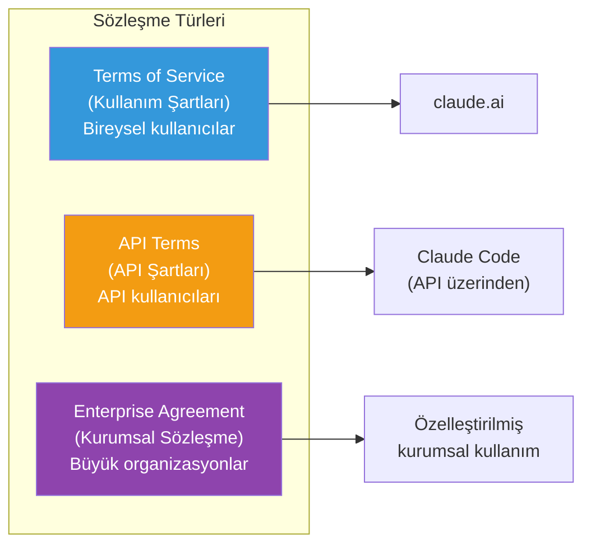
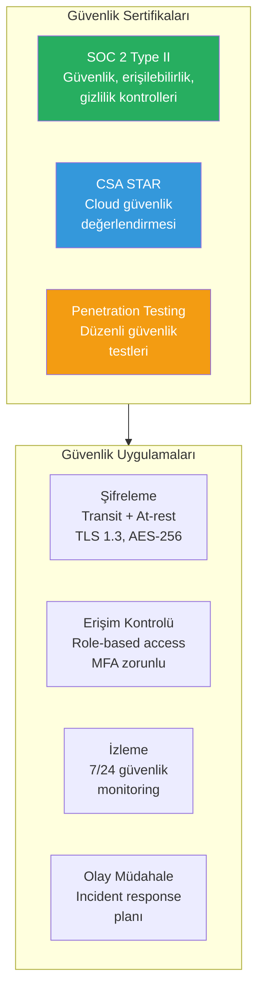
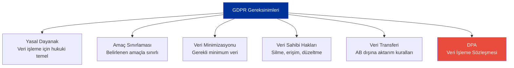
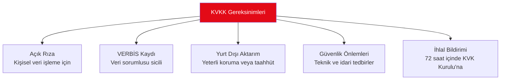
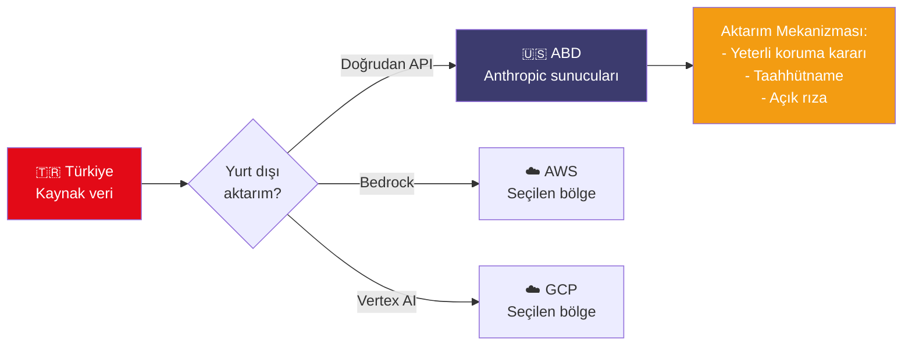
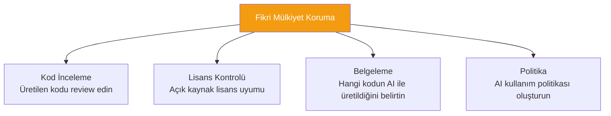
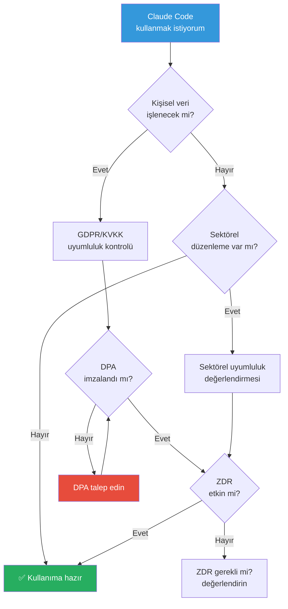

# Yasal Uyumluluk

Claude Code'u kurumsal ortamda kullanırken legal agreements (yasal sözleşmeler), compliance certifications (uyumluluk sertifikaları), GDPR ve KVKK gibi düzenlemelere dikkat etmek gerekmektedir. Bu rehber, hukuki çerçeveyi ve uyumluluk gereksinimlerini kapsar.

## Ön Koşullar

| Konu | Bölüm |
|------|-------|
| Veri güvenliği ve ZDR | [Veri Güvenliği ve ZDR](./08-veri-guvenligi-ve-zdr.md) |
| Güvenlik en iyi uygulamalar | [Güvenlik En İyi Uygulamalar](../10-izinler-ve-guvenlik/05-guvenlik-en-iyi-uygulamalar.md) |

---

## Hukuki Çerçeve Genel Bakış

Claude Code kullanımı birden fazla hukuki alan ile ilişkilidir:



---

## Anthropic Sözleşme Yapısı

### Sözleşme Türleri



### Claude Code İçin Geçerli Sözleşme

Claude Code, API Terms kapsamında çalışır. Kurumsal müşteriler için Enterprise Agreement uygulanabilir:

| Sözleşme | Kapsam | Taraf |
|----------|--------|-------|
| API Terms of Service | API kullanımı, Claude Code dahil | Bireysel / küçük takımlar |
| Enterprise Agreement | Özelleştirilmiş kurumsal koşullar | Büyük organizasyonlar |
| ZDR Addendum | Zero Data Retention ek sözleşmesi | ZDR talep edenler |
| BAA | Business Associate Agreement (HIPAA) | Sağlık sektörü |

---

## Güvenlik Sertifikaları

Anthropic'in sahip olduğu güvenlik sertifikaları:



### Sertifika Durumları

| Sertifika | Durum | Kapsam |
|-----------|-------|--------|
| SOC 2 Type II | ✅ Aktif | Güvenlik, erişilebilirlik, işlem bütünlüğü, gizlilik |
| CSA STAR | ✅ Aktif | Cloud güvenlik değerlendirmesi |
| Penetration Testing | ✅ Düzenli | Uygulama ve altyapı güvenliği |
| ISO 27001 | Bilgi için iletişime geçin | Bilgi güvenliği yönetim sistemi |
| HIPAA | BAA ile | Sağlık verileri (ABD) |

---

## GDPR Uyumluluğu

GDPR (General Data Protection Regulation / Genel Veri Koruma Tüzüğü), Avrupa Birliği'nin kişisel veri koruma düzenlemesidir.

### GDPR Kapsamında Claude Code



### GDPR Kontrol Listesi

| Gereksinim | Claude Code'da Karşılığı |
|------------|--------------------------|
| Yasal dayanak | Meşru menfaat veya sözleşme yükümlülüğü |
| Veri minimizasyonu | Yalnızca gerekli dosyaları Claude Code'a gönderin |
| Veri işleme sözleşmesi (DPA) | Anthropic DPA mevcut (Enterprise) |
| Veri transferi | SCCs (Standard Contractual Clauses) uygulanır |
| Veri sahibi hakları | ZDR ile veri saklanmadığında uyumluluk kolaylaşır |
| Veri koruma etki değerlendirmesi (DPIA) | Kişisel veri işleniyorsa DPIA yapılmalı |

### DPA (Data Processing Agreement)

Anthropic, kurumsal müşterilerine DPA (Veri İşleme Sözleşmesi) sunmaktadır:

```
Anthropic DPA kapsamı:
- Veri işleme amaçları ve sınırları
- Alt işleyiciler (sub-processors) listesi
- Veri güvenliği önlemleri
- İhlal bildirim prosedürleri
- Veri sahibi hakları desteği
- Uluslararası veri transferi mekanizmaları
```

---

## KVKK Uyumluluğu

KVKK (Kişisel Verilerin Korunması Kanunu), Türkiye'nin kişisel veri koruma düzenlemesidir ve GDPR ile büyük ölçüde benzerdir.

### KVKK Kapsamında Dikkat Edilmesi Gerekenler



### KVKK Kontrol Listesi

| Gereksinim | Aksiyon |
|------------|---------|
| Kişisel veri tespiti | Claude Code'a gönderilen veride kişisel veri var mı? |
| Açık rıza | Gerekiyorsa çalışanlardan aydınlatma ve onay |
| Yurt dışı aktarım | ABD'ye veri transferi için yeterli koruma veya taahhütname |
| VERBİS kaydı | Veri sorumlusu olarak kayıt kontrolü |
| Teknik tedbirler | Şifreleme, erişim kontrolü, log tutma |
| İdari tedbirler | Politika, eğitim, gizlilik sözleşmesi |

### Yurt Dışı Veri Transferi

Claude Code kullanıldığında veriler Anthropic sunucularına (ABD) aktarılır. KVKK açısından:



**Öneriler:**

1. **Bedrock/Vertex AI kullanımı** — Veriler seçtiğiniz bölgede kalabilir
2. **ZDR etkinleştirme** — Veri saklanmadığında transfer riski azalır
3. **Hukuk danışmanlığı** — Organizasyonunuza özel değerlendirme yaptırın
4. **Kişisel veri minimizasyonu** — Claude Code'a kişisel veri göndermekten kaçının

---

## Fikri Mülkiyet (IP) Hakları

### Claude Code ile Üretilen Kod

| Soru | Cevap |
|------|-------|
| Üretilen kodun sahibi kim? | **Siz.** API Terms'e göre output'lar müşteriye aittir |
| Anthropic üretilen kodu kullanabilir mi? | Hayır (API kullanımında model eğitimi için kullanılmaz) |
| Lisans kısıtlaması var mı? | Hayır, üretilen kodu dilediğiniz gibi kullanabilirsiniz |
| Üçüncü taraf IP riski var mı? | Olası, ancak düşük risk (genel sorumluluk kullanıcıda) |

### IP Koruma Önerileri



---

## Sektörel Uyumluluk

| Sektör | Düzenleme | Claude Code Değerlendirmesi |
|--------|-----------|----------------------------|
| Finans | SPK, BDDK, PCI-DSS | ZDR + Bedrock/Vertex önerilir |
| Sağlık | HIPAA (ABD), sağlık verileri | BAA gerekli, ZDR zorunlu |
| Kamu | Kamu verileri mevzuatı | Hukuk danışmanlığı gerekli |
| Savunma | ITAR, EAR | Detaylı değerlendirme gerekli |
| Eğitim | FERPA (ABD), kişisel veriler | Öğrenci verisi kullanılmamalı |

---

## Pratik Örnek: Uyumluluk Dosyası

Organizasyonunuz için bir AI uyumluluk dosyası oluşturun:

```markdown
# AI Araç Kullanım Politikası

## Kapsam
Bu politika, [Şirket Adı] çalışanlarının Claude Code 
ve benzeri AI kodlama araçlarını kullanımını düzenler.

## İzin Verilen Kullanımlar
- Açık kaynak ve iç proje kodu geliştirme
- Kod inceleme ve refactoring
- Test yazma ve hata ayıklama
- Dökümantasyon oluşturma

## Yasaklanan Kullanımlar
- Kişisel veri içeren dosyaların AI'ya gönderilmesi
- Müşteri credential'larının paylaşılması
- Sınıflandırılmış/gizli verilerin işlenmesi
- Lisanslı üçüncü taraf kodunun doğrudan kopyalanması

## Teknik Önlemler
- ZDR etkinleştirilmiştir
- Hassas dosya filtreleme hook'u aktiftir
- Tüm oturumlar denetim loglarına kaydedilir
- Managed settings ile güvenlik politikaları uygulanır

## Sorumluluk
- Üretilen tüm kod, teslim öncesi insan tarafından review edilmelidir
- AI ile üretilen kodun sorumluluğu geliştirici ve ekibindedir
```

---

## Uyumluluk Karar Ağacı



---

## Sık Yapılan Hatalar

| Hata | Çözüm |
|------|-------|
| Yasal değerlendirme yapmadan kullanmak | Hukuk ekibinizle değerlendirme yapın |
| KVKK yurt dışı transfer kurallarını görmezden gelmek | Aktarım mekanizması belirleyin |
| DPA imzalamamak | Enterprise plan ile DPA talep edin |
| AI politikası oluşturmamak | Yazılı AI kullanım politikası hazırlayın |
| Üretilen kodu review etmemek | Tüm AI çıktılarını insan gözünden geçirin |

---

## Önemli Linkler

| Kaynak | URL |
|--------|-----|
| Anthropic Privacy Policy | [anthropic.com/privacy](https://www.anthropic.com/privacy) |
| Anthropic Terms of Service | [anthropic.com/terms](https://www.anthropic.com/terms) |
| Anthropic Security | [anthropic.com/security](https://trust.anthropic.com) |
| KVKK Kurumu | [kvkk.gov.tr](https://www.kvkk.gov.tr) |

---

## Özet

| Konu | Anahtar Bilgi |
|------|---------------|
| Sözleşme | API Terms (bireysel), Enterprise Agreement (kurumsal) |
| Sertifikalar | SOC 2 Type II, CSA STAR |
| GDPR | DPA mevcut, SCCs uygulanır |
| KVKK | Yurt dışı transfer değerlendirmesi gerekli |
| IP hakları | Üretilen kodun hakları müşteriye ait |
| Öneriler | ZDR + DPA + AI politikası + hukuk danışmanlığı |

---

## Sonraki Adım

Kurumsal kullanım bölümünü tamamladınız! Şimdi farklı roller için özel rehberlere geçelim:

→ [Bölüm 19: Rol Bazlı Rehberler](../19-rol-bazli-rehberler/README.md)
