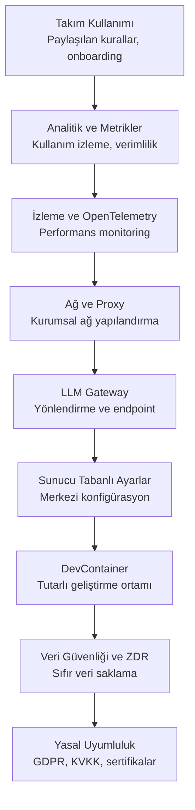

# Bölüm 18: Kurumsal Kullanım

Claude Code, bireysel geliştiricilerin ötesinde, büyük ekiplerin ve kurumsal organizasyonların ihtiyaçlarını karşılayacak şekilde tasarlanmıştır. Takım yönetimi, analitik, güvenlik, ağ konfigürasyonu ve yasal uyumluluk gibi konuları bu bölümde ele alıyoruz.

## Bu Bölümde Neler Öğreneceksiniz?

## İçerik

| # | Dosya | Konu | Süre |
|---|-------|------|------|
| 01 | [Takım Kullanımı ve Yönetim](./01-takim-kullanimi-ve-yonetim.md) | Paylaşılan kurallar, standart izinler, onboarding | ~15 dk |
| 02 | [Analitik ve Metrikler](./02-analitik-ve-metrikler.md) | Kullanım metrikleri, adopsiyon takibi, verimlilik ölçümü | ~12 dk |
| 03 | [İzleme ve OpenTelemetry](./03-izleme-ve-opentelemetry.md) | OpenTelemetry entegrasyonu, loglama, performans | ~12 dk |
| 04 | [Ağ ve Proxy Konfigürasyonu](./04-ag-ve-proxy-konfigurasyonu.md) | Proxy sunucular, CA sertifikaları, mTLS | ~12 dk |
| 05 | [LLM Gateway](./05-llm-gateway.md) | Gateway çözümleri, yönlendirme, endpoint yapılandırma | ~10 dk |
| 06 | [Sunucu Tabanlı Ayarlar](./06-sunucu-tabanli-ayarlar.md) | Merkezi konfigürasyon, cihaz yönetimi olmadan | ~10 dk |
| 07 | [DevContainer](./07-devcontainer.md) | Geliştirme container'ları, devcontainer.json | ~12 dk |
| 08 | [Veri Güvenliği ve ZDR](./08-veri-guvenligi-ve-zdr.md) | Zero Data Retention, veri kullanım politikaları | ~10 dk |
| 09 | [Yasal Uyumluluk](./09-yasal-uyumluluk.md) | GDPR, KVKK, sertifikalar, hukuki çerçeve | ~10 dk |

## Ön Koşullar

Bu bölümü okumadan önce aşağıdaki konulara aşina olmanız önerilir:

| Konu | Bölüm |
|------|-------|
| Claude Code temelleri | [Bölüm 06](../06-claude-code-tanitim/README.md) |
| İzinler ve güvenlik | [Bölüm 10](../10-izinler-ve-guvenlik/README.md) |
| Konfigürasyon | [Bölüm 17](../17-konfigurasyon/README.md) |

## Önceki Bölüm

← [17 - Konfigürasyon](../17-konfigurasyon/README.md)

## Sonraki Adım

Bu bölümü tamamladıktan sonra → [19 - Rol Bazlı Rehberler](../19-rol-bazli-rehberler/README.md)
