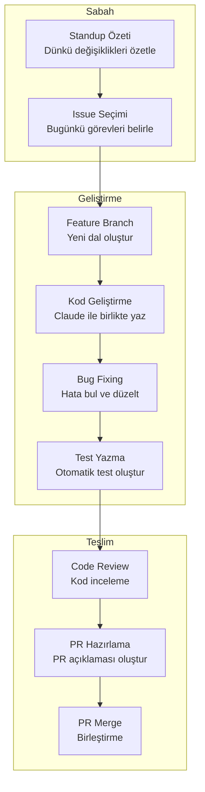
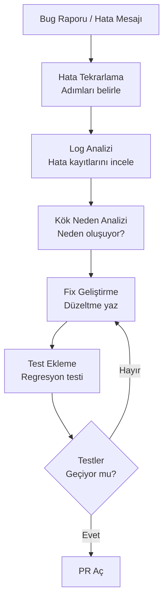
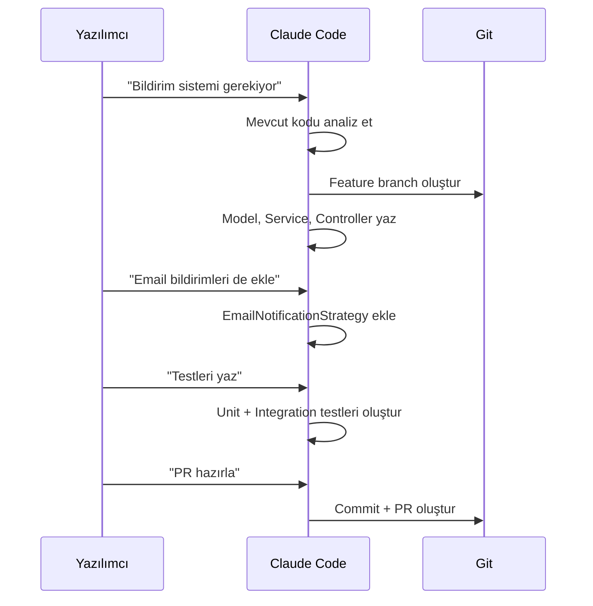
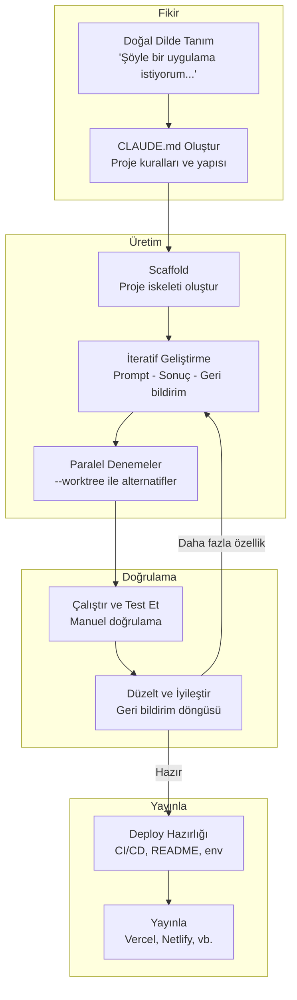
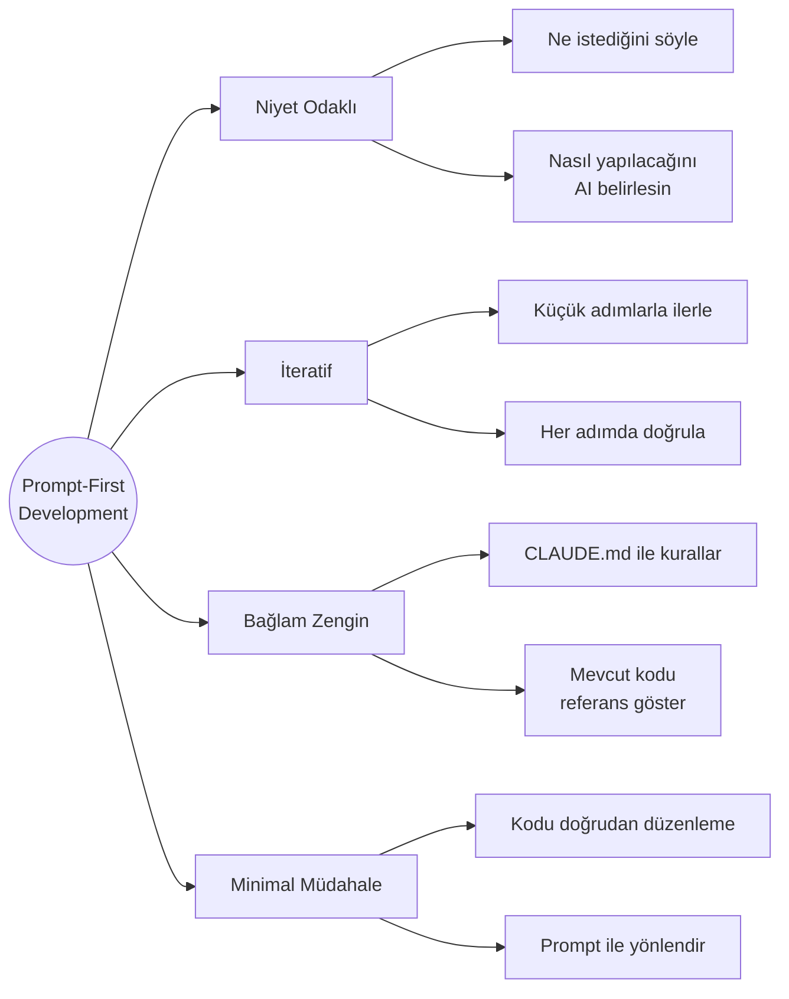
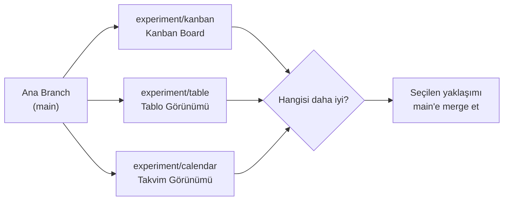
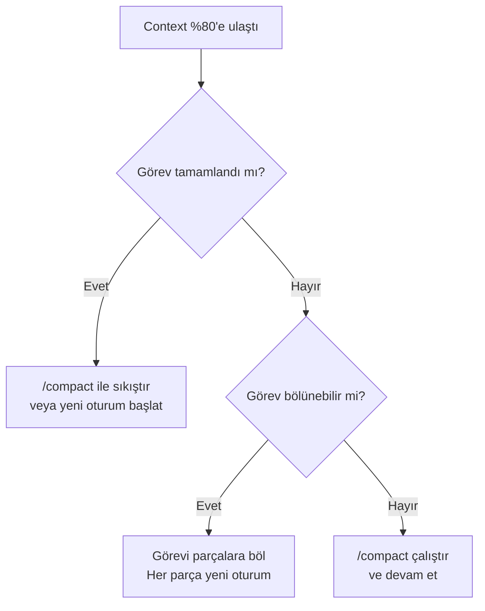

# Yazılım Geliştirici Rehberi

Claude Code'u günlük yazılım geliştirme iş akışınıza entegre etmek, üretkenliğinizi dramatik şekilde artırır. Bu rehber; sabah standup'tan PR merge'e kadar tüm geliştirme döngüsünü Claude Code ile nasıl optimize edeceğinizi kapsar. Ayrıca Vibe Coding (his ile kodlama) yaklaşımını da içerir: doğal dil prompt'ları ile yazılım geliştirme yöntemini, klasik geliştirme pratiğiyle birleştirir.

---

## Ön Koşullar

| Konu | Bölüm |
|------|-------|
| Claude Code kurulumu | [Kurulum ve Gereksinimler](../06-claude-code-tanitim/03-kurulum-ve-gereksinimler.md) |
| Arayüz ve komutlar | [Bölüm 07](../07-arayuz-ve-komutlar/README.md) |
| Bellek ve bağlam yönetimi | [Bölüm 09](../09-bellek-ve-baglam/README.md) |
| Vibe Coding kavramı | [Vibe Coding](../04-ai-destekli-gelistirme/03-vibe-coding.md) |
| Hızlı mod | [Hızlı Mod](../07-arayuz-ve-komutlar/03-hizli-mod.md) |

---

## Günlük İş Akışı

Bir yazılımcının Claude Code ile tipik günlük iş akışı:



---

## Sabah Standup Özeti

Güne başlarken dünden bu yana yapılan değişiklikleri özetleyin:

```bash
# Dünkü commit'leri özetle
claude "Dünden bu yana yapılan commit'leri özetle. git log --since='yesterday' kullanarak her commit'i Türkçe açıkla ve standup için kısa bir özet hazırla."
```

```bash
# Aktif branch'lerdeki değişiklikleri gör
claude "Bu repo'daki aktif branch'leri listele ve her birinin main'den ne kadar farklılaştığını göster. Standup için bir tablo hazırla."
```

**İleri seviye:** Standup özeti oluştururken JIRA veya GitHub Issues referanslarını da dahil edin:

```bash
claude "git log --since='yesterday' çıktısını oluştur. Her commit'teki JIRA ticket numaralarını (ör: PROJ-123) çıkar ve hangi issue'ların üzerinde çalışıldığını özetle."
```

---

## Bug Fixing (Hata Düzeltme) İş Akışı

Bug düzeltme, yazılımcının en sık karşılaştığı görevdir. Claude Code ile sistematik bir yaklaşım:



### Pratik Örnek: TypeError Düzeltme

```bash
claude "Bu hatayı alıyorum: 'TypeError: Cannot read properties of undefined (reading map)'. Bu hatanın kaynağını bul, neden oluştuğunu açıkla ve düzelt. Düzeltme sonrası ilgili birim testini de ekle."
```

### Pratik Örnek: Veritabanı Bağlantı Hatası

```bash
claude "Aşağıdaki stack trace'i analiz et ve hatanın kök nedenini bul:

Error: ECONNREFUSED 127.0.0.1:5432
    at TCPConnectWrap.afterConnect
    at Protocol._enqueue
    
Veritabanı bağlantı ayarlarını kontrol et ve düzelt."
```

### Pratik Örnek: Race Condition (Yarış Durumu)

```bash
claude "Kullanıcılar eş zamanlı istek gönderdiğinde veritabanında tutarsız veri oluşuyor. src/services/order-service.ts dosyasındaki createOrder fonksiyonunu incele. Race condition var mı kontrol et, varsa transaction veya lock mekanizması ile düzelt."
```

### Pratik Örnek: Memory Leak (Bellek Sızıntısı)

```bash
claude "Uygulama uzun süre çalıştığında bellek kullanımı sürekli artıyor. src/services/ dizinindeki event listener'ları ve subscription'ları incele. Temizlenmeyen listener'ları tespit et ve cleanup mekanizması ekle."
```

---

## Feature Development (Özellik Geliştirme)

Yeni özellik geliştirirken Claude Code'u etkili kullanmak:

```bash
# Feature branch oluştur ve geliştirmeye başla
claude "Yeni bir feature branch oluştur: feature/user-notifications. Kullanıcı bildirim sistemi için gerekli dosyaları oluştur: model, service, controller ve route. Her dosyada temel yapıyı kur."
```

```bash
# Mevcut koda uygun şekilde genişlet
claude "src/services/ dizinindeki mevcut servislerin yapısını incele. Aynı pattern'i kullanarak NotificationService oluştur. Dependency injection (bağımlılık enjeksiyonu), error handling (hata yönetimi) ve logging mevcut servislerdeki gibi olsun."
```

### Adım Adım Feature Geliştirme



### Karmaşık Feature: Adım Adım Prompt Zinciri

Büyük bir özelliği küçük prompt'lara bölme stratejisi:

```bash
# 1. Veri modeli
claude "Bildirim sistemi için veritabanı modelini oluştur. Tablolar: notifications (id, user_id, type, title, body, read, created_at), notification_preferences (user_id, channel, enabled). Migration dosyasını da oluştur."

# 2. Repository katmanı
claude "notifications tablosu için repository oluştur. Mevcut UserRepository pattern'ini kullanarak: findByUserId, markAsRead, markAllAsRead, deleteOld metodlarını yaz."

# 3. Service katmanı
claude "NotificationService oluştur. Bildirim gönderme, okundu işaretleme ve tercih yönetimi için metodlar ekle. Strategy pattern ile farklı kanalları (email, push, in-app) destekle."

# 4. API katmanı
claude "Bildirim API endpoint'lerini oluştur: GET /notifications, PATCH /notifications/:id/read, POST /notifications/read-all, GET /notifications/preferences, PUT /notifications/preferences. Mevcut route pattern'ini kullan."

# 5. Testler
claude "NotificationService ve NotificationController için kapsamlı test yaz. Happy path, edge case ve error case'leri kapsasın. Mock kullanarak bağımlılıkları izole et."
```

---

## PR Hazırlama ve Code Review

### PR Hazırlama

Pull Request (Çekme İsteği) hazırlarken Claude Code ile kapsamlı ve profesyonel PR açıklamaları oluşturun:

```bash
claude "Bu branch'teki tüm değişiklikleri analiz et ve bir PR açıklaması oluştur. Şunları içersin: değişiklik özeti, motivasyon, test planı, ekran görüntüsü gerektiren yerler ve reviewer'lar için önemli notlar."
```

```bash
claude "Bu branch'i main ile karşılaştır. Şunları kontrol et: merge conflict (birleştirme çakışması) var mı, tüm testler geçiyor mu, lint hataları var mı, coverage (kapsam) düşüyor mu. Sorunları listele."
```

### PR Öncesi Otomatik Kontrol Listesi

```bash
claude "PR açmadan önce şu kontrolleri yap ve sonuçları tablo olarak sun:
1. Tüm testler geçiyor mu?
2. Lint hataları var mı?
3. Type check (tip kontrolü) başarılı mı?
4. Yeni dosyalar için test yazılmış mı?
5. console.log veya debug kodu kalmış mı?
6. TODO yorumları kalmış mı?
7. .env dosyasına yeni değişken eklenmiş mi? (.env.example güncellenmeli)
8. Migration dosyası gerekli mi?"
```

### Code Review

Başkalarının kodlarını review ederken Claude Code'u asistan olarak kullanın:

```bash
claude "PR #42'deki değişiklikleri incele. Şunlara dikkat et: potansiyel bug'lar, performans sorunları, güvenlik açıkları, naming convention (adlandırma kuralı) tutarlılığı ve test coverage. Her bulgu için severity (critical/warning/info) belirt."
```

### Code Review Cevap Şablonu

```bash
claude "Şu PR yorumuna yanıt hazırla: 'Bu fonksiyon çok uzun, bölünmeli'. İlgili fonksiyonu analiz et, review'ın haklı olduğu noktaları belirle ve refactoring önerisi sun. Refactoring'i uygula."
```

---

## Vibe Coding Yaklaşımı

Vibe Coding, doğal dil prompt'ları ile yazılım geliştirme yaklaşımıdır. Geleneksel satır satır kodlama yerine niyetinizi doğal dille ifade edersiniz ve Claude Code kodu üretir. Bu bölüm, Vibe Coding'i günlük geliştirme pratiğinize entegre etmenin yollarını gösterir.

### Vibe Coding Yaşam Döngüsü



### Prompt-First Development (Prompt-Öncelikli Geliştirme)

Vibe Coding'de geliştirme süreci prompt yazarak başlar, kod yazarak değil:



### Sıfırdan Proje: Adım Adım Walkthrough (Uçtan Uca Yürüyüş)

Doğal dil prompt'ları ile komple bir web uygulaması oluşturma — TaskFlow görev yönetim uygulaması örneği:

**Adım 1: Proje İskeleti**

```bash
claude "TaskFlow adında bir görev yönetim uygulaması oluştur. Next.js 15, TypeScript ve Tailwind CSS kullan. Proje yapısını kur, gerekli paketleri yükle ve çalışır duruma getir."
```

**Adım 2: Veritabanı**

```bash
claude "SQLite veritabanı kur (Drizzle ORM). Şu tablolar olsun:
- users (id, name, email, avatar)
- projects (id, name, description, owner_id, created_at)
- tasks (id, title, description, status, priority, project_id, assignee_id, due_date, created_at)
- comments (id, content, task_id, author_id, created_at)

Status enum: todo, in_progress, review, done
Priority enum: low, medium, high, urgent

Migration'ı çalıştır ve seed data ekle."
```

**Adım 3: Dashboard Tasarımı**

```bash
claude "Ana sayfa bir dashboard olsun:
- Sol tarafta sidebar (projeler listesi, navigasyon)
- Üstte başlık çubuğu (arama, kullanıcı menüsü)
- Ortada görev kartları (Kanban board tarzı: Todo, In Progress, Review, Done sütunları)
- Sağ üstte 'Yeni Görev' butonu
Güzel ve modern görünsün. Dark mode desteği olsun."
```

**Adım 4: CRUD ve Etkileşim**

```bash
claude "Görev CRUD işlemlerini ekle:
- Yeni görev oluşturma (modal form)
- Görev detay sayfası
- Görev düzenleme
- Görev silme (onay dialog'u ile)
- Sürükle-bırak ile görev durumu değiştirme
Her işlem için loading state ve error handling ekle."
```

**Adım 5: Auth ve Deploy**

```bash
claude "NextAuth.js ile GitHub OAuth authentication ekle. Login sayfası, korumalı route'lar ve kullanıcı menüsü ekle."

claude "Vercel'e deploy etmek için projeyi hazırla: .env.example dosyası, README.md, gerekli konfigürasyonlar."
```

### --worktree ile Paralel Denemeler

Farklı yaklaşımları aynı anda deneyerek en iyisini seçin:

```bash
# UI alternatiflerini paralel dene
claude --worktree experiment/kanban "Dashboard'u Kanban board olarak tasarla"
claude --worktree experiment/table "Dashboard'u tablo görünümü olarak tasarla"
claude --worktree experiment/calendar "Dashboard'u takvim görünümü olarak tasarla"
```



### Minimal Manuel Müdahale

Vibe Coding'de amaç kodu mümkün olduğunca az doğrudan düzenlemektir:

| Durum | Geleneksel | Vibe Coding |
|-------|-----------|-------------|
| Buton rengi değiştirme | CSS dosyasını aç, class bul, rengi değiştir | `claude "Butonları maviden yeşile çevir"` |
| API endpoint ekleme | Route dosyası oluştur, handler yaz, test et | `claude "Ürünler için CRUD API endpoint'leri ekle"` |
| Bug fix | Stack trace oku, dosya bul, debug et | `claude "Bu hata mesajını düzelt: [mesaj]"` |
| Responsive design | Media query yaz, test et | `claude "Mobilde sidebar hamburger menüye dönsün"` |
| Veritabanı modeli ekleme | Schema dosyasını düzenle, migration yaz | `claude "Yorum tablosu ekle, task ile ilişkilendir"` |

### Vibe Coding İpuçları

**1. Büyük Düşün, Küçük Adımla İlerle**

```bash
# Kötü: Çok büyük prompt ❌
claude "Tam bir e-ticaret sitesi yap: ürünler, sepet, ödeme, kullanıcı profili, admin paneli..."

# İyi: Adım adım ✅
claude "E-ticaret sitesi başlat. İlk adım: ürün listeleme sayfası. Grid görünümü, ürün kartları, fiyat ve resim göstersin."
```

**2. Sonucu Görün, Sonra Yönlendirin**

```bash
claude "Bu sayfayı oluştur ve development server'ı başlat"
# Sonucu inceleyin, sonra:
claude "Sayfa güzel olmuş ama: 1) Header'ı sticky yap, 2) Kartlara hover efekti ekle, 3) Renkleri daha canlı yap"
```

**3. CLAUDE.md'yi Güncel Tutun**

```bash
claude "CLAUDE.md dosyasına ekle: tüm API response'ları { success: boolean, data: T, error?: string } formatında olmalı."
```

---

## Yazılımcılar İçin En İyi Prompt Pattern'leri

### 1. Bağlam Verin

```bash
# Kötü ❌
claude "Login fonksiyonunu düzelt"

# İyi ✅
claude "src/auth/login.ts dosyasındaki loginUser fonksiyonu, OAuth callback'ten dönen token'ı parse ederken hata veriyor. Token format: JWT. Hata: 'invalid signature'. Google OAuth ile test ediyoruz."
```

### 2. Mevcut Kodu Referans Alın

```bash
# Kötü ❌
claude "Yeni bir API endpoint yaz"

# İyi ✅
claude "src/routes/users.ts dosyasındaki mevcut CRUD endpoint pattern'ini kullanarak products için aynı yapıda endpoint'ler oluştur. Validation, error handling ve middleware'ler aynı kalıpta olsun."
```

### 3. Çıktı Formatı Belirtin

```bash
# Kötü ❌
claude "Bu kodu iyileştir"

# İyi ✅
claude "Bu fonksiyonu performans açısından optimize et. Her değişiklik için: 1) Ne değişti, 2) Neden değişti, 3) Beklenen performans kazancı açıkla. Mevcut testlerin geçmeye devam ettiğini doğrula."
```

### 4. Kısıtları Belirtin

```bash
claude "Bu modülü refactor et ama: 1) Public API değişmesin, 2) Mevcut testler kırılmasın, 3) Sadece ES2020 özellikleri kullan, 4) Dış bağımlılık ekleme."
```

### 5. İteratif Geliştirme

```bash
# Önce plan, sonra uygulama
claude "Bu görevi Plan Mode'da planla: kullanıcı profil sayfası için backend API gerekiyor. Adımları listele."

# Planı onayla ve uygula
claude "Planı onayla ve uygulamaya başla. Her adımı tamamladığında bir sonrakine geç."
```

### 6. Hata Bağlamı ile Prompt

```bash
claude "npm run build çıktısında şu hata var:
[hata çıktısını yapıştır]
Bu hatayı düzelt. Düzeltme sonrası build'in başarıyla tamamlandığını doğrula."
```

---

## CLAUDE.md Şablonu: Geliştirici Takımı

Takım genelinde tutarlılık sağlayan bir `CLAUDE.md` şablonu:

```markdown
# Proje: E-Ticaret Backend

## Mimari
- Node.js + Express + TypeScript
- PostgreSQL + Prisma ORM
- Redis cache
- Jest test framework

## Kurallar
- Tüm fonksiyonlar TypeScript strict mode ile yazılmalı
- Her public fonksiyon JSDoc ile dokümante edilmeli
- Controller → Service → Repository katman yapısı kullanılmalı
- Error handling: AppError sınıfı ile merkezi hata yönetimi

## Naming Convention (Adlandırma Kuralı)
- Dosyalar: kebab-case (user-service.ts)
- Sınıflar: PascalCase (UserService)
- Fonksiyonlar: camelCase (getUserById)
- Veritabanı: snake_case (user_id)

## Test Kuralları
- Her service fonksiyonu için en az 1 unit test
- Happy path + error case test zorunlu
- Mock kullanımı: jest.mock() ile
- Coverage hedefi: %80

## Branch Stratejisi
- Feature: feature/JIRA-123-kısa-açıklama
- Bugfix: bugfix/JIRA-456-kısa-açıklama
- Commit mesajı: conventional commits (feat:, fix:, refactor:)

## Yasaklar
- console.log üretim kodunda YASAK, logger kullan
- any tipi YASAK, uygun tip tanımla
- Hardcoded string YASAK, constant veya env kullan
```

---

## Context (Bağlam) Yönetimi İpuçları

Claude Code'un context window'unu (bağlam penceresi) verimli kullanmak, uzun geliştirme oturumlarında kritik öneme sahiptir.

### %80 Kuralı

Context window'un %80'ine ulaştığında Claude Code performans kaybetmeye başlar. Bu noktada:



### /compact Kullanımı

```bash
# Context dolduğunda sıkıştır
> /compact

# Özel özet ile sıkıştır
> /compact "User authentication modülünü refactor ediyordum. Login ve register servisleri tamamlandı, OAuth entegrasyonu kaldı."
```

### Görev Parçalama (Task Chunking)

Büyük görevleri küçük, bağımsız parçalara bölün:

```bash
# Kötü: Tek oturumda her şeyi yapmaya çalışmak ❌
claude "Tüm backend'i refactor et"

# İyi: Parçalara bölmek ✅
# Oturum 1:
claude "Sadece auth modülünü refactor et. Controller katmanını düzenle."

# Oturum 2:
claude "Auth modülünün service katmanını refactor et. Controller'lar dün tamamlandı."

# Oturum 3:
claude "Auth modülünün repository katmanını refactor et. Controller ve Service tamamlandı."
```

### Worktree ile Paralel Çalışma

```bash
# Farklı görevleri paralel branch'lerde yürüt
claude --worktree feature/auth "Auth modülünü yeniden yaz"
claude --worktree feature/notifications "Bildirim sistemini kur"
```

---

## Sık Kullanılan Komutlar Cheat Sheet

| Görev | Komut |
|-------|-------|
| Hızlı bug fix | `claude "Bu hatayı düzelt: [hata mesajı]"` |
| Test oluştur | `claude "Bu dosya için unit testler yaz: [dosya]"` |
| PR açıklaması | `claude "PR açıklaması oluştur"` |
| Code review | `claude "Bu diff'i review et: [branch]"` |
| Refactoring | `claude "Bu fonksiyonu SOLID prensiplerine uygun refactor et"` |
| Dependency güncelleme | `claude "Outdated bağımlılıkları güncelle ve breaking change'leri düzelt"` |
| Git log özeti | `claude "Son 1 haftanın commit'lerini özetle"` |
| Context sıkıştır | `/compact` |
| Vibe: Proje başlat | `claude "X uygulaması oluştur. [teknoloji] kullan."` |
| Vibe: Stil değiştir | `claude "Renkleri daha soft yap, boşlukları artır"` |
| Vibe: Paralel dene | `claude --worktree exp/a "Yaklaşım A'yı dene"` |

---

## Özet

| Alan | Claude Code Katkısı |
|------|---------------------|
| **Standup** | Git log'dan otomatik günlük özet |
| **Bug Fixing** | Kök neden analizi ve otomatik düzeltme |
| **Feature** | Mevcut pattern'lere uygun kod üretimi |
| **Test** | Otomatik birim ve entegrasyon testi |
| **PR** | Kapsamlı PR açıklaması ve review |
| **Context** | %80 kuralı, /compact, görev parçalama |
| **Vibe Coding** | Prompt-First geliştirme, minimal müdahale |
| **Paralel Çalışma** | --worktree ile alternatif yaklaşımları deneme |

---

## Sonraki Adım

QA ve test uzmanları için özel iş akışları:

→ [QA / Test Uzmanı Rehberi](./02-teknik-qa-test.md)
