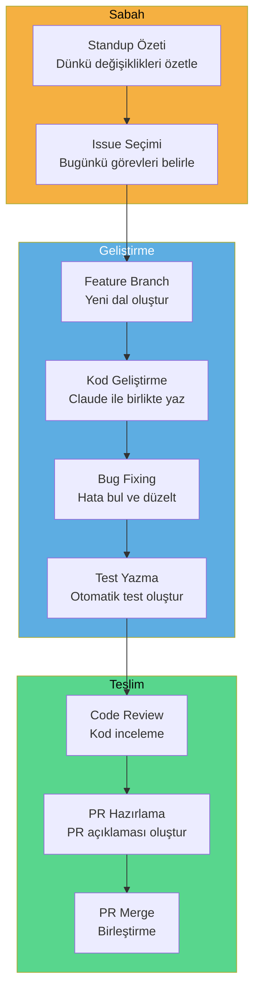
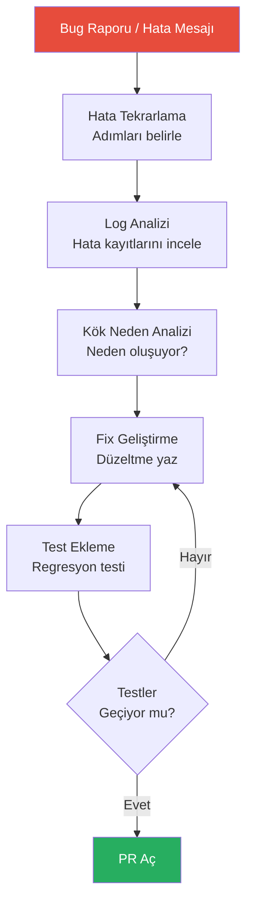
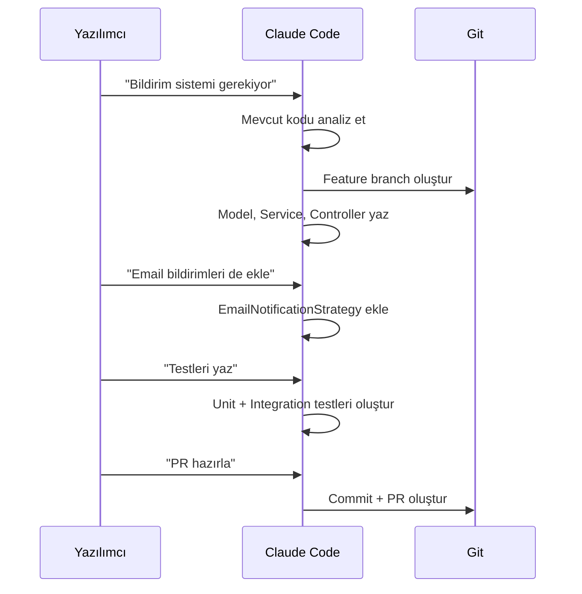
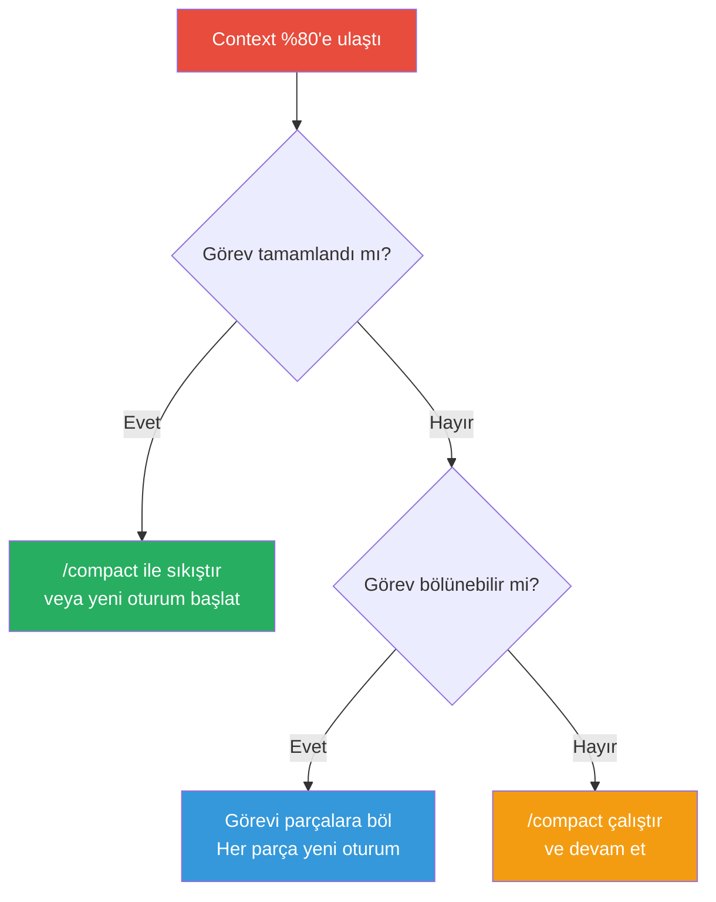

# Yazılımcı Rehberi

Claude Code'u günlük yazılım geliştirme iş akışınıza entegre etmek, üretkenliğinizi dramatik şekilde artırır. Bu rehber; sabah standup'tan PR merge'e kadar tüm geliştirme döngüsünü Claude Code ile nasıl optimize edeceğinizi kapsar.

## Ön Koşullar

| Konu | Bölüm |
|------|-------|
| Claude Code kurulumu | [Kurulum ve Gereksinimler](../06-claude-code-tanitim/03-kurulum-ve-gereksinimler.md) |
| Arayüz ve komutlar | [Bölüm 07](../07-arayuz-ve-komutlar/README.md) |
| Bellek ve bağlam yönetimi | [Bölüm 09](../09-bellek-ve-baglam/README.md) |

---

## Günlük İş Akışı

Bir yazılımcının Claude Code ile tipik günlük iş akışı:



---

## Sabah Standup Özeti

Güne başlarken dünden bu yana yapılan değişiklikleri özetleyin:

```bash
# Dünkü commit'leri özetle
claude "Dünden bu yana yapılan commit'leri özetle. git log --since='yesterday' kullanarak her commit'i Türkçe açıkla ve standup için kısa bir özet hazırla."
```

```bash
# Aktif branch'lerdeki değişiklikleri gör
claude "Bu repo'daki aktif branch'leri listele ve her birinin main'den ne kadar farklılaştığını göster. Standup için bir tablo hazırla."
```

---

## Bug Fixing İş Akışı

Bug düzeltme, yazılımcının en sık karşılaştığı görevdir. Claude Code ile sistematik bir yaklaşım:



### Pratik Örnek: Bug Düzeltme

```bash
# Hata mesajından yola çıkarak kök nedeni bul
claude "Bu hatayı alıyorum: 'TypeError: Cannot read properties of undefined (reading map)'. Bu hatanın kaynağını bul, neden oluştuğunu açıkla ve düzelt. Düzeltme sonrası ilgili birim testini de ekle."
```

```bash
# Stack trace analizi
claude "Aşağıdaki stack trace'i analiz et ve hatanın kök nedenini bul:

Error: ECONNREFUSED 127.0.0.1:5432
    at TCPConnectWrap.afterConnect
    at Protocol._enqueue
    
Veritabanı bağlantı ayarlarını kontrol et ve düzelt."
```

---

## Feature Development (Özellik Geliştirme)

Yeni özellik geliştirirken Claude Code'u etkili kullanmak:

```bash
# Feature branch oluştur ve geliştirmeye başla
claude "Yeni bir feature branch oluştur: feature/user-notifications. Kullanıcı bildirim sistemi için gerekli dosyaları oluştur: model, service, controller ve route. Her dosyada temel yapıyı kur."
```

```bash
# Mevcut koda uygun şekilde genişlet
claude "src/services/ dizinindeki mevcut servislerin yapısını incele. Aynı pattern'i kullanarak NotificationService oluştur. Dependency injection, error handling ve logging mevcut servislerdeki gibi olsun."
```

### Adım Adım Feature Geliştirme



---

## PR Hazırlama

Pull Request hazırlarken Claude Code ile kapsamlı ve profesyonel PR açıklamaları oluşturun:

```bash
# PR açıklaması oluştur
claude "Bu branch'teki tüm değişiklikleri analiz et ve bir PR açıklaması oluştur. Şunları içersin: değişiklik özeti, motivasyon, test planı, ekran görüntüsü gerektiren yerler ve reviewer'lar için önemli notlar."
```

```bash
# PR öncesi kontrol
claude "Bu branch'i main ile karşılaştır. Şunları kontrol et: merge conflict var mı, tüm testler geçiyor mu, lint hataları var mı, coverage düşüyor mu. Sorunları listele."
```

---

## Code Review

Başkalarının kodlarını review ederken Claude Code'u asistan olarak kullanın:

```bash
# PR'ı review et
claude "PR #42'deki değişiklikleri incele. Şunlara dikkat et: potansiyel bug'lar, performans sorunları, güvenlik açıkları, naming convention tutarlılığı ve test coverage. Her bulgu için severity (critical/warning/info) belirt."
```

---

## Yazılımcılar İçin En İyi Prompt Pattern'leri

### 1. Bağlam Verin

```bash
# Kötü ❌
claude "Login fonksiyonunu düzelt"

# İyi ✅
claude "src/auth/login.ts dosyasındaki loginUser fonksiyonu, OAuth callback'ten dönen token'ı parse ederken hata veriyor. Token format: JWT. Hata: 'invalid signature'. Google OAuth ile test ediyoruz."
```

### 2. Mevcut Kodu Referans Alın

```bash
# Kötü ❌
claude "Yeni bir API endpoint yaz"

# İyi ✅
claude "src/routes/users.ts dosyasındaki mevcut CRUD endpoint pattern'ini kullanarak products için aynı yapıda endpoint'ler oluştur. Validation, error handling ve middleware'ler aynı kalıpda olsun."
```

### 3. Çıktı Formatı Belirtin

```bash
# Kötü ❌
claude "Bu kodu iyileştir"

# İyi ✅
claude "Bu fonksiyonu performans açısından optimize et. Her değişiklik için: 1) Ne değişti, 2) Neden değişti, 3) Beklenen performans kazancı açıkla. Mevcut testlerin geçmeye devam ettiğini doğrula."
```

### 4. Kısıtları Belirtin

```bash
claude "Bu modülü refactor et ama: 1) Public API değişmesin, 2) Mevcut testler kırılmasın, 3) Sadece ES2020 özellikleri kullan, 4) Dış bağımlılık ekleme."
```

### 5. İteratif Geliştirme

```bash
# Önce plan, sonra uygulama
claude "Bu görevi Plan Mode'da planla: kullanıcı profil sayfası için backend API gerekiyor. Adımları listele."

# Planı onayla ve uygula
claude "Planı onayla ve uygulamaya başla. Her adımı tamamladığında bir sonrakine geç."
```

---

## CLAUDE.md Şablonu: Geliştirici Takımı

Takım genelinde tutarlılık sağlayan bir `CLAUDE.md` şablonu:

```markdown
# Proje: E-Ticaret Backend

## Mimari
- Node.js + Express + TypeScript
- PostgreSQL + Prisma ORM
- Redis cache
- Jest test framework

## Kurallar
- Tüm fonksiyonlar TypeScript strict mode ile yazılmalı
- Her public fonksiyon JSDoc ile dokümante edilmeli
- Controller → Service → Repository katman yapısı kullanılmalı
- Error handling: AppError sınıfı ile merkezi hata yönetimi

## Naming Convention
- Dosyalar: kebab-case (user-service.ts)
- Sınıflar: PascalCase (UserService)
- Fonksiyonlar: camelCase (getUserById)
- Veritabanı: snake_case (user_id)

## Test Kuralları
- Her service fonksiyonu için en az 1 unit test
- Happy path + error case test zorunlu
- Mock kullanımı: jest.mock() ile
- Coverage hedefi: %80

## Branch Stratejisi
- Feature: feature/JIRA-123-kısa-açıklama
- Bugfix: bugfix/JIRA-456-kısa-açıklama
- Commit mesajı: conventional commits (feat:, fix:, refactor:)

## Yasaklar
- console.log üretim kodunda YASAK, logger kullan
- any tipi YASAK, uygun tip tanımla
- Hardcoded string YASAK, constant veya env kullan
```

---

## Context Yönetimi İpuçları

Claude Code'un context window'unu (bağlam penceresi) verimli kullanmak, uzun geliştirme oturumlarında kritik öneme sahiptir.

### %80 Kuralı

Context window'un %80'ine ulaştığında Claude Code performans kaybetmeye başlar. Bu noktada:



### /compact Kullanımı

```bash
# Context dolduğunda sıkıştır
> /compact

# Özel özet ile sıkıştır
> /compact "User authentication modülünü refactor ediyordum. Login ve register servisleri tamamlandı, OAuth entegrasyonu kaldı."
```

### Görev Parçalama (Task Chunking)

Büyük görevleri küçük, bağımsız parçalara bölün:

```bash
# Kötü: Tek oturumda her şeyi yapmaya çalışmak ❌
claude "Tüm backend'i refactor et"

# İyi: Parçalara bölmek ✅
# Oturum 1:
claude "Sadece auth modülünü refactor et. Controller katmanını düzenle."

# Oturum 2:
claude "Auth modülünün service katmanını refactor et. Controller'lar dün tamamlandı."

# Oturum 3:
claude "Auth modülünün repository katmanını refactor et. Controller ve Service tamamlandı."
```

### Worktree ile Paralel Çalışma

```bash
# Farklı görevleri paralel branch'lerde yürüt
claude --worktree feature/auth "Auth modülünü yeniden yaz"
claude --worktree feature/notifications "Bildirim sistemini kur"
```

---

## Sık Kullanılan Komutlar Cheat Sheet

| Görev | Komut |
|-------|-------|
| Hızlı bug fix | `claude "Bu hatayı düzelt: [hata mesajı]"` |
| Test oluştur | `claude "Bu dosya için unit testler yaz: [dosya]"` |
| PR açıklaması | `claude "PR açıklaması oluştur"` |
| Code review | `claude "Bu diff'i review et: [branch]"` |
| Refactoring | `claude "Bu fonksiyonu SOLID prensiplerine uygun refactor et"` |
| Dependency güncelleme | `claude "Outdated bağımlılıkları güncelle ve breaking change'leri düzelt"` |
| Git log özeti | `claude "Son 1 haftanın commit'lerini özetle"` |
| Context sıkıştır | `/compact` |

---

## Özet

| Alan | Claude Code Katkısı |
|------|---------------------|
| **Standup** | Git log'dan otomatik günlük özet |
| **Bug Fixing** | Kök neden analizi ve otomatik düzeltme |
| **Feature** | Mevcut pattern'lere uygun kod üretimi |
| **Test** | Otomatik birim ve entegrasyon testi |
| **PR** | Kapsamlı PR açıklaması ve review |
| **Context** | %80 kuralı, /compact, görev parçalama |

---

## Sonraki Adım

Yazılım mimarları için özel iş akışları ve karar süreçleri:

→ [Yazılım Mimarı Rehberi](./02-yazilim-mimari-rehberi.md)
