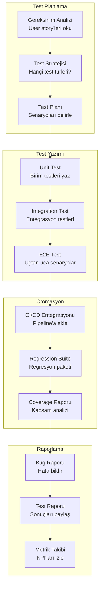
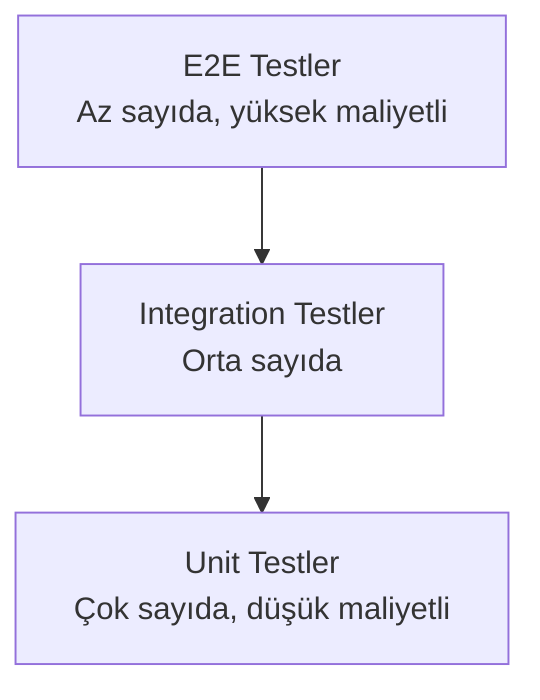
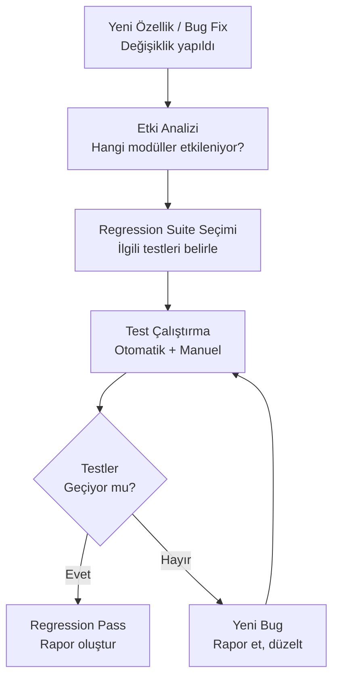
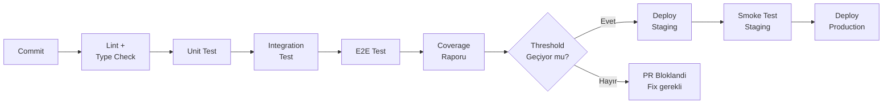

# QA / Test Uzmanı Rehberi

QA (Quality Assurance — Kalite Güvence) ve test uzmanları, yazılım kalitesinin bekçileridir. Test stratejisi oluşturmaktan otomasyon senaryolarına, regression (regresyon) testlerinden CI/CD (Sürekli Entegrasyon / Sürekli Dağıtım) pipeline'larına kadar geniş bir sorumluluk alanı taşırlar. Claude Code, bu süreçlerin her aşamasında güçlü bir asistan olarak QA uzmanlarının verimliliğini katlar.

---

## Ön Koşullar

| Konu | Bölüm |
|------|-------|
| Claude Code kurulumu | [Kurulum ve Gereksinimler](../06-claude-code-tanitim/03-kurulum-ve-gereksinimler.md) |
| Arayüz ve komutlar | [Bölüm 07](../07-arayuz-ve-komutlar/README.md) |
| Bellek ve bağlam yönetimi | [Bölüm 09](../09-bellek-ve-baglam/README.md) |
| CI/CD entegrasyonu | [Bölüm 16](../16-ci-cd-entegrasyonu/README.md) |

---

## QA İş Akışı

Bir QA uzmanının Claude Code ile tipik iş akışı:



---

## Test Stratejisi ve Claude Code

Claude Code ile farklı test türlerini nasıl oluşturabilirsiniz:

### Test Piramidi



### Unit Test (Birim Test) Oluşturma

```bash
claude "src/services/payment-service.ts dosyası için kapsamlı unit testler yaz. Jest kullan. Şu senaryoları kapsasın:
1. Başarılı ödeme işlemi
2. Yetersiz bakiye durumu
3. Geçersiz kart numarası
4. Timeout durumu
5. Tekrarlanan ödeme (idempotency)
Her test için arrange-act-assert pattern'ini kullan. Mock'ları jest.mock ile oluştur."
```

**Pratik Örnek: Service Test**

```bash
claude "UserService.createUser fonksiyonu için test yaz. Şu durumları kapsa:
- Geçerli input ile kullanıcı oluşturma (happy path)
- Email zaten kayıtlı ise DuplicateError fırlatma
- Geçersiz email formatında ValidationError fırlatma
- Veritabanı bağlantı hatası durumunda DatabaseError fırlatma
- Password'un hash'lendiğini doğrulama
Repository ve email service mock olsun."
```

### Integration Test (Entegrasyon Testi) Yazma

```bash
claude "Auth modülü için integration test yaz. Gerçek veritabanı (test container) kullanarak:
1. Register → Login → Token alma akışı
2. Geçersiz credentials ile login reddi
3. Expired token ile erişim reddi
4. Refresh token ile yeni access token alma
5. Logout sonrası token geçersizliği
Her testten önce veritabanını temiz duruma getir (beforeEach)."
```

### E2E Test (Uçtan Uca Test) Senaryoları

```bash
claude "Kullanıcı kayıt akışı için Playwright E2E testi yaz:
1. /register sayfasını aç
2. Formu doldur (ad, email, şifre)
3. Submit butonuna tıkla
4. Başarılı kayıt mesajını doğrula
5. Otomatik login yapıldığını doğrula (dashboard'a yönlendirme)
6. Aynı email ile tekrar kayıt olunmadığını doğrula
Page Object Model (POM) pattern'ini kullan."
```

### Performance Test (Performans Testi)

```bash
claude "API endpoint'leri için performans test senaryosu oluştur. k6 veya Artillery kullan:
1. GET /api/products — 100 concurrent user, 60 saniye
2. POST /api/orders — 50 concurrent user, 30 saniye
3. GET /api/search?q=test — 200 concurrent user, 60 saniye
Her senaryo için:
- Response time P50, P95, P99 hedefleri
- Error rate hedefi (%1 altı)
- Throughput hedefi
Sonuçları HTML rapor olarak üret."
```

---

## Test Otomasyon Örnekleri

### Jest / Vitest ile Unit Test

```bash
claude "src/utils/validators.ts dosyası için Vitest ile test dosyası oluştur. Her validator fonksiyonu için:
- Geçerli input'larla başarılı doğrulama
- Sınır değerler (boundary values)
- Geçersiz input'larla hata durumları
- null/undefined/empty string durumları
describe/it yapısını kullan. Her test grubu için en az 5 test case olsun."
```

**Pratik Vitest Prompt Zinciri:**

```bash
# 1. Mevcut test durumunu analiz et
claude "Projedeki mevcut testleri analiz et. Hangi dosyaların testi var, hangilerinin yok? Test coverage raporunu oluştur ve en düşük coverage'a sahip 10 dosyayı listele."

# 2. Eksik testleri tamamla
claude "Coverage'ı en düşük olan ilk 3 dosya için kapsamlı testler yaz. Mevcut test style'ını takip et."

# 3. Test kalitesini kontrol et
claude "Mevcut testleri incele. Şunları kontrol et: assertion'lar yeterli mi, edge case'ler kapsanmış mı, mock'lar doğru kullanılmış mı, test isolation sağlanmış mı."
```

### Playwright / Cypress ile E2E Test

```bash
claude "E-ticaret sitesi için Playwright E2E test suite'i oluştur. Page Object Model kullan:

Page Objects:
- LoginPage: login formu, hata mesajları
- ProductListPage: ürün kartları, arama, filtreleme
- CartPage: sepet öğeleri, toplam fiyat
- CheckoutPage: adres, ödeme, onay

Test Senaryoları:
1. Ürün arama ve filtreleme
2. Sepete ürün ekleme/çıkarma
3. Checkout akışı (login → sepet → adres → ödeme → onay)
4. Stokta olmayan ürün kontrolü
5. Responsive test (mobil/tablet/desktop)

Her test öncesi test verisi seed et."
```

```bash
# Cypress ile görsel regresyon testi
claude "Cypress ve cypress-image-snapshot kullanarak görsel regresyon testi oluştur. Şu sayfaların screenshot'ını karşılaştır: login, dashboard, profil, ayarlar. Mobil ve desktop viewport'ları için ayrı snapshot al."
```

### Load Testing (Yük Testi)

```bash
claude "k6 ile yük testi scripti oluştur:

Senaryo: E-ticaret Black Friday simülasyonu
- Ramp-up: 0'dan 500 kullanıcıya 5 dakikada çık
- Steady state: 500 kullanıcı 10 dakika
- Spike: 2000 kullanıcıya ani artış, 2 dakika
- Ramp-down: 0'a 3 dakikada in

Endpoint'ler ve ağırlıkları:
- GET /products (40%)
- GET /products/:id (25%)
- POST /cart (20%)
- POST /checkout (10%)
- GET /search (5%)

Threshold'lar:
- P95 response time < 500ms
- Error rate < 1%
- Request rate > 1000 req/s"
```

---

## Bug Raporlama ve Tracking (Takip)

Claude Code ile sistematik bug raporları oluşturun:

```bash
claude "Bu hatayı analiz et ve standart bug raporu formatında raporla:

Hata: Kullanıcı profil fotoğrafı yüklerken 413 hatası alıyor.

Rapor formatı:
- Başlık
- Severity (Şiddet): Critical/Major/Minor/Trivial
- Priority (Öncelik): P1/P2/P3/P4
- Ortam: Browser, OS, uygulama versiyonu
- Tekrarlama adımları (1, 2, 3...)
- Beklenen sonuç
- Gerçekleşen sonuç
- Ekran görüntüsü/log bağlantısı
- Olası kök neden (tahmini)
- Etkilenen kullanıcı segmenti"
```

### Bug Triage (Hata Önceliklendirme) Yardımı

```bash
claude "Şu hata listesini severity ve priority'ye göre sırala ve açıkla:
1. Login sayfası 500 hatası veriyor
2. Profil sayfasında typo var
3. Ödeme sonrası onay maili gitmiyor
4. Dark mode'da buton rengi yanlış
5. Arama sonuçları yavaş yükleniyor (5+ saniye)
6. Sepetteki ürün fiyatı yanlış hesaplanıyor
Her biri için severity, priority ve tahmini resolution time belirt."
```

---

## Regression Test (Regresyon Testi) Yönetimi



```bash
claude "Son PR'daki değişiklikleri analiz et ve etki analizi yap:
1. Hangi modüller doğrudan değişti?
2. Bu modüllere bağımlı olan modüller hangileri?
3. Hangi test suite'leri çalıştırılmalı?
4. Manuel test gerekiyor mu? Hangi senaryolar?
Sonucu bir regression test checklist olarak hazırla."
```

### Regression Suite Bakımı

```bash
claude "Mevcut test suite'i analiz et ve şunları belirle:
1. Flaky testler (bazen geçen, bazen kalan) — son 10 çalışmada tutarsız olanlar
2. Yavaş testler — 5 saniyeden uzun sürenler
3. Duplicate testler — aynı şeyi test eden testler
4. Gereksiz testler — artık var olmayan özellikler için yazılmış testler
Her kategori için düzeltme önerisi sun."
```

---

## Test Coverage (Test Kapsamı) Analizi

```bash
claude "Projenin test coverage raporunu analiz et. Şunları belirle:
1. Genel coverage oranı (line, branch, function, statement)
2. Coverage'ı %50'nin altında olan modüller
3. Hiç testi olmayan dosyalar
4. Kritik iş mantığı içeren ama test edilmemiş fonksiyonlar
5. Coverage artırmak için öncelik sırası öner

Hedef: Genel coverage %80, kritik modüller %90"
```

### Coverage Improvement (Kapsam İyileştirme) Planı

```bash
claude "Test coverage'ı %65'ten %80'e çıkarmak için bir plan oluştur:
1. En yüksek etkili (çok kullanılan, düşük coverage'lı) 10 dosyayı belirle
2. Her dosya için kaç test gerektiğini tahmin et
3. Testleri kolaylık sırasına göre sırala
4. Her grup için tahmini süre belirt
Toplam efor tahmini oluştur."
```

---

## CI/CD Pipeline'da Test Entegrasyonu



### GitHub Actions ile Test Pipeline

```bash
claude "GitHub Actions CI pipeline'ı oluştur. Şu adımları içersin:
1. PR açıldığında otomatik çalışsın
2. Node.js 20 ile setup
3. Bağımlılıkları yükle (cache ile)
4. Lint kontrolü (ESLint)
5. Type check (TypeScript)
6. Unit testler (Jest, parallel)
7. Integration testler (test database ile)
8. E2E testler (Playwright, headless)
9. Coverage raporu (codecov'a gönder)
10. Coverage threshold kontrolü (statement %80, branch %75)
PR'a otomatik yorum olarak test sonucu ve coverage değişimi ekle."
```

### Test Sonuçlarını PR'a Otomatik Raporlama

```bash
claude "CI pipeline'a test sonucu raporlama ekle. Her PR'da şu bilgiler yorum olarak eklensin:
- Toplam test sayısı / geçen / kalan
- Coverage değişimi (önceki vs şimdi)
- Yeni eklenen testler
- Yavaş testler (2s+) listesi
- Flaky test uyarısı
Format: Markdown tablo ve emoji'ler ile okunabilir olsun."
```

---

## QA İçin En İyi Prompt Pattern'leri

### 1. Test Case Üretimi

```bash
claude "Şu user story için test case'ler üret:
'Kullanıcı olarak, sepetimde indirim kodu uygulayabilmek istiyorum.'

Pozitif senaryolar:
- Geçerli kod ile indirim uygulanması
- Minimum sepet tutarı kontrolü
- Yüzdelik vs sabit indirim

Negatif senaryolar:
- Süresi geçmiş kod
- Zaten kullanılmış kod
- Geçersiz kod formatı
- Minimum tutar altı

Edge case'ler:
- Birden fazla indirim kodu
- İndirim sonrası 0 veya negatif tutar
- İndirim kodu + ücretsiz kargo kombinasyonu"
```

### 2. Test Verisi Oluşturma

```bash
claude "Test için gerekli mock veri setleri oluştur:
- 50 adet kullanıcı (farklı roller: admin, user, moderator)
- 100 adet ürün (farklı kategoriler, fiyat aralıkları)
- 200 adet sipariş (farklı durumlar: pending, processing, shipped, delivered, cancelled)
- 30 adet indirim kodu (aktif, süresi dolmuş, kullanılmış)
JSON formatında, gerçekçi verilerle. Factory pattern ile üretilebilir bir yapıda olsun."
```

### 3. Exploratory Testing (Keşif Testi) Rehberi

```bash
claude "Ödeme modülü için exploratory testing charter'ı oluştur:
- Hedef: Ödeme akışında beklenmeyen davranışlar bulmak
- Süre: 60 dakika
- Kapsam: Sepet → Adres → Ödeme → Onay
- Test fikirleri: Hızlı tıklama, geri tuşu, tab değiştirme, ağ kesintisi, çok büyük/küçük değerler
Session-based test management (SBTM) formatında hazırla."
```

### 4. API Test Senaryoları

```bash
claude "REST API endpoint'leri için kapsamlı test senaryoları oluştur:
POST /api/orders

Test grupları:
1. Request validation (geçersiz body, eksik alanlar, yanlış tipler)
2. Authentication (token yok, geçersiz token, expired token)
3. Authorization (yetkisiz rol)
4. Business rules (stok kontrolü, minimum sipariş)
5. Response format (status code, response body yapısı)
6. Error handling (500, 503, timeout)
7. Rate limiting (aşırı istek)
8. Idempotency (tekrarlanan istek)
Her test için expected status code ve response body belirt."
```

---

## QA Metrikleri ve KPI'lar

```bash
claude "QA takımı için dashboard metriklerini hesapla ve raporla:
1. Test coverage trend (son 4 sprint)
2. Bug detection rate (sprint başına bulunan bug sayısı)
3. Bug escape rate (production'a kaçan bug oranı)
4. Mean time to detect (ortalama tespit süresi)
5. Mean time to resolve (ortalama çözüm süresi)
6. Automation coverage (otomasyon oranı)
7. Flaky test oranı
8. CI pipeline success rate
Her metrik için hedef değer ve mevcut durumu karşılaştır."
```

---

## Özet

| Alan | Claude Code Katkısı |
|------|---------------------|
| **Test Planlama** | User story'den otomatik test case üretimi |
| **Unit Test** | Kapsamlı birim test oluşturma ve edge case tespiti |
| **Integration Test** | Servisler arası entegrasyon testleri |
| **E2E Test** | Playwright/Cypress ile uçtan uca senaryo |
| **Performance Test** | k6/Artillery ile yük testi senaryosu |
| **Bug Raporlama** | Standart formatta detaylı hata raporu |
| **Regression** | Etki analizi ve regression suite bakımı |
| **Coverage** | Kapsam analizi ve iyileştirme planı |
| **CI/CD** | Pipeline entegrasyonu ve otomatik raporlama |
| **Test Verisi** | Gerçekçi mock data üretimi |

---

## Sonraki Adım

Sistem uzmanları için altyapı, mimari ve DevOps iş akışları:

→ [Sistem Uzmanı Rehberi](./03-teknik-sistem-uzmani.md)
