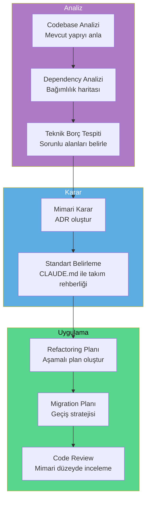
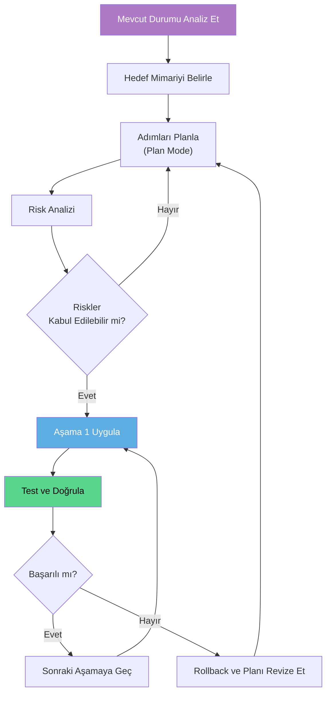

# Yazılım Mimarı Rehberi

Yazılım mimarları, teknik kararları yönlendiren, kod tabanının sağlığını koruyan ve ekip genelinde standartları belirleyen kilit rollerdir. Claude Code, mimari analiz, büyük ölçekli refactoring planlaması, dependency (bağımlılık) analizi ve migration (göç) planlaması gibi karmaşık görevlerde güçlü bir asistan sunar.

## Ön Koşullar

| Konu | Bölüm |
|------|-------|
| Claude Code temelleri | [Bölüm 06](../06-claude-code-tanitim/README.md) |
| Plan Mode | [Plan Modu](../07-arayuz-ve-komutlar/02-plan-modu.md) |
| Bellek ve bağlam yönetimi | [Bölüm 09](../09-bellek-ve-baglam/README.md) |
| Subagent'lar | [Bölüm 13](../13-subagentlar-ve-agent-takimlari/README.md) |

---

## Mimari İş Akışı

Bir yazılım mimarının Claude Code ile tipik iş akışı:



---

## Codebase Analizi

Yeni veya mevcut bir kod tabanını mimari düzeyde anlamak:

```bash
# Proje yapısını ve mimariyi analiz et
claude "Bu projenin mimari yapısını analiz et. Şunları belirle:
1. Kullanılan mimari pattern (MVC, Clean Architecture, Hexagonal vb.)
2. Katman yapısı ve sorumlulukları
3. Modüller arası bağımlılıklar
4. Entry point'ler ve akış
5. Potansiyel mimari sorunlar
Bulgularını bir mimari doküman olarak hazırla."
```

```bash
# Modüller arası bağımlılık haritası
claude "Bu projedeki tüm modülleri ve aralarındaki bağımlılıkları analiz et. Mermaid diagram olarak bir dependency graph (bağımlılık grafiği) çiz. Circular dependency (döngüsel bağımlılık) varsa kırmızı ile işaretle."
```

### Mimari Değerlendirme Kontrol Listesi

```bash
# Kapsamlı mimari sağlık kontrolü
claude "Bu kod tabanı için mimari sağlık kontrolü yap. Her madde için 1-5 arası puan ver:

1. Separation of Concerns (Sorumluluk Ayrımı)
2. Dependency Inversion (Bağımlılık Tersine Çevirme)
3. Single Responsibility (Tek Sorumluluk)
4. Code Duplication (Kod Tekrarı)
5. Error Handling Tutarlılığı
6. Test Coverage Yeterliliği
7. Configuration Management
8. Logging ve Observability
9. Security Practices
10. API Design Tutarlılığı

Her düşük puan için somut iyileştirme önerisi sun."
```

---

## Dependency Analizi

Proje bağımlılıklarını analiz ederek risk ve fırsat tespiti:

```bash
# Bağımlılık risk analizi
claude "package.json (veya requirements.txt / go.mod) dosyasını analiz et. Her bağımlılık için:
1. Son güncelleme tarihi
2. Maintenance durumu (aktif/archived/deprecated)
3. Güvenlik açığı (CVE) kontrolü
4. Alternatifler (daha iyi seçenekler varsa)
5. Breaking change riski
Sonuçları risk seviyesine göre (yüksek/orta/düşük) sırala."
```

```bash
# Kullanılmayan bağımlılıkları tespit et
claude "Bu projedeki tüm bağımlılıkları tara. Hiçbir yerde import edilmeyen veya kullanılmayan bağımlılıkları tespit et. Her biri için kaldırılabilir mi yoksa dolaylı mı kullanılıyor belirt."
```

---

## Mimari Karar Kaydı (ADR)

Architecture Decision Record (Mimari Karar Kaydı) oluşturma:

```bash
# ADR oluştur
claude "Aşağıdaki mimari karar için bir ADR (Architecture Decision Record) oluştur:

Karar: Monolith'ten microservice'e geçiş
Bağlam: Mevcut monolith uygulama ölçeklenemiyor

ADR formatı:
- Başlık
- Tarih
- Durum (Proposed/Accepted/Deprecated)
- Bağlam (Mevcut durum ve sorunlar)
- Değerlendirilen Seçenekler (en az 3, artı/eksi ile)
- Karar ve Gerekçe
- Sonuçlar (Olumlu ve olumsuz)
- Riskler ve Azaltma Stratejileri"
```

---

## Büyük Ölçekli Refactoring Planlaması

Refactoring planlarını Claude Code'un Plan Mode'u ile hazırlayın:



```bash
# Refactoring planı oluştur
claude "Bu projeyi Clean Architecture'a taşımak istiyorum. Mevcut yapıyı analiz et ve şu formatta bir refactoring planı hazırla:

Aşama 1: [En az riskli değişiklikler]
Aşama 2: [Orta riskli değişiklikler]
Aşama 3: [Yüksek riskli değişiklikler]

Her aşama için:
- Etkilenen dosyalar
- Tahmini süre
- Risk seviyesi
- Rollback stratejisi
- Doğrulama kriterleri (testler)

Aşamalar birbirinden bağımsız deploy edilebilir olsun."
```

```bash
# Worktree ile paralel refactoring denemeleri
claude --worktree refactor/approach-a "Approach A: Domain-driven refactoring uygula"
claude --worktree refactor/approach-b "Approach B: Layer-based refactoring uygula"
```

---

## Takım Rehberliği: CLAUDE.md

Yazılım mimarı olarak, takımın Claude Code kullanımını `CLAUDE.md` dosyası ile standardize edin:

```markdown
# Proje: Fintech Platform

## Mimari Prensipler
- Hexagonal Architecture (Ports & Adapters)
- Domain-Driven Design (DDD)
- CQRS for read/write separation
- Event Sourcing for audit trail

## Katman Kuralları
```
src/
├── domain/          # İş kuralları (framework bağımsız)
├── application/     # Use case'ler ve command/query handler'lar
├── infrastructure/  # Veritabanı, API, messaging implementasyonları
└── presentation/    # Controller, DTO, serializer
```

## Bağımlılık Kuralı
- Domain → HİÇBİR ŞEY (saf iş kuralları)
- Application → Domain
- Infrastructure → Application, Domain
- Presentation → Application

## Kod Standartları
- Interface'ler domain katmanında tanımlanır
- Concrete implementasyonlar infrastructure'da yaşar
- Controller'lar ince olmalı, iş mantığı Service'lerde
- Her aggregate root kendi dizininde
- Value Object'ler immutable olmalı

## Anti-Pattern'ler (YAPMA)
- Domain entity'lerinde framework annotation kullanma
- Service'ler arası doğrudan çağrı yapma (event kullan)
- Repository'de iş mantığı bulundurma
- Controller'da doğrudan veritabanı sorgusu yapma
- God class oluşturma (500+ satır uyarı)

## Migration Kuralları
- Her migration geri alınabilir (reversible) olmalı
- Data migration ve schema migration ayrı olmalı
- Migration'lar idempotent olmalı
```

---

## Mimari Düzey Code Review

```bash
# Mimari perspektiften code review
claude "Bu PR'daki değişiklikleri mimari perspektiften incele. Şunları kontrol et:
1. Katman ihlalleri (domain'den infrastructure'a doğrudan erişim var mı?)
2. SOLID prensip ihlalleri
3. Yeni bağımlılıklar uygun mu?
4. API kontratı değişiklikleri geriye uyumlu mu?
5. Performans etkisi (N+1 sorgu, gereksiz eager loading)
6. Güvenlik: input validation, authorization kontrolleri
Her bulgu için severity ve düzeltme önerisi sun."
```

```bash
# Mimari uyumluluk kontrolü
claude "Bu projede katman kurallarına uyulup uyulmadığını kontrol et. Domain katmanından infrastructure katmanına doğrudan import var mı? Varsa hangi dosyalarda ve nasıl düzeltilmeli?"
```

---

## Migration Planlaması

Teknoloji geçişlerini planlama ve yönetme:

```bash
# Veritabanı migration planı
claude "PostgreSQL'den MongoDB'ye migration planı oluştur. Mevcut schema'yı analiz et ve şunları belirle:
1. Her tablo için hedef MongoDB collection yapısı
2. İlişkilerin nasıl modellenecegi (embedding vs referencing)
3. Data migration script'i
4. Dual-write dönemi stratejisi
5. Rollback planı
6. Zero-downtime migration adımları"
```

```bash
# Framework migration
claude "Bu Express.js projesini NestJS'e migrate etmek istiyorum. Mevcut route'ları, middleware'leri ve service'leri analiz et. Her birinin NestJS karşılığını belirle ve aşamalı bir migration planı oluştur. Her aşamada hem eski hem yeni sistem çalışabilmeli."
```

---

## Özet

| Görev | Claude Code Yaklaşımı |
|-------|----------------------|
| **Codebase Analizi** | Mimari pattern tespiti, katman analizi, bağımlılık grafiği |
| **Mimari Karar** | ADR oluşturma, seçenek karşılaştırma |
| **Refactoring** | Plan Mode ile aşamalı plan, worktree ile paralel denemeler |
| **Standart Belirleme** | CLAUDE.md ile takım geneli kurallar |
| **Code Review** | Mimari düzeyde katman ihlali ve SOLID kontrolü |
| **Migration** | Aşamalı geçiş planı, rollback stratejisi |

---

## Sonraki Adım

İş analistleri için özel iş akışları — gereksinim analizi, user story oluşturma ve prototipleme:

→ [Analist Rehberi](./03-analist-rehberi.md)
