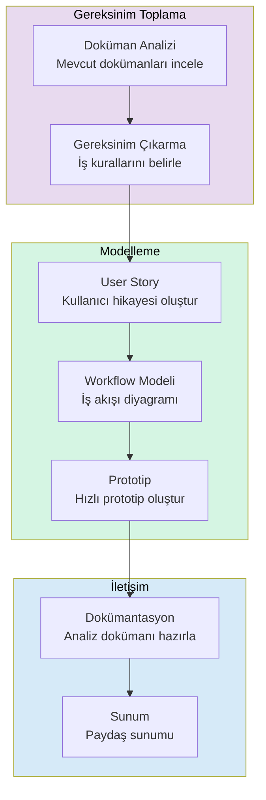

# Analist Rehberi

İş analistleri (Business Analyst), gereksinim toplama, user story oluşturma, iş süreçlerini modelleme ve paydaşlarla iletişim gibi kritik görevleri yürütür. Claude Code, teknik bilgi düzeyinden bağımsız olarak analistlere güçlü bir analiz ve prototipleme ortamı sunar.

## Ön Koşullar

| Konu | Bölüm |
|------|-------|
| Claude Code temelleri | [Bölüm 06](../06-claude-code-tanitim/README.md) |
| Araçlar genel bakış | [Araçlara Genel Bakış](../08-araclar/01-araclara-genel-bakis.md) |
| Prompt mühendisliği | [Prompt Mühendisliği](../04-ai-destekli-gelistirme/04-prompt-muhendisligi.md) |

---

## Analist İş Akışı

Bir iş analistinin Claude Code ile tipik iş akışı:



---

## Gereksinim Analizi

Mevcut dokümanlardan sistematik gereksinim çıkarma:

```bash
# Toplantı notlarından gereksinim çıkarma
claude "Aşağıdaki toplantı notlarını analiz et ve yapılandırılmış gereksinimler çıkar:

[Toplantı notları buraya yapıştırılır]

Her gereksinim için:
1. ID (REQ-001 formatında)
2. Başlık
3. Açıklama
4. Öncelik (Must/Should/Could/Won't - MoSCoW)
5. Kabul kriterleri
6. Bağımlılıklar
7. Riskler"
```

```bash
# Mevcut sistem analizi
claude "Bu projenin kaynak kodunu analiz ederek mevcut iş kurallarını çıkar. Her iş kuralı için: hangi dosyada tanımlı, ne yaptığı ve hangi modülü etkilediğini listele. Sonuçları bir iş kuralları kataloğu olarak hazırla."
```

### Gereksinim Doğrulama

```bash
# Gereksinim tutarlılık kontrolü
claude "Aşağıdaki gereksinim listesini analiz et ve şunları kontrol et:
1. Çelişen gereksinimler var mı?
2. Eksik gereksinimler (belirtilen akışlarda gap var mı?)
3. Belirsiz gereksinimler (ölçülebilir değil mi?)
4. Tekrarlayan gereksinimler
5. Bağımlılık döngüsü

[Gereksinim listesi buraya yapıştırılır]"
```

---

## User Story Oluşturma

Analist olarak kullanıcı hikayelerini Claude Code ile hızlıca oluşturun:

```bash
# User story oluşturma
claude "E-ticaret sipariş yönetimi modülü için user story'ler oluştur. Her story şu formatta olsun:

**Story:** [US-XXX] Başlık
**Rol:** [Kullanıcı rolü] olarak
**İstiyorum:** [Yapmak istediğim şey]
**Böylece:** [Elde edeceğim değer]

**Kabul Kriterleri:**
- [ ] Kriter 1
- [ ] Kriter 2

**Story Point:** [1/2/3/5/8/13]
**Öncelik:** [Must/Should/Could]

En az 10 user story oluştur. Epic'lere grupla."
```

```bash
# User story detaylandırma
claude "Bu user story'yi detaylandır ve aşağıdakileri ekle:
1. Edge case'ler ve alternatif akışlar
2. UI wireframe önerisi (metin tabanlı)
3. API endpoint önerisi
4. Veri modeli gereksinimi
5. Test senaryoları

US-005: Kullanıcı olarak sipariş geçmişimi görüntülemek istiyorum."
```

---

## Workflow Modelleme

İş süreçlerini diyagramlarla modelleme:

```bash
# BPMN tarzı iş akışı oluştur
claude "Aşağıdaki iş sürecini mermaid diagram olarak modellememi sağla:

Sipariş Süreci:
1. Müşteri sipariş verir
2. Stok kontrolü yapılır
3. Stok yoksa müşteriye bildirim gider
4. Stok varsa ödeme alınır
5. Ödeme başarısızsa 3 kez tekrar denenir
6. Ödeme başarılıysa kargo sürecine girer
7. Kargo gönderildiğinde müşteriye SMS ve email gider
8. Teslimat onayı ile süreç kapanır

Karar noktalarını, paralel akışları ve hata durumlarını göster."
```

```bash
# Mevcut süreç analizi ve iyileştirme
claude "Bu projenin kaynak kodunu analiz ederek kullanıcı kayıt sürecini çıkar. Mevcut akışı bir flowchart ile göster. Ardından şunları öner:
1. Gereksiz adımlar (kaldırılabilecek)
2. Eksik adımlar (eklenmesi gereken)
3. Optimize edilebilecek noktalar
4. İyileştirilmiş akışı ayrı bir flowchart olarak çiz"
```

---

## Hızlı Prototipleme

Teknik bilgi gerektirmeden hızlı prototipler oluşturun:

```bash
# HTML prototip oluştur
claude "Müşteri şikayet yönetim sistemi için tek sayfalık bir HTML prototip oluştur. Şunları içersin:
1. Şikayet listesi (tablo görünümü)
2. Yeni şikayet formu (modal)
3. Durum filtreleme (Yeni/İşlemde/Çözüldü)
4. Basit istatistik kartları (toplam, açık, çözülen)

Modern görünümlü olsun. Gerçek veri bağlantısı gerekmiyor, örnek veri ile çalışsın. Tailwind CSS kullan."
```

```bash
# Clickable wireframe
claude "Kullanıcı profil sayfası için interaktif bir wireframe oluştur. Sayfa bölümleri:
1. Profil bilgileri (avatar, isim, email)
2. Ayarlar tabları (Genel, Güvenlik, Bildirimler)
3. Her tab'ın içeriği
Tailwind CSS ile responsive olsun. Gerçek fonksiyonellik yerine placeholder kullan."
```

---

## Veri Analizi ve Görselleştirme

Mevcut verilerden analiz ve görsel çıkarma:

```bash
# CSV verisi analizi
claude "data/sales.csv dosyasını analiz et. Şunları hesapla:
1. Aylık satış trendi
2. En çok satan ürünler (top 10)
3. Müşteri segmentasyonu
4. Ortalama sipariş değeri
5. Yıllık büyüme oranı
Sonuçları hem tablo hem de mermaid diagram olarak sun."
```

```bash
# Veritabanı analizi
claude "Bu projenin veritabanı schema'sını analiz et. Şunları çıkar:
1. Entity Relationship Diagram (ERD) - mermaid ile
2. Tablo bazında kayıt tahminleri
3. İlişki türleri (1:1, 1:N, M:N)
4. Normalizasyon seviyesi ve öneriler
5. İndeks önerileri"
```

---

## Dokümantasyon Üretimi

Analist çıktılarını profesyonel dokümanlara dönüştürme:

```bash
# Gereksinim dokümanı oluştur
claude "Toplanan gereksinimleri kullanarak profesyonel bir SRS (Software Requirements Specification) dokümanı oluştur. IEEE 830 formatına uygun olsun:
1. Giriş (amaç, kapsam, tanımlar)
2. Genel Tanım (ürün perspektifi, kullanıcı sınıfları)
3. Fonksiyonel Gereksinimler (use case bazlı)
4. Non-Fonksiyonel Gereksinimler (performans, güvenlik, uyumluluk)
5. Ek: Veri sözlüğü, akış diyagramları"
```

```bash
# Toplantı notu ve karar özeti
claude "Aşağıdaki toplantı notlarını düzenle ve şu formatta bir çıktı hazırla:
1. Toplantı Özeti (3-5 cümle)
2. Alınan Kararlar (karar, sorumlu, tarih)
3. Aksiyon Maddeleri (görev, atanan, deadline)
4. Açık Konular (tartışılacak, sonraki toplantıda)
5. Katılımcılar

[Toplantı notları buraya yapıştırılır]"
```

---

## Paydaş İletişimi

Teknik olmayan paydaşlar için anlaşılır çıktılar hazırlama:

```bash
# Teknik analizi iş diline çevir
claude "Aşağıdaki teknik bulguları teknik bilgisi olmayan yöneticiler için anlaşılır bir rapora dönüştür:
- Technical debt oranı %35
- 3 circular dependency tespit edildi
- Test coverage %45
- 12 deprecated API kullanımı var

Her bulgu için: iş etkisi, risk seviyesi ve tavsiye aksiyonu belirt. Teknik jargon kullanma."
```

---

## Analistler İçin En İyi Prompt Pattern'leri

### 1. Rol Belirtme

```bash
# İyi ✅
claude "Bir iş analisti olarak bu toplantı notlarını analiz et ve yapılandırılmış gereksinimler çıkar."
```

### 2. Format Belirleme

```bash
# İyi ✅
claude "Bu süreci modellerken çıktıyı şu formatta ver: 1) Mermaid flowchart, 2) Adım listesi, 3) RACI matrisi"
```

### 3. Hedef Kitle Belirtme

```bash
# İyi ✅
claude "Bu teknik raporu C-level yöneticiler için özetle. Maksimum 1 sayfa, bullet point formatında, iş etkisi odaklı."
```

### 4. Karşılaştırma İsteme

```bash
# İyi ✅
claude "Mevcut süreç ile önerilen süreç arasındaki farkları tablo formatında karşılaştır. Her fark için: mevcut durum, önerilen durum, beklenen kazanç."
```

---

## Özet

| Görev | Claude Code Katkısı |
|------|---------------------|
| **Gereksinim Analizi** | Dokümanlardan yapılandırılmış gereksinim çıkarma |
| **User Story** | Formatlı, kabul kriterli story oluşturma |
| **Workflow** | Mermaid ile iş süreci modelleme |
| **Prototipleme** | Kod bilmeden HTML/CSS prototip |
| **Veri Analizi** | CSV/veritabanı analizi ve görselleştirme |
| **Dokümantasyon** | SRS, toplantı notu, karar raporu |
| **İletişim** | Teknik bulguları iş diline çevirme |

---

## Sonraki Adım

Vibe Coder'lar için hızlı prototipleme ve AI-native geliştirme iş akışı:

→ [Vibe Coder Rehberi](./04-vibe-coder-rehberi.md)
