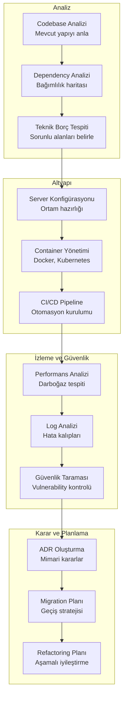
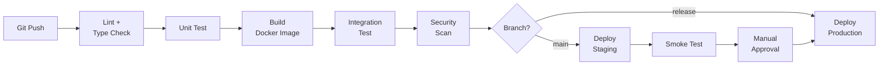
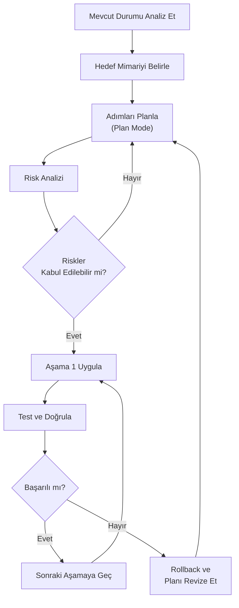

# Sistem Uzmanı Rehberi

Sistem uzmanları; altyapı (infrastructure), mimari (architecture) ve DevOps süreçlerini yöneten, teknik kararları şekillendiren ve kod tabanının sağlığını koruyan kilit rollerdir. Bu rehber, Claude Code'un mimari analiz, altyapı yönetimi, güvenlik taraması, migration (göç) planlaması ve performans optimizasyonu gibi karmaşık görevlerde nasıl güçlü bir asistan sunduğunu kapsar.

---

## Ön Koşullar

| Konu | Bölüm |
|------|-------|
| Claude Code temelleri | [Bölüm 06](../06-claude-code-tanitim/README.md) |
| Plan Mode (Plan Modu) | [Plan Modu](../07-arayuz-ve-komutlar/02-plan-modu.md) |
| Bellek ve bağlam yönetimi | [Bölüm 09](../09-bellek-ve-baglam/README.md) |
| Subagent'lar | [Bölüm 13](../13-subagentlar-ve-agent-takimlari/README.md) |
| CI/CD entegrasyonu | [Bölüm 16](../16-ci-cd-entegrasyonu/README.md) |

---

## Sistem Uzmanı İş Akışı

Bir sistem uzmanının Claude Code ile tipik iş akışı:



---

## Mimari Analiz

### Codebase (Kod Tabanı) Analizi

Yeni veya mevcut bir kod tabanını mimari düzeyde anlamak:

```bash
claude "Bu projenin mimari yapısını analiz et. Şunları belirle:
1. Kullanılan mimari pattern (MVC, Clean Architecture, Hexagonal vb.)
2. Katman yapısı ve sorumlulukları
3. Modüller arası bağımlılıklar
4. Entry point'ler (giriş noktaları) ve akış
5. Potansiyel mimari sorunlar
Bulgularını bir mimari doküman olarak hazırla."
```

```bash
claude "Bu projedeki tüm modülleri ve aralarındaki bağımlılıkları analiz et. Mermaid diagram olarak bir dependency graph (bağımlılık grafiği) çiz. Circular dependency (döngüsel bağımlılık) varsa işaretle."
```

### Dependency (Bağımlılık) Analizi

Proje bağımlılıklarını analiz ederek risk ve fırsat tespiti:

```bash
claude "package.json (veya requirements.txt / go.mod) dosyasını analiz et. Her bağımlılık için:
1. Son güncelleme tarihi
2. Maintenance durumu (aktif/archived/deprecated)
3. Güvenlik açığı (CVE) kontrolü
4. Alternatifler (daha iyi seçenekler varsa)
5. Breaking change (kırılma değişikliği) riski
Sonuçları risk seviyesine göre (yüksek/orta/düşük) sırala."
```

```bash
claude "Bu projedeki tüm bağımlılıkları tara. Hiçbir yerde import edilmeyen veya kullanılmayan bağımlılıkları tespit et. Her biri için kaldırılabilir mi yoksa dolaylı mı kullanılıyor belirt."
```

### Teknik Borç Tespiti

```bash
claude "Bu kod tabanında teknik borç analizi yap. Şu kategorilerde sorunları tespit et:
1. Code smell'ler (uzun fonksiyonlar, god class'lar, feature envy)
2. Outdated pattern'ler (callback hell, var kullanımı, vb.)
3. Eksik error handling (hata yönetimi)
4. Hardcoded değerler (configuration'a taşınması gerekenler)
5. Test edilmemiş kritik kodlar
6. Dokümantasyon eksiklikleri

Her bulgu için: severity (şiddet), effort (düzeltme efor tahmini) ve önerilen çözüm belirt."
```

### Mimari Değerlendirme Kontrol Listesi

```bash
claude "Bu kod tabanı için mimari sağlık kontrolü yap. Her madde için 1-5 arası puan ver:

1. Separation of Concerns (Sorumluluk Ayrımı)
2. Dependency Inversion (Bağımlılık Tersine Çevirme)
3. Single Responsibility (Tek Sorumluluk)
4. Code Duplication (Kod Tekrarı)
5. Error Handling Tutarlılığı
6. Test Coverage (Test Kapsamı) Yeterliliği
7. Configuration Management (Konfigürasyon Yönetimi)
8. Logging ve Observability (Gözlemlenebilirlik)
9. Security Practices (Güvenlik Pratikleri)
10. API Design Tutarlılığı

Her düşük puan için somut iyileştirme önerisi sun."
```

---

## Altyapı Yönetimi

### Server Konfigürasyonu

```bash
claude "Nginx reverse proxy konfigürasyonu oluştur. Şu gereksinimleri karşılasın:
1. SSL/TLS termination (Let's Encrypt)
2. HTTP/2 desteği
3. Gzip compression
4. Rate limiting (IP başına 100 req/dk)
5. WebSocket proxy
6. Static asset caching (1 yıl)
7. Security header'ları (HSTS, CSP, X-Frame-Options)
8. Health check endpoint
Konfigürasyonu açıklayarak oluştur."
```

```bash
claude "Production ortamı için .env.example dosyası oluştur. Şu kategorilerde environment variable'lar olsun:
- Database (connection string, pool size)
- Redis (host, port, password)
- JWT (secret, expiration)
- Email (SMTP ayarları)
- Cloud storage (S3/GCS credentials)
- Monitoring (Sentry DSN, log level)
- Feature flags
Her değişken için açıklama ve örnek değer ekle."
```

### Docker / Container Yönetimi

```bash
claude "Bu proje için production-ready Dockerfile oluştur:
- Multi-stage build (builder + runner)
- Non-root user
- Health check
- Minimal image size (alpine base)
- Build cache optimizasyonu
- Security best practice'ler
Ayrıca docker-compose.yml dosyası ile: app, PostgreSQL, Redis, Nginx servislerini tanımla."
```

**Docker Compose Örneği:**

```bash
claude "Geliştirme ortamı için docker-compose.yml oluştur:
Servisler:
- app: Node.js uygulaması (hot-reload ile)
- db: PostgreSQL 16 (volume ile kalıcı veri)
- redis: Redis 7 (session store)
- mailhog: Email test servisi
- adminer: Veritabanı yönetim aracı
Network: Tüm servisler aynı network'te
Volume: db-data, redis-data
Environment: .env dosyasından oku"
```

### Kubernetes Konfigürasyonu

```bash
claude "Bu uygulama için Kubernetes manifest dosyaları oluştur:
1. Deployment (3 replica, rolling update stratejisi)
2. Service (ClusterIP)
3. Ingress (TLS, path-based routing)
4. ConfigMap (uygulama ayarları)
5. Secret (hassas bilgiler)
6. HPA (Horizontal Pod Autoscaler: CPU %70'te scale)
7. PDB (Pod Disruption Budget: min 2 available)
8. Resource limits (CPU: 500m, Memory: 512Mi)
Helm chart olarak organize et."
```

### CI/CD Pipeline Kurulumu



```bash
claude "GitHub Actions CI/CD pipeline oluştur:
1. PR açıldığında: lint, type-check, test, build
2. main'e merge: staging'e otomatik deploy
3. release tag: production'a deploy (manual approval ile)

Her stage için:
- Cache stratejisi (node_modules, Docker layer)
- Paralel çalışma (test'ler paralel)
- Artifact saklama (build output, coverage raporu)
- Slack bildirimi (başarı/hata)
- Rollback mekanizması"
```

---

## Performans ve İzleme

### Performans Analizi

```bash
claude "Bu uygulamanın performans darboğazlarını (bottleneck) analiz et:
1. Yavaş veritabanı sorguları (N+1 problem, eksik index)
2. Bellek sızıntıları (memory leak)
3. Gereksiz re-render'lar (frontend)
4. Büyük bundle size
5. Optimize edilmemiş resimler/asset'ler
6. Eksik caching
Her bulgu için somut düzeltme önerisi sun ve öncelik sırasına göre sırala."
```

```bash
claude "Veritabanı sorgularını optimize et:
1. Tüm ORM sorgularını bul ve ham SQL karşılığını göster
2. Execution plan (EXPLAIN ANALYZE) çıktılarını analiz et
3. Eksik index'leri tespit et
4. N+1 sorgu problemlerini bul ve eager loading ile düzelt
5. Gereksiz JOIN'leri belirle
Optimizasyon sonrası beklenen performans kazancını tahmin et."
```

### Log Analizi

```bash
claude "Uygulama loglarını analiz et ve şunları belirle:
1. En sık tekrarlanan hata mesajları (top 10)
2. Hata kalıpları (belirli saatlerde artış var mı?)
3. Slow query log'ları (1 saniyeden uzun sorgular)
4. 4xx ve 5xx HTTP hatalarının dağılımı
5. Kullanıcı etkisi (kaç kullanıcı etkileniyor?)
Sonuçları özet rapor olarak hazırla ve acil müdahale gereken noktaları vurgula."
```

### Monitoring (İzleme) Kurulumu

```bash
claude "Prometheus + Grafana monitoring kurulumu oluştur:
1. Prometheus konfigürasyonu (scrape config)
2. Node.js uygulama metrik'leri (prom-client ile):
   - HTTP request duration (histogram)
   - Active connections (gauge)
   - Error rate (counter)
   - Database query duration (histogram)
   - Memory/CPU usage
3. Grafana dashboard JSON'ları:
   - Uygulama genel durumu
   - Veritabanı performansı
   - Error tracking
4. Alert kuralları:
   - Error rate > %5: warning
   - Response time P95 > 2s: warning
   - Memory > %80: critical
   - Disk > %90: critical"
```

---

## Güvenlik

### Güvenlik Taraması

```bash
claude "Bu projenin güvenlik analizi yap. OWASP Top 10'a göre kontrol et:
1. Injection (SQL, NoSQL, OS command)
2. Broken Authentication (zayıf şifre politikası, session yönetimi)
3. Sensitive Data Exposure (hassas veri ifşası)
4. XML External Entities (XXE)
5. Broken Access Control (yetki kontrolü eksiklikleri)
6. Security Misconfiguration (güvenlik yapılandırma hataları)
7. Cross-Site Scripting (XSS)
8. Insecure Deserialization
9. Using Components with Known Vulnerabilities
10. Insufficient Logging & Monitoring

Her bulgu için: risk seviyesi, etkilenen dosya/fonksiyon ve düzeltme önerisi sun."
```

### Penetration Test (Sızma Testi) Hazırlığı

```bash
claude "API endpoint'leri için penetration test checklist'i oluştur:
1. Authentication bypass denemeleri
2. Authorization bypass (farklı role ile erişim)
3. Input validation (SQL injection, XSS, path traversal)
4. Rate limiting kontrolü
5. CORS policy kontrolü
6. JWT/Token manipülasyonu
7. File upload güvenliği
8. Error message information leakage
9. HTTP header güvenliği
10. API versioning ve deprecation

Her kontrol için: test yöntemi, beklenen sonuç ve düzeltme önerisi ekle."
```

### Compliance (Uyumluluk) Kontrolü

```bash
claude "KVKK/GDPR uyumluluk kontrolü yap:
1. Kişisel veri toplanan noktaları belirle
2. Veri saklama sürelerini kontrol et
3. Veri silme mekanizması var mı? (right to be forgotten)
4. Veri şifreleme durumu (at rest, in transit)
5. Kullanıcı onay mekanizması (consent)
6. Veri erişim logları
7. Data breach bildirim mekanizması
8. Üçüncü taraf veri paylaşımı kontrolü
Eksik noktaları listele ve düzeltme planı oluştur."
```

---

## Migration (Göç) Planlaması

Teknoloji geçişlerini planlama ve yönetme:



### Veritabanı Migration

```bash
claude "PostgreSQL'den MongoDB'ye migration planı oluştur. Mevcut schema'yı analiz et ve şunları belirle:
1. Her tablo için hedef MongoDB collection yapısı
2. İlişkilerin nasıl modelleneceği (embedding vs referencing)
3. Data migration script'i
4. Dual-write dönemi stratejisi
5. Rollback planı
6. Zero-downtime migration adımları"
```

### Framework Migration

```bash
claude "Bu Express.js projesini NestJS'e migrate etmek istiyorum. Mevcut route'ları, middleware'leri ve service'leri analiz et. Her birinin NestJS karşılığını belirle ve aşamalı bir migration planı oluştur. Her aşamada hem eski hem yeni sistem çalışabilmeli."
```

### Monolith'ten Microservice'e Geçiş

```bash
claude "Bu monolith uygulamayı microservice'lere bölme planı oluştur:
1. Bounded context'leri belirle (hangi modüller ayrı servis olabilir?)
2. Veri bağımlılıklarını analiz et (paylaşılan tablolar)
3. İletişim stratejisi (REST vs gRPC vs message queue)
4. Shared library ihtiyaçları
5. Her servis için: sorumluluklar, API kontratı, veri modeli
6. Strangler fig pattern ile aşamalı geçiş planı
7. Service discovery ve API gateway ihtiyacı
8. Distributed tracing ve centralized logging kurulumu"
```

---

## ADR (Architecture Decision Record — Mimari Karar Kaydı) Oluşturma

```bash
claude "Aşağıdaki mimari karar için bir ADR oluştur:

Karar: Monolith'ten microservice'e geçiş
Bağlam: Mevcut monolith uygulama ölçeklenemiyor

ADR formatı:
- Başlık ve Numara
- Tarih
- Durum (Proposed/Accepted/Deprecated)
- Bağlam (Mevcut durum ve sorunlar)
- Değerlendirilen Seçenekler (en az 3, artı/eksi ile)
- Karar ve Gerekçe
- Sonuçlar (Olumlu ve olumsuz)
- Riskler ve Azaltma Stratejileri
- İlgili ADR'ler"
```

**ADR Şablonu Örneği:**

```bash
claude "ADR dizini oluştur ve şu ADR'leri yaz:
ADR-001: Veritabanı seçimi (PostgreSQL vs MySQL vs MongoDB)
ADR-002: API tasarım yaklaşımı (REST vs GraphQL)
ADR-003: Authentication stratejisi (JWT vs Session)
ADR-004: Cache stratejisi (Redis vs Memcached vs In-memory)
Her ADR için bağlam, seçenekler, karar ve sonuçları yaz."
```

---

## CLAUDE.md Şablonu: Sistem Takımı

```markdown
# Proje: Fintech Platform

## Mimari Prensipler
- Hexagonal Architecture (Ports & Adapters)
- Domain-Driven Design (DDD)
- CQRS for read/write separation
- Event Sourcing for audit trail

## Katman Kuralları
src/
├── domain/          # İş kuralları (framework bağımsız)
├── application/     # Use case'ler ve command/query handler'lar
├── infrastructure/  # Veritabanı, API, messaging implementasyonları
└── presentation/    # Controller, DTO, serializer

## Bağımlılık Kuralı
- Domain → HİÇBİR ŞEY (saf iş kuralları)
- Application → Domain
- Infrastructure → Application, Domain
- Presentation → Application

## Anti-Pattern'ler (YAPMA)
- Domain entity'lerinde framework annotation kullanma
- Service'ler arası doğrudan çağrı yapma (event kullan)
- Repository'de iş mantığı bulundurma
- Controller'da doğrudan veritabanı sorgusu yapma
- God class oluşturma (500+ satır uyarı)

## Altyapı Kuralları
- Her servis Docker container'da çalışmalı
- Environment variable'lar .env dosyasından okunmalı
- Secret'lar asla kod içinde hardcode edilmemeli
- Her deploy geri alınabilir (reversible) olmalı

## Migration Kuralları
- Her migration geri alınabilir (reversible) olmalı
- Data migration ve schema migration ayrı olmalı
- Migration'lar idempotent olmalı
```

---

## Büyük Ölçekli Refactoring Planlaması

```bash
claude "Bu projeyi Clean Architecture'a taşımak istiyorum. Mevcut yapıyı analiz et ve şu formatta bir refactoring planı hazırla:

Aşama 1: [En az riskli değişiklikler]
Aşama 2: [Orta riskli değişiklikler]
Aşama 3: [Yüksek riskli değişiklikler]

Her aşama için:
- Etkilenen dosyalar
- Tahmini süre
- Risk seviyesi
- Rollback stratejisi
- Doğrulama kriterleri (testler)

Aşamalar birbirinden bağımsız deploy edilebilir olsun."
```

```bash
# Worktree ile paralel refactoring denemeleri
claude --worktree refactor/approach-a "Approach A: Domain-driven refactoring uygula"
claude --worktree refactor/approach-b "Approach B: Layer-based refactoring uygula"
```

---

## Sistem Uzmanı İçin En İyi Prompt Pattern'leri

### 1. Altyapı as Code

```bash
claude "Terraform ile AWS altyapısı oluştur:
- VPC (3 AZ, public/private subnet)
- ECS Fargate cluster
- RDS PostgreSQL (Multi-AZ)
- ElastiCache Redis
- ALB (Application Load Balancer)
- CloudWatch alarmları
- S3 bucket (static assets)
Modüler yapıda, environment variable'lar ile parametrik olsun."
```

### 2. Disaster Recovery (Felaket Kurtarma)

```bash
claude "Disaster recovery planı oluştur:
- RPO (Recovery Point Objective): 1 saat
- RTO (Recovery Time Objective): 4 saat
- Veritabanı backup stratejisi (full + incremental)
- Cross-region replication
- Failover prosedürü (adım adım)
- Test planı (yılda 2 kez DR drill)
- Communication plan (kimlere ne zaman bildirim)"
```

### 3. Capacity Planning (Kapasite Planlama)

```bash
claude "Mevcut kullanım metriklerini analiz et ve 6 aylık kapasite planı oluştur:
- Kullanıcı büyüme tahmini
- Veritabanı boyutu büyüme tahmini
- CPU/Memory ihtiyacı projeksiyonu
- Maliyet tahmini
- Scale-up vs scale-out karşılaştırması
- Öneri: Ne zaman hangi kaynak artırılmalı?"
```

---

## Özet

| Alan | Claude Code Katkısı |
|------|---------------------|
| **Mimari Analiz** | Pattern tespiti, katman analizi, bağımlılık grafiği |
| **Teknik Borç** | Code smell tespiti, önceliklendirme, düzeltme planı |
| **Altyapı** | Docker, K8s, Nginx, CI/CD konfigürasyonu |
| **Performans** | Darboğaz tespiti, sorgu optimizasyonu, monitoring |
| **Güvenlik** | OWASP kontrolü, penetration test, compliance |
| **Migration** | Aşamalı geçiş planı, rollback stratejisi |
| **ADR** | Mimari karar kaydı oluşturma |
| **Refactoring** | Plan Mode ile aşamalı plan, worktree ile denemeler |
| **Kapasite** | Büyüme tahmini, maliyet projeksiyonu |

---

## Sonraki Adım

UI/UX tasarımcıları için özel iş akışları:

→ [UI/UX Tasarımcı Rehberi](./04-teknik-ui-ux.md)
