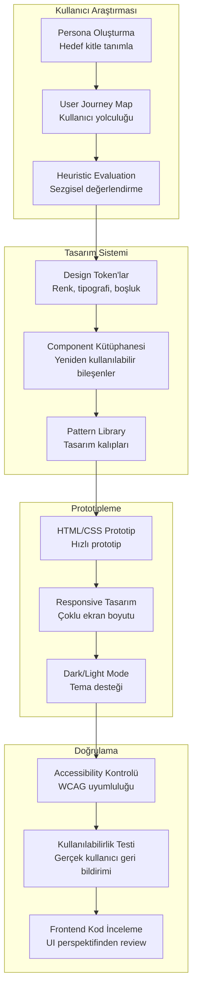
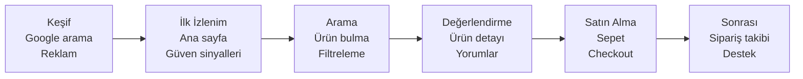

# UI/UX Tasarımcı Rehberi

UI/UX tasarımcıları, kullanıcı deneyiminin (UX — User Experience) ve arayüz tasarımının (UI — User Interface) mimarlarıdır. Claude Code, tasarım sistemi oluşturmaktan prototiplemeye, erişilebilirlik (accessibility) kontrolünden kullanıcı araştırmasına kadar UI/UX süreçlerinin her aşamasında güçlü bir asistan sunar. Bu rehber, Claude Code'u tasarım iş akışınıza nasıl entegre edeceğinizi kapsar.

---

## Ön Koşullar

| Konu | Bölüm |
|------|-------|
| Claude Code kurulumu | [Kurulum ve Gereksinimler](../06-claude-code-tanitim/03-kurulum-ve-gereksinimler.md) |
| Arayüz ve komutlar | [Bölüm 07](../07-arayuz-ve-komutlar/README.md) |
| Bellek ve bağlam yönetimi | [Bölüm 09](../09-bellek-ve-baglam/README.md) |
| Vibe Coding yaklaşımı | [Yazılım Geliştirici Rehberi](./01-teknik-yazilim-gelistirici.md) |

---

## UI/UX İş Akışı

Bir UI/UX tasarımcısının Claude Code ile tipik iş akışı:



---

## Tasarım Sistemi Oluşturma

### Design Token'lar (Tasarım Belirteçleri)

Design token'lar, tasarım sisteminin temel yapı taşlarıdır. Renk, tipografi, boşluk ve diğer görsel değerleri merkezi olarak yönetirler.

```bash
claude "Bir SaaS uygulaması için CSS custom properties ile design token sistemi oluştur:

Renkler:
- Primary (ana renk): Indigo skalası (50-950)
- Secondary (ikincil): Teal skalası
- Neutral (nötr): Slate skalası
- Semantic (anlamsal): success (yeşil), warning (sarı), error (kırmızı), info (mavi)

Tipografi:
- Font family: Inter (sans-serif), JetBrains Mono (monospace)
- Font size skalası: xs (12px) - 4xl (36px)
- Line height: tight (1.25), normal (1.5), relaxed (1.75)
- Font weight: normal (400), medium (500), semibold (600), bold (700)

Boşluk:
- 4px bazlı skala: 0, 1 (4px), 2 (8px), 3 (12px), 4 (16px), 6 (24px), 8 (32px), 12 (48px), 16 (64px)

Border:
- Radius: sm (4px), md (8px), lg (12px), xl (16px), full (9999px)
- Width: thin (1px), medium (2px), thick (4px)

Shadow:
- sm, md, lg, xl skalası

Dark mode: tüm token'ların dark mode karşılıkları da olsun.
CSS variables olarak tokens.css dosyasına yaz."
```

### Component (Bileşen) Kütüphanesi

```bash
claude "Tasarım sistemine uygun temel UI bileşenleri oluştur. React + TypeScript + Tailwind CSS kullan:

1. Button (Buton):
   - Variants: primary, secondary, outline, ghost, destructive
   - Sizes: sm, md, lg
   - States: default, hover, active, disabled, loading
   - Icon desteği (sol/sağ)

2. Input (Giriş Alanı):
   - Text, email, password, number, textarea
   - Label, placeholder, helper text, error message
   - States: default, focused, error, disabled

3. Card (Kart):
   - Header, body, footer alanları
   - Variants: default, bordered, elevated
   - Tıklanabilir variant

4. Badge (Rozet):
   - Variants: success, warning, error, info, neutral
   - Sizes: sm, md
   - Dot indicator (nokta göstergesi)

5. Modal (Kalıcı Pencere):
   - Header, body, footer
   - Close button, backdrop click
   - Sizes: sm, md, lg, full
   - Animasyon (fade + scale)

Her bileşen için: TypeScript props arayüzü, Storybook story dosyası ve kullanım örnekleri oluştur."
```

### Renk Paleti ve Tipografi

```bash
claude "Mevcut projede kullanılan tüm renkleri ve fontları analiz et:
1. Kullanılan benzersiz renk değerleri listesi
2. Tutarsız renk kullanımları (aynı amaç farklı renk)
3. Renklerin contrast ratio'ları (WCAG AA standardı: 4.5:1)
4. Font family, size ve weight kullanım istatistikleri
5. Tutarsız tipografi kullanımları

Analiz sonrası:
- Standart renk paleti öner (max 8 renk + tonları)
- Tipografi skalası öner (max 6 boyut)
- Mevcut kodda hangi değişiklikler gerektiğini listele"
```

### İkon Sistemi

```bash
claude "Proje için tutarlı bir ikon sistemi kur:
1. Lucide Icons kütüphanesini entegre et
2. Proje genelinde kullanılan ikonları kategorize et (navigasyon, aksiyon, durum, sosyal)
3. Icon component oluştur: size prop'u, renk prop'u, erişilebilirlik (aria-label)
4. İkon kullanım rehberi dokümanı oluştur
5. Mevcut koddaki tutarsız ikon kullanımlarını tespit et"
```

---

## Prototipleme

### HTML/CSS Prototip Oluşturma

```bash
claude "Kullanıcı dashboard sayfası için hızlı HTML/CSS prototipi oluştur:

Layout:
- Sol: Sidebar (240px, daraltılabilir)
  - Logo, navigasyon menüsü, kullanıcı profil kısayolu
- Üst: Header bar (64px)
  - Breadcrumb, arama, bildirimler, profil dropdown
- Ana alan: Grid layout
  - Özet kartlar satırı (4 kart: toplam kullanıcı, aktif oturum, gelir, siparişler)
  - Grafik alanı (sol: çizgi grafik, sağ: pasta grafik)
  - Son işlemler tablosu

Tailwind CSS kullan. Gerçekçi dummy data ile. Animasyonlar: sidebar hover, kart hover efekti.
Tek HTML dosyasında, CDN ile Tailwind dahil et."
```

### Responsive (Duyarlı) Tasarım

```bash
claude "Mevcut dashboard sayfasını responsive yap:

Breakpoint'ler:
- Mobile (<640px): Tek sütun, sidebar hamburger menüye dönüşsün, kartlar yığılsın
- Tablet (640-1024px): 2 sütun grid, sidebar daraltılmış (ikon only)
- Desktop (>1024px): Full layout

Her breakpoint için:
1. Navigation davranışı
2. Kart grid düzeni
3. Tablo davranışı (horizontal scroll vs card view)
4. Font size ayarlamaları
5. Padding/margin ayarlamaları
6. Touch-friendly button boyutları (mobil: min 44px)

Tailwind responsive class'larını kullan. Her breakpoint'te test et."
```

### Dark / Light Mode (Karanlık / Aydınlık Tema)

```bash
claude "Uygulamaya dark/light mode desteği ekle:

1. Theme Provider component oluştur (React Context)
2. Sistem tercihini algıla (prefers-color-scheme)
3. Kullanıcı tercihi localStorage'da sakla
4. Toggle button/switch bileşeni
5. CSS variables ile tema değişkenleri:
   - Background: light (#ffffff → #0f172a dark)
   - Surface: light (#f8fafc → #1e293b dark)
   - Text primary: light (#0f172a → #f8fafc dark)
   - Text secondary: light (#64748b → #94a3b8 dark)
   - Border: light (#e2e8f0 → #334155 dark)
6. Geçiş animasyonu (smooth transition)
7. Tüm mevcut bileşenleri dark mode'a uyumlu hale getir

Mevcut hardcoded renkleri CSS variable'lara taşı."
```

### Mikro-etkileşimler (Micro-interactions)

```bash
claude "Uygulamaya şu mikro-etkileşimleri ekle (Framer Motion veya CSS animation ile):
1. Buton tıklanma: scale(0.95) → scale(1) bounce
2. Kart hover: translateY(-2px) + shadow artışı
3. Sayfa geçişi: fade-in + slide-up
4. Bildirim: sağdan slide-in, 3 saniye sonra slide-out
5. Skeleton loading: pulse animasyonu
6. Form submit başarılı: checkmark animasyonu
7. Sayı artışı: count-up animasyonu
8. Sürükle-bırak: ghost element + drop zone vurgusu

Performansı düşürmeyecek şekilde (GPU-accelerated transform'lar kullan)."
```

---

## Accessibility (Erişilebilirlik)

### WCAG Kontrolleri

```mermaid
flowchart TD
    subgraph algilama ["Algılanabilirlik"]
        A["Metin Alternatifleri<br/>img alt, aria-label"] --> B["Renk Kontrastı<br/>4.5:1 minimum oran"]
        B --> C["Responsive Metin<br/>Zoom 200% desteği"]
    end

    subgraph kullanilabilirlik ["Kullanılabilirlik"]
        D["Keyboard Navigasyonu<br/>Tab sırası, focus visible"] --> E["Yeterli Süre<br/>Zamanlayıcı kontrolü"]
        E --> F["Seizure Güvenliği<br/>Yanıp sönen içerik yok"]
    end

    subgraph anlasilabilirlik ["Anlaşılabilirlik"]
        G["Tutarlı Navigasyon<br/>Aynı menü yapısı"] --> H["Hata Önleme<br/>Form validation"]
        H --> I["Input Yardımı<br/>Label, placeholder, helper"]
    end

    subgraph saglam ["Sağlamlık"]
        J["Semantic HTML<br/>Doğru etiketler"] --> K["ARIA Rolleri<br/>WAI-ARIA standartları"]
        K --> L["Uyumluluk<br/>AT uyumluluğu"]
    end
```



```bash
claude "Bu projenin erişilebilirlik (accessibility) denetimini yap. WCAG 2.1 AA standardına göre kontrol et:

Algılanabilirlik:
1. Tüm görsellerin alt metni var mı?
2. Form elemanlarının label'ları var mı?
3. Renk kontrastı yeterli mi? (normal metin 4.5:1, büyük metin 3:1)
4. Renk tek başına bilgi taşıyıcısı olarak kullanılmış mı?
5. Video/ses içeriklerde altyazı var mı?

Kullanılabilirlik:
6. Tüm işlevler klavye ile erişilebilir mi?
7. Focus sırası mantıklı mı?
8. Focus göstergesi görünür mü?
9. Skip navigation linki var mı?

Anlaşılabilirlik:
10. Sayfa dili tanımlı mı? (lang attribute)
11. Form hata mesajları açık mı?
12. Tutarlı navigasyon var mı?

Her bulgu için: WCAG kriteri, severity, etkilenen element ve düzeltme kodu sun."
```

### Screen Reader (Ekran Okuyucu) Uyumluluğu

```bash
claude "Uygulamayı screen reader uyumlu hale getir:

1. Semantic HTML kontrolü:
   - div/span yerine doğru elementler: nav, main, aside, section, article, header, footer
   - Heading hiyerarşisi (h1 → h2 → h3, atlama yok)
   - List yapıları (ul/ol/li doğru kullanım)

2. ARIA attribute'ları:
   - Dinamik içerikler için aria-live (polite/assertive)
   - Modal'lar için aria-modal, aria-labelledby
   - Tab component için role='tablist', role='tab', role='tabpanel'
   - Dropdown için aria-expanded, aria-haspopup
   - Progress bar için aria-valuenow, aria-valuemin, aria-valuemax
   - Toggle button için aria-pressed

3. Görsel-olmayan bilgi:
   - İkon-only butonlar için aria-label
   - Dekoratif görseller için aria-hidden='true'
   - Tablo yapısı: scope='col', scope='row'

4. Dinamik içerik:
   - Route değişiminde sayfa başlığı güncelleme
   - Toast bildirimleri için aria-live region
   - Loading durumları için aria-busy

Her düzeltmeyi mevcut kodda uygula."
```

### Keyboard (Klavye) Navigasyonu

```bash
claude "Tüm interaktif elemanların klavye navigasyonunu kontrol et ve düzelt:

1. Tab order (Tab sırası):
   - Mantıksal sıra takip ediliyor mu?
   - tabindex kullanımı doğru mu? (0 ve -1 dışında kullanılmamalı)

2. Focus management (Odak yönetimi):
   - Modal açıldığında focus modal'a taşınıyor mu?
   - Modal kapandığında focus tetikleyici elemana dönüyor mu?
   - Dropdown menüde arrow key navigasyonu var mı?

3. Keyboard shortcuts (Klavye kısayolları):
   - Escape: Modal/dropdown kapatma
   - Enter/Space: Buton/link aktivasyonu
   - Arrow keys: Liste/tab navigasyonu
   - Home/End: Liste başı/sonu

4. Focus trap (Odak tuzağı):
   - Modal içinde Tab ile döngü
   - Dropdown dışına Tab ile çıkma

5. Focus visible (Odak göstergesi):
   - Tüm interaktif elemanlarda görünür focus ring
   - Custom focus style: 2px solid + offset

Her bulguyu düzelt ve test senaryosu yaz."
```

---

## Kullanıcı Araştırması

### Kullanıcı Persona (Kişilik Profili) Oluşturma

```bash
claude "E-ticaret platformu için 3 kullanıcı persona oluştur:

Her persona için:
- Ad, yaş, meslek, fotoğraf açıklaması
- Teknoloji yetkinlik seviyesi
- Hedefler ve motivasyonlar
- Acı noktalar (pain points) ve frustrasyonlar
- Tercih ettiği cihazlar ve platformlar
- Tipik kullanım senaryosu
- Alıntı (kendi ağzından bir cümle)

Persona türleri:
1. Birincil persona (en çok hedeflenen kullanıcı)
2. İkincil persona (desteklenen ama öncelikli olmayan)
3. Negatif persona (hedeflenmeyen kullanıcı tipi)

Markdown formatında, görsel olarak düzenli."
```

### User Journey Map (Kullanıcı Yolculuk Haritası)

```bash
claude "E-ticaret sitesinde 'ilk kez alışveriş yapan kullanıcı' için user journey map oluştur:

Aşamalar:
1. Keşif (Discovery): Siteye nasıl ulaştı?
2. İlk İzlenim (First Impression): Ana sayfada ne gördü?
3. Arama ve Gezinme (Browse): Ürünleri nasıl buldu?
4. Değerlendirme (Evaluation): Ürünü nasıl değerlendirdi?
5. Satın Alma (Purchase): Checkout süreci
6. Teslimat Sonrası (Post-Purchase): Sipariş takibi ve iade

Her aşama için:
- Kullanıcı aksiyonları
- Düşünceleri ve duyguları (emoji ile)
- Temas noktaları (touchpoints)
- Acı noktalar (pain points)
- Fırsatlar (opportunities)

Mermaid diagram olarak yolculuk akışını da çiz."
```



### Heuristic Evaluation (Sezgisel Değerlendirme)

```bash
claude "Nielsen'in 10 Sezgisel Kuralı'na (10 Usability Heuristics) göre bu uygulamayı değerlendir:

1. Sistem Durumu Görünürlüğü: Kullanıcı sistemin ne durumda olduğunu anlayabiliyor mu?
2. Sistem ve Gerçek Dünya Uyumu: Kullanıcının anlayacağı dil kullanılıyor mu?
3. Kullanıcı Kontrolü ve Özgürlüğü: Geri al, yeniden yap var mı?
4. Tutarlılık ve Standartlar: Aynı aksiyon her yerde aynı şekilde mi?
5. Hata Önleme: Form validation, onay diyalogları var mı?
6. Tanıma vs Hatırlama: Seçenekler görünür mü, bilgi ezberletiliyor mu?
7. Esneklik ve Verimlilik: Kısayollar, ileri seviye özellikler var mı?
8. Estetik ve Minimalist Tasarım: Gereksiz bilgi yok mu?
9. Hata Kurtarma: Hata mesajları anlaşılır ve çözüm önerili mi?
10. Yardım ve Dokümantasyon: Kullanıcı rehberliği var mı?

Her kural için: 0-4 arası severity puanı, bulgu açıklaması ve düzeltme önerisi sun."
```

### Kullanılabilirlik Test Senaryoları

```bash
claude "Dashboard sayfası için kullanılabilirlik test senaryoları oluştur:

Görevler (5 adet):
1. Görev: Son 7 günün gelir grafiğini bul
   - Başarı kriteri: 30 saniye içinde bulma
   - Ölçüm: Süre, tıklama sayısı, hata sayısı

2. Görev: Yeni bir ürün ekle
   - Başarı kriteri: 2 dakika içinde tamamlama
   - Ölçüm: Tamamlanma oranı, süre, hata

3. Görev: Belirli bir siparişin durumunu öğren
   - Başarı kriteri: Arama ile 20 saniye içinde bulma
   - Ölçüm: Kullanılan yöntem, süre

4. Görev: Profil fotoğrafını değiştir
   - Başarı kriteri: 1 dakika içinde tamamlama
   - Ölçüm: Navigasyon yolu, karşılaşılan sorunlar

5. Görev: Dark mode'a geç
   - Başarı kriteri: 15 saniye içinde bulma
   - Ölçüm: Arama yolu, bulunamama durumu

Her görev için: ön anket soruları, gözlem notları şablonu ve SUS (System Usability Scale) formu."
```

---

## Frontend Kod İnceleme (UI Perspektifinden)

```bash
claude "Frontend kodunu UI/UX perspektifinden incele:

1. Tasarım Tutarlılığı:
   - Renk kullanımı tutarlı mı? (design token'lara uyuyor mu)
   - Boşluk sistemi tutarlı mı? (4px grid)
   - Tipografi skalası takip ediliyor mu?
   - Border radius tutarlı mı?

2. Responsive Davranış:
   - Tüm sayfalar mobilde düzgün görünüyor mu?
   - Breakpoint'ler tutarlı mı?
   - Touch hedefler yeterli boyutta mı? (44x44px)
   - Metin mobilde okunabilir mi? (min 16px)

3. Etkileşim Kalitesi:
   - Hover/focus/active state'ler tanımlı mı?
   - Loading state'ler var mı? (skeleton, spinner)
   - Empty state'ler tasarlanmış mı?
   - Error state'ler kullanıcı dostu mu?

4. Performans (UI):
   - Resimler optimize mi? (WebP, lazy loading)
   - Font yükleme stratejisi? (font-display: swap)
   - CSS bundle boyutu?
   - Gereksiz re-render var mı?

5. Animasyon ve Geçişler:
   - Tutarlı timing function (ease-in-out)
   - Tutarlı duration (150-300ms)
   - Reduced motion desteği (prefers-reduced-motion)

Her bulgu için: ekran görüntüsü lokasyonu, severity ve düzeltme kodu sun."
```

### Component Review Checklist (Bileşen İnceleme Kontrol Listesi)

```bash
claude "Şu React bileşenini UI/UX açısından incele: [bileşen adı]

Kontrol listesi:
- [ ] Prop isimleri anlaşılır ve tutarlı mı?
- [ ] Varsayılan değerler mantıklı mı?
- [ ] Tüm state'ler ele alınmış mı? (loading, error, empty, success)
- [ ] Erişilebilirlik: ARIA attribute'ları doğru mu?
- [ ] Responsive: Tüm ekran boyutlarında çalışıyor mu?
- [ ] Dark mode: Her iki temada doğru görünüyor mu?
- [ ] Animasyonlar: Tutarlı ve performanslı mı?
- [ ] Keyboard: Klavye ile kullanılabiliyor mu?
- [ ] i18n: Hardcoded metin var mı? (varsa çeviri sistemine taşı)"
```

---

## UI/UX İçin En İyi Prompt Pattern'leri

### 1. Tasarım Eleştirisi

```bash
claude "Bu sayfayı tasarım prensipleri açısından değerlendir:
- Görsel hiyerarşi: En önemli element nedir? Gözün doğal akışı doğru mu?
- Beyaz alan (whitespace): Yeterli nefes alma alanı var mı?
- Hizalama: Grid sistemi tutarlı mı?
- Kontrast: Önemli elementler yeterince öne çıkıyor mu?
- CTA (Call to Action): Ana aksiyon butonu belirgin mi?
Somut düzeltme önerileri sun."
```

### 2. Tasarım Alternatifi Üretme

```bash
claude "Bu form tasarımı için 3 farklı yaklaşım öner:
Yaklaşım A: Minimal (tek sütun, adım adım)
Yaklaşım B: Kompakt (iki sütun, tek sayfa)
Yaklaşım C: Konuşma tarzı (chatbot benzeri)

Her yaklaşım için: HTML prototip, artılar, eksiler ve en uygun kullanım senaryosu."
```

### 3. Tasarımdan Koda Çevirme

```bash
claude "Bu tasarım dosyasındaki (Figma ekran görüntüsü / açıklama) sayfayı koda çevir:
- React + Tailwind CSS kullan
- Pixel-perfect olmasa da tasarıma yakın olsun
- Responsive olsun (mobile-first)
- Interaktif elementler çalışır durumda olsun
- Dark mode desteği olsun
- Accessibility standartlarına uygun olsun"
```

### 4. Stil Rehberi Oluşturma

```bash
claude "Mevcut kodu analiz ederek bir stil rehberi (style guide) dokümanı oluştur:
1. Kullanılan tüm renkleri, fontları ve boşluk değerlerini çıkar
2. Tutarsızlıkları tespit et
3. Standart bir tasarım token seti öner
4. Component envanteri çıkar
5. Kullanım örnekleri ile dokümante et
Markdown formatında, geliştirici ve tasarımcı dostu."
```

### 5. A/B Test Varyantları

```bash
claude "Checkout sayfası için A/B test varyantları oluştur:

Varyant A (Kontrol): Mevcut tasarım
Varyant B: Tek sayfa checkout (accordion ile)
Varyant C: İlerleme çubuğu (progress bar) ile adım adım

Her varyant için:
- HTML/CSS kodu
- Hipotez (neyi test ediyoruz?)
- Başarı metriği (conversion rate, sepet terk oranı)
- Minimum sample size önerisi"
```

### 6. Animasyon ve Geçiş Tasarımı

```bash
claude "Sayfa geçişleri ve mikro-etkileşimler için animasyon sistemi oluştur:
- Sayfa geçişi: Crossfade (200ms ease-in-out)
- Modal açılma: Fade-in backdrop + scale-up content (250ms)
- Dropdown: Slide-down + fade-in (150ms)
- Toast bildirimi: Slide-in from right (200ms), auto-dismiss (3s)
- Skeleton loading: Pulse animation (1.5s infinite)
- Hover efektleri: Transform + shadow (150ms)
CSS Tailwind animation config'e ekle. prefers-reduced-motion desteği ile."
```

---

## UI/UX Tasarımcı CLAUDE.md Şablonu

```markdown
# Proje: SaaS Dashboard

## Tasarım Sistemi
- Design tokens: src/styles/tokens.css
- Component library: src/components/ui/
- İkon seti: Lucide Icons
- Animasyon: Framer Motion

## Tasarım Kuralları
- Mobile-first responsive tasarım
- 4px grid sistemi
- Maksimum 3 font boyutu farkı bir sayfada
- Her interaktif elemanda hover, focus, active state
- Her asenkron işlemde loading state (skeleton)
- Her liste/grid'de empty state tasarımı
- Tüm renkler CSS variable'dan gelmeli

## Erişilebilirlik
- WCAG 2.1 AA minimum standart
- Renk kontrastı: normal metin 4.5:1, büyük metin 3:1
- Focus göstergesi: 2px ring, offset 2px
- Tüm img'lere alt attribute
- Semantic HTML öncelikli

## Dark Mode
- Tüm bileşenler dark mode desteklemeli
- Test: her değişiklik her iki temada kontrol edilmeli
- Beyaz arka plan kullanma, surface color kullan
```

---

## Özet

| Alan | Claude Code Katkısı |
|------|---------------------|
| **Tasarım Sistemi** | Design token, component kütüphanesi, renk paleti |
| **Prototipleme** | HTML/CSS prototip, responsive, dark mode |
| **Accessibility** | WCAG kontrolü, screen reader, keyboard nav |
| **Kullanıcı Araştırması** | Persona, journey map, heuristic evaluation |
| **Kod İnceleme** | UI tutarlılığı, responsive davranış, performans |
| **Animasyon** | Mikro-etkileşimler, sayfa geçişleri, loading |
| **Test** | Kullanılabilirlik testi, A/B test varyantları |
| **Dokümantasyon** | Stil rehberi, component envanter, CLAUDE.md |

---

## Sonraki Adım

Pratik senaryolar ve tarifler ile gerçek dünya kullanım örnekleri:

→ [Pratik Senaryolar ve Tarifler](../20-pratik-senaryolar/README.md)
