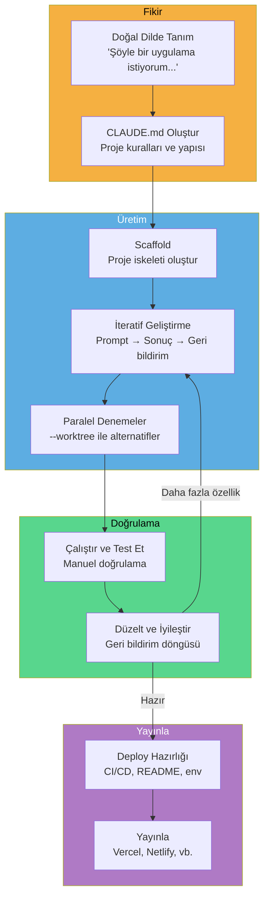
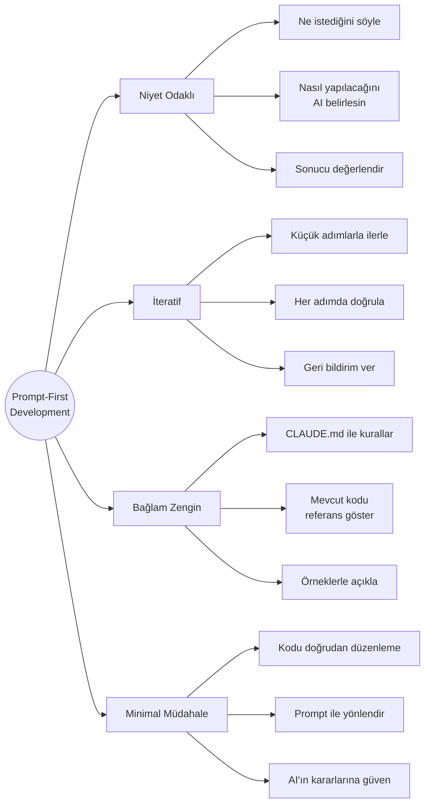
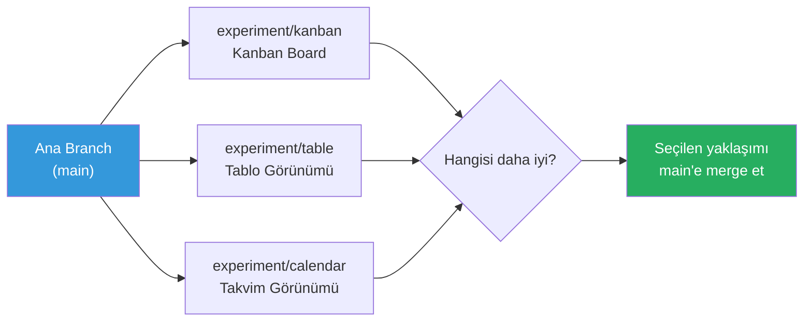

# Vibe Coder Rehberi

Vibe Coding (his ile kodlama), doğal dil prompt'ları ile yazılım geliştirme yaklaşımıdır. Vibe Coder, geleneksel satır satır kodlama yerine niyetini doğal dille ifade eder ve AI aracının kodu üretmesini sağlar. Claude Code, bu yaklaşım için ideal bir ortam sunar.

## Ön Koşullar

| Konu | Bölüm |
|------|-------|
| Vibe Coding kavramı | [Vibe Coding](../04-ai-destekli-gelistirme/03-vibe-coding.md) |
| Claude Code kurulumu | [Kurulum ve Gereksinimler](../06-claude-code-tanitim/03-kurulum-ve-gereksinimler.md) |
| Hızlı mod | [Hızlı Mod](../07-arayuz-ve-komutlar/03-hizli-mod.md) |

---

## Vibe Coding Yaşam Döngüsü

Bir Vibe Coder'ın tipik proje yaşam döngüsü:



---

## Prompt-First Development (Prompt-Öncelikli Geliştirme)

Vibe Coding'de geliştirme süreci prompt yazarak başlar, kod yazarak değil:

### Temel Prensipler



---

## CLAUDE.md: Proje Tutarlılığı

Vibe Coding'de `CLAUDE.md` dosyası projenizin "beyni" gibi çalışır:

```markdown
# Proje: TaskFlow - Görev Yönetim Uygulaması

## Teknoloji Kararları
- Frontend: Next.js 15 + TypeScript + Tailwind CSS
- Backend: Next.js API Routes
- Veritabanı: SQLite (Drizzle ORM)
- Auth: NextAuth.js
- Deploy: Vercel

## Tasarım Sistemi
- Renk paleti: Indigo (primary), Gray (neutral), Green (success), Red (error)
- Font: Inter (sans-serif)
- Border radius: 8px (kartlar), 6px (butonlar), 4px (input'lar)
- Responsive: mobile-first yaklaşım
- Dark mode desteği zorunlu

## Kurallar
- Her sayfa server component olsun, interaktif kısımlar client component
- Form validation: Zod schema ile
- Error handling: Her API route'ta try/catch
- Loading state'ler her sayfada olsun (skeleton)
- Tüm metin içerikleri Türkçe

## Dosya Yapısı
```
src/
├── app/           # Next.js App Router sayfaları
├── components/    # Paylaşılan UI bileşenleri
├── lib/           # Utility fonksiyonlar ve konfigürasyon
├── db/            # Veritabanı schema ve migration
└── types/         # TypeScript tip tanımları
```

## Öncelik Sırası
1. Çalışan MVP
2. Güzel görünüm
3. Edge case handling
4. Performans optimizasyonu
```

---

## Sıfırdan Proje: Adım Adım Walkthrough

Doğal dil prompt'ları ile komple bir web uygulaması oluşturma:

### Adım 1: Proje İskeleti

```bash
# Projeyi başlat
claude "TaskFlow adında bir görev yönetim uygulaması oluştur. Next.js 15, TypeScript ve Tailwind CSS kullan. Proje yapısını kur, gerekli paketleri yükle ve çalışır duruma getir."
```

### Adım 2: Veritabanı

```bash
# Veritabanı schema'sını oluştur
claude "SQLite veritabanı kur (Drizzle ORM). Şu tablolar olsun:
- users (id, name, email, avatar)
- projects (id, name, description, owner_id, created_at)
- tasks (id, title, description, status, priority, project_id, assignee_id, due_date, created_at)
- comments (id, content, task_id, author_id, created_at)

Status enum: todo, in_progress, review, done
Priority enum: low, medium, high, urgent

Migration'ı çalıştır ve seed data ekle."
```

### Adım 3: Ana Sayfa

```bash
# Dashboard tasarla
claude "Ana sayfa bir dashboard olsun:
- Sol tarafta sidebar (projeler listesi, navigasyon)
- Üstte başlık çubuğu (arama, kullanıcı menüsü)
- Ortada görev kartları (Kanban board tarzı: Todo, In Progress, Review, Done sütunları)
- Sağ üstte 'Yeni Görev' butonu
Güzel ve modern görünsün. Dark mode desteği olsun."
```

### Adım 4: CRUD İşlemleri

```bash
# Görev CRUD
claude "Görev CRUD işlemlerini ekle:
- Yeni görev oluşturma (modal form)
- Görev detay sayfası
- Görev düzenleme
- Görev silme (onay dialog'u ile)
- Sürükle-bırak ile görev durumu değiştirme
Her işlem için loading state ve error handling ekle."
```

### Adım 5: Arama ve Filtreleme

```bash
# Arama ve filtre
claude "Görev arama ve filtreleme ekle:
- Metin bazlı arama (başlık ve açıklama)
- Durum filtresi
- Öncelik filtresi
- Atanan kişi filtresi
- Tarih aralığı filtresi
Filtreler URL'de query parameter olarak saklanssın (bookmark yapılabilir olsun)."
```

### Adım 6: Auth ve Deploy

```bash
# Authentication
claude "NextAuth.js ile GitHub OAuth authentication ekle. Login sayfası, korumalı route'lar ve kullanıcı menüsü ekle."

# Deploy hazırlığı
claude "Vercel deploy için projeyi hazırla: .env.example dosyası, README.md, gerekli konfigürasyonlar."
```

---

## --worktree ile Paralel Denemeler

Farklı yaklaşımları aynı anda deneyerek en iyisini seçin:

```bash
# UI alternatiflerini paralel dene
claude --worktree experiment/kanban "Dashboard'u Kanban board olarak tasarla"
claude --worktree experiment/table "Dashboard'u tablo görünümü olarak tasarla"
claude --worktree experiment/calendar "Dashboard'u takvim görünümü olarak tasarla"
```



---

## AI-Native Workflow (AI-Yerel İş Akışı)

Vibe Coder olarak tüm geliştirme döngüsünü prompt'larla yönetin:

### Debugging (Hata Ayıklama)

```bash
# Hatayı prompt ile çöz
claude "Uygulama şu hatayı veriyor: [hata mesajı]. Hatayı bul ve düzelt. Düzeltme sonrası çalıştığını doğrula."
```

### Styling (Stil)

```bash
# Görünümü prompt ile değiştir
claude "Dashboard biraz sıkışık görünüyor. Kartlar arasına daha fazla boşluk ekle, font boyutlarını %10 büyüt, renkleri daha soft tonlara çevir. Modern ve ferah bir his versin."
```

### Refactoring

```bash
# Yapıyı prompt ile düzelt
claude "Kod tekrarı var gibi görünüyor. Tekrarlanan pattern'leri bul, ortak component'lere çıkar ve DRY prensibine uygun hale getir."
```

### Feature Ekleme

```bash
# Yeni özellik prompt ile ekle
claude "Uygulamaya bildirim sistemi ekle. Görev atandığında, yorum yapıldığında ve deadline yaklaştığında bildirim gelsin. Sağ üstte bildirim ikonu ve dropdown listesi olsun."
```

---

## Minimal Manual Intervention (Minimal Manuel Müdahale)

Vibe Coding'de amaç kodu mümkün olduğunca az doğrudan düzenlemektir:

| Durum | Geleneksel | Vibe Coding |
|-------|-----------|-------------|
| Buton rengi değiştirme | CSS dosyasını aç, class bul, rengi değiştir | `claude "Butonları maviden yeşile çevir"` |
| API endpoint ekleme | Route dosyası oluştur, handler yaz, test et | `claude "Ürünler için CRUD API endpoint'leri ekle"` |
| Bug fix | Stack trace oku, dosya bul, debug et | `claude "Bu hata mesajını düzelt: [mesaj]"` |
| Responsive design | Media query yaz, test et | `claude "Mobilde sidebar hamburger menüye dönsün"` |

---

## Vibe Coder İçin İpuçları

### 1. Büyük Düşün, Küçük Adımla İlerle

```bash
# Kötü: Çok büyük prompt ❌
claude "Tam bir e-ticaret sitesi yap: ürünler, sepet, ödeme, kullanıcı profili, admin paneli, raporlama, bildirimler, arama, favoriler, yorumlar"

# İyi: Adım adım ✅
claude "E-ticaret sitesi başlat. İlk adım: ürün listeleme sayfası. Grid görünümü, ürün kartları, fiyat ve resim göstersin."
```

### 2. Sonucu Görün, Sonra Yönlendirin

```bash
# Önce sonucu gör
claude "Bu sayfayı oluştur ve development server'ı başlat"

# Sonra geri bildirim ver
claude "Sayfa güzel olmuş ama: 1) Header'ı sticky yap, 2) Kartlara hover efekti ekle, 3) Renkleri daha canlı yap"
```

### 3. CLAUDE.md'yi Güncel Tutun

```bash
# Her önemli karardan sonra CLAUDE.md'yi güncelle
claude "CLAUDE.md dosyasına ekle: tüm API response'ları { success: boolean, data: T, error?: string } formatında olmalı."
```

---

## Tam Proje Oluşturma Örneği: Pomodoro Timer

Sıfırdan bir Pomodoro timer uygulaması oluşturalım — sadece doğal dil prompt'ları ile:

```bash
# 1. Proje başlat
claude "Pomodoro Timer web uygulaması oluştur. Vite + React + TypeScript + Tailwind CSS kullan. Proje iskeleti kur ve çalışır hale getir."

# 2. Ana bileşen
claude "Ana sayfada büyük bir dairesel zamanlayıcı olsun. 25 dakika çalışma, 5 dakika kısa mola, 15 dakika uzun mola. Başlat/Duraklat/Sıfırla butonları altında olsun. Minimalist ve şık tasarım."

# 3. Ses efekti
claude "Süre dolduğunda bildirim sesi çalsın. Tarayıcı notification API'si ile de masaüstü bildirimi göstersin."

# 4. İstatistikler
claude "Bugün kaç pomodoro tamamlandığını gösteren bir sayaç ekle. LocalStorage'da sakla. Haftalık grafik de ekle (son 7 gün)."

# 5. Ayarlar
claude "Ayarlar sayfası ekle: çalışma süresi, kısa mola, uzun mola sürelerini ayarlayabilsin. Dark/light mode toggle. Ses açma/kapama."

# 6. PWA
claude "Uygulamayı PWA yap. Offline çalışabilsin, ana ekrana eklenebilsin. Manifest ve service worker ekle."

# 7. Deploy
claude "Vercel'e deploy etmek için hazırla. README.md yaz, .env.example oluştur."
```

---

## Özet

| Kavram | Açıklama |
|--------|----------|
| **Vibe Coding** | Doğal dil ile yazılım geliştirme yaklaşımı |
| **Prompt-First** | Önce prompt yaz, sonra sonucu değerlendir |
| **CLAUDE.md** | Proje kuralları ve tutarlılık için yapılandırma dosyası |
| **--worktree** | Paralel denemeler için alternatif çalışma dizinleri |
| **Minimal Müdahale** | Kodu doğrudan düzenlemek yerine prompt ile yönlendirme |
| **İteratif Geliştirme** | Küçük adımlar, sürekli geri bildirim döngüsü |

---

## Sonraki Adım

Pratik senaryolar ve tarifler ile gerçek dünya kullanım örnekleri:

→ [Pratik Senaryolar ve Tarifler](../20-pratik-senaryolar/README.md)
