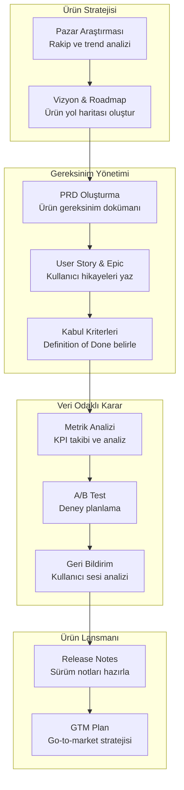
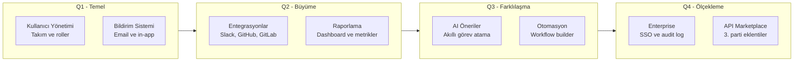
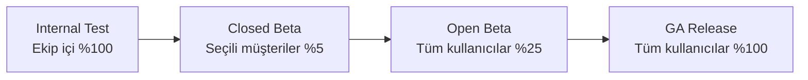

# Ürün Müdürü Rehberi

Ürün müdürleri (Product Manager - PM), ürün vizyonundan roadmap'e, pazar araştırmasından lansmana kadar geniş bir sorumluluk alanında çalışır. Claude Code, veri analizi, doküman üretimi, paydaş iletişimi ve stratejik planlama süreçlerinde ürün müdürlerine güçlü bir asistan sunar.

## Ön Koşullar

| Konu | Bölüm |
|------|-------|
| Claude Code temelleri | [Bölüm 06](../06-claude-code-tanitim/README.md) |
| Araçlar genel bakış | [Araçlara Genel Bakış](../08-araclar/01-araclara-genel-bakis.md) |
| Prompt mühendisliği | [Prompt Mühendisliği](../04-ai-destekli-gelistirme/04-prompt-muhendisligi.md) |

---

## Ürün Müdürü İş Akışı

Bir ürün müdürünün Claude Code ile tipik iş akışı:



---

## Ürün Stratejisi

### Pazar Araştırması ve Analiz

```bash
# Pazar trendi analizi
claude "SaaS proje yönetim araçları pazarını analiz et. Şunları içersin:

1. Pazar büyüklüğü ve büyüme trendi (TAM/SAM/SOM tahmini)
2. Temel kullanıcı segmentleri ve ihtiyaçları
3. Öne çıkan trendler (AI entegrasyonu, otomasyon vb.)
4. Fırsat alanları (underserved segments)
5. Giriş bariyerleri ve riskler

Sonuçları tablolar ve bullet point formatında sun."
```

### Rakip Analizi

```bash
# Rekabet matrisi oluşturma
claude "Aşağıdaki rakipleri karşılaştıran bir analiz tablosu oluştur:
Rakipler: Jira, Asana, Monday.com, Linear, ClickUp

Karşılaştırma kriterleri:
1. Temel özellikler (feature parity)
2. Fiyatlandırma modeli ve hedef kitle
3. Güçlü ve zayıf yönler (SWOT özeti)
4. Pazar konumlandırması ve entegrasyon ekosistemi

Sonuçları hem tablo hem de positioning map açıklaması olarak sun."
```

### Ürün Roadmap Oluşturma

```bash
# Roadmap oluşturma
claude "Proje yönetim aracımız için 4 çeyreklik ürün roadmap'i oluştur.

Mevcut durum: MVP lansmanı yapıldı, 500 aktif kullanıcı var.
Hedef: Yıl sonunda 5000 aktif kullanıcı.

Her çeyrek için:
1. Tema (ana odak)
2. Key features (öncelik sırasıyla)
3. Success metrics (başarı metrikleri)
4. Bağımlılıklar ve riskler
5. Tahmini efor (T-shirt sizing: S/M/L/XL)

RICE skorlama (Reach, Impact, Confidence, Effort) ile önceliklendirme yap."
```



---

## Gereksinim Yönetimi

### PRD (Product Requirements Document) Oluşturma

```bash
# PRD şablonu ile doküman üretme
claude "Aşağıdaki özellik için detaylı bir PRD oluştur:

Özellik: Takım içi gerçek zamanlı işbirliği (real-time collaboration)

PRD formatı:
1. **Özet**: Tek paragraf açıklama
2. **Problem Tanımı**: Hangi kullanıcı problemini çözüyoruz?
3. **Hedefler ve Başarı Metrikleri**: OKR formatında
4. **Kullanıcı Hikayeleri**: En az 5 user story
5. **Kapsam**: Dahil ve hariç olanlar
6. **Fonksiyonel Gereksinimler**: Detaylı özellik listesi
7. **Non-Fonksiyonel Gereksinimler**: Performans, güvenlik, ölçeklenebilirlik
8. **UX Gereksinimleri**: Temel akış ve wireframe açıklaması
9. **Teknik Notlar**: Mimari öneriler
10. **Timeline**: Milestone bazlı takvim
11. **Riskler ve Azaltma Planları**
12. **Açık Sorular**"
```

### User Story ve Epic Yazma

```bash
# Epic ve user story hiyerarşisi
claude "Gerçek zamanlı işbirliği özelliği için epic ve user story hiyerarşisi oluştur.

Epic formatı:
**EPIC-XX: Başlık**
- Açıklama
- İş değeri
- Başarı kriteri

Her epic altında user story'ler:
**US-XXX: Başlık**
- Rol: ... olarak
- İstiyorum: ...
- Böylece: ...
- Kabul Kriterleri (Given/When/Then formatında)
- Story Point: Fibonacci (1,2,3,5,8,13)
- Öncelik: MoSCoW

En az 3 epic ve toplam 15 user story oluştur."
```

### Kabul Kriterleri Belirleme

```bash
# Detaylı kabul kriterleri
claude "US-101 için kapsamlı kabul kriterleri yaz (Gherkin formatında):
Given [ön koşul] / When [aksiyon] / Then [beklenen sonuç]

Happy path, edge case (bağlantı kopması, çakışma), performans ve erişilebilirlik kriterlerini dahil et."
```

---

## Veri Odaklı Karar Alma

### Metrik Analizi

```bash
# KPI dashboard tanımı
claude "SaaS ürünümüz için AARRR (Acquisition, Activation, Retention, Revenue, Referral) metrik framework'ü oluştur.

Her metrik için: tanım, formül, hedef değer, ölçüm sıklığı, veri kaynağı ve alert eşikleri."
```

### A/B Test Planlama

```bash
# A/B test planı oluşturma
claude "Onboarding akışımız için bir A/B test planı oluştur.

Hipotez: Adım sayısını 5'ten 3'e düşürmek aktivasyon oranını %15 artırır.

Test planı şunları içersin:
1. Hipotez (null ve alternatif)
2. Test metrikleri (primary ve secondary)
3. Örneklem büyüklüğü hesabı (statistical power: %80, significance: %95)
4. Test süresi tahmini
5. Segmentasyon (yeni vs mevcut kullanıcılar)
6. Kontrol ve varyant açıklaması
7. Guardrail metrikleri (olumsuz etki kontrolü)
8. Başarı/başarısızlık karar kriterleri
9. Rollout planı"
```

### Kullanıcı Geri Bildirim Analizi

```bash
# Geri bildirim analizi
claude "Aşağıdaki kullanıcı geri bildirimlerini analiz et ve yapılandır:

[Geri bildirimler buraya yapıştırılır]

Analiz çıktısı:
1. Tema bazlı gruplama (feature request, bug, UX issue vb.)
2. Sentiment analizi (pozitif/negatif/nötr dağılımı)
3. Frekans analizi (en çok tekrar eden konular)
4. Öncelik matrisi (etki vs sıklık)
5. Aksiyon önerileri (quick win, strategic, nice-to-have)
6. Ürün roadmap'e eklenmesi gereken maddeler"
```

---

## Paydaş İletişimi

### Teknik Ekiple İletişim

```bash
# Teknik tasarımı anlaşılır hale getirme
claude "Aşağıdaki teknik gereksinimi geliştirme ekibi için netleştir:

İş gereksinimi: 'Kullanıcılar raporları PDF olarak indirebilmeli'

Şunları belirt:
1. Detaylı kullanıcı akışı
2. Edge case'ler ve hata durumları
3. Performans beklentileri (timeout, max boyut)
4. Güvenlik gereksinimleri (yetki kontrolü)
5. Veri gereksinimleri (hangi alanlar dahil)
6. Öncelik ve timeline önerisi
7. Açık sorular listesi (geliştiriciyle tartışılacak)"
```

### C-Level Raporlama

```bash
# Yönetim raporu
claude "Aylık ürün performans raporu oluştur. C-level yöneticilere sunulacak.

Veriler: MRR: 150K→175K, Churn: %4.2→%3.8, NPS: 42→48, Yeni müşteri: 45

Format: Executive Summary (3 bullet), Key Metrics (tablo), Highlights & Lowlights, Roadmap Update, Next Month Focus. Maksimum 2 sayfa, jargonsuz."
```

---

## Ürün Lansmanı

### Release Notes Oluşturma

```bash
# Release notes hazırlama
claude "Bu sprint'te tamamlanan özelliklerden release notes oluştur:

Tamamlanan maddeler:
- US-201: Dashboard'a özel widget ekleme
- US-205: CSV export özelliği
- BUG-112: Login sayfası timeout sorunu düzeltildi
- US-210: Slack entegrasyonu (beta)
- PERF-15: Sayfa yüklenme hızı %40 iyileştirildi

İki farklı versiyon oluştur:
1. **Kullanıcı odaklı** (pazarlama/blog için, heyecan verici, fayda odaklı)
2. **Teknik** (changelog formatında, detaylı)"
```

### Go-to-Market Plan

```bash
# GTM plan oluşturma
claude "Yeni AI özelliğimiz için Go-to-Market planı oluştur.

Özellik: AI destekli otomatik görev atama
Hedef segment: 50-200 çalışanlı teknoloji şirketleri
Lansman tarihi: 6 hafta sonra

Plan şunları içersin:
1. Positioning statement (konumlandırma)
2. Mesajlaşma framework'ü (headline, value props, proof points)
3. Lansman öncesi aktiviteler (beta, teaser, PR)
4. Lansman günü aktiviteleri
5. Lansman sonrası (feedback toplama, iterasyon)
6. Kanal stratejisi (email, blog, social, webinar)
7. Başarı metrikleri ve hedefler
8. Haftalık timeline"
```

### Feature Flag Yönetimi

```bash
# Feature flag stratejisi
claude "Real-time collaboration özelliği için feature flag stratejisi oluştur:
1. Rollout aşamaları (internal → beta → GA)
2. Her aşamada açılacak segment ve yüzdeler
3. İzlenmesi gereken metrikler
4. Rollback kriterleri
5. Flag temizleme planı"
```



---

## Ürün Müdürleri İçin En İyi Prompt Pattern'leri

### 1. Stratejik Perspektif Verme

```bash
# İyi ✅
claude "Bir ürün müdürü perspektifinden bu özelliği değerlendir. İş etkisi, teknik fizibilite ve kullanıcı değeri açısından analiz yap. RICE skorlaması ile önceliklendir."
```

### 2. Hedef Kitle Odaklı Çıktı

```bash
# İyi ✅
claude "Bu teknik değişikliği 3 farklı paydaş grubu için özetle:
1. C-level: İş etkisi, 2 cümle
2. Geliştirme ekibi: Teknik detay, 1 paragraf
3. Müşteri: Fayda odaklı, marketing dili"
```

### 3. Framework Kullanımı

```bash
# İyi ✅
claude "Bu ürün kararını Jobs-to-be-Done (JTBD) framework'ü ile analiz et.
- Job: Kullanıcı ne yapmaya çalışıyor?
- Current solutions: Şu an nasıl çözüyor?
- Pain points: Nerede zorlanıyor?
- Desired outcome: İdeal sonuç ne?"
```

### 4. Veri ile Destekleme ve Trade-off Analizi

```bash
# İyi ✅
claude "Bu iki yaklaşımı karşılaştır: A) Monolitik dashboard, B) Modüler widget sistemi.
Her biri için: geliştirme maliyeti, UX, ölçeklenebilirlik, time-to-market. Business case ile destekle, tahmini ROI hesapla."
```

---

## Özet

| Görev | Claude Code Katkısı |
|------|---------------------|
| **Pazar Araştırması** | Rakip analizi, persona oluşturma, trend analizi |
| **Roadmap** | RICE skorlama ile önceliklendirilmiş yol haritası |
| **PRD** | Yapılandırılmış ürün gereksinim dokümanı |
| **User Story** | Epic/story hiyerarşisi, kabul kriterleri |
| **Metrik Analizi** | KPI framework, A/B test planı |
| **Paydaş İletişimi** | Farklı hedef kitlelere uyarlanmış raporlar |
| **Lansman** | Release notes, GTM plan, rollout stratejisi |

---

## Sonraki Adım

İş analisti perspektifinden gereksinim analizi ve süreç modelleme:

→ [İş Analisti Rehberi](./06-urun-is-analisti.md)
