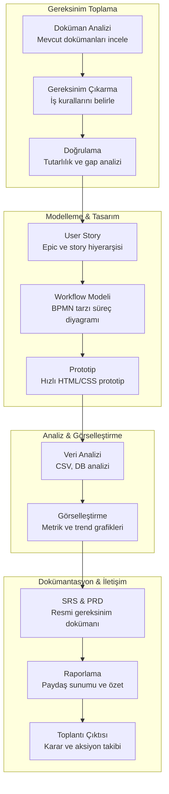
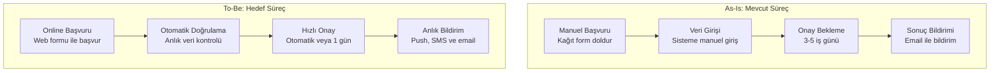

# İş Analisti Rehberi

İş analistleri (Business Analyst - BA), gereksinim toplama, user story oluşturma, iş süreçlerini modelleme ve paydaşlarla iletişim gibi kritik görevleri yürütür. Claude Code, teknik bilgi düzeyinden bağımsız olarak analistlere güçlü bir analiz, modelleme ve prototipleme ortamı sunar. Bu rehber, iş analistlerinin günlük iş akışlarını Claude Code ile nasıl hızlandırabileceğini kapsamlı örneklerle açıklar.

## Ön Koşullar

| Konu | Bölüm |
|------|-------|
| Claude Code temelleri | [Bölüm 06](../06-claude-code-tanitim/README.md) |
| Araçlar genel bakış | [Araçlara Genel Bakış](../08-araclar/01-araclara-genel-bakis.md) |
| Prompt mühendisliği | [Prompt Mühendisliği](../04-ai-destekli-gelistirme/04-prompt-muhendisligi.md) |

---

## Analist İş Akışı

Bir iş analistinin Claude Code ile tipik iş akışı:



---

## Gereksinim Analizi

### Toplantı Notlarından Gereksinim Çıkarma

Yapılandırılmamış toplantı notlarını sistematik gereksinimlere dönüştürme:

```bash
# Toplantı notlarından yapılandırılmış gereksinim çıkarma
claude "Aşağıdaki toplantı notlarını analiz et ve yapılandırılmış gereksinimler çıkar:

[Toplantı notları buraya yapıştırılır]

Her gereksinim için:
1. ID (REQ-001 formatında)
2. Başlık
3. Detaylı Açıklama
4. Öncelik (Must/Should/Could/Won't - MoSCoW yöntemi)
5. Kabul Kriterleri (en az 3 madde)
6. Bağımlılıklar (diğer REQ-ID'lere referans)
7. Riskler ve varsayımlar
8. Kaynak (hangi paydaş/toplantıdan geldi)

Ayrıca şunları da çıkar:
- Belirsiz kalan noktalar (clarification gereken)
- Örtük (implicit) gereksinimler
- Çelişen ifadeler"
```

### Mevcut Sistem Analizi

```bash
# Kaynak koddan iş kuralı çıkarma
claude "Bu projenin kaynak kodunu analiz ederek mevcut iş kurallarını çıkar. Her iş kuralı için:
1. Kural ID (BR-001 formatında)
2. Hangi dosya/modülde tanımlı
3. Kuralın açık dilde tanımı
4. Etkilenen modüller ve bağımlılıklar

Sonuçları bir iş kuralları kataloğu olarak hazırla ve karmaşıklık seviyesine göre grupla."
```

### Gereksinim Doğrulama

```bash
# Kapsamlı gereksinim doğrulama
claude "Gereksinim listesini kalite kontrolden geçir. Kontrol: tutarlılık, tamlık, netlik, tekrar, bağımlılık döngüsü, test edilebilirlik ve fizibilite. Her bulgu için risk seviyesi ve düzeltme önerisi ver.

[Gereksinim listesi buraya yapıştırılır]"
```

---

## User Story Oluşturma

Kullanıcı hikayelerini profesyonel standartta oluşturma:

```bash
# Epic ve user story hiyerarşisi
claude "E-ticaret sipariş yönetimi modülü için kapsamlı user story hiyerarşisi oluştur.

Epic formatı:
**EPIC-XX: Başlık**
- İş değeri açıklaması
- Başarı kriteri

Her epic altında user story'ler:
**US-XXX: Başlık**
- **Rol:** [Kullanıcı rolü] olarak
- **İstiyorum:** [Yapmak istediğim şey]
- **Böylece:** [Elde edeceğim değer]
- **Kabul Kriterleri:** (Given/When/Then formatında, en az 3)
- **Story Point:** Fibonacci (1/2/3/5/8/13)
- **Öncelik:** MoSCoW (Must/Should/Could/Won't)

En az 3 epic ve toplam 15 user story oluştur."
```

```bash
# User story detaylandırma
claude "US-005 (sipariş geçmişi görüntüleme) story'sini detaylandır:
1. Happy path ve alternatif akışlar
2. Edge case'ler (boş liste, iptal edilmiş siparişler)
3. API endpoint önerisi (method, path, request/response)
4. Test senaryoları (en az 8 senaryo)
5. Non-functional gereksinimler"
```

```bash
# Story splitting (büyük story'leri bölme)
claude "US-050 çok büyük (13+ SP). INVEST prensibine uygun küçük story'lere böl.
Her alt story bağımsız teslim edilebilir, tek sprint'te tamamlanabilir ve iş değeri sunmalı.
Bölme stratejisini ve bağımlılıkları açıkla."
```

---

## Workflow Modelleme

### BPMN Tarzı İş Akışı

İş süreçlerini profesyonel diyagramlarla modelleme:

```bash
# Detaylı iş süreci modelleme
claude "Aşağıdaki iş sürecini mermaid diagram olarak modellememi sağla:

Sipariş Süreci:
1. Müşteri sipariş verir
2. Stok kontrolü yapılır
3. Stok yoksa müşteriye bildirim gider, alternatif ürün önerilir
4. Stok varsa ödeme alınır
5. Ödeme başarısızsa 3 kez tekrar denenir, sonra iptal edilir
6. Ödeme başarılıysa sipariş onaylanır ve kargo hazırlanır
7. Kargo gönderildiğinde müşteriye SMS ve email gider
8. Teslimat onayı ile süreç kapanır

Karar noktalarını, paralel akışları, hata durumlarını ve timeout senaryolarını göster.
Her adımda sorumlu rolü (müşteri, sistem, depo, kargo) belirt."
```

### Süreç Analizi ve İyileştirme

```bash
# As-Is / To-Be analizi
claude "Kullanıcı kayıt sürecini analiz et. As-Is (mevcut akış, darboğazlar) ve To-Be (iyileştirilmiş akış) flowchart'larını oluştur. Gap analizi ile tahmini iyileşme ve uygulama eforunu belirt."
```



---

## Hızlı Prototipleme

Teknik bilgi gerektirmeden hızlı prototipler oluşturma:

```bash
# Kapsamlı HTML prototip
claude "Müşteri şikayet yönetim sistemi için tek sayfalık bir HTML prototip oluştur. Şunları içersin:

1. Şikayet listesi (tablo görünümü, sıralama ve arama destekli)
2. Yeni şikayet formu (modal, form validasyonu ile)
3. Durum filtreleme (Yeni/İşlemde/Çözüldü/İptal)
4. İstatistik kartları (toplam, açık, çözülen, ortalama çözüm süresi)
5. Detay görünümü (bir şikayete tıklayınca yan panel)
6. Timeline (şikayet geçmişi adımları)

Modern görünümlü olsun. Tailwind CSS kullan. Responsive olsun.
Gerçek veri bağlantısı gerekmiyor, örnek veri ile çalışsın.
Etkileşimli olsun: filtreleme, sıralama, modal açma/kapama çalışsın."
```

```bash
# Karşılaştırmalı wireframe
claude "Kullanıcı profil ayarları için iki yaklaşımı karşılaştır:
A) Tek sayfa (long scroll) B) Tab yapısı (Genel, Güvenlik, Bildirimler)
Her biri için HTML prototip oluştur, avantaj/dezavantajları listele, önerini sun."
```

---

## Veri Analizi ve Görselleştirme

Mevcut verilerden analiz ve içgörü çıkarma:

```bash
# Kapsamlı CSV veri analizi
claude "data/sales.csv dosyasını analiz et. Aşağıdaki analizleri yap:

1. **Tanımlayıcı İstatistikler**: Ortalama, medyan, standart sapma
2. **Trend Analizi**: Aylık satış trendi ve mevsimsellik
3. **Ürün Analizi**: En çok satan ürünler (top 10), Pareto analizi
4. **Müşteri Segmentasyonu**: RFM (Recency, Frequency, Monetary) analizi
5. **Büyüme**: Yıllık büyüme oranı, MoM değişim
6. **Anomali Tespiti**: Normal dışı satış günleri veya ürünler

Sonuçları hem tablo hem de mermaid diagram olarak sun.
Her bulgu için iş aksiyonu önerisi ekle."
```

```bash
# Veritabanı şema analizi
claude "Veritabanı schema'sını analiz et: ERD (mermaid erDiagram), ilişki türleri, normalizasyon değerlendirmesi, indeks önerileri ve veri bütünlüğü risklerini çıkar."
```

---

## Dokümantasyon Üretimi

### SRS (Software Requirements Specification) Oluşturma

```bash
# IEEE 830 uyumlu SRS dokümanı
claude "Toplanan gereksinimleri kullanarak profesyonel bir SRS dokümanı oluştur. IEEE 830 formatına uygun olsun:

1. **Giriş**
   - Amaç ve kapsam
   - Tanımlar, kısaltmalar ve referanslar
   - Doküman yapısı

2. **Genel Tanım**
   - Ürün perspektifi (sistem bağlamı diyagramı)
   - Kullanıcı sınıfları ve özellikleri
   - Kısıtlamalar ve varsayımlar

3. **Fonksiyonel Gereksinimler**
   - Use case bazlı (aktör, ön koşul, ana akış, alternatif akışlar)
   - Her gereksinim trace edilebilir (REQ-ID ile)

4. **Non-Fonksiyonel Gereksinimler**
   - Performans (response time, throughput)
   - Güvenlik (authentication, authorization, data protection)
   - Uyumluluk (tarayıcı, cihaz, erişilebilirlik)
   - Ölçeklenebilirlik hedefleri

5. **Ekler**
   - Veri sözlüğü
   - Akış diyagramları
   - Onay matrisi"
```

### Toplantı Notu ve Karar Özeti

```bash
# Yapılandırılmış toplantı çıktısı
claude "Toplantı notlarını düzenle: Executive Summary, Alınan Kararlar (tablo), Aksiyon Maddeleri (görev, atanan, deadline), Açık Konular ve Sonraki Toplantı ajandası olarak formatla.

[Toplantı notları buraya yapıştırılır]"
```

```bash
# Karar kaydı (ADR - Architecture Decision Record)
claude "Monolitik→microservice geçiş kararını ADR formatında belgele:
Bağlam, değerlendirilen seçenekler (en az 3, artı/eksileri ile), karar gerekçesi, sonuçlar ve riskler."
```

---

## Paydaş İletişimi

Farklı hedef kitlelere uyarlanmış iletişim:

```bash
# Teknik bulguları iş diline çevirme
claude "Technical debt %35, test coverage %45, response time 2.3s (hedef: 500ms).
Bu bulguları 3 paydaş için ayrı raporla:
1. CEO/CTO: İş etkisi, 5 bullet point
2. Proje Yöneticisi: Timeline etkisi, kaynak ihtiyacı
3. Geliştirme Ekibi: Root cause, çözüm yaklaşımları"
```

```bash
# Değişiklik etki analizi
claude "PayPal→Stripe geçişinin etki analizini yap: etkilenen modüller, user story'ler, veri migrasyonu, tahmini efor, risk ve geçiş planı."
```

---

## Analistler İçin En İyi Prompt Pattern'leri

### 1. Rol ve Bağlam Belirtme

```bash
# İyi ✅
claude "Bir iş analisti olarak bu toplantı notlarını analiz et. Bağlam: E-ticaret platformu, 50K aktif kullanıcı, 3. faz geliştirme. Yapılandırılmış gereksinimler çıkar."

# Kötü ❌
claude "Bu notlara bak ve gereksinimler çıkar."
```

### 2. Çıktı Formatı Belirleme

```bash
# İyi ✅
claude "Bu süreci modellerken çıktıyı şu formatta ver:
1. Mermaid flowchart (karar noktaları ile)
2. Adım listesi (her adımda sorumlu rol)
3. RACI matrisi (tablo formatında)
4. Süre tahmini (her adım için)"
```

### 3. Hedef Kitle Belirtme

```bash
# İyi ✅
claude "Bu teknik mimari kararını 3 farklı hedef kitle için özetle:
- C-level: Maksimum 3 cümle, iş etkisi odaklı
- Proje yöneticisi: Timeline ve kaynak etkisi
- Geliştirici: Teknik detay ve implementation guide"
```

### 4. İteratif Çalışma

```bash
# İyi ✅
claude "Önceki analizde çıkardığın REQ-005 gereksinimini detaylandır.
Ek bağlam: Müşteri, mobil uygulama üzerinden de erişim istediğini belirtti.
Kabul kriterlerini güncelle ve yeni edge case'leri ekle."
```

### 5. Karşılaştırmalı Analiz

```bash
# İyi ✅
claude "Mevcut süreç ile önerilen süreç arasındaki farkları karşılaştır:
- Her fark için: mevcut durum, önerilen durum, beklenen kazanım
- Geçiş riski (Yüksek/Orta/Düşük)
- Efor tahmini
- Öncelik sırası (hemen, kısa vade, orta vade)"
```

---

## Özet

| Görev | Claude Code Katkısı |
|------|---------------------|
| **Gereksinim Analizi** | Çoklu kaynaktan yapılandırılmış gereksinim çıkarma ve doğrulama |
| **User Story** | INVEST uyumlu, kabul kriterli epic/story hiyerarşisi |
| **Workflow Modelleme** | BPMN tarzı süreç modelleme, As-Is/To-Be analizi |
| **Prototipleme** | Kod bilmeden interaktif HTML/CSS prototip |
| **Veri Analizi** | CSV/veritabanı analizi, RFM segmentasyonu, anomali tespiti |
| **Dokümantasyon** | IEEE 830 uyumlu SRS, ADR, toplantı notu |
| **Paydaş İletişimi** | Hedef kitleye uyarlanmış raporlar, etki analizi |

---

## Sonraki Adım

Proje yönetimi perspektifinden sprint planlama, risk yönetimi ve ilerleme takibi:

→ [Proje Yöneticisi Rehberi](./07-urun-proje-yoneticisi.md)
