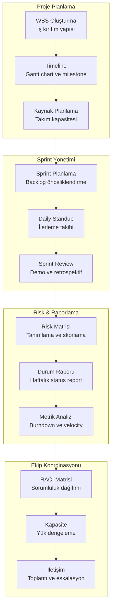
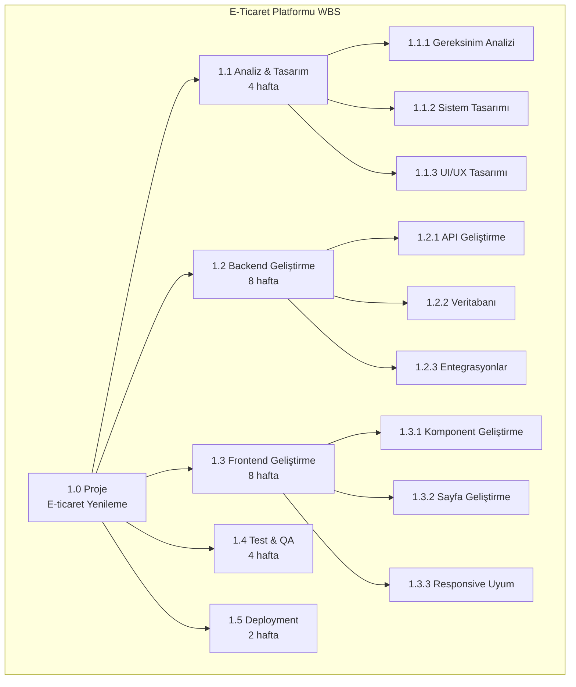
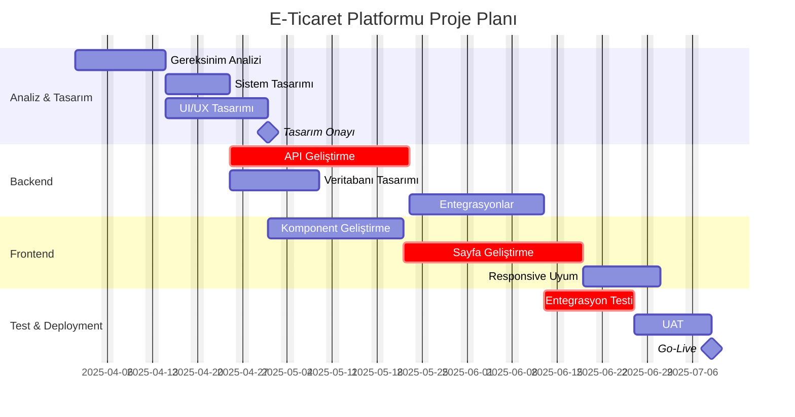
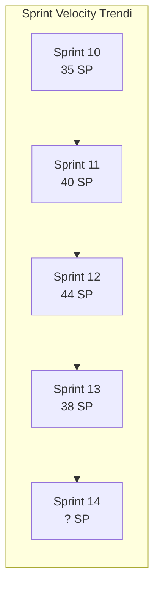
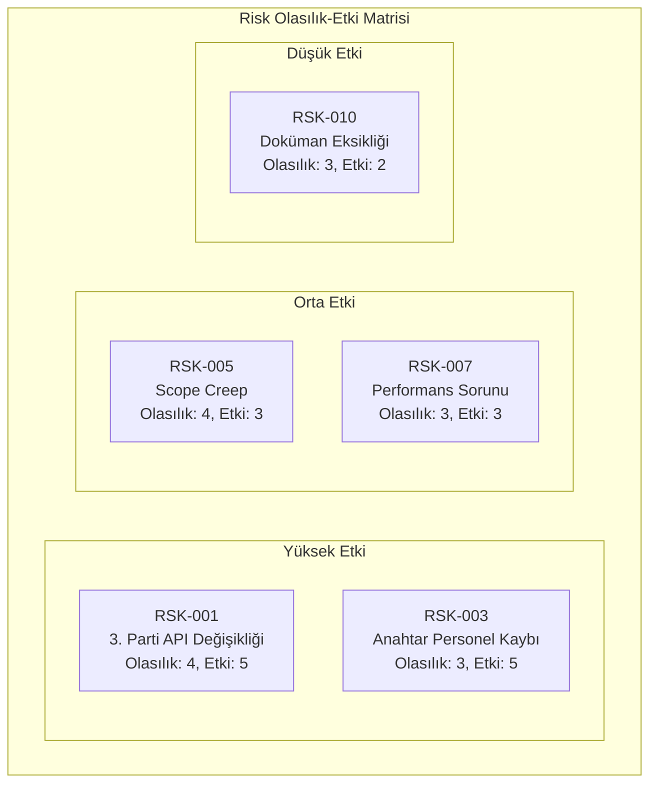

# Proje Yöneticisi Rehberi

Proje yöneticileri (Project Manager - PM), proje planlama, sprint yönetimi, risk yönetimi ve ekip koordinasyonu gibi çok yönlü sorumluluklar üstlenir. Claude Code, planlama dokümanları üretme, ilerleme raporlama, risk analizi ve ekip iletişimini kolaylaştırarak PM'lerin stratejik işlere daha fazla zaman ayırmasını sağlar.

## Ön Koşullar

| Konu | Bölüm |
|------|-------|
| Claude Code temelleri | [Bölüm 06](../06-claude-code-tanitim/README.md) |
| Araçlar genel bakış | [Araçlara Genel Bakış](../08-araclar/01-araclara-genel-bakis.md) |
| Prompt mühendisliği | [Prompt Mühendisliği](../04-ai-destekli-gelistirme/04-prompt-muhendisligi.md) |

---

## PM İş Akışı

Bir proje yöneticisinin Claude Code ile tipik iş akışı:



---

## Proje Planlama

### WBS (Work Breakdown Structure) Oluşturma

```bash
# Detaylı WBS oluşturma
claude "Aşağıdaki proje için WBS (Work Breakdown Structure - İş Kırılım Yapısı) oluştur:

Proje: E-ticaret platformu yenileme
Süre: 6 ay
Ekip: 4 frontend, 3 backend, 2 QA, 1 DevOps

WBS formatı:
1. Seviye 1: Ana iş paketleri (work packages)
2. Seviye 2: Alt görevler
3. Seviye 3: Detay görevler

Her görev için:
- ID (WBS numarası: 1.1.1 formatı)
- Görev adı
- Tahmini süre (gün)
- Bağımlılıklar (predecessor ID)
- Atanacak rol
- Deliverable (çıktı)

Minimum 40 görev, kritik yol (critical path) analizi dahil."
```



### Gantt Chart / Timeline Hazırlama

```bash
# Gantt chart oluşturma
claude "WBS'deki görevleri kullanarak mermaid gantt chart oluştur.

Proje başlangıç tarihi: 2025-04-01
Çalışma günleri: Pazartesi-Cuma

Gantt chart'ta şunlar görünsün:
1. Ana fazlar (section olarak)
2. Her görev için başlangıç-bitiş
3. Bağımlılıklar (after ilişkisi)
4. Milestone'lar (milestone olarak)
5. Kritik yol görevleri (crit olarak)

Ayrıca aşağıdakileri metin olarak ekle:
- Toplam proje süresi
- Kritik yol üzerindeki görevler listesi
- Float (boş süre) olan görevler
- Buffer önerisi"
```



### Kaynak Planlama

```bash
# Kaynak planlama ve yük dengeleme
claude "4 FE, 3 BE, 2 QA, 1 DevOps ekibi için kaynak planlama yap.
Kısıtlamalar: FE2 Mayıs'ta 2 hafta izinli, BE1 başka projede %50 meşgul.

Çıktı: kişi bazlı görev ataması, haftalık doluluk oranı, over-allocation uyarıları, bus factor riskleri ve yük dengeleme önerileri."
```

---

## Sprint Yönetimi

### Sprint Planlama

```bash
# Sprint planlama
claude "Sprint 14 planlaması: Velocity ortalaması 42 SP, efektif kapasite ~34 SP (1 kişi izinde).

[Backlog maddelerini yapıştır]

Sprint hedefi, alınacak story'ler, carry-over'lar, bağımlılık haritası, risk değerlendirmesi ve görev dağılımı önerisi oluştur."
```

### Daily Standup Özeti Oluşturma

```bash
# Standup notu yapılandırma
claude "Standup notlarını analiz et: kişi bazlı özet (tablo), blocker'lar, sprint ilerleme (%), risk sinyalleri ve PM aksiyonu gerektiren maddeler.

[Ham standup notlarını yapıştır]"
```

### Sprint Review ve Retrospektif

```bash
# Sprint review ve retro hazırlığı
claude "Sprint 13 review/retro hazırlığı: Planlanan 42 SP, tamamlanan 38 SP, 2 carry-over (API gecikme).

Review sunumu (hedef durumu, demo listesi, metrikler) ve retrospektif şablonu (Start/Stop/Continue, tartışma konuları, iyileştirme önerileri) hazırla."
```



---

## Risk Yönetimi

### Risk Matrisi Oluşturma

```bash
# Kapsamlı risk analizi
claude "6 aylık e-ticaret yenileme projesi için risk matrisi oluştur (10 kişi, 3. parti entegrasyonlar).

Her risk: ID (RSK-001), açıklama, kategori, olasılık/etki (1-5), skor, tetikleyici, azaltma stratejisi ve yedek plan. En az 15 risk tanımla."
```



### Risk Azaltma Planları

```bash
# Risk azaltma planı detaylandırma
claude "Yüksek riskler için detaylı azaltma planı oluştur:
RSK-001: 3. parti API değişikliği (Skor: 20)
RSK-003: Anahtar personel kaybı (Skor: 15)
RSK-005: Scope creep (Skor: 12)

Her biri için: önleyici aksiyonlar, hafifletici aksiyonlar, sorumlular, izleme planı ve eskalasyon kriteri."
```

### Erken Uyarı Sistemleri

```bash
# Proje sağlık göstergeleri
claude "Erken uyarı sistemi tanımla. Kategoriler: zaman, maliyet, kalite, kapsam, ekip.
Her KPI için yeşil/sarı/kırmızı eşikleri, ölçüm sıklığı ve alarm durumunda alınacak aksiyonu belirt."
```

---

## İlerleme Takibi ve Raporlama

### Durum Raporu (Status Report) Oluşturma

```bash
# Haftalık durum raporu
claude "Haftalık status report oluştur:
Sprint: 28/42 SP (gün 7/10), Blocker: Ödeme API beklemede, Bütçe: %60 kullanıldı / %55 ilerleme.

Format: RAG status, executive summary, başarılar, riskler (tablo), önümüzdeki hafta planı, karar gerektiren maddeler ve bütçe durumu."
```

### Burndown/Burnup Analizi

```bash
# Sprint analizi
claude "Sprint 13 burndown analizi: Gün 1-10 verileri [42,42,37,35,32,28,22,15,8,4 SP].
Gün 5'te +3 SP scope change oldu. İdeal vs gerçek karşılaştırması, scope change etkisi, carry-over root cause ve sonraki sprint kapasite önerisi yap."
```

### Milestone Tracking

```bash
# Milestone takip raporu
claude "Milestone takibi: M1 3 gün gecikti, M2 risk altında, M3 yolunda, M4-M5 tarih belirsiz.
Her milestone için RAG status, domino etkisi analizi, telafi planı ve Go-Live için best/realistic/worst case senaryoları oluştur."
```

---

## Ekip Koordinasyonu

### RACI Matrisi

```bash
# RACI matrisi oluşturma
claude "PM, PO, TL, FE, BE, QA, DevOps, UX rolleri için RACI matrisi oluştur.
En az 15 aktivite (gereksinim, tasarım, sprint planlama, geliştirme, test, deployment vb.).
Her satırda 1 Accountable, en az 1 Responsible olmalı. Tablo formatında sun."
```

### Kapasite Planlama

```bash
# Çok sprint kapasite planlama
claude "4 sprint kapasite planı: 5 BE, 4 FE, 2 QA. Kısıtlamalar: BE2 Sprint 15'te izinli, FE1 Sprint 16'da 3 gün konferansta, QA1 Sprint 17'de %50 başka projede. %15 teknik borç payı dahil.

Sprint bazlı efektif kapasite, skill gap analizi ve cross-training önerileri oluştur."
```

### Toplantı Yönetimi

```bash
# Toplantı planı ve ajanda
claude "Sprint Planning (2 saat), Sprint Review (1 saat), Retrospektif (1.5 saat) ve Stakeholder Update (30 dk) için ajanda oluştur.
Her toplantı için: timebox, gündem maddeleri, hazırlık gereksinimleri ve çıktılar."
```

```bash
# Eskalasyon yönetimi
claude "4 seviyeli eskalasyon framework'ü oluştur (L1: PM, L2: Dept Head, L3: Direktör, L4: C-Level).
Her seviye için: eskalasyon koşulları, max bekleme süresi, iletişim formatı ve SLA."
```

---

## Proje Yöneticileri İçin En İyi Prompt Pattern'leri

### 1. Veri ile Bağlam Verme

```bash
# İyi ✅
claude "Sprint velocity verimiz: S10=35, S11=40, S12=44, S13=38.
Bu trendi analiz et. Düşüşün olası sebeplerini listele ve Sprint 14 için gerçekçi bir kapasite hedefi öner."
```

### 2. Şablon Bazlı Çalışma

```bash
# İyi ✅
claude "Haftalık durum raporu şablonumu doldur. Girdiler: [veriler]. 
Format: RAG status, executive summary (3 madde), riskler (tablo), 
önümüzdeki hafta planı, karar gerektiren maddeler."
```

### 3. Senaryo Analizi

```bash
# İyi ✅
claude "Go-live tarihimiz 30 Temmuz. Şu an 3 günlük gecikmemiz var. 
3 senaryo analiz et:
1. Best case: Gecikme telafi edilir
2. Realistic: Gecikme 1 haftaya çıkar
3. Worst case: Gecikme 3 haftayı bulur
Her senaryo için: koşullar, etki, aksiyon planı ve maliyet."
```

### 4. Otomatik Hesaplama

```bash
# İyi ✅
claude "Ekip kapasitesi: 5 dev × 10 gün × 0.8 (focus factor) = 40 kişi-gün.
İzinler: 2 gün (FE2) + 3 gün (BE1) = 5 kişi-gün kayıp.
Net kapasite: 35 kişi-gün.
Bu kapasiteye göre backlog'dan sprint'e alınabilecek story'leri seç."
```

### 5. Karşılaştırma ve Karar Desteği

```bash
# İyi ✅
claude "İki proje yönetim yaklaşımını karşılaştır:
A) 2 haftalık sprintler B) Kanban (sürekli akış)

Projemizin bağlamı: 10 kişilik ekip, 6 aylık proje, değişen gereksinimler.
Her yaklaşım için: avantajlar, dezavantajlar, uygunluk skoru (1-10), 
geçiş maliyeti. Önerini gerekçelendir."
```

---

## Özet

| Görev | Claude Code Katkısı |
|------|---------------------|
| **WBS & Planlama** | İş kırılım yapısı, kritik yol analizi, timeline |
| **Sprint Yönetimi** | Kapasite bazlı sprint planlama, standup analizi |
| **Risk Yönetimi** | Risk matrisi, azaltma planları, erken uyarı sistemi |
| **Raporlama** | RAG status report, burndown analizi, milestone takibi |
| **Ekip Koordinasyonu** | RACI matrisi, kapasite planlama, eskalasyon framework |
| **Toplantı Yönetimi** | Ajanda hazırlama, retro kolaylaştırma, karar takibi |

---

## Sonraki Adım

Ürün müdürü perspektifinden strateji, roadmap ve lansman yönetimi:

→ [Ürün Müdürü Rehberi](./05-urun-urun-muduru.md)
