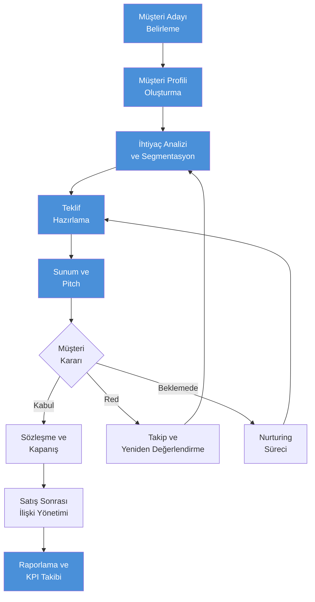
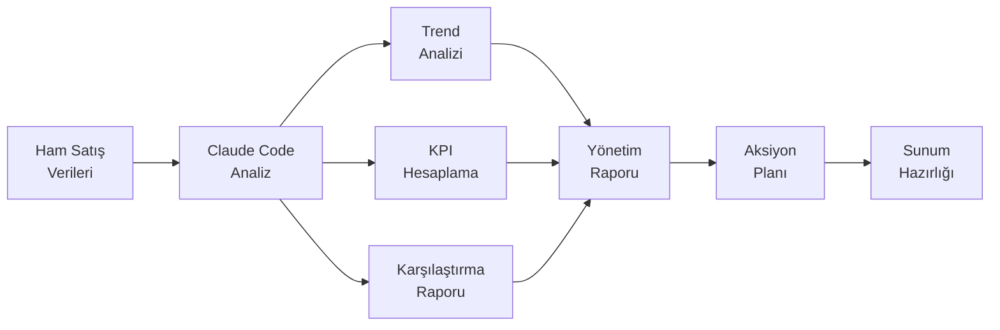

# Satış Rehberi

## Claude Code ile Satış Süreçlerinde Yapay Zeka Desteği

Satış profesyonelleri, müşteri ilişkilerinden teklif hazırlamaya, veri analizinden raporlamaya kadar geniş bir yelpazede çalışır. Claude Code, bu süreçlerin her aşamasında doğal dil komutlarıyla güçlü bir asistan olarak hizmet verir. Kod yazmaya gerek kalmadan, günlük satış operasyonlarınızı hızlandırabilir, veri odaklı kararlar almanıza yardımcı olabilir ve tekrarlayan görevleri otomatikleştirebilirsiniz.

Bu rehber, satış ekiplerinin Claude Code'u günlük iş akışlarına nasıl entegre edebileceğini pratik örneklerle açıklar.

---

## Satış İş Akışı

Aşağıdaki diyagram, satış sürecinin temel adımlarını ve Claude Code'un hangi aşamalarda destek sağladığını gösterir:



> Mavi kutular Claude Code'un aktif destek sağladığı aşamaları temsil eder.

---

## 1. Müşteri Analizi

### Müşteri Profili Oluşturma

Claude Code, mevcut müşteri verilerinizi analiz ederek detaylı müşteri profilleri oluşturmanıza yardımcı olur.

**Örnek Prompt:**
```
Aşağıdaki müşteri bilgilerini analiz edip detaylı bir müşteri profili oluştur:

Şirket: ABC Teknoloji A.Ş.
Sektör: Yazılım
Çalışan Sayısı: 150
Yıllık Ciro: 25 milyon TL
Mevcut Ürünlerimiz: Temel paket
Son 12 ay satın alma geçmişi: 3 sipariş, toplam 45.000 TL

Profilde şunları içer: büyüme potansiyeli, cross-sell fırsatları, risk faktörleri ve önerilen iletişim stratejisi.
```

### Müşteri Segmentasyonu

```
Aşağıdaki müşteri listesini analiz edip segmentlere ayır. Her segment için önerilen satış stratejisini belirle:

- Segment kriterleri: yıllık harcama, satın alma sıklığı, sektör, şirket büyüklüğü
- Her segment için: segment adı, özellikleri, tahmini potansiyel, önerilen yaklaşım

[Müşteri verileri buraya yapıştırılır]
```

---

## 2. Teklif Hazırlama

### Proposal (Teklif) Oluşturma

Claude Code ile profesyonel teklifler hızla hazırlanabilir.

**Örnek Prompt:**
```
Aşağıdaki bilgilere göre profesyonel bir satış teklifi oluştur:

Müşteri: XYZ Lojistik
İhtiyaç: Depo yönetim sistemi
Ürünümüz: SmartWMS Pro paketi
Fiyat: Yıllık 180.000 TL
Uygulama süresi: 8 hafta
Destek: 7/24 teknik destek dahil

Teklifte şunlar bulunsun:
- Yönetici özeti
- Müşteri ihtiyaçlarının analizi
- Çözüm önerimiz ve faydaları
- ROI hesaplaması
- Uygulama takvimi
- Fiyatlandırma detayları
- Referanslar bölümü
```

### Fiyatlandırma Analizi

```
Rakip fiyatlarını ve pazar konumumuzu analiz et:

Bizim fiyatımız: 180.000 TL/yıl
Rakip A: 150.000 TL/yıl (temel özellikler)
Rakip B: 220.000 TL/yıl (premium)
Rakip C: 165.000 TL/yıl (orta segment)

Fiyat pozisyonumuzu değerlendir, güçlü ve zayıf yönlerimizi belirle,
müşteriye sunabileceğimiz değer önerisi (value proposition) oluştur.
```

---

## 3. CRM Veri Analizi

### Satış Pipeline (Satış Hattı) Analizi

Claude Code, CRM verilerinizden anlamlı içgörüler çıkarabilir.

**Örnek Prompt:**
```
Aşağıdaki satış pipeline verilerini analiz et ve öneriler sun:

Aşama          | Fırsat Sayısı | Toplam Değer  | Ort. Yaş (gün)
Prospecting    | 45            | 2.1M TL       | 12
Qualification  | 28            | 1.8M TL       | 25
Proposal       | 15            | 1.2M TL       | 38
Negotiation    | 8             | 650K TL       | 52
Closing        | 4             | 320K TL       | 15

Dönüşüm oranlarını hesapla, darboğazları belirle ve
pipeline sağlığını değerlendir. İyileştirme önerileri sun.
```

### Forecast (Satış Tahmini)

```
Son 6 aylık satış verilerini kullanarak önümüzdeki çeyrek için
satış tahmini oluştur:

Ocak: 850K TL (hedef: 800K) - %106
Şubat: 720K TL (hedef: 850K) - %85
Mart: 1.1M TL (hedef: 900K) - %122
Nisan: 680K TL (hedef: 850K) - %80
Mayıs: 920K TL (hedef: 900K) - %102
Haziran: 1.3M TL (hedef: 1M) - %130

Trendi analiz et, mevsimsellik etkisini değerlendir ve
Temmuz-Ağustos-Eylül tahmini oluştur. Güven aralıklarını da belirt.
```

---

## 4. Sunum Hazırlama

### Pitch Deck İçeriği

```
B2B yazılım satışı için bir pitch deck (sunum) içeriği hazırla:

Ürün: Bulut tabanlı ERP çözümü
Hedef Kitle: Orta ölçekli üretim şirketleri (50-500 çalışan)
Süre: 15 dakikalık sunum

Her slayt için başlık, ana mesaj ve konuşma notları oluştur.
Slayt sırası: Problem, Çözüm, Demo özeti, Pazar büyüklüğü,
Rekabet avantajı, Müşteri hikayeleri, Fiyatlandırma, Sonraki adımlar.
```

### Competitive Analysis (Rekabet Analizi)

```
Aşağıdaki rakip bilgilerini kullanarak karşılaştırmalı analiz tablosu oluştur:

Bizim Ürün: CloudERP Pro
Rakip 1: SAP Business One - kurumsal, yüksek fiyat, karmaşık kurulum
Rakip 2: Logo Tiger - yerel, orta fiyat, sınırlı bulut
Rakip 3: Mikro Yazılım - düşük fiyat, temel özellikler

Karşılaştırma kriterleri: fiyat, özellik kapsamı, kurulum süresi,
destek kalitesi, ölçeklenebilirlik, entegrasyon kapasitesi.

Her rakibe karşı konumlanma stratejisi ve karşı argümanlar öner.
```

---

## 5. Email ve İletişim

### Müşteri Email Şablonları

```
Aşağıdaki senaryolar için profesyonel satış e-posta şablonları oluştur:

1. Soğuk e-posta (cold outreach) - ilk temas
2. Demo sonrası takip e-postası
3. Teklif gönderimi e-postası
4. Teklif takip e-postası (5 gün sonra)
5. Kaybedilen fırsatı yeniden canlandırma

Her şablon için: konu satırı, gövde metni ve call-to-action belirt.
Ton: profesyonel ama samimi, kısa ve öz.
```

### Takip Stratejileri

```
30 gündür yanıt vermeyen 5 müşteri adayı için kişiselleştirilmiş
takip stratejisi oluştur:

1. Müşteri A - Demo izledi ama geri dönmedi (finans sektörü)
2. Müşteri B - Fiyat yüksek dedi (perakende)
3. Müşteri C - "Şu an zamanımız yok" dedi (üretim)
4. Müşteri D - Rakip ürünü değerlendiriyor (teknoloji)
5. Müşteri E - Karar verici değişti (sağlık)

Her biri için: önerilen kanal, mesaj içeriği, zamanlama ve
alternatif yaklaşım.
```

---

## 6. Raporlama

### Satış Performans Raporu



**Örnek Prompt:**
```
Aşağıdaki aylık satış verilerini kullanarak yönetim için
performans raporu hazırla:

Satış Temsilcisi | Hedef    | Gerçekleşen | Yeni Müşteri | Pipeline
Ahmet K.        | 500K TL  | 620K TL     | 8            | 1.2M TL
Elif S.         | 450K TL  | 380K TL     | 5            | 800K TL
Murat D.        | 500K TL  | 510K TL     | 12           | 1.5M TL
Zeynep A.       | 400K TL  | 450K TL     | 6            | 650K TL

Raporda şunlar bulunsun:
- Ekip geneli performans özeti
- Bireysel performans değerlendirmesi
- Hedef gerçekleşme oranları
- Trend analizi ve öngörüler
- İyileştirme önerileri
```

### KPI Tracking (Temel Performans Göstergeleri Takibi)

```
Satış ekibimiz için aylık KPI dashboard içeriği oluştur:

Takip edilecek metrikler:
- MRR (Monthly Recurring Revenue / Aylık Yinelenen Gelir): 2.5M TL
- Churn Rate (Müşteri Kaybı Oranı): %3.2
- CAC (Customer Acquisition Cost / Müşteri Edinme Maliyeti): 15K TL
- LTV (Lifetime Value / Müşteri Yaşam Boyu Değeri): 180K TL
- Win Rate (Kazanma Oranı): %28
- Average Deal Size (Ortalama Anlaşma Büyüklüğü): 85K TL
- Sales Cycle Length (Satış Döngüsü Süresi): 45 gün

Her KPI için: mevcut durum, hedef, trend yönü ve önerilen aksiyonlar.
LTV/CAC oranını değerlendir ve sağlık analizi yap.
```

---

## Satış Profesyonelleri İçin Prompt Örnekleri

| Senaryo | Prompt |
|---------|--------|
| Müşteri araştırma | "XYZ şirketinin sektör pozisyonu, büyüme trendi ve potansiyel ihtiyaçları hakkında bir araştırma özeti hazırla" |
| Toplantı hazırlığı | "Yarınki müşteri toplantısı için gündem oluştur. Konu: ERP yenileme, katılımcılar: IT Direktörü ve CFO" |
| İtiraz yönetimi | "Müşteri 'fiyatınız çok yüksek' dediğinde kullanabileceğim 5 farklı karşı argüman hazırla" |
| Sözleşme inceleme | "Bu sözleşme taslağındaki riskli maddeleri ve eksiklikleri belirle, düzeltme önerileri sun" |
| Referans hikayesi | "Mevcut müşterimiz ABC'nin başarı hikayesini bir case study formatında yaz" |
| Pazar analizi | "Türkiye'de bulut ERP pazarının mevcut durumunu ve 2026 trendlerini özetle" |
| Üst satış fırsatı | "Mevcut temel paket müşterilerimize premium paketi sunmak için upsell stratejisi oluştur" |
| Haftalık rapor | "Bu haftaki 12 müşteri görüşmesinin özetini ve sonraki adımları listele" |

---

## Özet

Claude Code, satış profesyonellerine şu alanlarda güçlü destek sağlar:

- **Müşteri Analizi**: Profil oluşturma, segmentasyon ve potansiyel değerlendirme
- **Teklif Hazırlama**: Profesyonel teklifler, fiyatlandırma analizi ve ROI hesaplamaları
- **Veri Analizi**: Pipeline analizi, satış tahmini ve trend değerlendirme
- **İletişim**: E-posta şablonları, sunum içerikleri ve takip stratejileri
- **Raporlama**: Performans raporları, KPI takibi ve yönetim sunumları

Satış ekiplerinin Claude Code'dan en iyi şekilde yararlanması için öneriler:

1. **Bağlam verin**: Sektör, müşteri profili ve hedeflerinizi prompt'lara dahil edin
2. **Veri paylaşın**: Ne kadar çok veri sağlarsanız, o kadar isabetli analiz alırsınız
3. **İteratif çalışın**: İlk çıktıyı geliştirmek için takip prompt'ları kullanın
4. **Şablon oluşturun**: Sık kullandığınız prompt'ları şablonlaştırarak zaman kazanın
5. **Gizliliğe dikkat edin**: Hassas müşteri verilerini paylaşırken şirket politikalarını takip edin
