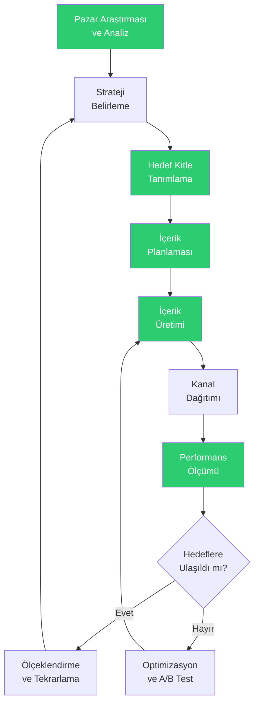
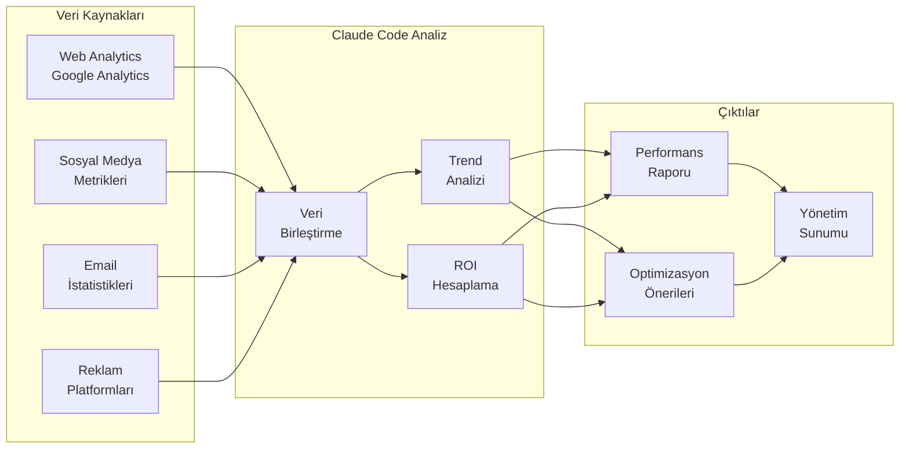

# Pazarlama Rehberi

## Claude Code ile Pazarlama Süreçlerinde Yapay Zeka Desteği

Pazarlama profesyonelleri, içerik üretiminden veri analizine, kampanya planlamadan marka yönetimine kadar birçok farklı alanda çalışır. Claude Code, bu süreçlerin tamamında doğal dil komutlarıyla kullanılabilecek güçlü bir araçtır. Kod yazmaya gerek kalmadan; blog yazıları oluşturabilir, SEO analizi yapabilir, kampanya stratejileri geliştirebilir ve pazarlama metriklerinizi analiz edebilirsiniz.

Bu rehber, pazarlama ekiplerinin Claude Code'u günlük operasyonlarına nasıl entegre edebileceğini somut örneklerle gösterir.

---

## Pazarlama İş Akışı



> Yeşil kutular Claude Code'un aktif destek sağladığı aşamaları gösterir.

---

## 1. İçerik Üretimi

### Blog Yazıları

Claude Code ile SEO uyumlu, hedef kitlenize yönelik blog yazıları hızla oluşturulabilir.

**Örnek Prompt:**
```
Aşağıdaki bilgilere göre bir blog yazısı oluştur:

Konu: "2026'da KOBİ'ler İçin Dijital Pazarlama Trendleri"
Hedef Kitle: Küçük ve orta ölçekli işletme sahipleri
Ton: Bilgilendirici ama ulaşılabilir, jargondan kaçınan
Uzunluk: 1200-1500 kelime
SEO Anahtar Kelime: "KOBİ dijital pazarlama"

İçerikte şunlar bulunsun:
- Dikkat çekici giriş
- En az 5 trend ve her birinin pratik uygulaması
- Gerçek dünya örnekleri
- Aksiyon maddeleri ile sonuç
- Meta description önerisi
```

### Sosyal Medya İçerikleri

```
LinkedIn için 1 haftalık içerik takvimi oluştur:

Marka: SaaS B2B şirket (proje yönetim yazılımı)
Hedef Kitle: Orta düzey yöneticiler ve proje yöneticileri
Hedefler: Thought leadership ve ürün farkındalığı

Her gönderi için:
- Gönderi metni (150-200 kelime)
- Hashtag önerileri (5-7 adet)
- Görsel açıklaması
- En iyi paylaşım zamanı
- Beklenen etkileşim türü (beğeni, yorum, paylaşım)

Haftalık dağılım: 2 eğitici, 1 ürün, 1 müşteri hikayesi, 1 sektör trendi
```

### Newsletter (Bülten) İçeriği

```
Aylık e-bülten içeriği hazırla:

Şirket: Dijital pazarlama ajansı
Abone profili: Pazarlama müdürleri ve marka yöneticileri
Konu: "Mart 2026 Dijital Pazarlama Özeti"

Bölümler:
1. Editör notu (kişisel, samimi ton)
2. Ayın öne çıkan 3 pazarlama haberi
3. Pratik ipucu bölümü
4. Başarı hikayesi / case study özeti
5. Önümüzdeki ay takvimi
6. Call-to-action
```

---

## 2. SEO Analizi

### Anahtar Kelime Araştırması

**Örnek Prompt:**
```
"Proje yönetim yazılımı" ana kelimesi etrafında kapsamlı bir
anahtar kelime araştırması yap:

Şunları oluştur:
- 20 long-tail (uzun kuyruk) anahtar kelime önerisi
- Her kelime için tahmini arama niyeti (bilgi, karşılaştırma, satın alma)
- İçerik türü önerisi (blog, landing page, karşılaştırma sayfası)
- Zorluk tahmini (düşük, orta, yüksek)
- Önerilen içerik başlığı

Ayrıca semantik olarak ilişkili kelime grupları oluştur.
```

### Rakip SEO Analizi

```
Aşağıdaki 3 rakibin web sitesi yapısını ve içerik stratejisini analiz et:

Rakip 1: www.rakip1.com - Blog'da ayda 12 yazı, ağırlıklı "nasıl yapılır" içerikleri
Rakip 2: www.rakip2.com - Kaynak merkezi, e-kitaplar, webinar sayfaları
Rakip 3: www.rakip3.com - Karşılaştırma sayfaları, fiyat sayfası detaylı

Analiz et:
- Her rakibin içerik stratejisi güçlü ve zayıf yönleri
- Bizim fırsatlarımız (content gap / içerik boşluğu)
- Önerilen içerik stratejisi ve 3 aylık yol haritası
```

---

## 3. Kampanya Planlama

### Kampanya Stratejisi

```
Yeni ürün lansmanı için entegre pazarlama kampanyası planla:

Ürün: AI destekli müşteri destek chatbot'u
Lansman Tarihi: 15 Nisan 2026
Bütçe: 150.000 TL
Hedef: 500 nitelikli lead (potansiyel müşteri adayı) elde etmek

Kampanya planında şunlar bulunsun:
- Pre-launch (öncesi), launch (lansman), post-launch (sonrası) fazları
- Her faz için kanal stratejisi ve bütçe dağılımı
- İçerik takvimi
- KPI hedefleri ve ölçüm yöntemi
- Risk analizi ve B planı
```

### Hedef Kitle Analizi

```
Aşağıdaki müşteri verilerini kullanarak detaylı persona (müşteri karakteri) oluştur:

Mevcut müşteri demografisi:
- %65 erkek, %35 kadın
- Yaş dağılımı: 28-45 ağırlıklı
- Pozisyon: %40 yönetici, %35 uzman, %25 direktör
- Sektör: %30 teknoloji, %25 finans, %20 perakende, %25 diğer
- Şirket büyüklüğü: %50 orta ölçek (50-250), %30 büyük (250+), %20 küçük

3 farklı persona oluştur. Her biri için:
- İsim, demografik bilgi, pozisyon
- Günlük zorluklar ve ağrı noktaları (pain points)
- Satın alma motivasyonları
- Bilgi kaynakları ve tercih ettiği kanallar
- Karar alma süreci
- Mesajlaşma stratejisi
```

---

## 4. Veri Analizi

### Marketing Metrics (Pazarlama Metrikleri)



**Örnek Prompt:**
```
Aşağıdaki pazarlama verilerini analiz et ve performans raporu oluştur:

Web Sitesi (Mart):
- Ziyaretçi: 45.000 (önceki ay: 38.000)
- Bounce Rate (Hemen Çıkma Oranı): %52 (önceki: %58)
- Ortalama Oturum Süresi: 2:45 (önceki: 2:20)
- Dönüşüm Oranı: %3.2 (önceki: %2.8)

Sosyal Medya:
- LinkedIn: 12K takipçi (+800), etkileşim oranı %4.2
- Instagram: 8K takipçi (+400), etkileşim oranı %5.8
- Twitter: 5K takipçi (+150), etkileşim oranı %2.1

Email:
- Açılma oranı: %28 (sektör ortalaması: %22)
- Tıklama oranı: %4.5 (sektör: %3.2)
- Abonelikten çıkma: %0.8

Tüm kanalları kapsayan performans değerlendirmesi,
öne çıkan başarılar, iyileştirme alanları ve öneriler sun.
```

### Conversion (Dönüşüm) Analizi

```
Satış hunisi dönüşüm verilerini analiz et:

Ziyaretçi → Lead: 45.000 → 1.350 (%3)
Lead → MQL (Marketing Qualified Lead): 1.350 → 540 (%40)
MQL → SQL (Sales Qualified Lead): 540 → 162 (%30)
SQL → Opportunity: 162 → 65 (%40)
Opportunity → Müşteri: 65 → 19 (%29)

Darboğazları belirle, her aşama için iyileştirme önerileri sun
ve 3 aylık optimizasyon planı oluştur.
```

---

## 5. Marka Yönetimi

### Brand Guidelines (Marka Kılavuzu) Oluşturma

```
Şirketimiz için marka sesini ve iletişim kılavuzunu oluştur:

Marka: TechFlow - B2B SaaS iş akışı otomasyonu
Değerler: Yenilikçilik, güvenilirlik, basitlik
Hedef Kitle: Kurumsal karar alıcılar

Kılavuzda şunlar bulunsun:
- Marka sesi tanımı ve örnekler
- Yapılması ve yapılmaması gerekenler (do's and don'ts)
- Farklı kanallar için ton ayarı (web sitesi, sosyal medya, email, basın)
- Mesaj hiyerarşisi (ana mesaj, destekleyici mesajlar, kanıt noktaları)
- Jargon ve terminoloji rehberi
- 5 örnek cümle dönüşümü (yanlış → doğru)
```

### Tone of Voice (Ses Tonu) Kontrol

```
Aşağıdaki pazarlama metinlerini marka kılavuzumuza uygunluk
açısından değerlendir ve düzelt:

Marka sesi: Profesyonel ama insancıl, teknik ama anlaşılır
Kaçınılması gereken: Aşırı resmi dil, klişeler, abartılı vaatler

Metin 1: [web sitesi açıklama metni]
Metin 2: [sosyal medya gönderisi]
Metin 3: [email kampanya metni]

Her metin için puan (1-10), sorunlu alanlar ve düzeltilmiş versiyon sun.
```

---

## 6. Email Marketing

### Email Kampanya Oluşturma

```
4 e-postadan oluşan bir drip campaign (damla kampanya) serisi oluştur:

Amaç: Ücretsiz deneme kullanıcılarını ücretli aboneye dönüştürmek
Ürün: Proje yönetim yazılımı
Süre: 14 günlük deneme süreci

Email 1 (Gün 1): Hoş geldin + hızlı başlangıç rehberi
Email 2 (Gün 4): Özellik keşfi + ipuçları
Email 3 (Gün 9): Başarı hikayesi + sosyal kanıt
Email 4 (Gün 12): Son gün hatırlatma + özel teklif

Her email için:
- Konu satırı (2 alternatif)
- Ön izleme metni
- Gövde içeriği
- CTA (Call-to-Action / Harekete Çağrı) butonu metni
- Gönderim zamanı önerisi
```

### A/B Test Planı

```
Email kampanyalarımız için A/B test planı oluştur:

Test edilecek öğeler ve hipotezler:
1. Konu satırı: Soru vs. rakam içeren
2. Gönderim zamanı: Salı sabah vs. Perşembe öğlen
3. CTA rengi ve metni: "Hemen Başla" vs. "Ücretsiz Dene"
4. İçerik uzunluğu: Kısa (100 kelime) vs. uzun (300 kelime)
5. Kişiselleştirme: İsimle hitap vs. genel

Her test için: hipotez, başarı kriteri, gerekli örneklem büyüklüğü,
test süresi ve beklenen etki tahmini.
```

---

## Pazarlama Profesyonelleri İçin Prompt Örnekleri

| Senaryo | Prompt |
|---------|--------|
| Başlık üretme | "Bu blog yazısı için SEO uyumlu 10 alternatif başlık öner: [konu]" |
| Sosyal kanıt | "Müşteri yorumlarını pazarlama materyaline dönüştür: [yorumlar]" |
| Landing page | "Bu ürün için yüksek dönüşüm odaklı landing page metni yaz" |
| Webinar planı | "AI ve pazarlama konusunda 45 dakikalık webinar için içerik planı oluştur" |
| Basın bülteni | "Yeni ürün lansmanı için basın bülteni hazırla: [ürün detayları]" |
| Hashtag araştırma | "B2B SaaS sektörü için LinkedIn'de trend hashtag'leri ve kullanım önerileri listele" |
| Rapor özeti | "Bu 20 sayfalık pazarlama raporunu yönetim için 1 sayfalık özete dönüştür" |
| İçerik dönüştürme | "Bu blog yazısını LinkedIn gönderisi, tweet serisi ve infografik metnine dönüştür" |

---

## Özet

Claude Code, pazarlama profesyonellerine şu alanlarda güçlü destek sağlar:

- **İçerik Üretimi**: Blog, sosyal medya, newsletter ve her türlü pazarlama metni
- **SEO Analizi**: Anahtar kelime araştırması, rakip analizi ve içerik optimizasyonu
- **Kampanya Planlama**: Strateji geliştirme, hedef kitle analizi ve bütçe planlaması
- **Veri Analizi**: Metrik değerlendirme, dönüşüm analizi ve raporlama
- **Marka Yönetimi**: Kılavuz oluşturma, ton kontrolü ve tutarlılık sağlama
- **Email Marketing**: Kampanya tasarımı, A/B test planlaması ve otomasyon

Pazarlama ekiplerinin Claude Code'dan en iyi şekilde yararlanması için öneriler:

1. **Hedef kitleyi tanımlayın**: Her prompt'ta hedef kitlenizi ve amacınızı belirtin
2. **Marka sesini koruyun**: Marka kılavuzunuzu referans olarak paylaşın
3. **Verilerle destekleyin**: Gerçek performans verilerinizi analiz için sunun
4. **Çoklu format üretin**: Bir içeriği farklı kanallara uyarlayın
5. **Sürekli optimize edin**: Sonuçları Claude Code ile analiz edip strateji güncelleyin
