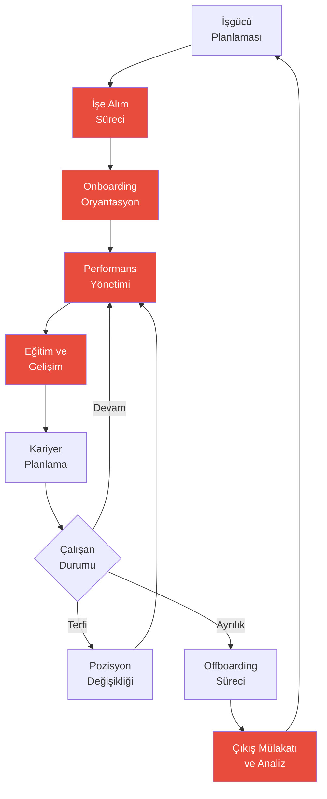
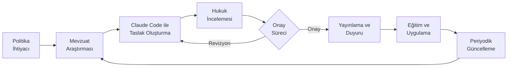

# İnsan Kaynakları Rehberi

## Claude Code ile İK Süreçlerinde Yapay Zeka Desteği

İnsan Kaynakları (İK) profesyonelleri, işe alımdan performans yönetimine, eğitim planlamadan politika oluşturmaya kadar geniş bir sorumluluk alanında çalışır. Claude Code, bu süreçlerin her birinde doğal dil komutlarıyla kullanılabilecek güçlü bir asistan sunar. Kod yazmaya gerek kalmadan; iş ilanları oluşturabilir, mülakat soruları hazırlayabilir, performans değerlendirme formları tasarlayabilir ve İK politikalarını düzenleyebilirsiniz.

Bu rehber, İK ekiplerinin Claude Code'u günlük operasyonlarına nasıl entegre edebileceğini pratik örneklerle açıklar.

---

## İK İş Akışı



> Kırmızı kutular Claude Code'un aktif destek sağladığı aşamaları gösterir.

---

## 1. İşe Alım

### İş İlanı Oluşturma

Claude Code ile farklı pozisyonlar için profesyonel ve çekici iş ilanları oluşturulabilir.

**Örnek Prompt:**
```
Aşağıdaki bilgilere göre çekici ve kapsayıcı bir iş ilanı oluştur:

Pozisyon: Kıdemli Dijital Pazarlama Uzmanı
Departman: Pazarlama
Lokasyon: İstanbul (hibrit çalışma - haftada 3 gün ofis)
Deneyim: En az 5 yıl
Maaş Aralığı: 55.000 - 75.000 TL (brüt)

Gereksinimler:
- Google Ads ve Meta Ads deneyimi
- SEO/SEM bilgisi
- Veri analizi yetkinliği
- B2B pazarlama deneyimi tercih sebebi

İlanda şunlar bulunsun:
- Dikkat çekici giriş paragrafı
- Rol ve sorumluluklar (6-8 madde)
- Aranan nitelikler (zorunlu ve tercih edilen ayrımı)
- Şirketin sunduğu avantajlar
- Kapsayıcı dil kullanımı
- Başvuru süreci bilgisi
```

### CV Tarama Kriterleri

```
Kıdemli Dijital Pazarlama Uzmanı pozisyonu için yapılandırılmış
CV değerlendirme matrisi oluştur:

Değerlendirme kriterleri ve ağırlıkları:
1. Teknik yetkinlikler (%30)
2. Sektör deneyimi (%20)
3. Eğitim ve sertifikalar (%15)
4. Liderlik deneyimi (%15)
5. Proje başarıları (%20)

Her kriter için:
- 1-5 arası puanlama rehberi (her puan seviyesinin tanımı)
- Otomatik eleme kriterleri (kırmızı bayraklar)
- Bonus puanlar (yeşil bayraklar)
- Örnek değerlendirme senaryosu
```

### Mülakat Soruları

```
Kıdemli Dijital Pazarlama Uzmanı pozisyonu için kapsamlı
mülakat soru seti hazırla:

3 aşamalı mülakat süreci için:

Aşama 1 - Telefon Ön Görüşme (20 dk):
- 5 elemeci soru (deneyim, maaş beklentisi, başlangıç tarihi)

Aşama 2 - Teknik Mülakat (45 dk):
- 8 yetkinlik bazlı soru (STAR metodu ile)
- 3 vaka çalışması sorusu

Aşama 3 - Kültür Uyumu (30 dk):
- 5 değer bazlı soru
- 3 senaryo sorusu

Her soru için: ideal cevap özeti ve puanlama kriterleri belirt.
```

---

## 2. Onboarding (İşe Başlama Süreci)

### Oryantasyon Programı

```
Yeni çalışanlar için 30-60-90 günlük oryantasyon programı oluştur:

Şirket: 200 çalışanlı teknoloji şirketi
Pozisyon türü: Orta düzey uzman pozisyonları

İlk 30 Gün (Öğrenme):
- Günlük aktivite planı (ilk hafta detaylı)
- Tanışma toplantıları listesi
- Okunması gereken dokümanlar
- Temel sistem eğitimleri

30-60 Gün (Katkı):
- İlk proje ataması
- Mentor buluşmaları
- Haftalık hedefler

60-90 Gün (Bağımsızlık):
- Performans beklentileri
- Geri bildirim seansı
- 90 gün değerlendirme formu

Her aşama için kontrol listesi (checklist) oluştur.
```

### Hoş Geldin Dokümanları

```
Yeni çalışanlar için hoş geldin paketi oluştur. Aşağıdaki
dokümanların taslağını hazırla:

1. Hoş geldin mektubu (CEO imzalı, samimi ton)
2. Şirket kültürü ve değerler rehberi
3. İlk gün rehberi (ofis planı, IT kurulumu, iletişim kanalları)
4. Sık sorulan sorular (FAQ) dokümanı
5. Önemli kişiler ve iletişim bilgileri şablonu
6. İzin ve yan haklar özet sayfası

Ton: sıcak, samimi ama profesyonel. Yeni çalışanın kendini
hoş karşılanmış hissetmesini sağla.
```

---

## 3. Performans Yönetimi

### Değerlendirme Formu Oluşturma

**Örnek Prompt:**
```
Yıllık performans değerlendirme formu oluştur:

Değerlendirme boyutları:
1. İş Sonuçları (%40)
   - Hedef gerçekleştirme
   - İş kalitesi
   - Verimlilik

2. Yetkinlikler (%35)
   - İletişim
   - Ekip çalışması
   - Problem çözme
   - Liderlik (yöneticiler için)

3. Gelişim (%25)
   - Öğrenme çevikliği
   - İnovasyon
   - Geri bildirime açıklık

Her boyut için:
- 1-5 ölçeği ile davranışsal göstergeler
- Yönetici yorum alanı
- Çalışan öz değerlendirme bölümü
- Genel performans notu hesaplama formülü
```

### Geri Bildirim Şablonları

```
Farklı senaryolar için yapıcı geri bildirim şablonları oluştur:

1. Olumlu geri bildirim - Beklentilerin üzerinde performans
2. Gelişim odaklı geri bildirim - Belirli bir beceri eksikliği
3. Düzeltici geri bildirim - Davranışsal sorun
4. Proje sonrası geri bildirim - Tamamlanan proje değerlendirmesi
5. 360 derece geri bildirim - Akranlar arası değerlendirme

Her şablon için:
- SBI modeli (Situation-Behavior-Impact / Durum-Davranış-Etki) formatı
- Yapılması ve yapılmaması gerekenler
- Örnek diyalog
- Takip aksiyonları
```

---

## 4. Eğitim ve Gelişim

### Eğitim Planı Oluşturma

```
2026 yılı için departman bazlı eğitim planı oluştur:

Şirket bilgileri:
- 200 çalışan, 6 departman
- Yıllık eğitim bütçesi: 500.000 TL
- Öncelikli alanlar: dijital yetkinlikler, liderlik, iletişim

Her departman için:
- Zorunlu eğitimler (compliance / uyumluluk)
- Teknik gelişim eğitimleri
- Yumuşak beceri eğitimleri
- Eğitim formatı önerisi (sınıf içi, online, workshop)
- Tahmini maliyet ve süre
- Başarı ölçütleri

Ayrıca yıllık eğitim takvimi ve bütçe dağılımı öner.
```

### Yetkinlik Matrisi

```
Pazarlama departmanı için yetkinlik matrisi oluştur:

Pozisyonlar:
- Pazarlama Uzmanı (Junior)
- Kıdemli Pazarlama Uzmanı
- Pazarlama Yöneticisi
- Pazarlama Direktörü

Yetkinlik alanları:
- Dijital pazarlama
- İçerik stratejisi
- Veri analizi
- Proje yönetimi
- Liderlik
- Stratejik düşünme
- Bütçe yönetimi

Her pozisyon-yetkinlik kesişimi için beklenen seviye (1-5):
1: Temel farkındalık
2: Temel uygulama
3: Bağımsız uygulama
4: İleri düzey / Mentorluk
5: Uzman / Strateji belirleme

Matris tablosu ve her geçiş için gelişim önerileri ekle.
```

---

## 5. İK Politikaları

### Politika Dokümanı Oluşturma



**Örnek Prompt:**
```
Uzaktan çalışma politikası dokümanı oluştur:

Şirket bilgileri:
- Hibrit model: haftada 2 gün uzaktan, 3 gün ofis
- Çalışan sayısı: 200
- Sektör: Teknoloji

Politikada şunlar bulunsun:
1. Amaç ve kapsam
2. Uygunluk kriterleri (hangi pozisyonlar, hangi koşullar)
3. Çalışma saatleri ve erişilebilirlik beklentileri
4. Ekipman ve altyapı desteği
5. Bilgi güvenliği kuralları
6. İletişim protokolleri
7. Performans ölçümü
8. Sağlık ve güvenlik sorumlulukları
9. Masraf politikası
10. İhlal durumunda uygulanacak prosedür

Dil: açık, anlaşılır, çalışan dostu. Yasal terminolojiyi
gerektiğinde açıklamalarla destekle.
```

### FAQ (Sık Sorulan Sorular) Hazırlama

```
Çalışanlardan en sık gelen İK sorularını ve cevaplarını içeren
kapsamlı bir FAQ dokümanı oluştur:

Kategoriler:
1. İzin ve tatil hakları (yıllık izin, mazeret izni, doğum izni)
2. Maaş ve yan haklar (ödeme takvimi, prim, yemek kartı)
3. Sağlık sigortası (kapsam, aile dahil etme, optik)
4. Uzaktan çalışma (gün sayısı, ekipman, internet desteği)
5. Eğitim ve gelişim (bütçe, izin, sertifika)
6. Performans ve terfi (değerlendirme takvimi, terfi kriterleri)
7. İş sağlığı ve güvenliği (ergonomi, acil durum)

Her soru için: net, kısa cevap + gerekirse ilgili politikaya referans.
Toplam 35-40 soru-cevap çifti oluştur.
```

---

## 6. Çalışan İletişimi

### Duyuru Metinleri

```
Aşağıdaki senaryolar için şirket içi duyuru metinleri hazırla:

1. Yeni CEO atanması duyurusu
2. Ofis taşınma bildirimi (2 ay sonra)
3. Yeni yan hak paketi tanıtımı
4. Organizasyon değişikliği (departman birleşmesi)
5. Bayram kutlama mesajı

Her duyuru için:
- E-posta versiyonu
- Intranet duyuru metni (kısa)
- Ton ve üslup: duruma uygun (resmi/kutlama/bilgilendirici)
- Sık sorulan sorular bölümü (gerekiyorsa)
```

### Çalışan Anket Analizi

```
Aşağıdaki çalışan memnuniyet anketi sonuçlarını analiz et:

Katılım Oranı: %78 (156/200 çalışan)

Sorular (1-5 ölçeği ortalama puanları):
1. Genel memnuniyet: 3.6
2. Yönetici ilişkisi: 4.1
3. Kariyer gelişimi fırsatları: 2.9
4. İş-yaşam dengesi: 3.3
5. Ücret ve yan haklar: 3.1
6. Çalışma ortamı: 3.8
7. İletişim ve şeffaflık: 3.0
8. Eğitim imkanları: 2.7
9. Takdir ve ödüllendirme: 2.8
10. Şirkete bağlılık: 3.5

Açık uçlu yorumlardan temalar:
- %35 "kariyer yolu belirsiz"
- %28 "eğitim bütçesi yetersiz"
- %22 "daha fazla esneklik istiyoruz"
- %18 "iletişim eksikliği var"

Detaylı analiz raporu oluştur:
- Güçlü ve zayıf alanlar
- Önceki yılla karşılaştırma yorumu
- Departman bazlı farklılık analizi önerisi
- Öncelikli aksiyon alanları (kısa/orta/uzun vade)
- Yönetim sunumu için özet
```

---

## İK Profesyonelleri İçin Prompt Örnekleri

| Senaryo | Prompt |
|---------|--------|
| İlan çevirme | "Bu iş ilanını İngilizce'ye çevir ve uluslararası standartlara uyarla" |
| Red mektubu | "Başvurusu reddedilen adaylara gönderilecek profesyonel ve empatik red e-postası yaz" |
| Toplantı gündemi | "Haftalık İK ekip toplantısı için gündem oluştur: işe alım güncellemeleri, devam eden projeler, haftalık metrikler" |
| Yasal metin | "İş sözleşmesindeki rekabet yasağı maddesini çalışan dostu bir dille açıkla" |
| Etkinlik planı | "200 kişilik şirket pikniği için organizasyon planı ve bütçe tahmini oluştur" |
| Çıkış mülakatı | "Kapsamlı çıkış mülakatı soru seti hazırla (15 soru, tematik gruplandırılmış)" |
| Rapor hazırlama | "Bu ayki işe alım verilerini (14 başvuru, 6 mülakat, 2 teklif, 1 kabul) analiz edip yönetime rapor hazırla" |
| Politika güncelleme | "Mevcut izin politikamızı yeni yasal düzenlemelere göre güncelle: [mevcut politika metni]" |

---

## Özet

Claude Code, İK profesyonellerine şu alanlarda güçlü destek sağlar:

- **İşe Alım**: İş ilanları, CV tarama kriterleri, mülakat soruları ve aday değerlendirme
- **Onboarding**: Oryantasyon programları, hoş geldin dokümanları ve kontrol listeleri
- **Performans Yönetimi**: Değerlendirme formları, geri bildirim şablonları ve hedef belirleme
- **Eğitim ve Gelişim**: Eğitim planları, yetkinlik matrisleri ve gelişim programları
- **Politika Yönetimi**: Politika dokümanları, FAQ'lar ve prosedür rehberleri
- **Çalışan İletişimi**: Duyuru metinleri, anket analizi ve iç iletişim stratejileri

İK ekiplerinin Claude Code'dan en iyi şekilde yararlanması için öneriler:

1. **Kapsayıcılığa dikkat edin**: İlanlar ve politikalarda kapsayıcı dil kullanılmasını isteyin
2. **Yasal uyumu kontrol edin**: Claude Code çıktılarını hukuk danışmanınıza onaylatın
3. **Şirket kültürünü yansıtın**: Şirket değerlerinizi ve tonunuzu prompt'lara dahil edin
4. **Verilerle destekleyin**: Anket sonuçları ve metrikleri analiz için paylaşın
5. **Gizliliğe özen gösterin**: Çalışan kişisel verilerini paylaşırken KVKK uyumuna dikkat edin
