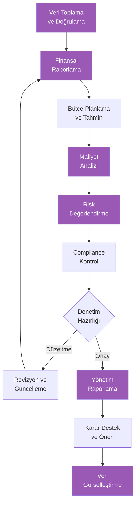
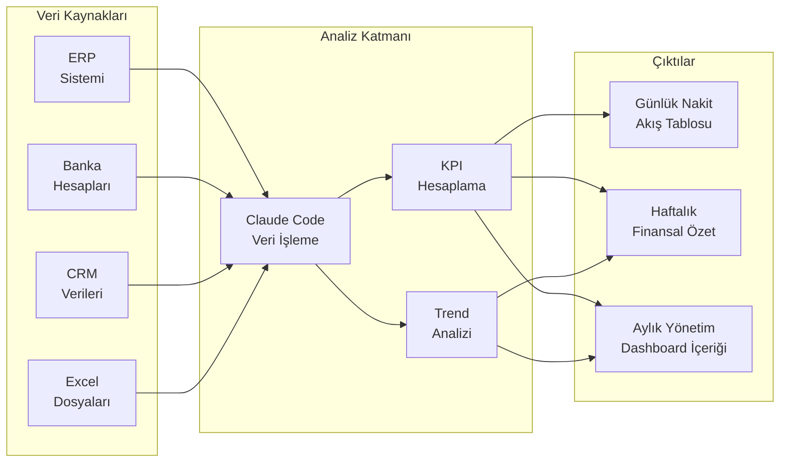

# Finans Rehberi

## Claude Code ile Finans Süreçlerinde Yapay Zeka Desteği

Finans profesyonelleri, raporlamadan bütçe planlamaya, risk analizinden mevzuat uyumluluğuna kadar yoğun ve detay odaklı süreçlerle çalışır. Claude Code, bu süreçlerde doğal dil komutlarıyla kullanılabilecek güçlü bir asistan olarak hizmet verir. Kod yazmaya gerek kalmadan; finansal raporlar oluşturabilir, bütçe analizleri yapabilir, risk değerlendirmeleri hazırlayabilir ve mevzuat uyumluluğunu kontrol edebilirsiniz.

Bu rehber, finans ekiplerinin Claude Code'u günlük operasyonlarına nasıl entegre edebileceğini pratik örneklerle gösterir.

---

## Finans İş Akışı



> Mor kutular Claude Code'un aktif destek sağladığı aşamaları gösterir.

---

## 1. Finansal Raporlama

### Rapor Oluşturma

Claude Code ile finansal verileri analiz edip profesyonel raporlar hazırlayabilirsiniz.

**Örnek Prompt:**
```
Aşağıdaki finansal verileri kullanarak aylık finansal rapor oluştur:

Gelir Tablosu (Mart 2026):
- Net Satışlar: 8.500.000 TL (Şubat: 7.200.000 TL)
- COGS (Satılan Malın Maliyeti): 5.100.000 TL
- Brüt Kar: 3.400.000 TL
- Operasyonel Giderler: 1.800.000 TL
  - Personel: 1.100.000 TL
  - Kira ve altyapı: 350.000 TL
  - Pazarlama: 200.000 TL
  - Diğer: 150.000 TL
- EBITDA: 1.600.000 TL
- Net Kar: 1.200.000 TL

Bilanço özet:
- Toplam Varlıklar: 45.000.000 TL
- Toplam Borçlar: 18.000.000 TL
- Öz Sermaye: 27.000.000 TL

Raporda şunlar bulunsun:
- Yönetici özeti
- Gelir analizi (aylık ve yıllık karşılaştırma)
- Kârlılık oranları (brüt kar marjı, net kar marjı, EBITDA marjı)
- Gider dağılımı analizi
- Likidite ve borçluluk oranları
- Öne çıkan noktalar ve riskler
- Sonraki ay tahminleri
```

### Finansal Veri Analizi

```
Aşağıdaki çeyreklik verileri karşılaştırmalı analiz et:

           Q1 2025    Q2 2025    Q3 2025    Q4 2025    Q1 2026
Gelir      22M TL     24M TL     21M TL     28M TL     25M TL
Gider      16M TL     17M TL     16.5M TL   19M TL     17.5M TL
Net Kar    4.5M TL    5.2M TL    3.2M TL    6.8M TL    5.5M TL
Çalışan    180        185        182        195        200

Trend analizi yap, mevsimsellik etkisini değerlendir,
verimlilik metriklerini (çalışan başı gelir, çalışan başı kar) hesapla
ve Q2 2026 tahmini oluştur.
```

---

## 2. Bütçe Planlama

### Bütçe Şablonu Oluşturma

**Örnek Prompt:**
```
2026 yılı departman bütçesi için şablon oluştur:

Departman: Pazarlama
2025 gerçekleşen toplam: 2.400.000 TL
2026 hedef büyüme: %15

Bütçe kalemleri:
1. Personel giderleri (maaş, prim, SGK)
2. Dijital reklam (Google, Meta, LinkedIn)
3. İçerik üretimi (ajans, freelancer)
4. Etkinlikler ve sponsorluklar
5. Yazılım ve araçlar (SaaS abonelikler)
6. Eğitim ve konferanslar
7. Baskı ve materyaller
8. Diğer

Her kalem için:
- Aylık dağılım önerisi
- Geçen yılla karşılaştırma
- Gerekçe ve açıklama
- Tasarruf fırsatları
- ROI beklentisi (ölçülebilir kalemlerde)
```

### Maliyet Analizi

```
Aşağıdaki maliyet verilerini analiz et ve optimizasyon önerileri sun:

Yazılım Abonelikleri (aylık):
- CRM: 12.000 TL (50 kullanıcı, aktif: 35)
- Proje Yönetimi: 8.000 TL (100 kullanıcı, aktif: 72)
- İletişim: 6.500 TL (200 kullanıcı)
- Analitik: 15.000 TL (10 kullanıcı, aktif: 4)
- Tasarım: 4.500 TL (5 kullanıcı, aktif: 3)
- Depolama: 3.000 TL (2 TB kullanım: 800 GB)
- Güvenlik: 9.000 TL (tüm şirket)

Toplam: 58.000 TL/ay = 696.000 TL/yıl

Analiz et:
- Kullanım oranı düşük olan abonelikler
- Birleştirme veya alternatif önerileri
- Tahmini tasarruf miktarı
- Öncelik sırasıyla aksiyon planı
```

---

## 3. Fatura ve Ödeme

### Fatura Kontrolü

```
Aşağıdaki fatura verilerini kontrol et ve tutarsızlıkları belirle:

Tedarikçi Sözleşme Bilgileri:
- ABC Lojistik: Aylık sabit 45.000 TL + km başı 3.50 TL
- XYZ Temizlik: Aylık 28.000 TL (KDV dahil)
- 123 IT Destek: Saatlik 750 TL, aylık maks 40 saat

Gelen Faturalar (Mart):
- ABC Lojistik: 78.500 TL (Not: 8.200 km yapıldı)
- XYZ Temizlik: 33.040 TL (Not: KDV dahil yazıyor)
- 123 IT Destek: 36.000 TL (Not: 48 saat çalışıldı belirtilmiş)

Her faturayı sözleşmeye göre doğrula, tutarsızlıkları belirle
ve tedarikçiye gönderilecek düzeltme talebi taslağını hazırla.
```

### Ödeme Takibi

```
Alacak yaşlandırma tablosunu analiz et ve tahsilat stratejisi öner:

Müşteri        | Toplam Alacak | 0-30 gün | 31-60 gün | 61-90 gün | 90+ gün
Müşteri A      | 250K TL       | 120K     | 80K       | 50K       | -
Müşteri B      | 180K TL       | 60K      | 40K       | 30K       | 50K
Müşteri C      | 95K TL        | 95K      | -         | -         | -
Müşteri D      | 320K TL       | 100K     | 100K      | 70K       | 50K
Müşteri E      | 45K TL        | -        | -         | 15K       | 30K
Toplam         | 890K TL       | 375K     | 220K      | 165K      | 130K

Analiz et:
- Risk seviyesine göre müşteri sıralaması
- Her müşteri için önerilen tahsilat aksiyonu
- Gecikme maliyeti hesaplaması
- Nakit akışı üzerindeki etki
- Tahsilat e-posta şablonları (nazik hatırlatma, resmi uyarı, son ihtar)
```

---

## 4. Risk Analizi

### Finansal Risk Değerlendirme

**Örnek Prompt:**
```
Şirketimizin finansal risk profilini değerlendir:

Mevcut Durum:
- Borç/Öz Sermaye Oranı: 0.67
- Cari Oran: 1.8
- Nakit Döngüsü: 65 gün
- Alacak Devir Hızı: 5.5 (yılda)
- Döviz Pozisyonu: 500K USD alacak, 200K EUR borç
- Gelir Yoğunlaşması: En büyük müşteri gelirin %22'si
- Sektör: İhracat odaklı üretim

Risk değerlendirmesi yap:
- Likidite riski
- Kur riski (USD/TRY ve EUR/TRY senaryoları)
- Kredi riski (müşteri yoğunlaşması)
- Operasyonel riskler
- Piyasa riskleri

Her risk için: seviye (düşük/orta/yüksek), etki analizi,
azaltma stratejisi ve erken uyarı göstergeleri belirle.
```

---

## 5. Compliance (Mevzuat Uyumluluk)

### Mevzuat Uyumluluk Kontrolü

```
Aşağıdaki finansal süreçleri mevzuat uyumluluğu açısından
değerlendir ve kontrol listesi oluştur:

Kontrol alanları:
1. Vergi uyumluluğu (KDV, Kurumlar Vergisi, Stopaj)
2. TFRS/TMS raporlama standartları
3. SPK düzenlemeleri (halka açık şirketler için)
4. KVKK kapsamında finansal veri koruma
5. E-fatura ve e-defter uyumluluğu
6. Transfer fiyatlandırması
7. Kara para aklama önlemleri (AML)

Her alan için:
- Kontrol edilmesi gereken maddeler
- Uyumluluk durumu değerlendirme kriterleri
- Eksiklik durumunda yapılması gerekenler
- Cezai yaptırım bilgileri
- Kontrol sıklığı önerisi
```

### Denetim Hazırlığı

```
Yıl sonu bağımsız denetim için hazırlık kontrol listesi oluştur:

Denetim türü: Tam kapsamlı bağımsız denetim
Dönem: 01.01.2025 - 31.12.2025
Şirket: Orta ölçekli üretim şirketi

Hazırlanması gereken dokümanlar:
1. Mali tablolar ve dipnotlar
2. Mizan ve yardımcı defterler
3. Banka mutabakatları
4. Müşteri ve tedarikçi mutabakatları
5. Stok sayım tutanakları
6. Amortisman tabloları
7. Vergi beyannameleri
8. Yönetim kurulu kararları
9. Sözleşmeler ve taahhütler
10. İlişkili taraf işlemleri

Her doküman için: sorumlu kişi alanı, tamamlanma tarihi,
kontrol eden ve notlar sütunu içeren tablo formatı.
```

---

## 6. Veri Görselleştirme

### Dashboard (Kontrol Paneli) Tasarımı



**Örnek Prompt:**
```
CFO dashboard'u için içerik ve yapı tasarla:

Gereken bölümler ve KPI'lar:

1. Nakit Akışı Bölümü:
   - Günlük nakit pozisyonu
   - Haftalık nakit akış tahmini
   - Vadesi gelen alacak/borç özeti

2. Gelir Bölümü:
   - Aylık gelir vs. hedef
   - Gelir kırılımı (ürün/hizmet/bölge)
   - YoY (Year-over-Year / Yıllık) büyüme oranı

3. Gider Bölümü:
   - Bütçe vs. gerçekleşen
   - Departman bazlı gider dağılımı
   - Opex vs Capex oranı

4. Kârlılık Bölümü:
   - Brüt Kar Marjı trendi
   - EBITDA marjı
   - Net Kar Marjı

5. Risk Göstergeleri:
   - DSO (Days Sales Outstanding / Alacak Tahsil Süresi)
   - DPO (Days Payable Outstanding / Borç Ödeme Süresi)
   - Quick Ratio (Asit-Test Oranı)
   - Borç/Öz Sermaye Oranı

Her KPI için: hedef değer, alarm eşiği, güncelleme sıklığı ve
veri kaynağını belirt.
```

### KPI Tracking (Temel Performans Göstergeleri Takibi)

```
Aşağıdaki finansal KPI'ları değerlendir ve yönetim için rapor oluştur:

KPI                      | Hedef    | Gerçekleşen | Trend
Net Kar Marjı            | %15      | %14.1       | ↗ İyileşiyor
Brüt Kar Marjı           | %40      | %40         | → Sabit
EBITDA Marjı             | %22      | %18.8       | ↘ Düşüyor
Cari Oran                | 2.0      | 1.8         | → Sabit
DSO                      | 45 gün   | 52 gün      | ↗ Kötüleşiyor
Gelir Büyümesi (YoY)     | %20      | %18         | ↗ İyileşiyor
Opex / Gelir Oranı       | %25      | %28         | ↘ Kötüleşiyor
Çalışan Başı Gelir       | 400K TL  | 375K TL     | ↗ İyileşiyor

Her KPI için:
- Mevcut durum değerlendirmesi
- Hedefe ulaşmak için gereken iyileştirme
- Önerilen aksiyon
- Sonraki dönem tahmini
```

---

## Finans Profesyonelleri İçin Prompt Örnekleri

| Senaryo | Prompt |
|---------|--------|
| Rapor özeti | "Bu finansal tabloyu yönetim için 1 sayfalık özete dönüştür: [veriler]" |
| Senaryo analizi | "Kur %20 artarsa gelir tablomuza etkisini 3 farklı senaryo ile analiz et" |
| Bütçe karşılaştırma | "Q1 bütçe ve gerçekleşen verileri karşılaştırıp sapma analizi yap" |
| Yatırım değerlendirme | "Bu makine yatırımının (850K TL) geri ödeme süresini ve NPV'sini hesapla" |
| Maliyet dağıtımı | "Genel giderleri departmanlara dağıtmak için adil bir yöntem öner" |
| Vergi planlaması | "Yıl sonu vergi planlaması için kontrol listesi oluştur" |
| Nakit akış tahmini | "Önümüzdeki 3 aylık nakit akış tablosu taslağı oluştur: [mevcut veriler]" |
| Sunum hazırlığı | "Bu çeyrek sonuçlarını yönetim kurulu sunumuna uygun formata dönüştür" |

---

## Özet

Claude Code, finans profesyonellerine şu alanlarda güçlü destek sağlar:

- **Finansal Raporlama**: Gelir tablosu, bilanço analizi ve karşılaştırmalı raporlar
- **Bütçe Planlama**: Bütçe şablonları, maliyet analizi ve optimizasyon önerileri
- **Fatura ve Ödeme**: Fatura kontrolü, alacak yaşlandırma ve tahsilat stratejileri
- **Risk Analizi**: Finansal risk değerlendirme, senaryo analizi ve erken uyarı göstergeleri
- **Compliance**: Mevzuat uyumluluk kontrolleri ve denetim hazırlığı
- **Veri Görselleştirme**: Dashboard tasarımı, KPI takibi ve yönetim raporlaması

Finans ekiplerinin Claude Code'dan en iyi şekilde yararlanması için öneriler:

1. **Doğru veri sağlayın**: Finansal analiz kalitesi, girdi verilerinin doğruluğuna bağlıdır
2. **Bağlam ekleyin**: Sektör, şirket büyüklüğü ve stratejik hedefleri prompt'lara dahil edin
3. **Doğrulama yapın**: Claude Code çıktılarını profesyonel muhasebecinizle doğrulayın
4. **Standartlara uyun**: Raporlama standartlarını (TFRS, VUK) belirtin
5. **Gizliliğe dikkat edin**: Hassas finansal verileri paylaşırken şirket politikalarını takip edin
