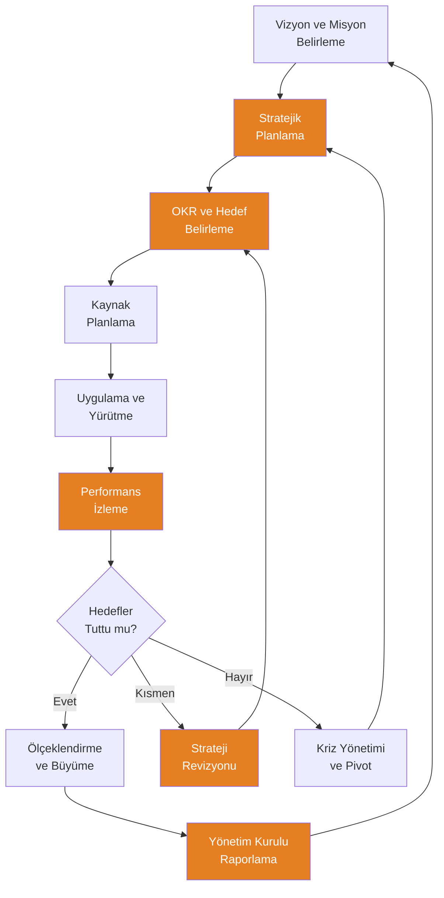
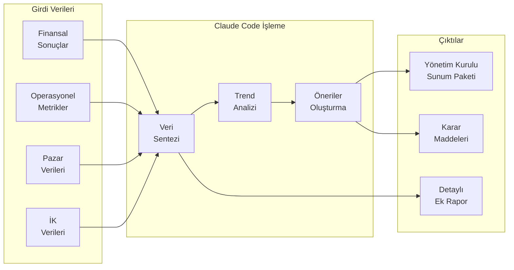

# Yönetim Rehberi

## Claude Code ile Yönetim Süreçlerinde Yapay Zeka Desteği

Yöneticiler ve üst düzey karar alıcılar, stratejik planlamadan ekip yönetimine, raporlamadan dijital dönüşüme kadar çok katmanlı sorumluluklar üstlenir. Claude Code, bu süreçlerin tamamında doğal dil komutlarıyla kullanılabilecek güçlü bir stratejik asistan olarak hizmet verir. Kod yazmaya gerek kalmadan; SWOT analizleri yapabilir, OKR'ler (Objectives and Key Results / Hedefler ve Temel Sonuçlar) oluşturabilir, veri odaklı karar desteği alabilir ve kapsamlı yönetim raporları hazırlayabilirsiniz.

Bu rehber, yöneticilerin Claude Code'u günlük iş akışlarına nasıl entegre edebileceğini pratik örneklerle açıklar.

---

## Yönetim İş Akışı



> Turuncu kutular Claude Code'un aktif destek sağladığı aşamaları gösterir.

---

## 1. Stratejik Planlama

### SWOT Analizi

Claude Code ile kapsamlı ve yapılandırılmış SWOT analizleri oluşturulabilir.

**Örnek Prompt:**
```
Şirketimiz için detaylı bir SWOT analizi hazırla:

Şirket Profili:
- Sektör: B2B SaaS (proje yönetim yazılımı)
- Çalışan: 200 kişi
- Pazar: Türkiye ve Orta Doğu
- Yıllık gelir: 50M TL, büyüme: %35 YoY
- Müşteri sayısı: 850
- Müşteri kaybı oranı: %4.5 aylık

Rekabet durumu:
- 3 büyük uluslararası rakip (Asana, Monday, Jira)
- 2 yerel rakip
- Fiyat avantajımız var, özellik setimiz orta düzey

Pazar dinamikleri:
- Dijital dönüşüm hızlanıyor
- Uzaktan çalışma kalıcılaşıyor
- KOBİ'lerde dijitalleşme talebi artıyor

SWOT analizi oluştur:
- Her kategoride en az 5 madde
- Her madde için kısa açıklama
- Güçlü yönleri fırsatlarla eşleştir (SO stratejileri)
- Zayıf yönleri tehditlerle eşleştir (WT stratejileri)
- Öncelikli 3 stratejik inisiyatif öner
```

### OKR (Hedefler ve Temel Sonuçlar) Oluşturma

```
2026 Q2 için şirket OKR'lerini oluştur:

Şirket öncelikleri:
1. Gelir büyümesi hızlandırma
2. Ürün-pazar uyumu güçlendirme
3. Operasyonel verimlilik artırma

Her öncelik için:
- 1 Objective (Hedef): İlham verici, niteliksel
- 3-4 Key Result (Temel Sonuç): Ölçülebilir, zamana bağlı
- Her KR için başlangıç değeri ve hedef değer
- Sorumlu departman/kişi alanı
- Haftalık check-in metrikleri

Ayrıca departman bazında (Satış, Pazarlama, Ürün, Mühendislik)
destekleyici OKR'ler öner. OKR'lerin birbirleriyle hizalanmasını
(alignment) göster.
```

---

## 2. Karar Alma

### Veri Odaklı Karar Desteği

**Örnek Prompt:**
```
Yeni bir pazara girme kararı için karar analizi çerçevesi oluştur:

Seçenekler:
A. Suudi Arabistan pazarına giriş (doğrudan satış ofisi)
B. BAE pazarına giriş (yerel distribütör ile)
C. Her iki pazara eş zamanlı giriş (dijital öncelikli)
D. Mevcut Türkiye pazarına odaklanma

Her seçenek için değerlendir:
- Tahmini yatırım maliyeti
- Beklenen getiri süresi (ROI payback period)
- Risk seviyesi
- Kaynak gereksinimi
- Stratejik uyum
- Rekabet yoğunluğu

Karar matrisi (weighted scoring / ağırlıklı puanlama) oluştur
ve en uygun seçeneği gerekçesiyle öner.
```

### Senaryo Analizi

```
Aşağıdaki stratejik karar için 3 senaryo oluştur:

Karar: Yeni ürün geliştirme yatırımı (Enterprise paket)
Yatırım: 2.5M TL (6 aylık geliştirme)
Mevcut durum: Sadece KOBİ segmentine hizmet veriyoruz

İyimser Senaryo:
- Pazar kabul oranı, gelir projeksiyonu, müşteri edinim hızı

Baz Senaryo:
- Gerçekçi beklentiler, ortalama değerler

Kötümser Senaryo:
- Düşük kabul, yüksek rekabet, uzayan satış döngüsü

Her senaryo için:
- 12 aylık gelir projeksiyonu
- Break-even (başabaş) noktası
- Net bugünkü değer (NPV) tahmini
- Olasılık ataması
- Risk faktörleri ve azaltma stratejileri
- Go/No-Go karar kriterleri
```

---

## 3. Ekip Yönetimi

### Organizasyon Yapısı

```
Şirketimiz 200'den 350 çalışana büyüme hedefliyor.
Yeni organizasyon yapısı öner:

Mevcut yapı:
- CEO
  - VP Satış (20 kişi)
  - VP Pazarlama (12 kişi)
  - VP Mühendislik (80 kişi)
  - VP Ürün (15 kişi)
  - CFO (8 kişi)
  - İK Direktörü (5 kişi)
  - VP Müşteri Başarısı (15 kişi)

Büyüme planı:
- Uluslararası genişleme (Orta Doğu)
- Enterprise segment eklenmesi
- AI/ML ekibi kurulması

Öner:
- Yeni organizasyon şeması
- Eklenmesi gereken yeni roller ve pozisyonlar
- Raporlama hatları
- Span of control (yönetim kapsamı) analizi
- Aşamalı büyüme planı (Q2-Q4 2026)
- Tahmini ek personel maliyeti
```

### Performans Takibi

```
Departman bazlı performans karnesini analiz et ve öneriler sun:

Departman    | Hedef Gerç. | Çalışan Memn. | Turnover | Bütçe Uyumu
Satış        | %92         | 3.8/5         | %8       | %105
Pazarlama    | %88         | 4.1/5         | %5       | %98
Mühendislik  | %75         | 3.5/5         | %15      | %112
Ürün         | %82         | 3.9/5         | %7       | %95
Müşteri Baş. | %95         | 4.3/5         | %3       | %100
Finans       | %98         | 4.0/5         | %2       | %92
İK           | %90         | 4.2/5         | %4       | %97

Her departman için:
- Güçlü yönler ve iyileştirme alanları
- Korelasyon analizi (memnuniyet-turnover, bütçe-hedef)
- Acil müdahale gereken alanlar
- Departmanlar arası en iyi uygulama paylaşım önerileri
- Yönetici ile birebir görüşme gündemi önerisi
```

---

## 4. Raporlama

### Yönetim Kurulu Raporu



**Örnek Prompt:**
```
Q1 2026 yönetim kurulu raporu hazırla:

Finansal:
- Gelir: 14.5M TL (hedef: 13M TL, Q1 2025: 10.5M TL)
- EBITDA: 3.2M TL (marj: %22)
- Nakit pozisyonu: 8.5M TL
- ARR (Annual Recurring Revenue): 52M TL

Operasyonel:
- Yeni müşteri: 85 (hedef: 70)
- Churn: %3.8 (hedef: <%4)
- NPS (Net Promoter Score): 62 (önceki çeyrek: 58)
- Uptime: %99.7

Ekip:
- Çalışan sayısı: 205 (+12)
- Açık pozisyon: 18
- eNPS (Employee NPS): 45

Pazar:
- TAM (Total Addressable Market): 2.5B USD
- Pazar payı tahmini: %0.8
- Önemli sektörel gelişmeler

Rapor formatı:
1. Yönetici özeti (1 sayfa, 5 ana mesaj)
2. Finansal performans (detaylı tablolarla)
3. Büyüme metrikleri ve trendler
4. Stratejik güncellemeler
5. Risk ve fırsatlar
6. Sonraki çeyrek planı ve beklentiler
7. Yönetim kurulu onayına sunulan kararlar
```

### Aylık/Çeyreklik Rapor Şablonu

```
Yönetim ekibi haftalık toplantısı için standart rapor şablonu oluştur:

Bölümler:
1. Geçen Hafta Özeti (3-5 madde ana gelişmeler)
2. KPI Dashboard Tablosu (haftalık metrikler)
3. Departman Güncellemeleri (her departmandan 2-3 madde)
4. Riskler ve Engeller (kırmızı/sarı/yeşil sınıflandırma)
5. Bu Hafta Öncelikler
6. Karar Gereken Konular
7. Bir Sonraki Toplantı Gündemi

Şablonu doldurulabilir formatta hazırla,
her bölüm için rehber notlar ve örnek içerik ekle.
```

---

## 5. İletişim

### İç Duyurular

```
Aşağıdaki senaryolar için CEO imzalı şirket içi duyuru metinleri hazırla:

1. Yıl sonu değerlendirmesi ve yeni yıl mesajı
   - Başarıları kutlayıcı, geleceğe ilham verici ton

2. Organizasyon yeniden yapılanması duyurusu
   - Değişiklikleri net açıklayan, endişeleri gideren ton

3. Yeni stratejik ortaklık duyurusu
   - Heyecan verici, fırsatları vurgulayan ton

4. Zor dönem iletişimi (ekonomik belirsizlik)
   - Şeffaf, güven veren, dayanışma vurgulayan ton

Her duyuru için:
- All-hands meeting (tüm şirket toplantısı) konuşma metni (5 dk)
- Yazılı e-posta versiyonu
- Slack/Teams kısa mesaj versiyonu
- Beklenen soru-cevaplar (Q&A hazırlığı)
```

### Şirket Politikaları

```
Şirketimiz için AI kullanım politikası oluştur:

Şirket profili:
- 200+ çalışan, B2B SaaS
- Müşteri verileriyle çalışıyor
- ISO 27001 sertifikalı

Politikada şunlar bulunsun:
1. Amaç ve kapsam
2. Onaylanan AI araçları listesi
3. Kabul edilebilir kullanım senaryoları
4. Yasak kullanım senaryoları
5. Veri güvenliği kuralları (hangi veriler AI'a verilebilir/verilemez)
6. Müşteri verisi politikası
7. Fikri mülkiyet hakları
8. Kalite kontrol ve doğrulama süreci
9. Raporlama ve şeffaflık yükümlülükleri
10. İhlal durumunda yaptırımlar
11. Eğitim gereksinimleri
12. Politika güncelleme süreci

Dil: açık, anlaşılır, pratik. Her madde için somut örnekler ekle.
```

---

## 6. Dijital Dönüşüm

### AI Adaptasyon Stratejisi

```
Şirketimiz için 12 aylık AI adaptasyon yol haritası oluştur:

Mevcut durum:
- AI kullanımı çok sınırlı (bireysel ChatGPT kullanımı)
- Veri altyapısı orta düzey (ERP, CRM mevcut)
- Çalışan dijital yetkinliği orta düzey
- Yönetim desteği güçlü
- Bütçe: 500K TL (ilk yıl)

Hedef:
- Tüm departmanlarda AI destekli verimlilik artışı
- Tekrarlayan görevlerin %30'unu AI ile otomatikleştirme
- AI-first kültür oluşturma

Yol haritası oluştur:
Ay 1-3: Keşif ve Pilot
Ay 4-6: Yaygınlaştırma
Ay 7-9: Optimizasyon
Ay 10-12: Ölçeklendirme

Her faz için:
- Hedefler ve KPI'lar
- Departman bazlı use case'ler (kullanım senaryoları)
- Eğitim planı
- Bütçe dağılımı
- Risk ve azaltma stratejileri
- Başarı hikayeleri ve quick wins (hızlı kazanımlar)
```

### ROI (Return on Investment / Yatırım Getirisi) Analizi

```
AI yatırımımızın ROI analizini yap:

Yatırım Maliyetleri (Yıllık):
- AI araç lisansları: 180.000 TL
- Eğitim ve danışmanlık: 120.000 TL
- Altyapı ve entegrasyon: 100.000 TL
- İç kaynak (proje yöneticisi): 200.000 TL (yarı zamanlı)
Toplam yatırım: 600.000 TL

Beklenen Kazanımlar:
- Pazarlama ekibi: İçerik üretiminde %40 zaman tasarrufu (8 kişi)
- Satış ekibi: Teklif hazırlamada %50 hızlanma (15 kişi)
- İK ekibi: İşe alım sürecinde %30 verimlilik artışı (4 kişi)
- Finans ekibi: Raporlamada %35 zaman tasarrufu (6 kişi)
- Yönetim: Karar alma sürecinde %25 iyileşme

Hesapla:
- Her departman için zaman tasarrufu (saat/hafta)
- Parasal karşılığı (ortalama saat ücreti bazında)
- Toplam yıllık tasarruf tahmini
- ROI oranı ve payback period (geri ödeme süresi)
- 3 yıllık TCO (Total Cost of Ownership / Toplam Sahip Olma Maliyeti)
- Ölçülemeyen faydalar (kalite artışı, çalışan memnuniyeti)
```

---

## Yöneticiler İçin Prompt Örnekleri

| Senaryo | Prompt |
|---------|--------|
| Strateji geliştirme | "Şirketimiz için 3 yıllık büyüme stratejisi taslağı oluştur: [şirket bilgileri]" |
| Toplantı hazırlığı | "Pazartesi yönetim toplantısı için gündem, konuşma noktaları ve karar maddeleri hazırla" |
| Kriz iletişimi | "Veri sızıntısı durumunda müşterilere, çalışanlara ve basına iletişim planı oluştur" |
| Bütçe onayı | "Bu departman bütçe talebini değerlendir ve onay/red gerekçesi hazırla: [bütçe talebi]" |
| Yetenek planlaması | "Önümüzdeki 2 yıl için kritik pozisyonların yedekleme planı oluştur" |
| Board sunumu | "Bu çeyrek sonuçlarını 10 slaytlık yönetim kurulu sunumuna dönüştür" |
| Benchmarking | "Sektörümüzdeki en iyi uygulamaları araştır ve şirketimizle karşılaştır" |
| Değişim yönetimi | "ERP değişikliği için change management planı ve iletişim stratejisi oluştur" |

---

## Özet

Claude Code, yöneticilere ve üst düzey karar alıcılara şu alanlarda güçlü destek sağlar:

- **Stratejik Planlama**: SWOT analizi, OKR oluşturma ve strateji geliştirme
- **Karar Alma**: Veri odaklı analiz, senaryo planlama ve karar matrisleri
- **Ekip Yönetimi**: Organizasyon tasarımı, performans takibi ve yetenek planlaması
- **Raporlama**: Yönetim kurulu raporları, haftalık/aylık değerlendirmeler
- **İletişim**: İç duyurular, politika oluşturma ve kriz iletişimi
- **Dijital Dönüşüm**: AI adaptasyon stratejisi, ROI analizi ve değişim yönetimi

Yöneticilerin Claude Code'dan en iyi şekilde yararlanması için öneriler:

1. **Stratejik düşünün**: Claude Code'u operasyonel değil, stratejik görevlerde kullanın
2. **Bağlam zenginliği sağlayın**: Şirket vizyonu, pazar durumu ve hedeflerinizi paylaşın
3. **Çoklu perspektif isteyin**: Farklı senaryo ve bakış açıları talep edin
4. **Doğrulama yapın**: Stratejik kararları sadece AI çıktısına dayandırmayın, ekibinizle tartışın
5. **Gizliliğe dikkat edin**: Rekabete hassas bilgileri paylaşırken dikkatli olun
6. **Kültür oluşturun**: Ekibinizi de AI araçlarını kullanmaya teşvik edin
