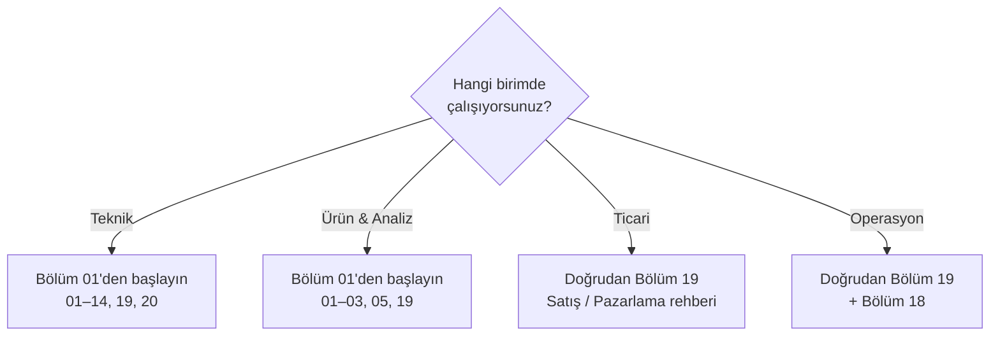

# Bölüm 19: Birim ve Pozisyon Bazlı Kullanım Rehberleri

Claude Code'un farklı birimlerdeki günlük iş akışlarına nasıl entegre edilebileceğini gösteren 12 pozisyon rehberi. Her rehber, ilgili pozisyona özel kullanım senaryoları, örnek prompt'lar ve en iyi uygulamaları içerir.

---

## İçerik

| Birim | # | Dosya | Pozisyon | Süre |
|-------|---|-------|----------|------|
| **Teknik** | 01 | [Yazılım Geliştirici](./01-teknik-yazilim-gelistirici.md) | Yazılım Geliştirici | ~25 dk |
| **Teknik** | 02 | [QA / Test](./02-teknik-qa-test.md) | QA / Test | ~18 dk |
| **Teknik** | 03 | [Sistem Uzmanı](./03-teknik-sistem-uzmani.md) | Sistem Uzmanı | ~20 dk |
| **Teknik** | 04 | [UI/UX](./04-teknik-ui-ux.md) | UI/UX | ~18 dk |
| **Ürün & Analiz** | 05 | [Ürün Müdürü](./05-urun-urun-muduru.md) | Ürün Müdürü | ~18 dk |
| **Ürün & Analiz** | 06 | [İş Analisti](./06-urun-is-analisti.md) | İş Analisti | ~20 dk |
| **Ürün & Analiz** | 07 | [Proje Yöneticisi](./07-urun-proje-yoneticisi.md) | Proje Yöneticisi | ~18 dk |
| **Ticari** | 08 | [Satış](./08-ticari-satis.md) | Satış | ~15 dk |
| **Ticari** | 09 | [Pazarlama](./09-ticari-pazarlama.md) | Pazarlama | ~15 dk |
| **Operasyon** | 10 | [İK](./10-operasyon-ik.md) | İK | ~15 dk |
| **Operasyon** | 11 | [Finans](./11-operasyon-finans.md) | Finans | ~15 dk |
| **Operasyon** | 12 | [Yönetim](./12-operasyon-yonetim.md) | Yönetim | ~15 dk |

---

## Hangi Birim Nereden Başlamalı?

Teknik ve Ürün & Analiz birimleri yapay zeka temellerini öğrenerek başlar. Ticari ve Operasyon birimleri doğrudan kendi pozisyon rehberlerine geçebilir.

---

## Ön Koşullar

Bu bölümdeki rehberler bağımsız okunabilir; ancak teknik birim için aşağıdaki konulara aşinalık önerilir:

| Konu | Bölüm |
|------|-------|
| Claude Code nasıl çalışır | [Bölüm 06](../06-claude-code-tanitim/README.md) |
| Arayüz ve komutlar | [Bölüm 07](../07-arayuz-ve-komutlar/README.md) |
| Araçlar (Tools) | [Bölüm 08](../08-araclar/README.md) |
| Bellek ve bağlam yönetimi | [Bölüm 09](../09-bellek-ve-baglam/README.md) |

---

## Önceki Bölüm

← [18 - Kurumsal Kullanım](../18-kurumsal-kullanim/README.md)

## Sonraki Bölüm

→ [20 - Pratik Senaryolar ve Tarifler](../20-pratik-senaryolar/README.md)
