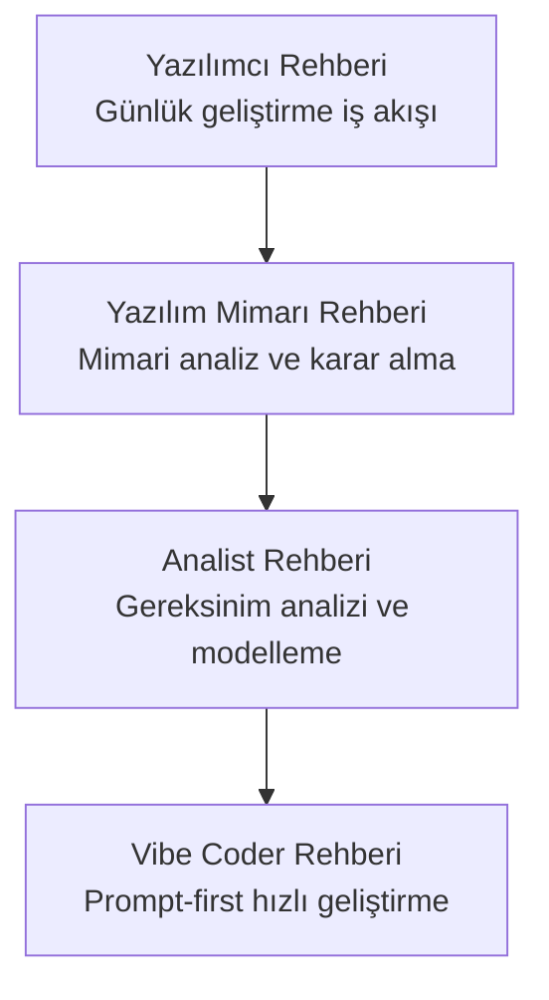
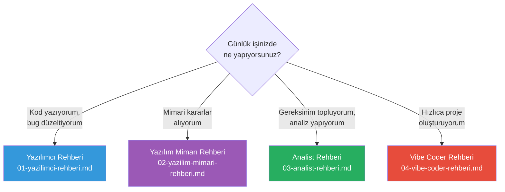

# Bölüm 19: Rol Bazlı Kullanım Rehberleri

Claude Code, farklı rollerdeki profesyoneller için farklı iş akışları sunar. Bu bölüm; yazılımcılar, yazılım mimarları, iş analistleri ve Vibe Coder'lar için özelleştirilmiş kullanım rehberlerini içerir.

## Bu Bölümde Neler Öğreneceksiniz?

## İçerik

| # | Dosya | Konu | Süre |
|---|-------|------|------|
| 01 | [Yazılımcı Rehberi](./01-yazilimci-rehberi.md) | Günlük geliştirme iş akışı, bug fixing, PR hazırlama, code review | ~20 dk |
| 02 | [Yazılım Mimarı Rehberi](./02-yazilim-mimari-rehberi.md) | Mimari analiz, refactoring planlama, standart belirleme | ~20 dk |
| 03 | [Analist Rehberi](./03-analist-rehberi.md) | Gereksinim analizi, user story, prototipleme, veri analizi | ~18 dk |
| 04 | [Vibe Coder Rehberi](./04-vibe-coder-rehberi.md) | Prompt-first geliştirme, sıfırdan proje, AI-native iş akışı | ~22 dk |

## Ön Koşullar

Bu bölümü okumadan önce aşağıdaki konulara aşina olmanız önerilir:

| Konu | Bölüm |
|------|-------|
| Claude Code nasıl çalışır | [Bölüm 06](../06-claude-code-tanitim/README.md) |
| Arayüz ve komutlar | [Bölüm 07](../07-arayuz-ve-komutlar/README.md) |
| Araçlar (Tools) | [Bölüm 08](../08-araclar/README.md) |
| Bellek ve bağlam yönetimi | [Bölüm 09](../09-bellek-ve-baglam/README.md) |

## Hangi Rehber Size Uygun?

## Önceki Bölüm

← [18 - Kurumsal Kullanım](../18-kurumsal-kullanim/README.md)

## Sonraki Adım

Bu bölümü tamamladıktan sonra → [20 - Pratik Senaryolar ve Tarifler](../20-pratik-senaryolar/README.md)
