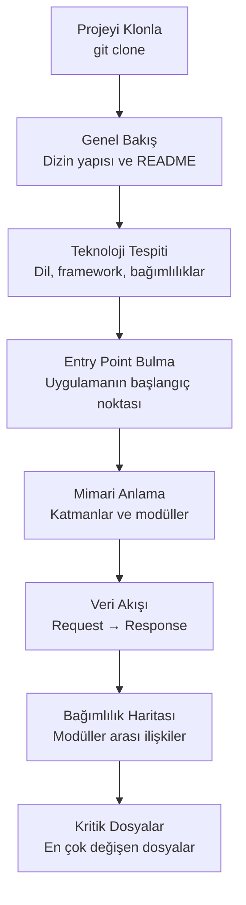

# Proje Keşfetme

Yeni bir projeye katıldığınızda veya açık kaynak bir kod tabanını incelemeniz gerektiğinde, Claude Code güçlü bir keşif aracıdır. Bu rehber, bilinmeyen bir kod tabanını sistematik şekilde anlama sürecini kapsar.

## Ön Koşullar

| Konu | Bölüm |
|------|-------|
| Claude Code temelleri | [Bölüm 06](../06-claude-code-tanitim/README.md) |
| Araçlar | [Bölüm 08](../08-araclar/README.md) |

---

## Keşif İş Akışı

Yeni bir kod tabanını anlamak için sistematik bir yaklaşım:



---

## Adım 1: Genel Bakış

```bash
# Projenin genel yapısını anla
claude "Bu projenin genel yapısını analiz et:
1. Dizin yapısını göster (2 seviye derinlikte)
2. README varsa özetle
3. Hangi programlama dili ve framework kullanılıyor?
4. Kaç dosya var, toplam satır sayısı nedir?
5. Proje ne iş yapıyor?"
```

### Örnek Terminal Oturumu

```
$ cd /path/to/unknown-project
$ claude

> Bu projenin genel yapısını analiz et ve bana özetle.

Claude: Bu proje bir e-ticaret backend API'si. İşte genel yapı:

├── src/
│   ├── controllers/    # 12 controller dosyası
│   ├── services/       # 15 service dosyası
│   ├── models/         # 8 model dosyası
│   ├── middleware/      # 5 middleware
│   ├── routes/         # 10 route dosyası
│   └── utils/          # 7 utility dosyası
├── tests/              # 45 test dosyası
├── docs/               # API dokümantasyonu
└── scripts/            # Deploy ve migration script'leri

Teknolojiler: Node.js, Express, TypeScript, PostgreSQL, Prisma ORM
Toplam: 57 kaynak dosya, ~12.000 satır kod
```

---

## Adım 2: Teknoloji ve Bağımlılık Tespiti

```bash
# Bağımlılıkları ve teknoloji stack'ini analiz et
claude "Bu projenin bağımlılıklarını analiz et:
1. package.json (veya requirements.txt, go.mod, Cargo.toml) dosyasını oku
2. Temel bağımlılıkları kategorize et (framework, ORM, test, utility)
3. Dev bağımlılıklarını listele
4. Versiyon bilgilerini kontrol et (güncel mi?)
5. Bir teknoloji stack özeti tablosu oluştur"
```

---

## Adım 3: Entry Point ve Akış

```bash
# Uygulamanın giriş noktasını bul
claude "Bu uygulamanın entry point'ini (giriş noktası) bul. Main dosyası neresi, uygulama nasıl başlıyor? Başlangıçtan bir HTTP isteğinin işlenip yanıt dönmesine kadar olan akışı adım adım açıkla."
```

```bash
# Request lifecycle'ı takip et
claude "Bir POST /api/users isteğinin uygulamada geçtiği tüm katmanları takip et. Route → Middleware → Controller → Service → Repository → Database yolunu göster. Her katmanda ne oluyor açıkla."
```

---

## Adım 4: Mimari Anlama

```bash
# Mimari pattern'i belirle
claude "Bu projenin mimari yapısını analiz et:
1. Hangi mimari pattern kullanılıyor? (MVC, Clean, Hexagonal, vb.)
2. Katman yapısını mermaid diagram ile göster
3. Modüller arası bağımlılık grafiğini çiz
4. Circular dependency (döngüsel bağımlılık) var mı?
5. Mimari açıdan güçlü ve zayıf yönleri listele"
```

---

## Adım 5: Bağımlılık Haritası

```bash
# Modüller arası ilişkileri haritalandır
claude "Bu projedeki tüm modüller (dizinler) arasındaki import ilişkilerini analiz et. Hangi modül hangi modüle bağımlı? Mermaid dependency graph olarak çiz. En çok bağımlılığa sahip modülü (hub) ve en çok bağımlılık alan modülü belirle."
```

---

## Adım 6: Kritik Dosyalar ve Hot Spot'lar

```bash
# En çok değişen dosyaları bul
claude "Git geçmişini analiz ederek:
1. Son 3 ayda en çok değişen 10 dosyayı bul
2. En çok commit alan modülleri belirle
3. En çok contributor'a sahip dosyaları listele
4. Bu hot spot'ların potansiyel sorunlarını yorumla"
```

---

## Keşif Oturumu Kontrol Listesi

Projeyi keşfederken bu kontrol listesini takip edin:

| Adım | Kontrol | Komut |
|------|---------|-------|
| Genel bakış | Dizin yapısı anlaşıldı mı? | `claude "Dizin yapısını göster"` |
| Teknoloji | Framework ve dil belirlendi mi? | `claude "Teknoloji stack'i ne?"` |
| Entry point | Uygulama nerede başlıyor? | `claude "Entry point neresi?"` |
| Mimari | Katman yapısı anlaşıldı mı? | `claude "Mimari pattern ne?"` |
| Veri akışı | Request lifecycle izlendi mi? | `claude "Bir isteğin akışını göster"` |
| Bağımlılıklar | Modül ilişkileri haritalandı mı? | `claude "Bağımlılık grafiğini çiz"` |
| Veritabanı | Schema anlaşıldı mı? | `claude "Veritabanı schema'sını göster"` |
| Testler | Test yapısı incelendi mi? | `claude "Test coverage ne durumda?"` |
| Config | Ortam değişkenleri belirlendi mi? | `claude "Gerekli env değişkenleri ne?"` |

---

## Özet

| Keşif Aşaması | Claude Code Katkısı |
|----------------|---------------------|
| **Genel Bakış** | Dizin yapısı ve proje özeti |
| **Teknoloji** | Bağımlılık analizi ve stack tespiti |
| **Entry Point** | Başlangıç noktası ve akış takibi |
| **Mimari** | Pattern tespiti ve katman analizi |
| **Bağımlılıklar** | Modül ilişki grafiği |
| **Hot Spot** | Git geçmişinden kritik dosya tespiti |

---

## Sonraki Adım

Keşfettiğiniz projede bir hatayı nasıl düzelteceğinizi öğrenin:

→ [Bug Düzeltme](./02-bug-duzeltme.md)
