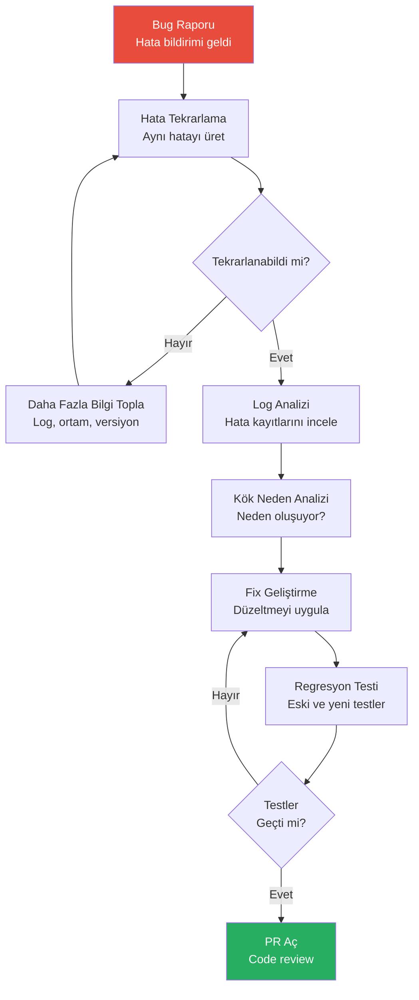
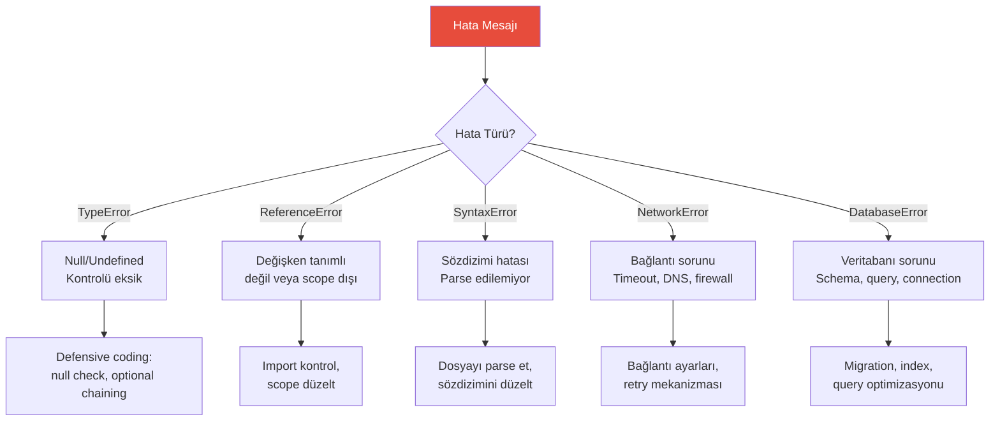

# Bug Düzeltme

Bug fixing (hata düzeltme), yazılım geliştirmenin en yaygın ve zaman alıcı görevlerinden biridir. Claude Code, hatayı tekrarlama, log analizi, kök neden tespiti ve düzeltme süreçlerinin tamamında güçlü bir asistan sunar.

## Ön Koşullar

| Konu | Bölüm |
|------|-------|
| Claude Code araçları | [Bölüm 08](../08-araclar/README.md) |
| Proje keşfetme | [Proje Keşfetme](./01-proje-kesfetme.md) |

---

## Bug Düzeltme İş Akışı

Sistematik bir hata düzeltme süreci:



---

## Adım 1: Hata Tekrarlama

```bash
# Hata mesajından başlayarak hatayı tekrarla
claude "Bu hatayı alıyorum:

TypeError: Cannot read properties of undefined (reading 'email')
    at UserService.getUserProfile (src/services/user-service.ts:45:23)
    at UserController.getProfile (src/controllers/user-controller.ts:18:30)

Bu hatayı tekrarlayabilmek için hangi adımları izlemem gerekiyor? İlgili dosyaları incele ve hatanın hangi koşullarda oluştuğunu belirle."
```

---

## Adım 2: Log Analizi

```bash
# Log dosyalarını analiz et
claude "logs/ dizinindeki son hata kayıtlarını incele. Tekrarlayan hata pattern'lerini bul, en sık oluşan hataları sırala ve her biri için olası nedenleri listele."
```

```bash
# Runtime hatası analizi
claude "Uygulama şu hatayı production'da veriyor:
'FATAL ERROR: CALL_AND_RETRY_LAST Allocation failed - JavaScript heap out of memory'

Bu hata neden oluşuyor olabilir? Bu projedeki potansiyel memory leak kaynaklarını bul. Büyük array'ler, kapatılmayan connection'lar, temizlenmeyen event listener'lar var mı kontrol et."
```

---

## Adım 3: Kök Neden Analizi

```bash
# Kök neden tespiti
claude "src/services/user-service.ts:45 satırındaki hatanın kök nedenini bul. Şunları kontrol et:
1. Fonksiyona gelen parametreler doğru mu?
2. Null/undefined kontrolü eksik mi?
3. Veritabanı sorgusu doğru sonuç dönüyor mu?
4. Race condition (yarış durumu) olabilir mi?
5. Bu fonksiyonu çağıran tüm yerleri listele"
```

### Kök Neden Analiz Şablonu



---

## Adım 4: Düzeltme Uygulama

```bash
# Fix geliştir ve test et
claude "src/services/user-service.ts dosyasındaki getUserProfile fonksiyonunu düzelt:
1. User null olabilecek durumları handle et
2. Optional chaining kullan
3. Anlamlı hata mesajları ekle
4. Bu fix için bir unit test yaz
5. Mevcut testlerin hâlâ geçtiğini doğrula"
```

---

## Adım 5: Regresyon Testi

```bash
# Regresyon testi ekle
claude "Düzelttiğimiz bug için regresyon testi yaz:
1. Hatayı tetikleyen koşulu test et (user undefined olduğunda)
2. Normal akışın çalıştığını doğrula (user mevcut olduğunda)
3. Edge case'leri test et (boş user objesi, eksik email alanı)
Tüm testleri çalıştır ve sonuçları göster."
```

---

## Pratik Örnekler

### Örnek 1: API 500 Hatası

```bash
claude "POST /api/orders endpoint'i 500 Internal Server Error dönüyor. İstek gövdesi:
{\"product_id\": 123, \"quantity\": 2}

İlgili route, controller ve service dosyalarını incele. Hatanın kaynağını bul ve düzelt. Fix sonrası curl ile test et."
```

### Örnek 2: Frontend Render Hatası

```bash
claude "React uygulamasında 'Too many re-renders' hatası alıyorum. ProfilePage component'inde oluşuyor. useEffect bağımlılık dizisi veya state güncellemelerinde sonsuz döngü olabilir. Hatayı bul, nedenini açıkla ve düzelt."
```

### Örnek 3: Veritabanı Bağlantı Hatası

```bash
claude "Uygulama başlangıçta 'ECONNREFUSED 127.0.0.1:5432' hatası veriyor. Veritabanı bağlantı konfigürasyonunu kontrol et:
1. .env dosyasındaki bağlantı bilgilerini incele
2. connection pool ayarlarını kontrol et
3. SSL konfigürasyonu gerekiyor mu?
4. Docker compose'daki veritabanı servisi doğru mu?"
```

### Örnek 4: Memory Leak

```bash
claude "Uygulama birkaç saat çalıştıktan sonra yavaşlıyor ve memory kullanımı sürekli artıyor. Potansiyel memory leak kaynaklarını bul:
1. Kapatılmayan veritabanı bağlantıları
2. Temizlenmeyen setInterval/setTimeout
3. Büyüyen cache'ler
4. Event listener temizlemeyen component'ler
Her bulgu için düzeltme öner."
```

### Örnek 5: Race Condition

```bash
claude "İki kullanıcı aynı anda aynı ürünü satın aldığında stok eksi'ye düşüyor. Bu race condition'ı (yarış durumu) bul ve düzelt. Veritabanı transaction veya optimistic locking kullan."
```

---

## Bug Düzeltme İpuçları

| İpucu | Açıklama |
|-------|----------|
| Stack trace paylaş | Claude'a tam hata mesajını ve stack trace'i ver |
| Ortam bilgisi ver | Node version, OS, veritabanı versiyonu |
| Minimal repro | Hatayı en az adımla tekrarlama yolunu belirt |
| Git blame | Hatanın ne zaman girdiğini öğrenmek için `git blame` kullan |
| Binary search | Hangi commit'te bozulduğunu bulmak için `git bisect` kullan |

---

## Özet

| Aşama | Claude Code Katkısı |
|-------|---------------------|
| **Tekrarlama** | Hata koşullarını tespit |
| **Log Analizi** | Pattern tespiti ve sıralama |
| **Kök Neden** | Kod analizi ve neden tespiti |
| **Düzeltme** | Fix uygulama ve doğrulama |
| **Regresyon** | Otomatik test yazma |

---

## Sonraki Adım

Kod tabanını daha temiz ve sürdürülebilir hale getirmek için refactoring:

→ [Refactoring](./03-refactoring.md)
