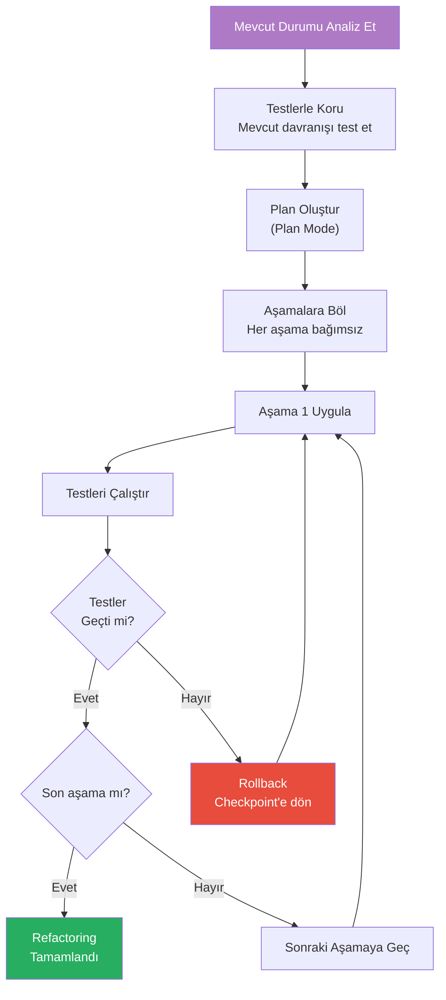
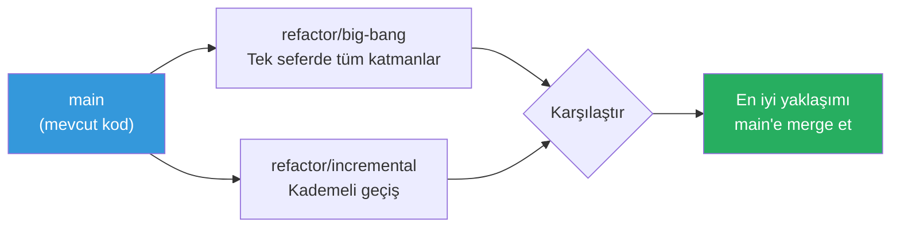

# Refactoring

Refactoring (yeniden yapılandırma), yazılımın dışarıdan görünen davranışını değiştirmeden iç yapısını iyileştirme sürecidir. Claude Code, büyük ölçekli refactoring işlemlerini Plan Mode ile planlama, `--worktree` ile paralel deneme ve test-driven yaklaşımla güvenle uygulama imkânı sunar.

## Ön Koşullar

| Konu | Bölüm |
|------|-------|
| Plan Mode | [Plan Modu](../07-arayuz-ve-komutlar/02-plan-modu.md) |
| Worktree | [Worktree ile Paralel Çalışma](../09-bellek-ve-baglam/08-worktree-ile-paralel-calisma.md) |
| Test yazma | [Test Yazma](./04-test-yazma.md) |

---

## Refactoring Stratejisi

Büyük ölçekli refactoring için güvenli bir yaklaşım:



---

## Adım 1: Mevcut Durumu Analiz Et

```bash
# Code smell tespiti
claude "Bu projedeki code smell'leri (kod kokuları) tespit et:
1. God class (500+ satır sınıflar)
2. Duplicate code (tekrarlayan kod blokları)
3. Long method (50+ satır fonksiyonlar)
4. Feature envy (başka sınıfın verisini çok kullanan)
5. Shotgun surgery (bir değişiklik için çok dosya değiştirmek)
Her bulgu için dosya, satır ve önem seviyesi belirt."
```

```bash
# Metrik analizi
claude "Bu projenin kod kalite metriklerini hesapla:
1. Dosya başına ortalama satır sayısı
2. Fonksiyon başına ortalama satır sayısı
3. Cyclomatic complexity (döngüsel karmaşıklık) yüksek fonksiyonlar
4. Coupling (bağımlılık) metrikleri
5. Test coverage
Sorunlu alanları öncelik sırasına göre listele."
```

---

## Adım 2: Plan Mode ile Planlama

```bash
# Plan Mode'da refactoring planla
claude "Plan Mode'a geç. Bu projeyi Clean Architecture'a taşımak istiyorum. Şu adımları planla:

Mevcut durum: Tüm iş mantığı controller'larda
Hedef: Controller → Service → Repository katman ayrımı

Her adım için:
- Etkilenen dosyalar
- Değişiklik açıklaması
- Risk seviyesi
- Doğrulama kriteri
- Tahmini süre

Adımlar birbirinden bağımsız deploy edilebilir olsun."
```

---

## Adım 3: Paralel Denemeler (--worktree)

Farklı refactoring yaklaşımlarını paralel olarak deneyin:

```bash
# Approach A: Büyük değişiklik
claude --worktree refactor/big-bang "Tüm controller'ları tek seferde service + repository katmanına ayır."

# Approach B: Kademeli değişiklik
claude --worktree refactor/incremental "Sadece UserController'ı service + repository katmanına ayır. Diğerlerine dokunma."
```



---

## Adım 4: Test-Driven Refactoring

```bash
# Önce testleri yaz, sonra refactor et
claude "UserController'daki tüm endpoint'ler için integration testleri yaz. Testler mevcut davranışı koruyan 'golden master' testleri olsun. Bu testler, refactoring sırasında davranışın değişmediğini doğrulayacak."
```

```bash
# Refactoring uygula ve testlerle doğrula
claude "Şimdi UserController'daki iş mantığını UserService'e taşı:
1. UserService sınıfı oluştur
2. Controller'daki iş mantığını service'e aktar
3. Controller sadece HTTP request/response yönetsin
4. Her adımda testleri çalıştır
5. Tüm testler geçene kadar düzelt"
```

---

## Yaygın Refactoring Senaryoları

### Senaryo 1: Fonksiyon Çıkarma (Extract Function)

```bash
claude "src/utils/helpers.ts dosyasındaki processOrder fonksiyonu 120 satır. Bu fonksiyonu küçük, tek sorumluluğu olan alt fonksiyonlara böl. Her fonksiyonun adı ne yaptığını açıkça ifade etsin. Mevcut testler kırılmasın."
```

### Senaryo 2: Kod Tekrarı Giderme (DRY)

```bash
claude "Bu projede tekrarlayan kod blokları bul. Özellikle:
1. Benzer validation mantığı
2. Tekrarlayan error handling kodu
3. Copy-paste edilmiş veritabanı sorguları
Her tekrar için ortak bir abstraction öner ve uygula."
```

### Senaryo 3: Design Pattern Uygulama

```bash
claude "Projede 5 farklı bildirim kanalı var (email, SMS, push, Slack, webhook). Her biri controller'da if-else ile kontrol ediliyor. Strategy pattern uygulayarak bu yapıyı düzenle:
1. NotificationStrategy interface tanımla
2. Her kanal için concrete strategy oluştur
3. NotificationService ile strategy seçimi yap
4. Controller'daki if-else'leri kaldır"
```

### Senaryo 4: Dosya Yapısı Yeniden Düzenleme

```bash
claude "Bu projede tüm dosyalar src/ altında düz bir yapıda. Feature-based (özellik bazlı) bir dizin yapısına geçir:

Mevcut: src/userController.ts, src/userService.ts, src/orderController.ts ...
Hedef:
  src/user/controller.ts, src/user/service.ts
  src/order/controller.ts, src/order/service.ts

Tüm import path'leri güncelle. Testleri çalıştırarak doğrula."
```

### Senaryo 5: TypeScript Migration

```bash
claude "Bu JavaScript projesini TypeScript'e geçirmek istiyorum. Kademeli bir plan oluştur:
1. tsconfig.json oluştur (allowJs: true ile)
2. En az bağımlılığa sahip dosyadan başla
3. Her dosyayı .ts'e çevir ve tip tanımlarını ekle
4. Interface ve type dosyaları oluştur
5. any kullanımını minimize et
Her adımda projenin çalışır durumda kalmasını sağla."
```

---

## Refactoring Güvenlik Kontrol Listesi

| Kontrol | Komut |
|---------|-------|
| Testler geçiyor mu? | `claude "Tüm testleri çalıştır"` |
| Lint hataları var mı? | `claude "Lint kontrolü yap"` |
| Build başarılı mı? | `claude "Projeyi derle"` |
| API kontratı değişti mi? | `claude "Public API değişikliklerini listele"` |
| Performans etkilendi mi? | `claude "Bu değişikliklerin performans etkisini analiz et"` |

---

## Özet

| Strateji | Açıklama |
|----------|----------|
| **Plan Mode** | Büyük refactoring'leri önce planlayın |
| **Test-First** | Önce testlerle mevcut davranışı koruyun |
| **Kademeli** | Büyük değişiklikleri aşamalara bölün |
| **Worktree** | Farklı yaklaşımları paralel deneyin |
| **Doğrulama** | Her adımda test çalıştırın |

---

## Sonraki Adım

Test yazma süreçleri ve TDD iş akışı:

→ [Test Yazma](./04-test-yazma.md)
